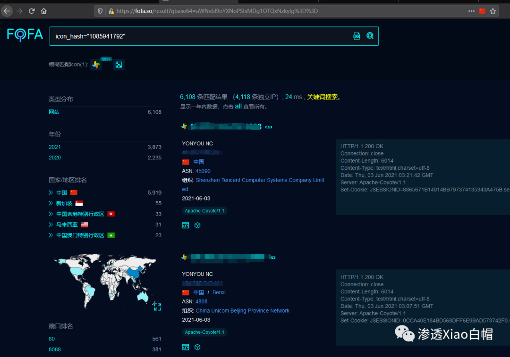
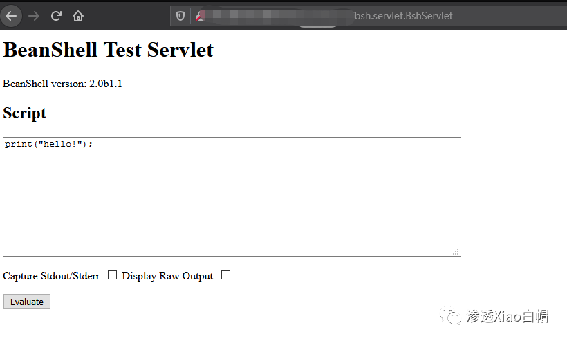
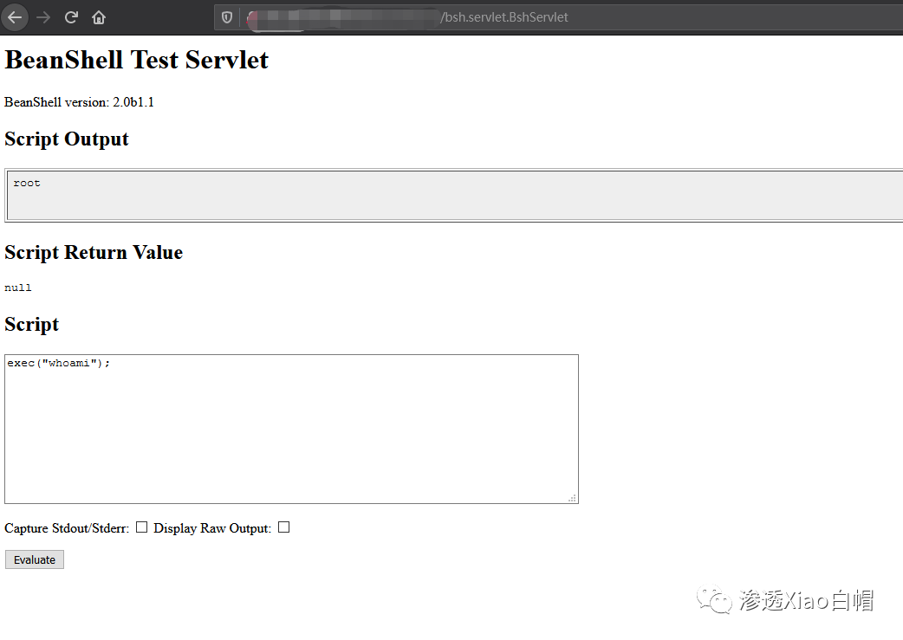
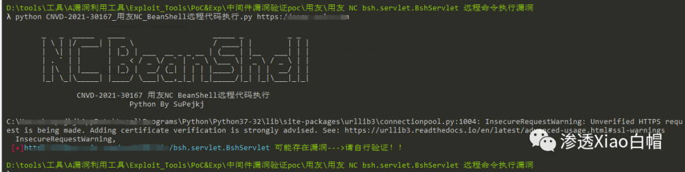

# 用友NC BeanShell BshServlet未授权代码执行

> 指纹字段校订（2026-10-04）：按原归档正文的明确平台标签及完整表达式恢复当前查询，旧误填或截取字段逐字保存在 `previous_*`；后文对此旧字段的诊断按当前字段阅读。仅经过本库保守语法与原字面核对，未在线运行查询，不把指纹命中视为漏洞存在。

## 条目说明

- 对象与具体问题：用友NC BeanShell；BshServlet未授权代码执行
- 版本、配置及部署条件：NC6.5声明
- 认证与权限前提：未授权暴露接口
- 核验边界：已完成原始 Markdown 的文本审阅；未执行 PoC、未访问目标、未视检截图。来源所述影响与复现结果不等于本库独立验证。

## 证据边界与更正

以下记录原始资料的证据边界。可以由原文确定的产品、编号及格式问题已在本条修订；没有原始证据的版本、响应和补丁信息仍待核实。

- version/fofa也错抽标题
- 主ID30167，复现只路由和截图，标题附PoC却脚本明确未给
- 有官方patch PK链接可保存，但缺精确适用build
- 宣传CVE2109/17144均非主编号

## 操作风险

命令/代码执行示例可能改变主机状态。保留原示例供静态分析；仅可在明确授权的隔离测试环境验证，事先准备备份与回滚。

## 技术资料与来源记录

> 本文由 [简悦 SimpRead](http://ksria.com/simpread/) 转码， 原文地址 [mp.weixin.qq.com](https://mp.weixin.qq.com/s/zBJl19bmXZg2kVsVNTIG6Q)

****

**0x01 简介**

该漏洞是由于用友 NC 对外开放了 BeanShell 接口，攻击者可以在未授权的情况下直接访问该接口，并构造恶意数据执行任意代码并获取服务器权限。

**0x02 影响版本**

```
NC6.5版本
```

**0x03 漏洞复现**

FOFA 语句：

```
icon_hash="1085941792"
```



**访问目标站点这个酱紫**



**执行命令**

**PoC:**

```
/servlet/~ic/bsh.servlet.BshServlet
```



**脚本验证**



用脚写的太菜就不放出来见笑了

**0x04 修复方案**

```
官方已发布安全补丁，建议使用该产品的用户及时安装该漏洞补丁包。
下载链接：
http://umc.yonyou.com/ump/querypatchdetailedmng?PK=18981c7af483007db179a236016f594d37c01f22aa5f5d19
```

****【往期推荐】****  

[【内网渗透】内网信息收集命令汇总](http://mp.weixin.qq.com/s?__biz=MzI1NTM4ODIxMw==&mid=2247485796&idx=1&sn=8e78cb0c7779307b1ae4bd1aac47c1f1&chksm=ea37f63edd407f2838e730cd958be213f995b7020ce1c5f96109216d52fa4c86780f3f34c194&scene=21#wechat_redirect)  

[【内网渗透】域内信息收集命令汇总](http://mp.weixin.qq.com/s?__biz=MzI1NTM4ODIxMw==&mid=2247485855&idx=1&sn=3730e1a1e851b299537db7f49050d483&chksm=ea37f6c5dd407fd353d848cbc5da09beee11bc41fb3482cc01d22cbc0bec7032a5e493a6bed7&scene=21#wechat_redirect)

[【超详细 | Python】CS 免杀 - Shellcode Loader 原理 (python)](http://mp.weixin.qq.com/s?__biz=MzI1NTM4ODIxMw==&mid=2247486582&idx=1&sn=572fbe4a921366c009365c4a37f52836&chksm=ea37f32cdd407a3aea2d4c100fdc0a9941b78b3c5d6f46ba6f71e946f2c82b5118bf1829d2dc&scene=21#wechat_redirect)

[【超详细 | Python】CS 免杀 - 分离 + 混淆免杀思路](http://mp.weixin.qq.com/s?__biz=MzI1NTM4ODIxMw==&mid=2247486638&idx=1&sn=99ce07c365acec41b6c8da07692ffca9&chksm=ea37f3f4dd407ae28611d23b31c39ff1c8bc79762bfe2535f12d1b9d7a6991777b178a89b308&scene=21#wechat_redirect)  

[【超详细】CVE-2020-14882 | Weblogic 未授权命令执行漏洞复现](http://mp.weixin.qq.com/s?__biz=MzI1NTM4ODIxMw==&mid=2247485550&idx=1&sn=921b100fd0a7cc183e92a5d3dd07185e&chksm=ea37f734dd407e22cfee57538d53a2d3f2ebb00014c8027d0b7b80591bcf30bc5647bfaf42f8&scene=21#wechat_redirect)

[【超详细 | 附 PoC】CVE-2021-2109 | Weblogic Server 远程代码执行漏洞复现](http://mp.weixin.qq.com/s?__biz=MzI1NTM4ODIxMw==&mid=2247486517&idx=1&sn=34d494bd453a9472d2b2ebf42dc7e21b&chksm=ea37f36fdd407a7977b19d7fdd74acd44862517aac91dd51a28b8debe492d54f53b6bee07aa8&scene=21#wechat_redirect)  

[【奇淫巧技】如何成为一个合格的 “FOFA” 工程师](http://mp.weixin.qq.com/s?__biz=MzI1NTM4ODIxMw==&mid=2247485135&idx=1&sn=f872054b31429e244a6e56385698404a&chksm=ea37f995dd40708367700fc53cca4ce8cb490bc1fe23dd1f167d86c0d2014a0c03005af99b89&scene=21#wechat_redirect)
---------------------------------------------------------------------------------------------------------------------------------------------------------------------------------------------------------------------------------------------------

[记一次 HW 实战笔记 | 艰难的提权爬坑](http://mp.weixin.qq.com/s?__biz=MzI1NTM4ODIxMw==&mid=2247484991&idx=2&sn=5368b636aed77ce455a1e095c63651e4&chksm=ea37f965dd407073edbf27256c022645fe2c0bf8b57b38a6000e5aeb75733e10815a4028eb03&scene=21#wechat_redirect)

[【超详细】Microsoft Exchange 远程代码执行漏洞复现【CVE-2020-17144】](http://mp.weixin.qq.com/s?__biz=MzI1NTM4ODIxMw==&mid=2247485992&idx=1&sn=18741504243d11833aae7791f1acda25&chksm=ea37f572dd407c64894777bdf77e07bdfbb3ada0639ff3a19e9717e70f96b300ab437a8ed254&scene=21#wechat_redirect)

[【超详细】Fastjson1.2.24 反序列化漏洞复现](http://mp.weixin.qq.com/s?__biz=MzI1NTM4ODIxMw==&mid=2247484991&idx=1&sn=1178e571dcb60adb67f00e3837da69a3&chksm=ea37f965dd4070732b9bbfa2fe51a5fe9030e116983a84cd10657aec7a310b01090512439079&scene=21#wechat_redirect)

_**走过路过的大佬们留个关注再走呗**_

**往期文章有彩蛋哦******  


基于 Kali Linux 环境，从理论、应用和实践三个维度详解 Windows 渗透测试，通过 136 个操作实例手把手带领读者学习，详解环境搭建、主机发现、嗅探欺骗、密码攻击、漏洞扫描等。

---

> 来源：MrWQ/vulnerability-paper（https://github.com/MrWQ/vulnerability-paper）
