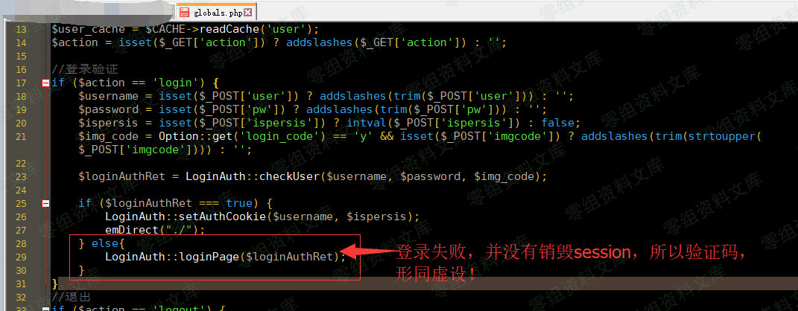
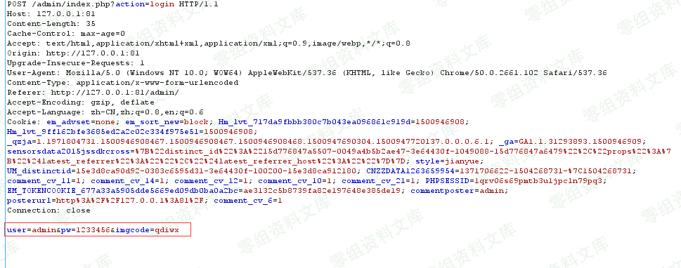
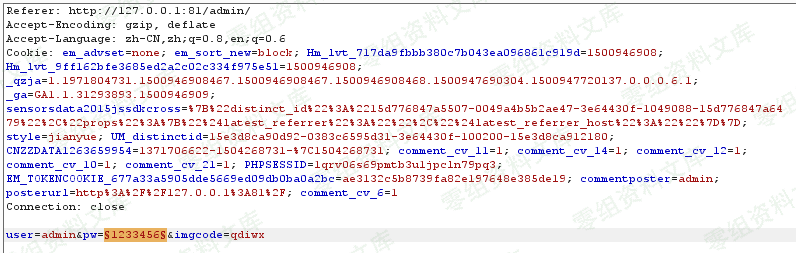

Emlog 6.0 后台暴力破解
======================

一、漏洞简介
------------

Emlog博客系统默认后台登陆地址为http://域名/admin/login.php而后台登陆时，错误情况下，验证码未刷新，导致可暴力破解登陆管理员账号低危漏洞，但是在emlog5.3.1和6.0测试版本均存在
\...

二、漏洞影响
------------

emlog5.3.1和6.0

三、复现过程
------------

访问

    http://0-sec.org:81/admin/

已知管理员用户名为：admin（可在前端文章页寻找作者用户名）

image

登陆后台

随便输入admin admin123 qdiwx，点击登陆

然后burpsuite抓包

CTRL+I尝试暴力破解：

成功爆破出密码，所以再次验证：验证码没消除会话，导致可暴力破解漏洞的存在

四、参考链接
------------

> http://www.dyboy.cn/post-900.html
